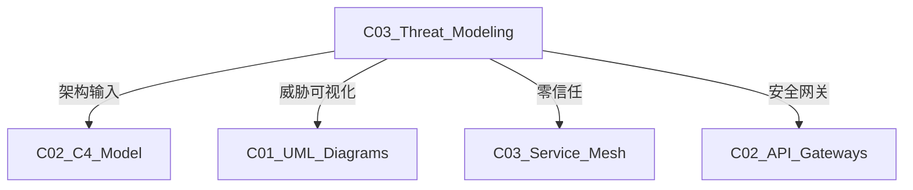

# C03 Threat Modeling - 威胁建模

**领域**: A03_Design_Architecture/B05_System_Modeling  
**创建日期**: 2026-01-30  
**最后更新**: 2026-01-30

---

## 1. 主题定位

### 1.1 定义与本质

威胁建模（Threat Modeling）是一种结构化方法，用于识别、量化和解决系统面临的安全威胁。它将安全考虑左移到系统设计阶段，帮助团队在编码前发现和修复潜在漏洞。

威胁建模由微软在1999年系统化推广，STRIDE模型由Loren Kohnfelder和Praerit Garg提出。现代威胁建模已成为DevSecOps的核心实践。

### 1.2 为什么需要威胁建模

```
安全修复成本对比:

设计阶段 ────────► 开发阶段 ────────► 测试阶段 ────────► 生产阶段
   │                  │                  │                  │
   ▼                  ▼                  ▼                  ▼
 1x成本              10x成本            100x成本           1000x成本
   │                  │                  │                  │
 架构评审           代码审查           渗透测试           应急响应
 威胁建模           静态分析           模糊测试           数据泄露
                    安全培训           动态分析           合规罚款

威胁建模的价值:
• 在设计阶段发现60-70%的安全问题
• 降低后期修复成本
• 建立安全设计模式库
• 满足合规要求 (PCI-DSS, ISO 27001)
```

---

## 2. 核心概念

### 2.1 STRIDE威胁分类

```
┌─────────────────────────────────────────────────────────────────┐
│                    STRIDE威胁分类                                │
├─────────────────────────────────────────────────────────────────┤
│                                                                 │
│  S - Spoofing (欺骗)                                            │
│  ┌───────────────────────────────────────────────────────────┐ │
│  │  威胁: 攻击者伪装成其他用户或系统                           │ │
│  │  示例: 伪造JWT令牌、会话劫持                                │ │
│  │  对策: 强身份认证、MFA、令牌签名验证                        │ │
│  └───────────────────────────────────────────────────────────┘ │
│                                                                 │
│  T - Tampering (篡改)                                           │
│  ┌───────────────────────────────────────────────────────────┐ │
│  │  威胁: 未经授权修改数据                                     │ │
│  │  示例: SQL注入、参数篡改、消息篡改                          │ │
│  │  对策: 输入验证、完整性校验、数字签名                       │ │
│  └───────────────────────────────────────────────────────────┘ │
│                                                                 │
│  R - Repudiation (否认)                                         │
│  ┌───────────────────────────────────────────────────────────┐ │
│  │  威胁: 用户否认执行过的操作                                 │ │
│  │  示例: 用户否认下单、管理员否认删除数据                     │ │
│  │  对策: 审计日志、数字签名、不可抵赖机制                     │ │
│  └───────────────────────────────────────────────────────────┘ │
│                                                                 │
│  I - Information Disclosure (信息泄露)                          │
│  ┌───────────────────────────────────────────────────────────┐ │
│  │  威胁: 敏感信息被未授权访问                                 │ │
│  │  示例: 越权访问、日志泄露、错误信息暴露                     │ │
│  │  对策: 最小权限原则、数据分类、加密                         │ │
│  └───────────────────────────────────────────────────────────┘ │
│                                                                 │
│  D - Denial of Service (拒绝服务)                               │
│  ┌───────────────────────────────────────────────────────────┐ │
│  │  威胁: 使系统不可用                                         │ │
│  │  示例: DDoS攻击、资源耗尽、死循环                           │ │
│  │  对策: 限流熔断、CAPTCHA、资源配额                        │ │
│  └───────────────────────────────────────────────────────────┘ │
│                                                                 │
│  E - Elevation of Privilege (权限提升)                          │ │
│  ┌───────────────────────────────────────────────────────────┐ │
│  │  威胁: 获得超出授权的权限                                   │ │
│  │  示例: 垂直越权、水平越权、提权漏洞                         │ │
│  │  对策: RBAC、权限检查、最小权限原则                         │ │
│  └───────────────────────────────────────────────────────────┘ │
│                                                                 │
└─────────────────────────────────────────────────────────────────┘
```

### 2.2 威胁建模流程

```
┌─────────────────────────────────────────────────────────────────┐
│                    威胁建模四步流程                              │
├─────────────────────────────────────────────────────────────────┤
│                                                                 │
│  Step 1: 分解应用程序 (Decompose)                               │
│  ┌───────────────────────────────────────────────────────────┐ │
│  │  • 创建数据流图 (DFD)                                      │ │
│  │  • 识别入口点 (Entry Points)                               │ │
│  │  • 识别资产 (Assets)                                       │ │
│  │  • 识别信任边界 (Trust Boundaries)                         │ │
│  └───────────────────────────────────────────────────────────┘ │
│                              │                                  │
│                              ▼                                  │
│  Step 2: 确定威胁 (Determine)                                   │
│  ┌───────────────────────────────────────────────────────────┐ │
│  │  • 应用STRIDE分类                                          │ │
│  │  • 使用攻击树 (Attack Trees)                               │ │
│  │  • 参考威胁库 (如OWASP Top 10)                             │ │
│  │  • 头脑风暴                                                │ │
│  └───────────────────────────────────────────────────────────┘ │
│                              │                                  │
│                              ▼                                  │
│  Step 3: 缓解威胁 (Mitigate)                                    │
│  ┌───────────────────────────────────────────────────────────┐ │
│  │  • 设计安全控制措施                                        │ │
│  │  • 应用安全设计模式                                        │ │
│  │  • 制定安全需求                                            │ │
│  └───────────────────────────────────────────────────────────┘ │
│                              │                                  │
│                              ▼                                  │
│  Step 4: 验证 (Validate)                                        │
│  ┌───────────────────────────────────────────────────────────┐ │
│  │  • 安全设计评审                                            │ │
│  │  • 威胁模型更新                                            │ │
│  │  • 安全测试验证                                            │ │
│  └───────────────────────────────────────────────────────────┘ │
│                                                                 │
└─────────────────────────────────────────────────────────────────┘
```

### 2.3 数据流图 (DFD)

```
┌─────────────────────────────────────────────────────────────────┐
│                    威胁建模数据流图                              │
├─────────────────────────────────────────────────────────────────┤
│                                                                 │
│  信任边界                                                        │
│  ╔═══════════════════════════════════════════════════════════╗ │
│  ║  互联网边界 (信任级别: 0)                                    ║ │
│  ║                                                           ║ │
│  ║     ┌──────────────┐                                      ║ │
│  ║     │   用户浏览器  │ [外部实体]                           ║ │
│  ║     └──────┬───────┘                                      ║ │
│  ║            │ HTTPS                                        ║ │
│  ╚════════════╪══════════════════════════════════════════════╝ │
│               │                                                │
│  ╔════════════╪══════════════════════════════════════════════╗ │
│  ║  Web层 (信任级别: 1)  ║                                   ║ │
│  ║                      ▼                                   ║ │
│  ║     ┌────────────────────────────────┐                  ║ │
│  ║     │       Web Application          │  [进程]          ║ │
│  ║     │  ┌──────────┐  ┌──────────┐   │                  ║ │
│  ║     │  │ 前端界面  │  │ 输入验证  │   │                  ║ │
│  ║     │  └──────────┘  └──────────┘   │                  ║ │
│  ║     └──────────┬───────────────────┘                  ║ │
│  ║                │ JWT Token                             ║ │
│  ╚════════════════╪═══════════════════════════════════════╝ │
│                   │                                            │
│  ╔════════════════╪═══════════════════════════════════════╗ │
│  ║  API层 (信任级别: 2)  ║                                   ║ │
│  ║                      ▼                                   ║ │
│  ║     ┌────────────────────────────────┐                  ║ │
│  ║     │       API Gateway              │  [进程]          ║ │
│  ║     │  ┌──────────┐  ┌──────────┐   │                  ║ │
│  ║     │  │ 认证中间件│  │ 限流中间件│   │                  ║ │
│  ║     │  └──────────┘  └──────────┘   │                  ║ │
│  ║     └──────────┬───────────────────┘                  ║ │
│  ╚════════════════╪═══════════════════════════════════════╝ │
│                   │                                            │
│  ╔════════════════╪═══════════════════════════════════════╗ │
│  ║  服务层 (信任级别: 3) ║                                   ║ │
│  ║    ┌─────────────┴─────────────┐                        ║ │
│  ║    ▼                           ▼                        ║ │
│  ║ ┌──────────────┐      ┌──────────────┐                 ║ │
│  ║ │ Order Service│      │Payment Service│  [进程]        ║ │
│  ║ └──────┬───────┘      └──────┬───────┘                 ║ │
│  ║        │                      │                         ║ │
│  ╚════════╪══════════════════════╪═════════════════════════╝ │
│           │                      │                            │
│  ╔════════╪══════════════════════╪═════════════════════════╗ │
│  ║  数据层 (信任级别: 4) ║                                   ║ │
│  ║        ▼                      ▼                         ║ │
│  ║ ┌──────────────┐      ┌──────────────┐                  ║ │
│  ║ │  Order DB    │      │ Payment DB   │  [数据存储]      ║ │
│  ║ │ (PostgreSQL) │      │ (PostgreSQL) │                  ║ │
│  ║ └──────────────┘      └──────────────┘                  ║ │
│  ║                                                           ║ │
│  ║ ┌──────────────┐                                         ║ │
│  ║ │    Redis     │  [数据存储]                              ║ │
│  ║ │   (Cache)    │                                         ║ │
│  ║ └──────────────┘                                         ║ │
│  ╚══════════════════════════════════════════════════════════╝ │
│                                                                 │
│  图例:                                                          │
│  ┌───┐ 外部实体    ┌───┐ 进程    ┌───┐ 数据存储                │
│  └───┘             └───┘         └───┘                         │
│  ╔═══╗ 信任边界    ───► 数据流                                  │
│                                                                 │
└─────────────────────────────────────────────────────────────────┘
```

---

## 3. 技术实践

### 3.1 威胁建模工具

```python
# threat_modeling_tool.py
"""
威胁建模自动化工具
支持STRIDE分析和风险评级
"""

from dataclasses import dataclass, field
from typing import List, Dict, Optional, Set
from enum import Enum
import json
from datetime import datetime


class ThreatCategory(Enum):
    SPOOFING = "Spoofing"
    TAMPERING = "Tampering"
    REPUDIATION = "Repudiation"
    INFO_DISCLOSURE = "Information Disclosure"
    DOS = "Denial of Service"
    ELEVATION = "Elevation of Privilege"


class RiskLevel(Enum):
    CRITICAL = "Critical"
    HIGH = "High"
    MEDIUM = "Medium"
    LOW = "Low"


@dataclass
class Threat:
    """威胁定义"""
    id: str
    name: str
    category: ThreatCategory
    description: str
    affected_component: str
    threat_source: str
    
    # 风险评级
    likelihood: int  # 1-5
    impact: int      # 1-5
    
    # 缓解措施
    mitigation: str
    mitigation_status: str = "Open"  # Open, In Progress, Mitigated, Accepted
    
    def calculate_risk_score(self) -> int:
        """计算风险分数"""
        return self.likelihood * self.impact
    
    def get_risk_level(self) -> RiskLevel:
        """获取风险等级"""
        score = self.calculate_risk_score()
        if score >= 20:
            return RiskLevel.CRITICAL
        elif score >= 15:
            return RiskLevel.HIGH
        elif score >= 8:
            return RiskLevel.MEDIUM
        else:
            return RiskLevel.LOW


@dataclass
class Asset:
    """资产定义"""
    id: str
    name: str
    description: str
    sensitivity: str  # Public, Internal, Confidential, Secret
    owner: str


@dataclass
class DataFlow:
    """数据流定义"""
    id: str
    name: str
    source: str
    destination: str
    protocol: str
    data_types: List[str]
    encrypted: bool


class ThreatModel:
    """威胁模型"""
    
    def __init__(self, system_name: str, version: str):
        self.system_name = system_name
        self.version = version
        self.created_at = datetime.now()
        
        self.assets: List[Asset] = []
        self.data_flows: List[DataFlow] = []
        self.threats: List[Threat] = []
        self.trust_boundaries: List[Dict] = []
    
    def add_asset(self, asset: Asset):
        """添加资产"""
        self.assets.append(asset)
    
    def add_data_flow(self, flow: DataFlow):
        """添加数据流"""
        self.data_flows.append(flow)
    
    def add_threat(self, threat: Threat):
        """添加威胁"""
        self.threats.append(threat)
    
    def analyze_stride(self) -> Dict[ThreatCategory, List[Threat]]:
        """按STRIDE分类分析威胁"""
        analysis = {category: [] for category in ThreatCategory}
        
        for threat in self.threats:
            analysis[threat.category].append(threat)
        
        return analysis
    
    def get_high_risk_threats(self) -> List[Threat]:
        """获取高风险威胁"""
        return [t for t in self.threats 
                if t.get_risk_level() in [RiskLevel.CRITICAL, RiskLevel.HIGH]]
    
    def generate_stride_checklist(self) -> Dict:
        """生成STRIDE检查清单"""
        checklist = {
            "Spoofing": [
                "所有入口点是否都有身份认证?",
                "会话管理是否安全?",
                "API密钥是否安全存储和传输?",
                "是否防止CSRF攻击?"
            ],
            "Tampering": [
                "输入验证是否在服务端执行?",
                "是否有完整性校验机制?",
                "参数是否防止篡改?",
                "审计日志是否防篡改?"
            ],
            "Repudiation": [
                "所有敏感操作是否记录审计日志?",
                "日志是否包含用户身份和时间戳?",
                "日志是否集中存储?"
            ],
            "Information Disclosure": [
                "敏感数据是否加密存储?",
                "传输是否使用TLS?",
                "错误信息是否泄露敏感信息?",
                "是否有访问控制?"
            ],
            "Denial of Service": [
                "是否有速率限制?",
                "是否有资源配额?",
                "是否有熔断降级机制?",
                "是否有CAPTCHA防自动化攻击?"
            ],
            "Elevation of Privilege": [
                "是否实施最小权限原则?",
                "水平越权是否被防止?",
                "垂直越权是否被防止?",
                "权限检查是否在服务端执行?"
            ]
        }
        return checklist
    
    def generate_report(self) -> str:
        """生成威胁模型报告"""
        report = f"""# 威胁模型报告

## 系统信息

- **系统名称**: {self.system_name}
- **版本**: {self.version}
- **创建日期**: {self.created_at.strftime('%Y-%m-%d')}

## 资产清单

| 资产名称 | 敏感度 | 所有者 |
|---------|--------|--------|
"""
        for asset in self.assets:
            report += f"| {asset.name} | {asset.sensitivity} | {asset.owner} |\n"
        
        report += f"""
## 威胁统计

| 风险等级 | 数量 |
|---------|------|
"""
        risk_counts = {}
        for threat in self.threats:
            level = threat.get_risk_level().value
            risk_counts[level] = risk_counts.get(level, 0) + 1
        
        for level in ["Critical", "High", "Medium", "Low"]:
            count = risk_counts.get(level, 0)
            report += f"| {level} | {count} |\n"
        
        report += f"""
## 高风险威胁详情

"""
        high_risks = self.get_high_risk_threats()
        if high_risks:
            for i, threat in enumerate(high_risks, 1):
                report += f"""### {i}. {threat.name}

- **类别**: {threat.category.value}
- **风险等级**: {threat.get_risk_level().value}
- **风险分数**: {threat.calculate_risk_score()}
- **影响组件**: {threat.affected_component}
- **描述**: {threat.description}
- **缓解措施**: {threat.mitigation}
- **状态**: {threat.mitigation_status}

"""
        else:
            report += "暂无高风险威胁\n"
        
        return report
    
    def save(self, filepath: str):
        """保存威胁模型"""
        data = {
            "system_name": self.system_name,
            "version": self.version,
            "created_at": self.created_at.isoformat(),
            "assets": [
                {
                    "id": a.id,
                    "name": a.name,
                    "description": a.description,
                    "sensitivity": a.sensitivity,
                    "owner": a.owner
                } for a in self.assets
            ],
            "threats": [
                {
                    "id": t.id,
                    "name": t.name,
                    "category": t.category.value,
                    "description": t.description,
                    "affected_component": t.affected_component,
                    "likelihood": t.likelihood,
                    "impact": t.impact,
                    "risk_score": t.calculate_risk_score(),
                    "risk_level": t.get_risk_level().value,
                    "mitigation": t.mitigation,
                    "status": t.mitigation_status
                } for t in self.threats
            ]
        }
        
        with open(filepath, 'w') as f:
            json.dump(data, f, indent=2)
        
        print(f"Threat model saved to: {filepath}")


# 使用示例
def example_threat_model():
    """电商系统威胁建模示例"""
    model = ThreatModel("E-commerce System", "1.0")
    
    # 添加资产
    model.add_asset(Asset("user_db", "User Database", "Stores user credentials and PII", "Secret", "DBA Team"))
    model.add_asset(Asset("payment_api", "Payment API", "Processes payment transactions", "Secret", "Payment Team"))
    model.add_asset(Asset("order_data", "Order Data", "Customer order information", "Confidential", "Operations"))
    
    # 添加威胁
    threats = [
        Threat(
            id="T001",
            name="SQL Injection in Search",
            category=ThreatCategory.TAMPERING,
            description="Attacker injects malicious SQL through search parameter",
            affected_component="Product Search API",
            threat_source="External Attacker",
            likelihood=4,
            impact=5,
            mitigation="Use parameterized queries and ORM; implement WAF",
            mitigation_status="Mitigated"
        ),
        Threat(
            id="T002",
            name="Session Hijacking",
            category=ThreatCategory.SPOOFING,
            description="Attacker steals session token to impersonate user",
            affected_component="Authentication Service",
            threat_source="Man-in-the-Middle",
            likelihood=3,
            impact=4,
            mitigation="Use HTTPS; implement secure cookie flags; rotate tokens",
            mitigation_status="In Progress"
        ),
        Threat(
            id="T003",
            name="Privilege Escalation",
            category=ThreatCategory.ELEVATION,
            description="Regular user gains admin privileges",
            affected_component="Admin Panel",
            threat_source="Malicious User",
            likelihood=2,
            impact=5,
            mitigation="Implement RBAC; verify permissions on every request",
            mitigation_status="Open"
        ),
        Threat(
            id="T004",
            name="Credit Card Data Leak",
            category=ThreatCategory.INFO_DISCLOSURE,
            description="Payment card data exposed in logs or error messages",
            affected_component="Payment Service",
            threat_source="Insider Threat",
            likelihood=2,
            impact=5,
            mitigation="Tokenize card data; mask in logs; PCI-DSS compliance",
            mitigation_status="Mitigated"
        ),
    ]
    
    for threat in threats:
        model.add_threat(threat)
    
    # 生成报告
    print(model.generate_report())
    
    # 保存模型
    model.save("/tmp/threat_model.json")


if __name__ == "__main__":
    example_threat_model()
```

### 3.2 攻击树分析

```
┌─────────────────────────────────────────────────────────────────┐
│                    攻击树示例 - 窃取用户凭证                      │
├─────────────────────────────────────────────────────────────────┤
│                                                                 │
│                         [窃取用户凭证]                           │
│                              AND                                │
│              ┌───────────────┼───────────────┐                 │
│              │               │               │                  │
│              ▼               ▼               ▼                  │
│      [获取用户名]      [获取密码]       [绕过MFA]              │
│           OR                OR               OR                 │
│      ┌─────┴─────┐    ┌─────┴─────┐   ┌─────┴─────┐          │
│      │           │    │           │   │           │           │
│      ▼           ▼    ▼           ▼   ▼           ▼           │
│  [社工]    [枚举]  [钓鱼] [暴力破解] [SIM交换] [OTP绕过]      │
│                                                                 │
│  AND: 所有子节点必须完成                                        │
│  OR:  任一子节点完成即可                                        │
│                                                                 │
│  攻击成本分析:                                                   │
│  • 社工: 低技术，高成功率                                       │
│  • 暴力破解: 需绕过速率限制                                     │
│  • SIM交换: 需要运营商配合                                      │
│                                                                 │
└─────────────────────────────────────────────────────────────────┘
```

---

## 4. 资源索引

### 4.1 工具

| 工具 | 类型 | 特点 |
|------|------|------|
| Microsoft Threat Modeling Tool | 免费 | STRIDE方法 |
| OWASP Threat Dragon | 开源 | 社区活跃 |
| pytm | Python库 | 代码化建模 |
| ThreatSpec | 开源 | 文档集成 |

### 4.2 标准

| 标准 | 描述 |
|------|------|
| NIST SP 800-30 | 风险评估指南 |
| ISO 27005 | 信息安全风险管理 |
| OWASP ASVS | 应用安全验证标准 |

---

## 5. 关联知识



---

## 6. 学习建议

1. 学习STRIDE和攻击树方法
2. 实践DFD绘制
3. 参与安全设计评审
4. 关注OWASP资源

---

## 7. 附录

| 版本 | 日期 | 变更内容 |
|------|------|----------|
| 1.0.0 | 2026-01-30 | 初始版本 |

---

> **文档维护**: 本知识库遵循持续更新原则。
