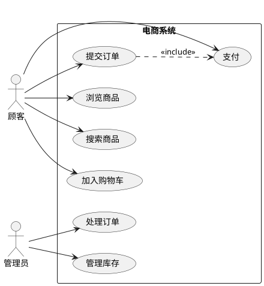
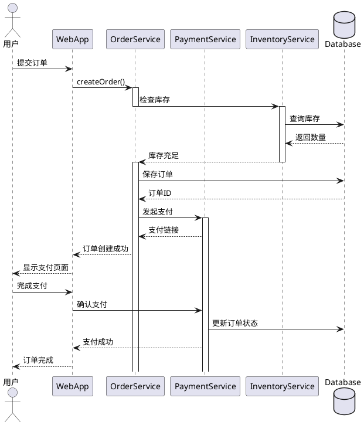
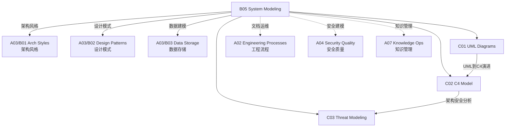

# B05 System Modeling

**所属领域**: [A03_Design_Architecture](../readme.md)
**创建日期**: 2026-01-30
**最后更新**: 2026-01-30

## 📋 子领域定位

系统建模是架构设计的核心能力，通过可视化方式表达系统结构、行为和交互。良好的建模实践帮助团队在实现前发现设计缺陷，促进跨职能沟通，并为系统演进提供文档基础。

本领域涵盖UML建模（结构图、行为图、交互图）、C4模型（上下文、容器、组件、代码）和威胁建模（STRIDE、攻击树、风险缓解）三大方向。架构师需要掌握多种建模技术，根据受众和目的选择合适的抽象层次。

**核心关注点**：
- **UML建模**: 结构图、行为图、时序图、状态机
- **C4模型**: 分层抽象、架构可视化、决策记录
- **威胁建模**: 安全分析、风险评估、缓解策略

## 🗂️ 专项列表

### [C01. UML_Diagrams](C01_UML_Diagrams/README.md)

UML是软件工程的标准建模语言。本专项详解结构图（类图、组件图、部署图）、行为图（用例图、活动图、状态机图）和交互图（时序图、通信图）。涵盖UML 2.5规范、PlantUML文本建模和模型驱动开发(MDD)实践。

### [C02. C4_Model](C02_C4_Model/README.md)

C4模型提供软件架构的分层可视化方法。本专项深入系统上下文图（Context）、容器图（Container）、组件图（Component）和代码图（Code）四个抽象层次。涵盖架构决策记录(ADR)、架构视图（4+1视图）和架构即代码实践。

### [C03. Threat_Modeling](C03_Threat_Modeling/README.md)

威胁建模是系统性的安全分析方法。本专项详解STRIDE威胁分类（欺骗、篡改、否认、信息泄露、拒绝服务、权限提升）、攻击树分析和风险评分方法（DREAD）。涵盖Microsoft威胁建模工具、OWASP威胁建模指南和DevSecOps集成。

## 🛠️ 技术栈概览

### 建模工具

| 工具 | 类型 | 特点 | 官网 |
|------|------|------|------|
| **PlantUML** | 文本建模 | 代码化、版本控制友好 | https://plantuml.com |
| **Mermaid** | 文本建模 | Markdown集成、GitHub原生 | https://mermaid.js.org |
| **Draw.io** | 图形建模 | 免费、多平台 | https://www.draw.io |
| **Lucidchart** | 图形建模 | 协作功能强 | https://www.lucidchart.com |
| **Enterprise Architect** | 专业建模 | 全功能UML | https://www.sparxsystems.com |
| **Visual Paradigm** | 专业建模 | 敏捷支持 | https://www.visual-paradigm.com |

### 架构文档工具

| 工具 | 用途 | 官网 |
|------|------|------|
| **Structurizr** | C4模型即代码 | https://structurizr.com |
| **Archi** | TOGAF建模 | https://www.archimatetool.com |
| **MADR** | ADR模板 | https://adr.github.io/madr |
| **Log4brains** | ADR管理 | https://github.com/thomvaill/log4brains |

### 威胁建模工具

| 工具 | 用途 | 官网 |
|------|------|------|
| **Microsoft Threat Modeling Tool** | STRIDE分析 | https://aka.ms/threatmodelingtool |
| **OWASP Threat Dragon** | Web威胁建模 | https://owasp.org/www-project-threat-dragon |
| **Pytm** | Python威胁建模 | https://github.com/izar/pytm |
| **ThreatModeler** | 企业级 | https://threatmodeler.com |

## 💼 实践案例索引

### 案例 1: 电商系统UML建模

**用例图**:


**时序图 - 下单流程**:


### 案例 2: C4模型实践

**系统上下文图**:
```plantuml
@startuml
!include https://raw.githubusercontent.com/plantuml-stdlib/C4-PlantUML/master/C4_Context.puml

LAYOUT_WITH_LEGEND()

Person(customer, "顾客", "浏览商品并下单")
Person(admin, "管理员", "管理商品和订单")

System(ecommerce, "电商系统", "处理商品展示、订单和支付")
System_Ext(payment_gateway, "支付网关", "处理信用卡和第三方支付")
System_Ext(email_system, "邮件系统", "发送订单确认邮件")

Rel(customer, ecommerce, "浏览、下单、支付", "HTTPS")
Rel(admin, ecommerce, "管理", "HTTPS")
Rel(ecommerce, payment_gateway, "处理支付", "HTTPS/API")
Rel(ecommerce, email_system, "发送邮件", "SMTP/API")

@enduml
```

**容器图**:
```plantuml
@startuml
!include https://raw.githubusercontent.com/plantuml-stdlib/C4-PlantUML/master/C4_Container.puml

LAYOUT_WITH_LEGEND()

Person(customer, "顾客", "浏览商品并下单")

System_Boundary(ecommerce, "电商系统") {
    Container(web_app, "Web应用", "React", "前端界面")
    Container(api_gateway, "API网关", "Kong", "路由和认证")
    Container(order_service, "订单服务", "Go", "订单管理")
    Container(product_service, "商品服务", "Java", "商品管理")
    Container(payment_service, "支付服务", "Python", "支付处理")
    ContainerDb(order_db, "订单库", "PostgreSQL", "订单数据")
    ContainerDb(product_db, "商品库", "MongoDB", "商品数据")
    Container(cache, "缓存", "Redis", "热点数据")
    Container(message_queue, "消息队列", "Kafka", "异步事件")
}

System_Ext(payment_gateway, "支付网关")

Rel(customer, web_app, "使用", "HTTPS")
Rel(web_app, api_gateway, "调用API", "HTTPS/JSON")
Rel(api_gateway, order_service, "路由", "gRPC")
Rel(api_gateway, product_service, "路由", "gRPC")
Rel(order_service, payment_service, "调用", "gRPC")
Rel(order_service, order_db, "读写", "SQL")
Rel(product_service, product_db, "读写", "NoSQL")
Rel(order_service, cache, "缓存", "Redis协议")
Rel(order_service, message_queue, "发布事件", "Kafka协议")
Rel(payment_service, payment_gateway, "处理支付", "HTTPS/API")

@enduml
```

### 案例 3: STRIDE威胁建模

**威胁分析表**:
| 组件 | 威胁 | 类型 | 风险 | 缓解措施 |
|------|------|------|------|----------|
| API网关 | 身份伪造 | S(欺骗) | 高 | JWT + MFA |
| 订单服务 | 数据篡改 | T(篡改) | 高 | 数字签名 |
| 支付服务 | 交易抵赖 | R(否认) | 中 | 审计日志 |
| 数据库 | 数据泄露 | I(信息泄露) | 高 | 加密 + 最小权限 |
| 消息队列 | 服务中断 | D(拒绝服务) | 中 | 限流 + 熔断 |
| 管理后台 | 越权访问 | E(权限提升) | 高 | RBAC + 审计 |

**攻击树**:
```
攻击目标: 窃取用户支付信息
│
├── 物理攻击
│   └── 访问数据中心
│       └── 绕过物理安全
│
├── 网络攻击
│   ├── 中间人攻击
│   │   ├── ARP欺骗
│   │   └── DNS劫持
│   └── 流量嗅探
│       └── 未加密通信
│
└── 应用攻击
    ├── SQL注入
    │   └── 输入验证绕过
    ├── XSS攻击
    │   └── 窃取会话令牌
    └── 内部威胁
        └── 数据库管理员
```

**威胁建模流程**:
```
1. 定义范围
   └── 确定建模对象（系统/模块/功能）

2. 绘制数据流图(DFD)
   ├── 识别实体（用户、系统、外部服务）
   ├── 识别数据流
   └── 识别数据存储

3. 识别威胁(STRIDE)
   ├── 遍历每个组件
   └── 应用STRIDE分类

4. 评估风险
   ├── 可能性评估
   └── 影响评估

5. 制定缓解措施
   ├── 技术控制
   └── 流程控制

6. 验证和迭代
   └── 持续更新威胁模型
```

## 🔗 知识关联图谱



## 📖 学习资源

### 推荐书籍

| 书名 | 作者 | 说明 |
|------|------|------|
| 《UML Distilled》 | Martin Fowler | UML精要 |
| 《Software Architecture for Developers》 | Simon Brown | C4模型创建者 |
| 《Threat Modeling》 | Adam Shostack | 威胁建模权威 |
| 《Documenting Software Architectures》 | Paul Clements | 架构文档化 |

### 在线资源

| 资源 | 链接 | 说明 |
|------|------|------|
| PlantUML Guide | https://plantuml.com/guide | 完整语法 |
| C4 Model | https://c4model.com | 官方文档 |
| OWASP Threat Modeling | https://owasp.org/www-community/Application_Threat_Modeling | 威胁建模指南 |
| ArchiMate | https://www.opengroup.org/archimate | 企业架构建模 |

### 开源项目

| 项目 | GitHub | 说明 |
|------|--------|------|
| PlantUML | https://github.com/plantuml/plantuml | 文本UML工具 |
| Mermaid | https://github.com/mermaid-js/mermaid | Markdown图表 |
| Structurizr | https://github.com/structurizr | C4模型工具 |
| Threat Dragon | https://github.com/OWASP/threat-dragon | 威胁建模 |

## 🔄 维护说明

- **内容审查**: 每半年更新建模规范和工具版本
- **更新机制**: 跟踪UML规范和架构建模社区发展
- **质量标准**: 确保图表示例符合行业标准
- **贡献方式**: 欢迎提交架构图案例和建模经验
