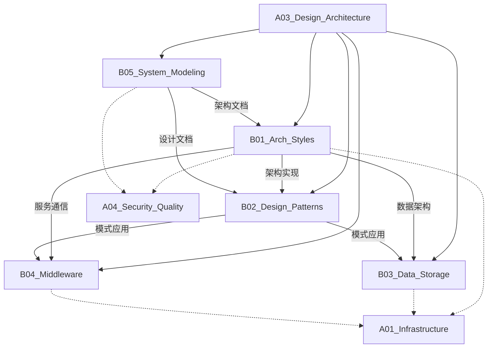

# A03_Design_Architecture

**领域定位**: 系统架构设计与实现模式
**创建日期**: 2026-01-30
**最后更新**: 2026-01-30

## 📋 领域概述

设计架构领域专注于系统级设计决策、架构模式选择和技术实现方案。本领域涵盖从宏观架构风格到微观设计模式，从数据存储策略到中间件选型，为构建可扩展、可维护的系统提供方法论指导。

**核心关注点**：
- **架构风格**：微服务、事件驱动、数据网格等现代架构模式
- **设计模式**：响应式系统、领域驱动设计、反模式识别
- **数据存储**：数据库选型、分片策略、数据湖仓架构
- **中间件**：消息队列、API 网关、服务网格
- **系统建模**：架构可视化、威胁建模、决策记录

## 🗂️ 子领域结构

### [B01_Arch_Styles](B01_Arch_Styles/README.md)
**定位**：微服务/事件驱动/数据网格架构

涵盖单体到微服务演进、事件驱动架构设计、CQRS/Event Sourcing 模式、数据网格理念、Serverless 架构等现代架构风格。

### [B02_Design_Patterns](B02_Design_Patterns/README.md)
**定位**：响应式系统、领域驱动设计、反模式分析

包括 GoF 设计模式、响应式编程模式、DDD 战术设计、六边形架构、反模式识别与重构策略等。

### [B03_Data_Storage](B03_Data_Storage/README.md)
**定位**：数据库分片策略、数据湖仓对比、向量数据库

覆盖关系型/NoSQL 数据库选型、分布式数据库架构、数据湖与数据仓库、向量数据库应用、数据一致性策略等。

### [B04_Middleware](B04_Middleware/README.md)
**定位**：消息队列选型、API 网关设计、服务网格实现

涉及 Kafka/RabbitMQ 等消息中间件、API Gateway 模式、Service Mesh 架构、分布式追踪、熔断降级策略等。

### [B05_System_Modeling](B05_System_Modeling/README.md)
**定位**：UML 建模、C4 模型、威胁建模

包括架构图绘制规范、C4 模型实践、ADR (架构决策记录)、威胁建模方法 (STRIDE/DREAD)、架构评审流程等。

## 🔗 知识关联图谱

## 📚 学习路径建议

### 初级路径
**目标**：理解基本架构概念，掌握常用设计模式

1. **架构基础** (B01)
   - 单体 vs 微服务架构
   - RESTful API 设计
   - 三层架构模式

2. **设计模式入门** (B02)
   - 创建型模式 (工厂、单例)
   - 结构型模式 (适配器、装饰器)
   - 行为型模式 (观察者、策略)

3. **数据库基础** (B03)
   - SQL vs NoSQL 选择
   - 数据库范式设计
   - 基本索引优化

4. **架构文档** (B05)
   - 基本 UML 图 (类图、时序图)
   - 架构图绘制规范
   - 技术文档编写

### 中级路径
**目标**：深入架构设计，具备系统设计能力

1. **现代架构** (B01)
   - 微服务拆分策略
   - 事件驱动架构
   - API Gateway 模式
   - 服务发现与注册

2. **高级设计模式** (B02)
   - 领域驱动设计 (DDD)
   - CQRS 与 Event Sourcing
   - 六边形架构
   - 反应式编程模式

3. **分布式数据** (B03)
   - 数据库分片 (Sharding)
   - 读写分离策略
   - 分布式事务 (2PC/Saga)
   - 缓存架构设计

4. **中间件应用** (B04)
   - 消息队列选型 (Kafka/RabbitMQ)
   - API 网关设计
   - 服务网格基础
   - 分布式追踪

5. **架构建模** (B05)
   - C4 模型实践
   - 架构决策记录 (ADR)
   - 架构评审流程

### 高级路径
**目标**：架构创新，前沿技术应用

1. **前沿架构** (B01)
   - 数据网格架构
   - Serverless 架构设计
   - 边缘计算架构
   - 混沌工程实践

2. **架构演进** (B02)
   - 遗留系统重构
   - 反模式识别与修复
   - 架构腐化防治
   - 技术债务管理

3. **数据架构** (B03)
   - 数据湖 vs 数据仓库
   - 实时数据架构
   - 向量数据库应用
   - 多模数据库设计

4. **高级中间件** (B04)
   - Service Mesh 深度实践
   - 事件流处理平台
   - 分布式配置中心
   - 熔断降级策略

5. **架构治理** (B05)
   - 威胁建模 (STRIDE)
   - 架构适应度函数
   - 架构演进度量
   - 技术雷达构建

## 📖 参考资源

### 核心资源

**书籍**：
- 《软件架构设计》(Software Architecture in Practice) - 架构基础经典
- 《领域驱动设计》(Domain-Driven Design) - Eric Evans
- 《微服务架构设计模式》- Chris Richardson
- 《设计模式》(Design Patterns) - GoF 四人帮
- 《数据密集型应用系统设计》(DDIA) - Martin Kleppmann
- 《企业集成模式》(Enterprise Integration Patterns)

**在线资源**：
- Martin Fowler's Blog: https://martinfowler.com/
- Microsoft Architecture Center: https://docs.microsoft.com/azure/architecture/
- AWS Architecture Center: https://aws.amazon.com/architecture/
- The Twelve-Factor App: https://12factor.net/
- C4 Model: https://c4model.com/

**社区**：
- Software Architecture Summit
- DDD Community
- Microservices Practitioners

### 扩展阅读

**架构风格**：
- 《Building Microservices》- Sam Newman
- 《Reactive Design Patterns》- Roland Kuhn
- 《Data Mesh》- Zhamak Dehghani

**设计模式**：
- 《Head First Design Patterns》- 设计模式入门
- 《Implementing Domain-Driven Design》- Vaughn Vernon
- 《Patterns of Enterprise Application Architecture》- Martin Fowler

**数据架构**：
- 《Designing Data-Intensive Applications》- DDIA 中文版
- 《Database Internals》- 数据库内部原理
- 《The Data Warehouse Toolkit》- 数据仓库工具箱

**系统建模**：
- 《Threat Modeling: Designing for Security》- 威胁建模
- 《Documenting Software Architectures》- 架构文档化
- 《Architecture Decision Records》- ADR 实践

**前沿技术**：
- InfoQ Architecture & Design 专栏
- ThoughtWorks Technology Radar
- GOTO Conference 演讲

## 🔄 维护说明

- **内容更新频率**: 每季度审查一次
- **质量标准**: 确保所有子领域链接有效，内容准确完整
- **贡献方式**: 参见根目录 readme.md 中的贡献指南
