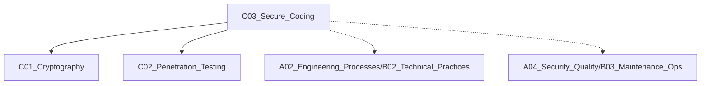

# C03 Secure Coding

**所属子领域**: [B01_Information_Security](../README.md)  
**创建日期**: 2026-01-30  
**最后更新**: 2026-01-30

## 📋 主题定位

安全编码（Secure Coding）是一套在软件开发过程中主动预防安全漏洞的实践方法，通过在编码阶段消除常见弱点（如 OWASP Top 10），从源头减少安全风险。安全左移（Shift Left Security）理念的核心实施环节。

## 🎯 核心概念

### OWASP Top 10 (2021)

| 排名 | 漏洞类型 | 风险描述 |
|------|----------|----------|
| A01 | 失效访问控制 | 权限绕过、越权访问 |
| A02 | 加密失败 | 敏感数据泄露、弱加密 |
| A03 | 注入攻击 | SQL、NoSQL、命令注入 |
| A04 | 不安全设计 | 架构层面的安全缺陷 |
| A05 | 安全配置错误 | 默认配置、暴露信息 |
| A06 | 易受攻击组件 | 过期依赖、已知 CVE |
| A07 | 身份认证失败 | 弱密码、会话管理 |
| A08 | 数据完整性失败 | 不安全的反序列化 |
| A09 | 日志监控不足 | 无法检测和响应攻击 |
| A10 | SSRF | 服务器端请求伪造 |

### 安全编码原则

1. **最小权限原则**: 仅授予完成任务必需的最小权限
2. **纵深防御**: 多层安全控制，单点失效不导致整体崩溃
3. **安全默认值**: 默认配置即安全，需显式降低安全级别
4. **白名单校验**: 允许已知安全的输入，拒绝其他所有
5. **不信任任何输入**: 所有外部输入都视为不可信

## 🛠️ 技术实践

### 1. 输入验证与净化

```python
import re
from html import escape
from urllib.parse import urlparse

class InputValidator:
    """输入验证器"""
    
    # 白名单模式
    ALLOWED_TAGS = {'p', 'br', 'strong', 'em'}
    ALLOWED_SCHEMES = {'http', 'https'}
    
    @staticmethod
    def sanitize_html(raw_html: str) -> str:
        """净化 HTML，移除危险标签和属性"""
        import bleach
        
        return bleach.clean(
            raw_html,
            tags=InputValidator.ALLOWED_TAGS,
            strip=True
        )
    
    @staticmethod
    def validate_email(email: str) -> bool:
        """邮箱格式验证"""
        pattern = r'^[a-zA-Z0-9._%+-]+@[a-zA-Z0-9.-]+\.[a-zA-Z]{2,}$'
        return re.match(pattern, email) is not None
    
    @staticmethod
    def validate_url(url: str) -> bool:
        """URL 安全验证"""
        try:
            parsed = urlparse(url)
            return parsed.scheme in InputValidator.ALLOWED_SCHEMES
        except:
            return False
    
    @staticmethod
    def validate_integer(value: str, min_val: int = None, max_val: int = None) -> int:
        """整数范围验证"""
        try:
            num = int(value)
            if min_val is not None and num < min_val:
                raise ValueError(f"Value must be >= {min_val}")
            if max_val is not None and num > max_val:
                raise ValueError(f"Value must be <= {max_val}")
            return num
        except ValueError:
            raise ValueError("Invalid integer")
```

### 2. SQL 注入防护

```python
from contextlib import contextmanager
import psycopg2
from psycopg2.extras import RealDictCursor

class SecureDatabase:
    """安全数据库操作"""
    
    def __init__(self, dsn: str):
        self.dsn = dsn
    
    @contextmanager
    def get_cursor(self):
        """获取数据库游标（上下文管理器）"""
        conn = psycopg2.connect(self.dsn)
        try:
            cursor = conn.cursor(cursor_factory=RealDictCursor)
            yield cursor
            conn.commit()
        except Exception as e:
            conn.rollback()
            raise
        finally:
            cursor.close()
            conn.close()
    
    def get_user_by_id(self, user_id: int) -> dict:
        """使用参数化查询防止 SQL 注入"""
        with self.get_cursor() as cursor:
            # ✅ 正确：使用参数化查询
            cursor.execute(
                "SELECT id, username, email FROM users WHERE id = %s",
                (user_id,)  # 参数作为元组传递
            )
            return cursor.fetchone()
    
    def search_users(self, username: str, status: str) -> list:
        """安全的动态查询构建"""
        # 白名单校验
        ALLOWED_STATUSES = ['active', 'inactive', 'pending']
        if status not in ALLOWED_STATUSES:
            raise ValueError(f"Invalid status: {status}")
        
        with self.get_cursor() as cursor:
            # 动态列选择仍需白名单
            query = """
                SELECT id, username, email, status 
                FROM users 
                WHERE username ILIKE %s AND status = %s
                LIMIT 100
            """
            cursor.execute(query, (f"%{username}%", status))
            return cursor.fetchall()
    
    # ❌ 错误示例：字符串拼接导致 SQL 注入
    def unsafe_query(self, user_input: str):
        query = f"SELECT * FROM users WHERE name = '{user_input}'"
        # 攻击者输入: ' OR '1'='1
```

### 3. 密码安全

```python
import secrets
import hashlib
import hmac
from argon2 import PasswordHasher
from argon2.exceptions import VerifyMismatchError

class PasswordManager:
    """安全密码管理"""
    
    def __init__(self):
        # Argon2id 配置（OWASP 推荐）
        self.ph = PasswordHasher(
            time_cost=3,      # 迭代次数
            memory_cost=65536, # 64 MB
            parallelism=4,    # 并行度
            hash_len=32,      # 哈希长度
            salt_len=16       # 盐长度
        )
    
    def hash_password(self, password: str) -> str:
        """密码哈希（不可逆）"""
        # 自动处理盐值
        return self.ph.hash(password)
    
    def verify_password(self, password: str, hashed: str) -> bool:
        """验证密码"""
        try:
            self.ph.verify(hashed, password)
            # 检查是否需要重新哈希（参数升级）
            if self.ph.check_needs_rehash(hashed):
                # 异步更新哈希
                pass
            return True
        except VerifyMismatchError:
            return False
    
    @staticmethod
    def generate_secure_token(length: int = 32) -> str:
        """生成安全随机令牌"""
        return secrets.token_urlsafe(length)
    
    @staticmethod
    def constant_time_compare(val1: str, val2: str) -> bool:
        """常量时间比较（防时序攻击）"""
        return hmac.compare_digest(val1.encode(), val2.encode())

# API 密钥管理
class APIKeyManager:
    """API 密钥安全管理"""
    
    @staticmethod
    def generate_api_key() -> tuple[str, str]:
        """生成 API 密钥对（key_id + secret）"""
        key_id = secrets.token_hex(16)  # 可公开
        secret = secrets.token_urlsafe(32)  # 仅展示一次
        
        # 存储哈希值
        secret_hash = hashlib.sha256(secret.encode()).hexdigest()
        store_key_hash(key_id, secret_hash)
        
        return key_id, secret  # 仅此时返回明文 secret
    
    @staticmethod
    def verify_api_key(key_id: str, secret: str) -> bool:
        """验证 API 密钥"""
        stored_hash = get_key_hash(key_id)
        if not stored_hash:
            return False
        
        provided_hash = hashlib.sha256(secret.encode()).hexdigest()
        return hmac.compare_digest(stored_hash, provided_hash)
```

### 4. 安全配置

```yaml
# Security Headers (Nginx)
add_header X-Frame-Options "SAMEORIGIN" always;
add_header X-Content-Type-Options "nosniff" always;
add_header X-XSS-Protection "1; mode=block" always;
add_header Referrer-Policy "strict-origin-when-cross-origin" always;
add_header Content-Security-Policy "default-src 'self'; script-src 'self'; style-src 'self' 'unsafe-inline';" always;
add_header Strict-Transport-Security "max-age=31536000; includeSubDomains" always;

# 禁用服务器版本信息
server_tokens off;
```

```python
# Flask 安全配置
from flask import Flask
from flask_talisman import Talisman
from flask_limiter import Limiter

app = Flask(__name__)

# 安全头
talisman = Talisman(
    app,
    force_https=True,
    strict_transport_security=True,
    content_security_policy={
        'default-src': "'self'",
        'script-src': ["'self'", "'unsafe-inline'"],
        'style-src': ["'self'", "'unsafe-inline'"],
    }
)

# 速率限制
limiter = Limiter(
    app,
    key_func=lambda: request.headers.get("X-Forwarded-For", request.remote_addr),
    default_limits=["100 per minute", "1000 per hour"]
)

# 安全 Cookie 配置
app.config.update(
    SESSION_COOKIE_SECURE=True,
    SESSION_COOKIE_HTTPONLY=True,
    SESSION_COOKIE_SAMESITE='Lax',
    PERMANENT_SESSION_LIFETIME=3600
)
```

### 5. 安全审计工具集成

```yaml
# .github/workflows/security.yml
name: Security Scan

on: [push, pull_request]

jobs:
  security:
    runs-on: ubuntu-latest
    steps:
    - uses: actions/checkout@v3
    
    # SAST - 静态应用安全测试
    - name: Run Bandit (Python)
      uses: PyCQA/bandit@main
      with:
        args: "-r . -f json -o bandit-report.json || true"
    
    # 依赖漏洞扫描
    - name: Run Safety
      run: |
        pip install safety
        safety check --json --output safety-report.json || true
    
    # Secret 检测
    - name: Detect Secrets
      uses: trufflesecurity/trufflehog@main
      with:
        path: ./
        base: main
        head: HEAD
```

## 📚 资源索引

### 安全标准

1. **OWASP Secure Coding Practices**
   - https://owasp.org/www-project-secure-coding-practices-quick-reference-guide/
   - 安全编码快速参考

2. **CWE Top 25**
   - https://cwe.mitre.org/top25/
   - 最常见软件弱点

3. **NIST SSDF**
   - https://csrc.nist.gov/projects/ssdf
   - 安全软件开发框架

### 工具推荐

1. **Bandit** - Python 安全扫描
2. **SonarQube** - 代码质量和安全
3. **Semgrep** - 轻量级静态分析
4. **Trivy** - 容器和依赖扫描
5. **GitLeaks** - Secret 检测

## 🔗 关联知识



## 🔄 维护说明

- **更新频率**: 跟踪 OWASP Top 10 更新
- **质量标准**: 代码示例经安全验证
- **贡献方式**: 提交新的安全漏洞防护方案
