# B01_Information_Security

**所属领域**: [A04_Security_Quality](../readme.md)
**创建日期**: 2026-01-30
**最后更新**: 2026-01-30

## 📋 子领域定位

信息安全技术与实践领域，涵盖密码学、渗透测试、安全编码等核心方向。从理论基础到工程实践，构建纵深防御体系，保障系统机密性、完整性、可用性。

**核心价值**：
- 建立系统性的安全防护思维
- 掌握主流安全技术与工具
- 识别并修复常见安全漏洞
- 构建零信任安全架构

## 🗂️ 专项列表

### [C01. Cryptography](C01_Cryptography/README.md)

密码学是信息安全的理论基础，涵盖对称加密、非对称加密、哈希算法、数字签名等核心技术。包括TLS/SSL、PKI体系、密钥管理、同态加密等工程应用，以及后量子密码学等前沿方向。

### [C02. Penetration_Testing](C02_Penetration_Testing/README.md)

渗透测试通过模拟攻击发现系统安全漏洞。涵盖信息收集、漏洞扫描、漏洞利用、权限提升、横向移动等攻击链各环节，以及Web安全、网络安全、移动安全等不同领域的测试方法。

### [C03. Secure_Coding](C03_Secure_Coding/README.md)

安全编码从源头防范安全漏洞，涵盖OWASP Top 10、输入验证、输出编码、认证授权、会话管理等核心实践。包括静态代码分析、依赖扫描、安全测试等DevSecOps流程。

## 🛠️ 技术栈概览

### 核心技术
- **密码学**: AES/RSA/ECC、SHA-256/SHA-3、HMAC、数字签名、零知识证明
- **零信任架构**: 身份验证、最小权限、微隔离、持续验证
- **Web安全**: XSS、CSRF、SQL注入、SSRF、XXE、反序列化漏洞
- **网络安全**: 防火墙、IDS/IPS、DDoS防护、VPN、WAF
- **身份认证**: OAuth2.0、OIDC、SAML、JWT、多因素认证（MFA）
- **数据保护**: 数据加密、脱敏、备份、DLP（数据防泄漏）

### 工具链
- **渗透测试**: Kali Linux、Metasploit、Burp Suite、OWASP ZAP、Nmap
- **漏洞扫描**: Nessus、OpenVAS、Acunetix、Nikto
- **密钥管理**: HashiCorp Vault、AWS KMS、Azure Key Vault、CyberArk
- **SIEM**: Splunk、ELK Stack、Wazuh、Graylog
- **代码扫描**: SonarQube、Checkmarx、Snyk、Semgrep、Trivy
- **WAF**: ModSecurity、Cloudflare WAF、AWS WAF、Imperva

### 框架与库
- **加密库**: OpenSSL、Bouncy Castle、libsodium、cryptography.io
- **认证框架**: Keycloak、Auth0、Okta、Authelia
- **安全框架**: Spring Security、Apache Shiro、OWASP ESAPI
- **密码学**: PyCryptodome、Go crypto、Rust crypto
- **Web安全**: OWASP Dependency-Check、retire.js、Safety
- **容器安全**: Falco、Aqua Security、Sysdig、Anchore

## 💼 实践案例索引

1. **API安全加固方案**
   - 认证授权：OAuth2.0 + JWT实现无状态认证
   - 限流防护：令牌桶算法防止API滥用
   - 数据加密：敏感数据传输与存储加密

2. **零信任网络架构**
   - 身份验证：多因素认证（MFA）+ 设备指纹
   - 微隔离：基于身份的网络访问控制
   - 持续验证：动态风险评估与自适应访问

3. **Web应用安全防护**
   - XSS防护：CSP策略 + 输出编码
   - CSRF防护：Token验证 + SameSite Cookie
   - SQL注入防护：参数化查询 + ORM框架

4. **容器安全实践**
   - 镜像扫描：Trivy扫描漏洞与敏感信息
   - 运行时防护：Falco检测异常行为
   - 网络隔离：NetworkPolicy限制Pod通信

5. **数据加密方案**
   - 传输加密：TLS 1.3 + 证书管理
   - 存储加密：数据库透明加密 + 文件系统加密
   - 密钥管理：Vault集中管理密钥生命周期

## 🔗 关联知识

## 📖 学习资源

### 推荐书籍
1. **《Web安全深度剖析》** - 张炳帅
   - 系统讲解Web安全漏洞原理与防护

2. **《密码学原理与实践》** - Douglas Stinson
   - 密码学理论基础与算法实现

3. **《黑客攻防技术宝典：Web实战篇》** - Dafydd Stuttard
   - Web渗透测试实战指南

4. **《零信任网络》** - Evan Gilman
   - 零信任架构设计与实践

5. **《安全编码：软件安全的原则与实践》** - Mark Graff
   - 安全编码最佳实践

6. **《Metasploit渗透测试指南》** - David Kennedy
   - Metasploit框架实战教程

7. **《Applied Cryptography》** - Bruce Schneier
   - 密码学应用经典著作

### 在线课程
1. **OWASP Top 10 Security Risks** - OWASP
   - Web应用安全风险权威指南

2. **Offensive Security Certified Professional (OSCP)** - Offensive Security
   - 渗透测试认证课程

3. **Cryptography I** - Stanford/Coursera
   - Dan Boneh密码学课程

4. **Web Security Academy** - PortSwigger
   - Burp Suite官方Web安全实验室

5. **AWS Security Fundamentals** - AWS
   - 云安全基础与最佳实践

### 技术博客
1. **OWASP** - https://owasp.org
   - Web应用安全标准与工具

2. **Krebs on Security** - https://krebsonsecurity.com
   - 安全事件分析与深度报道

3. **Troy Hunt's Blog** - https://www.troyhunt.com
   - Have I Been Pwned创始人博客

4. **Google Security Blog** - https://security.googleblog.com
   - Google安全团队技术分享

5. **Cloudflare Blog** - https://blog.cloudflare.com
   - DDoS防护与Web安全

6. **Snyk Blog** - https://snyk.io/blog
   - 开源安全与供应链安全

7. **HackerOne Blog** - https://www.hackerone.com/blog
   - 漏洞赏金与安全研究

## 🔄 维护说明

- **内容审查**: 每月检查链接有效性
- **更新机制**: 发现新技术或最佳实践时及时更新
- **质量标准**: 确保所有专项主题内容完整且准确
