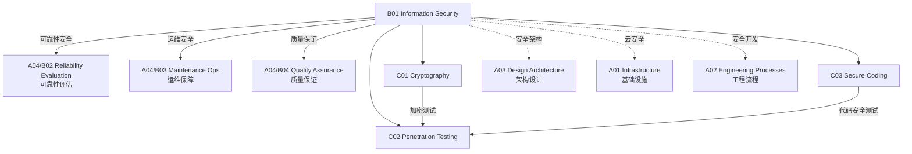

# B01 Information Security

**所属领域**: [A04_Security_Quality](../readme.md)
**创建日期**: 2026-01-30
**最后更新**: 2026-01-30

## 📋 子领域定位

信息安全是保护信息系统免受未经授权访问、使用、披露、破坏、修改或破坏的实践。随着网络威胁日益复杂和法规要求日益严格，信息安全已成为软件工程的核心组成部分而非事后考虑。

本领域涵盖密码学应用（对称/非对称加密、数字签名、PKI）、渗透测试方法论（PTES、OWASP Testing Guide）和安全编码规范（OWASP ASVS、CWE/SANS Top 25）。现代安全工程师需要理解纵深防御原则，能够在开发全流程中嵌入安全实践。

**核心关注点**：
- **密码学**: 加密算法、密钥管理、数字证书、零知识证明
- **渗透测试**: 漏洞扫描、Web 应用测试、红队演练、漏洞赏金
- **安全编码**: 输入验证、输出编码、认证授权、会话管理

## 🗂️ 专项列表

### [C01. Cryptography](C01_Cryptography/README.md)

密码学是信息安全的数学基础。本专项详解对称加密（AES、ChaCha20）、非对称加密（RSA、ECC）、哈希函数（SHA-256、BLAKE3）、数字签名（ECDSA、EdDSA）和密钥交换（Diffie-Hellman、X25519）。涵盖密钥管理系统（KMS）、硬件安全模块（HSM）、证书颁发机构（CA）和零知识证明技术。

### [C02. Penetration_Testing](C02_Penetration_Testing/README.md)

渗透测试通过模拟攻击来评估系统安全性。本专项深入渗透测试执行标准（PTES）、OWASP 测试指南、Web 应用渗透测试（SQL 注入、XSS、CSRF）、API 安全测试和移动应用安全测试。涵盖渗透测试工具链、漏洞赏金项目和红蓝对抗演练。

### [C03. Secure_Coding](C03_Secure_Coding/README.md)

安全编码规范帮助开发者在编码阶段消除安全漏洞。本专项覆盖 OWASP ASVS（应用安全验证标准）、CWE Top 25 最危险软件弱点、SANS Top 25、以及语言特定安全编码指南（SEI CERT）。涵盖输入验证、输出编码、认证授权、会话管理和安全日志记录。

## 🛠️ 技术栈概览

### 密码学工具

| 工具 | 用途 | 官网 |
|------|------|------|
| **OpenSSL** | 加密工具包 | https://www.openssl.org |
| **GnuPG** | 邮件加密 | https://gnupg.org |
| **HashiCorp Vault** | 密钥管理 | https://www.vaultproject.io |
| **AWS KMS** | 托管密钥服务 | https://aws.amazon.com/kms |
| **Let's Encrypt** | 免费证书 | https://letsencrypt.org |
| **Keycloak** | 身份认证 | https://www.keycloak.org |

### 渗透测试工具

| 工具 | 类型 | 官网 |
|------|------|------|
| **Metasploit** | 渗透框架 | https://www.metasploit.com |
| **Burp Suite** | Web 测试 | https://portswigger.net/burp |
| **OWASP ZAP** | Web 扫描 | https://www.zaproxy.org |
| **Nmap** | 网络扫描 | https://nmap.org |
| **Nessus** | 漏洞扫描 | https://www.tenable.com/products/nessus |
| **SQLMap** | SQL 注入 | https://sqlmap.org |
| **Dirb/Gobuster** | 目录爆破 | https://github.com/OJ/gobuster |

### 安全扫描工具

| 工具 | 类型 | 官网 |
|------|------|------|
| **SonarQube** | SAST | https://www.sonarqube.org |
| **Semgrep** | 轻量 SAST | https://semgrep.dev |
| **Snyk** | SCA/SAST | https://snyk.io |
| **Trivy** | 容器扫描 | https://aquasecurity.github.io/trivy |
| **GitLeaks** | 密钥扫描 | https://github.com/zricethezav/gitleaks |
| **OWASP Dependency-Check** | 依赖扫描 | https://owasp.org/www-project-dependency-check |

## 💼 实践案例索引

### 案例 1: 端到端加密消息系统

**架构设计**:
```
┌─────────┐         ┌─────────┐         ┌─────────┐
│  Alice  │────────▶│  Server │────────▶│   Bob   │
│ 客户端   │◀────────│ (Relay) │◀────────│ 客户端   │
└────┬────┘         └─────────┘         └────┬────┘
     │                                        │
     │        服务器无法解密消息内容            │
     │                                        │
     ▼                                        ▼
┌─────────────────────────────────────────────────────┐
│                   加密流程                           │
│  1. 密钥交换 (X25519)                                │
│  2. 消息加密 (AES-256-GCM)                           │
│  3. 数字签名 (Ed25519)                               │
│  4. 前向保密 (每次会话新密钥)                         │
└─────────────────────────────────────────────────────┘
```

**密钥派生**:
```python
from cryptography.hazmat.primitives.asymmetric.x25519 import X25519PrivateKey
from cryptography.hazmat.primitives.kdf.hkdf import HKDF
from cryptography.hazmat.primitives import hashes

# 生成临时密钥对
private_key = X25519PrivateKey.generate()
public_key = private_key.public_key()

# 执行 ECDH 密钥交换
shared_secret = private_key.exchange(peer_public_key)

# 派生加密密钥
key = HKDF(
    algorithm=hashes.SHA256(),
    length=32,
    salt=None,
    info=b'handshake data',
).derive(shared_secret)
```

### 案例 2: Web 应用渗透测试流程

**测试阶段**:
```
┌─────────────────────────────────────────────────────────────┐
│                    PTES 渗透测试流程                          │
├─────────────────────────────────────────────────────────────┤
│                                                             │
│  1. 前期交互                  2. 情报收集                    │
│     ├── 确定范围                ├── 域名/子域名枚举          │
│     ├── 明确目标                ├── 端口扫描                 │
│     └── 签订协议                └── 技术栈识别               │
│                        │                                    │
│                        ▼                                    │
│  3. 威胁建模                  4. 漏洞分析                    │
│     ├── 资产分类                ├── 自动化扫描               │
│     ├── 识别威胁源              ├── 手动验证                 │
│     └── 攻击路径分析            └── 逻辑漏洞挖掘             │
│                        │                                    │
│                        ▼                                    │
│  5. 渗透攻击                  6. 后渗透                      │
│     ├── 漏洞利用                ├── 权限提升                 │
│     ├── 横向移动                ├── 数据访问                 │
│     └── 权限提升                └── 持久化检测               │
│                        │                                    │
│                        ▼                                    │
│  7. 报告输出                                                 │
│     ├── 执行摘要                                             │
│     ├── 详细发现                                             │
│     └── 修复建议                                             │
└─────────────────────────────────────────────────────────────┘
```

**OWASP Top 10 (2021)**:
| 排名 | 漏洞类型 | 风险 |
|------|----------|------|
| A01 | 失效的访问控制 | 严重 |
| A02 | 加密机制失效 | 严重 |
| A03 | 注入攻击 | 严重 |
| A04 | 不安全设计 | 高 |
| A05 | 安全配置错误 | 高 |
| A06 | 易受攻击和过时组件 | 高 |
| A07 | 身份识别和认证失效 | 高 |
| A08 | 软件和数据完整性故障 | 中 |
| A09 | 安全日志和监控失效 | 中 |
| A10 | SSRF 服务器端请求伪造 | 中 |

### 案例 3: 安全编码规范实施

**输入验证清单**:
```java
// ❌ 不安全的代码
String query = "SELECT * FROM users WHERE id = " + userId;
Statement stmt = connection.createStatement();
ResultSet rs = stmt.executeQuery(query);

// ✅ 安全的代码（参数化查询）
String query = "SELECT * FROM users WHERE id = ?";
PreparedStatement pstmt = connection.prepareStatement(query);
pstmt.setString(1, userId);
ResultSet rs = pstmt.executeQuery();
```

**安全编码检查点**:
- [ ] 所有用户输入都经过验证和清理
- [ ] 使用参数化查询防止 SQL 注入
- [ ] 输出进行 HTML 编码防止 XSS
- [ ] 实施强密码策略和多因素认证
- [ ] 使用 HTTPS 保护传输中的数据
- [ ] 实施最小权限原则
- [ ] 安全处理敏感数据（加密存储）
- [ ] 记录安全相关事件
- [ ] 正确处理错误（不泄露敏感信息）
- [ ] 定期更新依赖组件

## 🔗 知识关联图谱



## 📖 学习资源

### 推荐书籍

| 书名 | 作者 | 说明 |
|------|------|------|
| 《Applied Cryptography》 | Bruce Schneier | 密码学应用经典 |
| 《The Web Application Hacker's Handbook》 | Dafydd Stuttard | Web 渗透测试圣经 |
| 《OWASP Testing Guide》 | OWASP | Web 测试权威指南 |
| 《Security Engineering》 | Ross Anderson | 安全工程全面指南 |
| 《Hacking: The Art of Exploitation》 | Jon Erickson | 漏洞利用技术 |

### 认证与培训

| 认证 | 机构 | 说明 |
|------|------|------|
| OSCP | Offensive Security | 渗透测试认证 |
| CEH | EC-Council | 道德黑客认证 |
| CISSP | (ISC)² | 安全管理认证 |
| GWAPT | SANS | Web 应用渗透测试 |
| Security+ | CompTIA | 安全基础认证 |

### 在线资源

| 资源 | 链接 | 说明 |
|------|------|------|
| OWASP | https://owasp.org | Web 安全标准 |
| NIST Cybersecurity | https://www.nist.gov/cyberframework | 网络安全框架 |
| PortSwigger Academy | https://portswigger.net/web-security | Web 安全学习 |
| Hack The Box | https://www.hackthebox.com | 渗透测试练习 |
| TryHackMe | https://tryhackme.com | 安全学习平台 |

### 开源项目

| 项目 | GitHub | 说明 |
|------|--------|------|
| OWASP ZAP | https://github.com/zaproxy/zaproxy | Web 扫描器 |
| Metasploit | https://github.com/rapid7/metasploit-framework | 渗透框架 |
| SQLMap | https://github.com/sqlmapproject/sqlmap | SQL 注入工具 |
| HashiCorp Vault | https://github.com/hashicorp/vault | 密钥管理 |

## 🔄 维护说明

- **内容审查**: 每季度更新漏洞信息和工具版本
- **更新机制**: 跟踪 OWASP、NIST 和 CVE 数据库更新
- **质量标准**: 所有安全建议需符合最新标准
- **贡献方式**: 欢迎提交安全测试案例和漏洞分析
