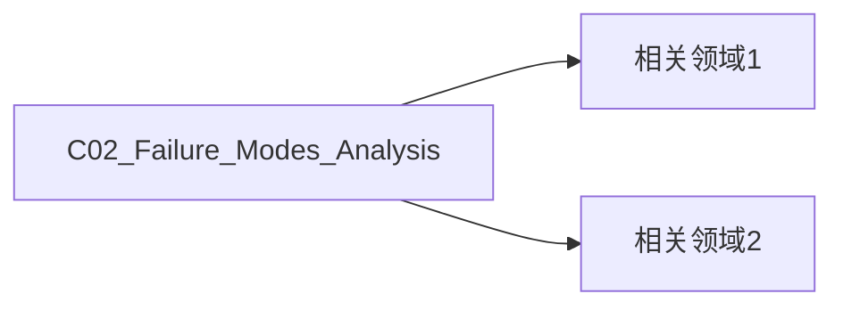

# C02 Failure Modes Analysis

**领域**: A04_Security_Quality/B02_Reliability_Evaluation  
**创建日期**: 2026-01-30

## 核心概念
- [ ] 添加关键定义
- [ ] 记录基本原理

## 技术实践
- [ ] 实现方案
- [ ] 最佳实践

## 资源索引
- [ ] 相关论文
- [ ] 工具链
- [ ] 案例研究

## 关联知识

