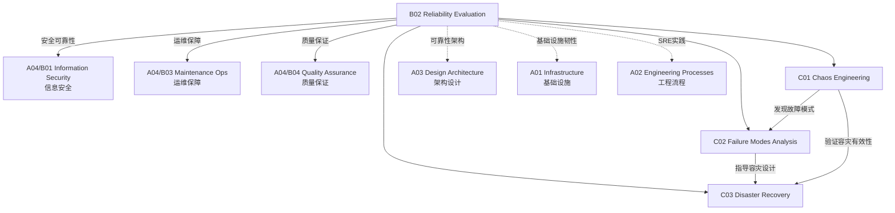

# B02 Reliability Evaluation

**所属领域**: [A04_Security_Quality](../readme.md)
**创建日期**: 2026-01-30
**最后更新**: 2026-01-30

## 📋 子领域定位

可靠性评估是确保系统在故障情况下仍能正常运行的关键实践。随着分布式系统的复杂性增加，传统的测试方法已无法满足可靠性验证的需求，需要引入混沌工程、故障模式分析等先进技术来主动发现和修复系统的薄弱环节。

本领域涵盖混沌工程实践（故障注入、韧性测试）、故障模式分析（FMEA、故障树分析）和灾难恢复（备份策略、多活架构、RTO/RPO 设计）三大方向，帮助组织构建高可用的弹性系统。

**核心关注点**：
- **混沌工程**: 故障注入、韧性测试、爆炸半径控制、安全回滚
- **故障模式分析**: FMEA、故障树、根因分析、可靠性建模
- **灾难恢复**: 备份策略、容灾架构、故障切换、业务连续性

## 🗂️ 专项列表

### [C01. Chaos_Engineering](C01_Chaos_Engineering/README.md)

混沌工程通过在生产环境中注入故障来验证系统韧性。本专项详解混沌工程原则（建立稳态假设、引入真实事件、线上环境验证）、故障注入类型（网络延迟、服务宕机、资源耗尽）、以及实验设计方法（最小爆炸半径、自动回滚）。涵盖 Chaos Monkey、Litmus、Gremlin 等混沌工程工具的使用。

### [C02. Failure_Modes_Analysis](C02_Failure_Modes_Analysis/README.md)

故障模式分析帮助团队系统性地识别和评估潜在故障。本专项深入 FMEA（故障模式与影响分析）、故障树分析（FTA）、HAZOP（危险与可操作性分析）、以及根因分析技术（5 Whys、鱼骨图）。涵盖可靠性建模（MTBF、MTTR、可用性计算）和 SRE 错误预算实践。

### [C03. Disaster_Recovery](C03_Disaster_Recovery/README.md)

灾难恢复确保业务在重大故障时能够快速恢复。本专项详解备份策略（全量/增量/差异备份、3-2-1 原则）、容灾架构（冷备/温备/热备、多活架构）、RTO/RPO 设计、以及灾难恢复演练（Game Day、 tabletop 演练）。涵盖跨地域复制、故障切换自动化和业务连续性计划（BCP）。

## 🛠️ 技术栈概览

### 混沌工程工具

| 工具 | 特点 | 官网 |
|------|------|------|
| **Chaos Mesh** | K8s 原生，中文社区 | https://chaos-mesh.org |
| **Litmus** | CNCF 项目，云原生 | https://litmuschaos.io |
| **Gremlin** | 企业级 SaaS | https://www.gremlin.com |
| **Chaos Monkey** | Netflix 开源 | https://github.com/Netflix/chaosmonkey |
| **AWS Fault Injection Simulator** | AWS 托管 | https://aws.amazon.com/fis |
| **Azure Chaos Studio** | Azure 托管 | https://azure.microsoft.com/services/chaos-studio |

### 可靠性监控工具

| 工具 | 功能 | 官网 |
|------|------|------|
| **Datadog** | 综合可观测性 | https://www.datadoghq.com |
| **New Relic** | 应用性能监控 | https://newrelic.com |
| **Dynatrace** | AIOps 监控 | https://www.dynatrace.com |
| **PagerDuty** | 事件响应 | https://www.pagerduty.com |
| **Opsgenie** | 告警管理 | https://www.atlassian.com/software/opsgenie |
| **Statuspage** | 状态页面 | https://www.atlassian.com/software/statuspage |

### 容灾备份工具

| 工具 | 功能 | 官网 |
|------|------|------|
| **Veeam** | 虚拟化备份 | https://www.veeam.com |
| **Velero** | K8s 备份恢复 | https://velero.io |
| **Kasten** | K8s 数据保护 | https://www.kasten.io |
| **Commvault** | 企业备份 | https://www.commvault.com |
| **AWS Backup** | 云备份服务 | https://aws.amazon.com/backup |
| **Azure Site Recovery** | 灾备服务 | https://azure.microsoft.com/services/site-recovery |

## 💼 实践案例索引

### 案例 1: Kubernetes 混沌工程实践

**混沌实验设计**:
```yaml
# Chaos Mesh 实验配置
apiVersion: chaos-mesh.org/v1alpha1
kind: NetworkChaos
metadata:
  name: network-delay
  namespace: chaos-testing
spec:
  action: delay
  mode: one
  selector:
    labelSelectors:
      app: web-server
  delay:
    latency: "100ms"
    correlation: "100"
    jitter: "0ms"
  duration: "5m"
  scheduler:
    cron: "@every 30m"
```

**实验流程**:
```
┌─────────────────────────────────────────────────────────────┐
│                    混沌工程实验流程                           │
├─────────────────────────────────────────────────────────────┤
│                                                             │
│  1. 定义稳态假设                                              │
│     ├── 系统正常指标（响应时间 < 200ms，错误率 < 0.1%）        │
│     └── 业务指标（订单成功率 > 99.9%）                        │
│                        │                                    │
│                        ▼                                    │
│  2. 设计实验                                                  │
│     ├── 选择故障类型（Pod 故障、网络延迟、CPU 满载）           │
│     ├── 确定爆炸半径（仅测试环境 -> 金丝雀 -> 生产）           │
│     └── 设置自动回滚条件（错误率 > 1% 自动停止）              │
│                        │                                    │
│                        ▼                                    │
│  3. 执行实验                                                  │
│     ├── 注入故障                                             │
│     ├── 监控指标                                             │
│     └── 记录系统行为                                          │
│                        │                                    │
│                        ▼                                    │
│  4. 分析结果                                                  │
│     ├── 系统是否恢复稳态？                                     │
│     ├── 发现了哪些未知弱点？                                   │
│     └── 需要修复的优先级                                      │
└─────────────────────────────────────────────────────────────┘
```

### 案例 2: FMEA 故障模式分析

**FMEA 分析表**:
| 组件 | 故障模式 | 影响 | 严重度(S) | 发生度(O) | 探测度(D) | RPN | 措施 |
|------|----------|------|-----------|-----------|-----------|-----|------|
| 数据库 | 主节点宕机 | 写入失败 | 8 | 3 | 2 | 48 | 自动故障转移 |
| 缓存 | Redis 失效 | 响应变慢 | 5 | 4 | 3 | 60 | 多级缓存 |
| 消息队列 | Kafka 分区不可写 | 消息堆积 | 7 | 2 | 4 | 56 | 分区冗余 |
| 支付网关 | 超时 | 订单失败 | 9 | 3 | 2 | 54 | 重试+降级 |

**RPN 计算公式**: RPN = S × O × D
- S (Severity): 1-10，故障影响严重程度
- O (Occurrence): 1-10，故障发生概率
- D (Detection): 1-10，故障探测难度

### 案例 3: 多活容灾架构设计

**架构拓扑**:
```
┌─────────────────────────────────────────────────────────────┐
│                    三地域多活架构                             │
├─────────────────────────────────────────────────────────────┤
│                                                             │
│     地域 A (华北)              地域 B (华东)              地域 C (华南)    │
│  ┌───────────────┐          ┌───────────────┐          ┌───────────────┐ │
│  │   活跃流量 40% │          │   活跃流量 40% │          │   待命流量 20% │ │
│  │               │          │               │          │               │ │
│  │  ┌─────────┐  │          │  ┌─────────┐  │          │  ┌─────────┐  │ │
│  │  │ K8s集群 │  │◀────────▶│  │ K8s集群 │  │◀────────▶│  │ K8s集群 │  │ │
│  │  └────┬────┘  │   同步    │  └────┬────┘  │   同步    │  └────┬────┘  │ │
│  │       │       │  复制     │       │       │  复制     │       │       │ │
│  │  ┌────┴────┐  │          │  ┌────┴────┐  │          │  ┌────┴────┐  │ │
│  │  │ 数据库   │  │◀────────▶│  │ 数据库   │  │◀────────▶│  │ 数据库   │  │ │
│  │  │ Primary │  │  同步复制  │  │ Primary │  │  异步复制  │  │ Replica │  │ │
│  │  └─────────┘  │          │  └─────────┘  │          │  └─────────┘  │ │
│  └───────────────┘          └───────────────┘          └───────────────┘ │
│           │                          │                          │         │
│           └──────────────────────────┼──────────────────────────┘         │
│                                      ▼                                    │
│                           ┌───────────────────┐                          │
│                           │   全局负载均衡器    │                          │
│                           │  (GSLB/GeoDNS)    │                          │
│                           └───────────────────┘                          │
└─────────────────────────────────────────────────────────────────────────┘
```

**容灾指标**:
| 指标 | 目标 | 实现方案 |
|------|------|----------|
| RTO | < 5分钟 | DNS 自动切换 + 预热集群 |
| RPO | < 5秒 | 同步复制 + 跨区域只读副本 |
| 可用性 | 99.999% | 三地域部署 + 自动故障转移 |

**故障切换决策树**:
```
故障检测
    │
    ├── 单节点故障？
    │   └── 是 → 本地自愈（Pod 重启）
    │
    ├── 单可用区故障？
    │   └── 是 → 同地域切换（AZ 级故障转移）
    │
    ├── 单地域故障？
    │   └── 是 → 跨地域切换（GSLB 流量切换）
    │
    └── 多地域故障？
        └── 是 → 启动灾难恢复预案（人工介入）
```

## 🔗 知识关联图谱



## 📖 学习资源

### 推荐书籍

| 书名 | 作者 | 说明 |
|------|------|------|
| 《Chaos Engineering》 | Casey Rosenthal | 混沌工程权威指南 |
| 《Site Reliability Engineering》 | Google | SRE 实践手册 |
| 《The Checklist Manifesto》 | Atul Gawande | 可靠性清单 |
| 《Resilience Engineering》 | Hollnagel | 韧性工程理论 |

### 在线资源

| 资源 | 链接 | 说明 |
|------|------|------|
| Principles of Chaos | https://principlesofchaos.org | 混沌工程原则 |
| Google SRE Books | https://sre.google/books/ | Google SRE 书籍 |
| AWS Well-Architected | https://aws.amazon.com/architecture/well-architected | 可靠性支柱 |
| Azure Reliability | https://docs.microsoft.com/azure/architecture/framework/resiliency | Azure 可靠性 |

### 开源项目

| 项目 | GitHub | 说明 |
|------|--------|------|
| Chaos Mesh | https://github.com/chaos-mesh/chaos-mesh | K8s 混沌工程 |
| Litmus | https://github.com/litmuschaos/litmus | 云原生混沌 |
| Chaos Monkey | https://github.com/Netflix/chaosmonkey | Netflix 混沌工具 |
| PowerfulSeal | https://github.com/powerfulseal/powerfulseal | K8s 混沌工具 |

## 🔄 维护说明

- **内容审查**: 每季度更新工具版本和最佳实践
- **更新机制**: 跟踪混沌工程社区和 SRE 实践发展
- **质量标准**: 确保可靠性指标基于实际生产数据
- **贡献方式**: 欢迎提交混沌实验案例和容灾架构设计
