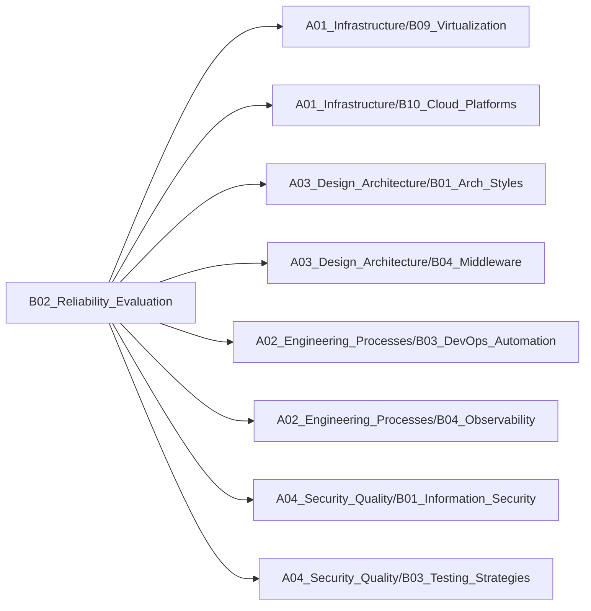

# B02_Reliability_Evaluation

**所属领域**: [A04_Security_Quality](../readme.md)
**创建日期**: 2026-01-30
**最后更新**: 2026-01-30

## 📋 子领域定位

系统可靠性工程（SRE）领域，通过混沌工程、故障模式分析、灾难恢复等技术手段，主动发现并修复系统脆弱点。从理论到实践，构建高可用、高韧性的生产系统。

**核心价值**：
- 主动发现系统潜在故障点
- 提升系统容错与自愈能力
- 建立系统可靠性度量体系
- 保障业务连续性与数据安全

## 🗂️ 专项列表

### [C01. Chaos_Engineering](C01_Chaos_Engineering/README.md)

混沌工程通过主动注入故障验证系统韧性。涵盖故障注入（网络延迟、服务宕机、资源耗尽）、爆炸半径控制、稳态假设验证等核心实践，以及Chaos Mesh、Gremlin、LitmusChaos等工具，帮助团队在生产环境前发现问题。

### [C02. Failure_Modes_Analysis](C02_Failure_Modes_Analysis/README.md)

故障模式分析系统性识别潜在故障场景。涵盖FMEA（故障模式与影响分析）、故障树分析、依赖分析、单点故障识别等方法，以及SLO/SLI设计、错误预算管理等SRE实践，建立量化的可靠性目标。

### [C03. Disaster_Recovery](C03_Disaster_Recovery/README.md)

灾难恢复确保业务在极端情况下的连续性。涵盖备份策略（3-2-1原则）、RTO/RPO目标设定、多活架构、异地容灾等核心技术，以及灾备演练、故障切换、数据恢复等运维实践，保障数据安全与业务可用性。

## 🛠️ 技术栈概览

### 核心技术
- **混沌工程**: 故障注入、稳态假设、爆炸半径、自动化实验
- **SRE实践**: SLO/SLI/SLA、错误预算、Toil消除、事后复盘
- **高可用架构**: 多活、异地多活、故障转移、降级熔断
- **监控告警**: 黄金信号（延迟/流量/错误/饱和度）、智能告警、根因分析
- **容量规划**: 负载预测、压力测试、容量评估、弹性伸缩
- **灾备技术**: 备份恢复、数据同步、跨区域复制、故障演练

### 工具链
- **混沌工程**: Chaos Mesh、Gremlin、LitmusChaos、Chaos Monkey、PowerfulSeal
- **监控平台**: Prometheus、Grafana、Datadog、New Relic、Dynatrace
- **告警系统**: Alertmanager、PagerDuty、Opsgenie、VictorOps
- **链路追踪**: Jaeger、Zipkin、SkyWalking、AWS X-Ray、Tempo
- **日志分析**: ELK Stack、Loki、Splunk、Graylog、Fluentd
- **备份工具**: Velero、Restic、Duplicity、Bacula、Veeam

### 框架与库
- **熔断降级**: Hystrix、Resilience4j、Sentinel、Polly
- **限流**: Guava RateLimiter、Bucket4j、Redis限流、Nginx限流
- **重试**: Spring Retry、Tenacity、Backoff、Retry
- **负载均衡**: Nginx、HAProxy、Envoy、Traefik、Ribbon
- **健康检查**: Spring Boot Actuator、Kubernetes Probes、Consul Health
- **压测工具**: JMeter、Gatling、Locust、k6、wrk

## 💼 实践案例索引

1. **混沌工程实践**
   - 故障注入：Chaos Mesh注入Pod故障、网络延迟
   - 稳态验证：监控关键指标，验证系统自愈能力
   - 演练流程：从测试环境到生产环境逐步推进

2. **SLO/SLI设计**
   - SLI定义：API可用性99.9%、P99延迟<200ms
   - SLO设定：基于业务需求的可靠性目标
   - 错误预算：允许0.1%的故障率，用于创新与优化

3. **多活架构设计**
   - 同城双活：两个数据中心同时提供服务
   - 异地多活：跨区域部署，就近访问
   - 数据同步：双向复制保证数据一致性

4. **灾备演练方案**
   - 备份验证：定期恢复测试验证备份有效性
   - 故障切换：模拟主站点故障，切换到备站点
   - RTO/RPO验证：实测恢复时间与数据丢失量

5. **监控告警体系**
   - 指标采集：Prometheus采集系统/应用指标
   - 可视化：Grafana仪表盘展示关键指标
   - 智能告警：基于异常检测的动态阈值告警

## 🔗 关联知识

## 📖 学习资源

### 推荐书籍
1. **《SRE: Google运维解密》** - Betsy Beyer等
   - Google SRE实践经验总结

2. **《混沌工程：通过实验学习系统韧性》** - Casey Rosenthal
   - 混沌工程理论与实践指南

3. **《The Site Reliability Workbook》** - Betsy Beyer等
   - SRE实战手册

4. **《Seeking SRE》** - David N. Blank-Edelman
   - SRE多样化视角与实践

5. **《Database Reliability Engineering》** - Laine Campbell
   - 数据库可靠性工程

6. **《Release It!》** - Michael Nygard
   - 生产环境稳定性设计模式

7. **《The Art of Monitoring》** - James Turnbull
   - 监控系统设计与实践

### 在线课程
1. **Site Reliability Engineering** - Coursera/Google
   - Google SRE官方课程

2. **Chaos Engineering Fundamentals** - Gremlin
   - 混沌工程基础认证

3. **Monitoring and Observability** - Linux Foundation
   - 可观测性工程实践

4. **Disaster Recovery Planning** - Udemy
   - 灾难恢复规划与实施

5. **High Availability Architecture** - Pluralsight
   - 高可用架构设计

### 技术博客
1. **Google SRE Blog** - https://sre.google
   - Google SRE团队技术分享

2. **Netflix Tech Blog** - https://netflixtechblog.com
   - Netflix可靠性工程实践

3. **Gremlin Blog** - https://www.gremlin.com/blog
   - 混沌工程案例与教程

4. **PagerDuty Blog** - https://www.pagerduty.com/blog
   - 事件响应与可靠性

5. **Honeycomb Blog** - https://www.honeycomb.io/blog
   - 可观测性最佳实践

6. **Chaos Mesh Blog** - https://chaos-mesh.org/blog
   - Kubernetes混沌工程

7. **SRE Weekly** - https://sreweekly.com
   - SRE领域周刊

## 🔄 维护说明

- **内容审查**: 每月检查链接有效性
- **更新机制**: 发现新技术或最佳实践时及时更新
- **质量标准**: 确保所有专项主题内容完整且准确
