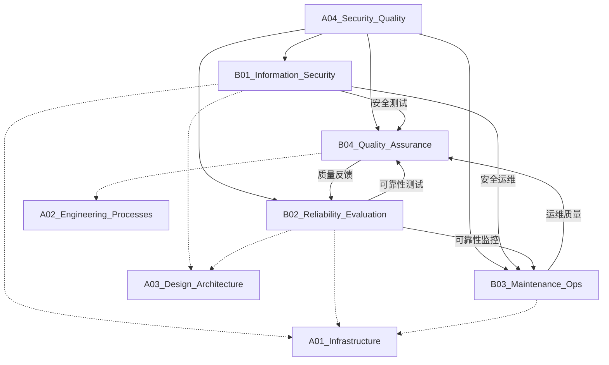

# A04_Security_Quality

**领域定位**: 系统安全与可靠性保障
**创建日期**: 2026-01-30
**最后更新**: 2026-01-30

## 📋 领域概述

安全与质量领域专注于构建可信赖的系统，涵盖从信息安全防护到系统可靠性保障的全方位实践。本领域强调纵深防御、持续验证和主动运维，确保系统在面对威胁和故障时的韧性与恢复能力。

**核心关注点**：
- **信息安全**：密码学应用、渗透测试、安全编码
- **可靠性工程**：混沌工程、故障分析、灾难恢复
- **运维保障**：事件响应、性能调优、技术债务
- **质量保证**：自动化测试、模糊测试、合规扫描
- **安全文化**：DevSecOps、零信任架构、安全左移

## 🗂️ 子领域结构

### [B01_Information_Security](B01_Information_Security/README.md)
**定位**：密码学应用、渗透测试、安全编码规范

涵盖对称/非对称加密、数字签名、PKI 体系、Web 安全漏洞 (OWASP Top 10)、渗透测试方法论 (PTES)、安全编码实践 (CERT)、威胁情报分析等。

### [B02_Reliability_Evaluation](B02_Reliability_Evaluation/README.md)
**定位**：混沌工程实践、故障模式分析、灾难恢复

包括混沌工程实验设计、故障注入工具 (Chaos Monkey)、FMEA 故障模式分析、SRE 可靠性工程、灾难恢复计划 (DRP)、业务连续性管理 (BCM) 等。

### [B03_Maintenance_Ops](B03_Maintenance_Ops/README.md)
**定位**：事件响应流程、性能调优、技术债务管理

涉及 ITIL 事件管理、根因分析 (RCA)、性能基准测试、APM 应用性能监控、技术债务量化、遗留系统现代化策略等。

### [B04_Quality_Assurance](B04_Quality_Assurance/README.md)
**定位**：自动化测试、模糊测试、合规扫描

覆盖测试金字塔、TDD/BDD 实践、契约测试、模糊测试 (Fuzzing)、静态代码分析 (SAST)、动态应用安全测试 (DAST)、合规性自动化 (SOC 2/ISO 27001) 等。

## 🔗 知识关联图谱

## 📚 学习路径建议

### 初级路径
**目标**：建立安全意识，掌握基础质量保障方法

1. **安全基础** (B01)
   - 常见 Web 漏洞 (XSS/CSRF/SQL 注入)
   - HTTPS/TLS 原理
   - 密码学基础概念
   - 安全编码规范

2. **测试入门** (B04)
   - 单元测试编写
   - 集成测试设计
   - 测试覆盖率分析
   - 基本自动化测试

3. **运维基础** (B03)
   - 日志管理与分析
   - 基本监控指标
   - 事件响应流程
   - 性能监控工具

4. **可靠性概念** (B02)
   - SLA/SLO/SLI 定义
   - 故障分类与影响
   - 基本备份策略
   - 高可用架构概念

### 中级路径
**目标**：深入安全实践，构建质量保障体系

1. **应用安全** (B01)
   - OWASP Top 10 深度防御
   - 安全架构设计
   - 身份认证与授权 (OAuth/OIDC)
   - API 安全最佳实践
   - 渗透测试方法

2. **可靠性工程** (B02)
   - SRE 实践 (错误预算/SLO)
   - 混沌工程实验设计
   - 故障演练 (Game Day)
   - 灾难恢复测试
   - 容量规划

3. **运维进阶** (B03)
   - 可观测性三支柱 (日志/指标/追踪)
   - 根因分析方法 (5 Whys/鱼骨图)
   - 性能调优实践
   - 事件管理自动化
   - 变更管理流程

4. **质量工程** (B04)
   - 测试策略设计
   - 契约测试 (Pact)
   - 性能测试 (负载/压力/稳定性)
   - 安全测试自动化
   - 质量门禁设计

### 高级路径
**目标**：安全架构设计，可靠性体系建设

1. **安全架构** (B01)
   - 零信任架构设计
   - 威胁建模 (STRIDE/PASTA)
   - 密码学工程实践
   - 安全合规框架 (NIST/CIS)
   - 供应链安全
   - 红蓝对抗演练

2. **混沌工程** (B02)
   - 混沌工程平台建设
   - 故障注入策略
   - 韧性度量体系
   - 自愈系统设计
   - 多区域容灾架构
   - 业务连续性管理

3. **高级运维** (B03)
   - AIOps 智能运维
   - 自动化修复系统
   - 技术债务量化
   - 成本优化策略
   - 遗留系统现代化
   - 运维效能度量

4. **质量体系** (B04)
   - 测试左移策略
   - 模糊测试平台
   - 质量度量体系
   - 合规自动化
   - 测试数据管理
   - 质量文化建设

## 📖 参考资源

### 核心资源

**书籍**：
- 《Web 应用安全权威指南》- OWASP 安全实践
- 《Site Reliability Engineering》- Google SRE 实践
- 《The Phoenix Project》- DevOps 与运维转型
- 《Chaos Engineering》- 混沌工程实践指南
- 《Accelerate》- DevOps 效能度量
- 《Security Engineering》- Ross Anderson 安全工程

**在线资源**：
- OWASP Foundation: https://owasp.org/
- NIST Cybersecurity Framework: https://www.nist.gov/cyberframework
- Google SRE Books: https://sre.google/books/
- Chaos Engineering Principles: https://principlesofchaos.org/
- SANS Institute: https://www.sans.org/

**社区**：
- OWASP Community
- SRE Weekly Newsletter
- Chaos Engineering Community
- DevSecOps Foundation

### 扩展阅读

**信息安全**：
- 《Applied Cryptography》- Bruce Schneier 密码学应用
- 《The Web Application Hacker's Handbook》- 渗透测试经典
- 《Threat Modeling: Designing for Security》- 威胁建模
- 《Zero Trust Networks》- 零信任架构

**可靠性工程**：
- 《Designing Data-Intensive Applications》- 分布式系统可靠性
- 《Release It!》- 生产环境稳定性设计
- 《The Art of Capacity Planning》- 容量规划
- 《Chaos Engineering》- O'Reilly 混沌工程

**运维实践**：
- 《The Practice of Cloud System Administration》- 云运维实践
- 《Effective DevOps》- DevOps 文化与实践
- 《Infrastructure as Code》- 基础设施即代码
- 《Observability Engineering》- 可观测性工程

**质量保证**：
- 《Continuous Delivery》- 持续交付实践
- 《Growing Object-Oriented Software, Guided by Tests》- TDD 实践
- 《The Art of Software Testing》- 软件测试艺术
- 《Agile Testing》- 敏捷测试实践

**前沿技术**：
- Black Hat/DEF CON 安全会议
- SREcon 可靠性工程大会
- USENIX Security Symposium
- IEEE Security & Privacy 期刊

## 🔄 维护说明

- **内容更新频率**: 每季度审查一次
- **质量标准**: 确保所有子领域链接有效，内容准确完整
- **贡献方式**: 参见根目录 readme.md 中的贡献指南
