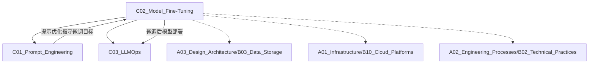

# C02 Model Fine-Tuning

**所属子领域**: [B01_AI_LLM_Engineering](../README.md)  
**创建日期**: 2026-01-30  
**最后更新**: 2026-01-30

## 📋 主题定位

模型微调（Model Fine-Tuning）是大语言模型工程化的核心技术，通过在特定领域数据上继续训练预训练模型，使其适应下游任务。相比提示工程，微调能够实现更深度的模型适配，显著提升专业领域任务的准确性和一致性。

## 🎯 核心概念

### 基本定义

模型微调是在预训练大语言模型（如 GPT、LLaMA、Claude 等）的基础上，使用特定领域或任务的数据集进行进一步训练，使模型学习领域知识和任务模式的过程。

**微调 vs 预训练 vs 提示工程**:

| 维度 | 预训练 | 微调 | 提示工程 |
|------|--------|------|----------|
| **数据量** | 万亿级 token | 千-百万级样本 | 无需训练数据 |
| **计算成本** | 极高（百万美元级） | 中等（数百-数千美元） | 低（推理成本） |
| **领域适应** | 通用能力 | 深度领域适配 | 依赖上下文学习 |
| **知识更新** | 基础世界知识 | 领域专业知识 | 动态信息注入 |
| **适用场景** | 基础模型构建 | 专业领域应用 | 快速原型验证 |

### 关键特性

**1. 全参数微调（Full Fine-Tuning）**
- 更新模型的所有参数
- 效果最佳，但计算成本最高
- 需要大量训练数据和 GPU 资源
- 容易产生灾难性遗忘

**2. 参数高效微调（PEFT）**
- **LoRA (Low-Rank Adaptation)**: 低秩适配，只训练低秩矩阵
- **QLoRA**: 4-bit 量化 + LoRA，大幅降低显存需求
- **Adapter**: 在 Transformer 层间插入小型适配器模块
- **Prefix Tuning**: 训练前缀嵌入，冻结主体参数
- **Prompt Tuning**: 优化软提示向量

**3. 指令微调（Instruction Tuning）**
- 使用 (指令, 输入, 输出) 格式数据训练
- 使模型学会遵循人类指令
- 是构建 Chat 模型的关键步骤
- 典型数据集：Alpaca、Dolly、OpenAssistant

**4. 人类反馈强化学习（RLHF）**
- SFT（监督微调）→ RM（奖励模型训练）→ RL（强化学习优化）
- 使模型输出符合人类偏好
- 关键步骤：数据收集 → 奖励建模 → PPO/DPO 训练

### 应用场景

- **垂直领域模型**: 法律、医疗、金融等专业领域助手
- **代码生成**: 特定编程语言或框架的代码补全
- **多语言支持**: 低资源语言的模型适配
- **风格迁移**: 特定写作风格或语气的生成
- **任务特化**: 摘要、翻译、分类等特定任务优化

## 🛠️ 技术实践

### 实现方法

**1. 数据准备**

```python
# 标准指令微调数据格式
{
    "instruction": "将以下中文翻译成英文",
    "input": "机器学习是人工智能的一个重要分支",
    "output": "Machine learning is an important branch of artificial intelligence"
}

# 对话格式（ChatML）
{
    "messages": [
        {"role": "system", "content": "你是一个专业翻译助手"},
        {"role": "user", "content": "翻译：你好世界"},
        {"role": "assistant", "content": "Hello World"}
    ]
}
```

**数据质量最佳实践**:
- 数据清洗：去除噪声、重复、低质量样本
- 数据平衡：确保各类别样本均衡
- 数据多样性：覆盖各种场景和边界情况
- 数据隐私：敏感信息脱敏处理

**2. LoRA 微调实现**

```python
from peft import LoraConfig, get_peft_model, prepare_model_for_kbit_training
from transformers import AutoModelForCausalLM, AutoTokenizer, TrainingArguments
from trl import SFTTrainer

# 加载基础模型
model = AutoModelForCausalLM.from_pretrained(
    "meta-llama/Llama-2-7b-hf",
    load_in_8bit=True,  # 量化加载
    torch_dtype=torch.float16,
    device_map="auto"
)

# 准备模型用于训练
model = prepare_model_for_kbit_training(model)

# 配置 LoRA
lora_config = LoraConfig(
    r=16,  # LoRA 秩，通常 8-64
    lora_alpha=32,  # 缩放参数，通常是 r 的 2 倍
    target_modules=["q_proj", "v_proj"],  # 目标模块
    lora_dropout=0.05,
    bias="none",
    task_type="CAUSAL_LM"
)

# 应用 LoRA
model = get_peft_model(model, lora_config)

# 训练配置
training_args = TrainingArguments(
    output_dir="./lora_model",
    num_train_epochs=3,
    per_device_train_batch_size=4,
    gradient_accumulation_steps=4,
    learning_rate=2e-4,
    warmup_steps=100,
    logging_steps=10,
    save_steps=500,
    fp16=True,
    optim="paged_adamw_8bit"
)

# 训练
trainer = SFTTrainer(
    model=model,
    train_dataset=dataset,
    args=training_args,
    tokenizer=tokenizer,
    max_seq_length=512
)
trainer.train()

# 保存 LoRA 权重
model.save_pretrained("./lora_model")
```

**3. QLoRA 高效微调**

```python
from transformers import BitsAndBytesConfig

# 4-bit 量化配置
bnb_config = BitsAndBytesConfig(
    load_in_4bit=True,
    bnb_4bit_quant_type="nf4",  # 4-bit Normal Float
    bnb_4bit_compute_dtype=torch.bfloat16,
    bnb_4bit_use_double_quant=True  # 嵌套量化
)

model = AutoModelForCausalLM.from_pretrained(
    "meta-llama/Llama-2-13b-hf",
    quantization_config=bnb_config,
    device_map="auto"
)

# 后续 LoRA 配置同上
# QLoRA 可在单张 24GB GPU 上微调 13B 模型
```

**4. 推理与合并**

```python
from peft import PeftModel

# 加载基础模型
base_model = AutoModelForCausalLM.from_pretrained("meta-llama/Llama-2-7b-hf")

# 加载 LoRA 权重
model = PeftModel.from_pretrained(base_model, "./lora_model")

# 方式1：动态加载（LoRA 权重单独存储）
# 适合多适配器切换场景

# 方式2：合并权重（Merge and Unload）
model = model.merge_and_unload()
# 合并后保存为完整模型
model.save_pretrained("./merged_model")
```

### 最佳实践

**1. 超参数调优**

| 参数 | 建议值 | 说明 |
|------|--------|------|
| LoRA rank (r) | 8-64 | 任务越复杂，rank 越高 |
| lora_alpha | 2*r | 缩放系数 |
| Learning Rate | 1e-4 ~ 5e-4 | 通常比全参数微调高 10 倍 |
| Batch Size | 4-16 | 根据显存调整 |
| Epochs | 3-10 | 早停防止过拟合 |
| Max Length | 512-2048 | 根据任务复杂度 |

**2. 训练策略**

**学习率调度**:
```python
# 余弦退火 +  Warmup
from transformers import get_cosine_schedule_with_warmup

scheduler = get_cosine_schedule_with_warmup(
    optimizer,
    num_warmup_steps=100,
    num_training_steps=total_steps
)
```

**梯度检查点**:
```python
model.gradient_checkpointing_enable()
# 以计算换显存，可节省 30-40% 显存
```

**3. 评估与监控**

```python
# 自动评估指标
from evaluate import load

bleu = load("bleu")
rouge = load("rouge")
perplexity = load("perplexity")

# 自定义领域评估
# 建立领域特定的测试集
# 人工评估样本质量
```

**4. 灾难性遗忘防护**

```python
# 方式1：保留部分原始数据
mixed_dataset = original_data.sample(0.1) + new_domain_data

# 方式2：EWC (Elastic Weight Consolidation)
# 对重要参数施加约束

# 方式3：Replay Buffer
# 定期混合原始任务样本
```

### 常见陷阱

**1. 数据泄露**
- ❌ 测试数据混入训练集
- ✅ 严格划分训练/验证/测试集
- ✅ 使用时间戳分割时序数据

**2. 过拟合**
- ❌ 训练数据太少或 epochs 过多
- ✅ 使用验证集早停
- ✅ 添加 Dropout 和权重衰减
- ✅ 数据增强和正则化

**3. 灾难性遗忘**
- ❌ 完全遗忘通用能力
- ✅ 混合保留原始能力的样本
- ✅ 使用 Adapter 等模块化方法

**4. 量化精度损失**
- ❌ 过度量化导致效果下降
- ✅ 8-bit 通常是精度与效率的平衡点
- ✅ 关键层保持 FP16/FP32

## 📚 资源索引

### 学术论文

1. **LoRA: Low-Rank Adaptation of Large Language Models** (2021)
   - 作者：Edward Hu et al., Microsoft
   - 链接：https://arxiv.org/abs/2106.09685
   - 核心贡献：提出低秩适配方法，大幅降低微调参数量

2. **QLoRA: Efficient Finetuning of Quantized LLMs** (2023)
   - 作者：Tim Dettmers et al., UW
   - 链接：https://arxiv.org/abs/2305.14314
   - 核心贡献：4-bit 量化 + LoRA，单卡微调 65B 模型

3. **Parameter-Efficient Transfer Learning for NLP** (2019)
   - 作者：Neil Houlsby et al., Google
   - 链接：https://arxiv.org/abs/1902.00751
   - 核心贡献：Adapter 层方法

4. **Training language models to follow instructions with human feedback** (2022)
   - 作者：Long Ouyang et al., OpenAI
   - 链接：https://arxiv.org/abs/2203.02155
   - 核心贡献：InstructGPT 的 RLHF 训练方法

5. **Llama 2: Open Foundation and Fine-Tuned Chat Models** (2023)
   - 作者：Hugo Touvron et al., Meta
   - 链接：https://arxiv.org/abs/2307.09288
   - 核心贡献：开源可商用的大模型及微调方法

### 技术文档

1. **Hugging Face PEFT 文档**
   - https://huggingface.co/docs/peft
   - 参数高效微调的官方实现指南

2. **Hugging Face TRL 文档**
   - https://huggingface.co/docs/trl
   - Transformer 强化学习训练框架

3. **Llama-Recipes**
   - https://github.com/meta-llama/llama-recipes
   - Meta 官方的 Llama 微调示例

4. **Axolotl**
   - https://github.com/OpenAccess-AI-Collective/axolotl
   - 简化大模型微调的工具

### 开源项目

1. **LLaMA-Factory**
   - https://github.com/hiyouga/LLaMA-Factory
   - 一站式大模型微调框架，支持 100+ 模型

2. **Unsloth**
   - https://github.com/unslothai/unsloth
   - 2-5 倍更快的微调，50% 更少显存

3. **Xtuner**
   - https://github.com/InternLM/xtuner
   - 书生·浦语的高效微调工具箱

4. **Modal**
   - https://modal.com/
   - 云端微调部署平台

### 数据集资源

1. **Awesome Instruction Datasets**
   - https://github.com/01-ai/Yi-1.5#training-data
   - 指令微调数据集集合

2. **Hugging Face Datasets**
   - https://huggingface.co/datasets?task_categories=task_categories:text-generation
   - 社区共享的文本生成数据集

3. **ShareGPT**
   - https://sharegpt.com/
   - 真实对话数据

## 🔗 关联知识



## 💡 学习建议

### 前置知识
- 深度学习基础（反向传播、优化器）
- Transformer 架构原理
- PyTorch 基础操作
- CUDA 和 GPU 编程基础

### 学习路径

**第1周：理论理解**
- 学习 LoRA/QLoRA 论文
- 理解 PEFT 原理
- 了解 RLHF 流程

**第2周：环境搭建**
- 配置 GPU 环境
- 安装 Transformers + PEFT
- 跑通官方示例

**第3周：实践微调**
- 使用公开数据集微调小模型
- 尝试不同 PEFT 方法对比
- 学习超参数调优

**第4周：项目实战**
- 构建领域数据集
- 完整微调流程
- 模型评估与部署

### 实践项目

**项目1：领域问答助手**
- 数据：领域文档 + 问答对
- 模型：Llama-2-7B + LoRA
- 输出：领域专属 Chatbot

**项目2：代码生成模型**
- 数据：GitHub 代码 + 注释
- 模型：CodeLlama + QLoRA
- 输出：IDE 代码补全插件

**项目3：多语言适配**
- 数据：低资源语言语料
- 模型：mBERT/XLM + 微调
- 输出：多语言 NLP 服务

## 🔄 维护说明

- **更新频率**: 每季度跟踪最新微调技术
- **质量标准**: 代码可运行，论文链接有效
- **贡献方式**: 提交新的微调方法、优化技巧、实践案例
