# C02 Model Fine-Tuning

**所属子领域**: [B01_AI_LLM_Engineering](../README.md)  
**创建日期**: 2026-01-30  
**最后更新**: 2026-01-30

## 📋 主题定位

模型微调（Model Fine-Tuning）是大语言模型工程化的核心技术，通过在特定领域数据上继续训练预训练模型，使其适应下游任务。相比提示工程，微调能够实现更深度的模型适配，显著提升专业领域任务的准确性和一致性。

## 🎯 核心概念

### 基本定义

模型微调是在预训练大语言模型（如 GPT、LLaMA、Claude 等）的基础上，使用特定领域或任务的数据集进行进一步训练，使模型学习领域知识和任务模式的过程。

**微调 vs 预训练 vs 提示工程**:

| 维度 | 预训练 | 微调 | 提示工程 |
|------|--------|------|----------|
| **数据量** | 万亿级 token | 千-百万级样本 | 无需训练数据 |
| **计算成本** | 极高（百万美元级） | 中等（数百-数千美元） | 低（推理成本） |
| **领域适应** | 通用能力 | 深度领域适配 | 依赖上下文学习 |
| **知识更新** | 基础世界知识 | 领域专业知识 | 动态信息注入 |
| **适用场景** | 基础模型构建 | 专业领域应用 | 快速原型验证 |

### 关键特性

**1. 全参数微调（Full Fine-Tuning）**
- 更新模型的所有参数
- 效果最佳，但计算成本最高
- 需要大量训练数据和 GPU 资源
- 容易产生灾难性遗忘

**2. 参数高效微调（PEFT）**
- **LoRA (Low-Rank Adaptation)**: 低秩适配，只训练低秩矩阵
- **QLoRA**: 4-bit 量化 + LoRA，大幅降低显存需求
- **Adapter**: 在 Transformer 层间插入小型适配器模块
- **Prefix Tuning**: 训练前缀嵌入，冻结主体参数
- **Prompt Tuning**: 优化软提示向量

**3. 指令微调（Instruction Tuning）**
- 使用 (指令, 输入, 输出) 格式数据训练
- 使模型学会遵循人类指令
- 是构建 Chat 模型的关键步骤
- 典型数据集：Alpaca、Dolly、OpenAssistant

**4. 人类反馈强化学习（RLHF）**
- SFT（监督微调）→ RM（奖励模型训练）→ RL（强化学习优化）
- 使模型输出符合人类偏好
- 关键步骤：数据收集 → 奖励建模 → PPO/DPO 训练

### 应用场景

- **垂直领域模型**: 法律、医疗、金融等专业领域助手
- **代码生成**: 特定编程语言或框架的代码补全
- **多语言支持**: 低资源语言的模型适配
- **风格迁移**: 特定写作风格或语气的生成
- **任务特化**: 摘要、翻译、分类等特定任务优化

## 🛠️ 技术实践

### 实现方法

**1. 数据准备**

```python
# 标准指令微调数据格式
{
    "instruction": "将以下中文翻译成英文",
    "input": "机器学习是人工智能的一个重要分支",
    "output": "Machine learning is an important branch of artificial intelligence"
}

# 对话格式（ChatML）
{
    "messages": [
        {"role": "system", "content": "你是一个专业翻译助手"},
        {"role": "user", "content": "翻译：你好世界"},
        {"role": "assistant", "content": "Hello World"}
    ]
}
```

**数据质量最佳实践**:
- 数据清洗：去除噪声、重复、低质量样本
- 数据平衡：确保各类别样本均衡
- 数据多样性：覆盖各种场景和边界情况
- 数据隐私：敏感信息脱敏处理

**2. LoRA 微调实现**

```python
from peft import LoraConfig, get_peft_model, prepare_model_for_kbit_training
from transformers import AutoModelForCausalLM, AutoTokenizer, TrainingArguments
from trl import SFTTrainer

# 加载基础模型
model = AutoModelForCausalLM.from_pretrained(
    "meta-llama/Llama-2-7b-hf",
    load_in_8bit=True,  # 量化加载
    torch_dtype=torch.float16,
    device_map="auto"
)

# 准备模型用于训练
model = prepare_model_for_kbit_training(model)

# 配置 LoRA
lora_config = LoraConfig(
    r=16,  # LoRA 秩，通常 8-64
    lora_alpha=32,  # 缩放参数，通常是 r 的 2 倍
    target_modules=["q_proj", "v_proj"],  # 目标模块
    lora_dropout=0.05,
    bias="none",
    task_type="CAUSAL_LM"
)

# 应用 LoRA
model = get_peft_model(model, lora_config)

# 训练配置
training_args = TrainingArguments(
    output_dir="./lora_model",
    num_train_epochs=3,
    per_device_train_batch_size=4,
    gradient_accumulation_steps=4,
    learning_rate=2e-4,
    warmup_steps=100,
    logging_steps=10,
    save_steps=500,
    fp16=True,
    optim="paged_adamw_8bit"
)

# 训练
trainer = SFTTrainer(
    model=model,
    train_dataset=dataset,
    args=training_args,
    tokenizer=tokenizer,
    max_seq_length=512
)
trainer.train()

# 保存 LoRA 权重
model.save_pretrained("./lora_model")
```

**3. QLoRA 高效微调**

```python
from transformers import BitsAndBytesConfig

# 4-bit 量化配置
bnb_config = BitsAndBytesConfig(
    load_in_4bit=True,
    bnb_4bit_quant_type="nf4",  # 4-bit Normal Float
    bnb_4bit_compute_dtype=torch.bfloat16,
    bnb_4bit_use_double_quant=True  # 嵌套量化
)

model = AutoModelForCausalLM.from_pretrained(
    "meta-llama/Llama-2-13b-hf",
    quantization_config=bnb_config,
    device_map="auto"
)

# 后续 LoRA 配置同上
# QLoRA 可在单张 24GB GPU 上微调 13B 模型
```

**4. 推理与合并**

```python
from peft import PeftModel

# 加载基础模型
base_model = AutoModelForCausalLM.from_pretrained("meta-llama/Llama-2-7b-hf")

# 加载 LoRA 权重
model = PeftModel.from_pretrained(base_model, "./lora_model")

# 方式1：动态加载（LoRA 权重单独存储）
# 适合多适配器切换场景

# 方式2：合并权重（Merge and Unload）
model = model.merge_and_unload()
# 合并后保存为完整模型
model.save_pretrained("./merged_model")
```

**5. DPO（Direct Preference Optimization）实现**

```python
from trl import DPOTrainer
from peft import LoraConfig

# DPO 数据集格式
# 每条数据包含：prompt, chosen（偏好回答）, rejected（不偏好回答）

# 配置 LoRA 用于 DPO
lora_config = LoraConfig(
    r=16,
    lora_alpha=32,
    target_modules=["q_proj", "v_proj", "k_proj", "o_proj"],
    lora_dropout=0.05,
    bias="none",
    task_type="CAUSAL_LM"
)

# DPO 训练配置
training_args = TrainingArguments(
    output_dir="./dpo_model",
    num_train_epochs=1,
    per_device_train_batch_size=2,
    gradient_accumulation_steps=8,
    learning_rate=5e-7,  # DPO 通常使用更小的学习率
    warmup_steps=100,
    logging_steps=10,
    save_steps=500,
    fp16=True,
    optim="paged_adamw_8bit",
    beta=0.1  # DPO 温度参数，控制与参考模型的偏离程度
)

# 初始化 DPO 训练器
dpo_trainer = DPOTrainer(
    model=model,
    ref_model=ref_model,  # 参考模型（通常是 SFT 后的模型）
    args=training_args,
    train_dataset=dpo_dataset,
    tokenizer=tokenizer,
    peft_config=lora_config,
    max_length=512,
    max_prompt_length=256
)

# 开始训练
dpo_trainer.train()
dpo_trainer.save_model("./dpo_model")
```

**6. 多模态微调（LLaVA 风格）**

```python
# 多模态指令微调数据格式
{
    "id": "image_001",
    "image": "path/to/image.jpg",
    "conversations": [
        {
            "from": "human",
            "value": "<image>\n描述这张图片的内容"
        },
        {
            "from": "gpt",
            "value": "这张图片展示了一座雪山，山顶覆盖着皑皑白雪..."
        }
    ]
}

# 使用 LLaVA 训练脚本
# https://github.com/haotian-liu/LLaVA
```

**7. PPO（Proximal Policy Optimization）训练**

```python
from trl import PPOTrainer, PPOConfig
from transformers import AutoModelForCausalLMWithValueHead

# 初始化带价值头的模型
model = AutoModelForCausalLMWithValueHead.from_pretrained(
    "./sft_model",
    peft_config=lora_config
)

# PPO 配置
ppo_config = PPOConfig(
    model_name="./sft_model",
    learning_rate=1.41e-5,
    batch_size=256,
    mini_batch_size=64,
    gradient_accumulation_steps=1,
    optimize_cuda_cache=True,
    early_stopping=False,
    target_kl=0.1,
    ppo_epochs=4,
    seed=42,
)

# 初始化 PPO 训练器
ppo_trainer = PPOTrainer(
    config=ppo_config,
    model=model,
    ref_model=ref_model,
    tokenizer=tokenizer,
    dataset=dataset,
    data_collator=collator
)

# 训练循环
for epoch in range(ppo_config.ppo_epochs):
    for batch in ppo_trainer.dataloader:
        queries = batch["query"]
        
        # 生成回答
        response_tensors = ppo_trainer.generate(queries)
        
        # 使用奖励模型打分
        rewards = reward_model(response_tensors)
        
        # PPO 更新
        stats = ppo_trainer.step(queries, response_tensors, rewards)
        ppo_trainer.log_stats(stats, batch, rewards)
```

**8. 奖励模型训练**

```python
from transformers import AutoModelForSequenceClassification

# 初始化奖励模型
reward_model = AutoModelForSequenceClassification.from_pretrained(
    "meta-llama/Llama-2-7b-hf",
    num_labels=1,  # 回归任务
    torch_dtype=torch.bfloat16
)

# 奖励模型训练配置
training_args = TrainingArguments(
    output_dir="./reward_model",
    num_train_epochs=1,
    per_device_train_batch_size=4,
    learning_rate=1e-5,
    warmup_ratio=0.1,
    logging_steps=10,
    evaluation_strategy="steps",
    eval_steps=500,
    save_steps=1000
)

# 训练奖励模型
trainer = Trainer(
    model=reward_model,
    args=training_args,
    train_dataset=preference_dataset,
    eval_dataset=eval_dataset,
    compute_metrics=compute_metrics
)
trainer.train()
```

**9. 微调数据集构建工具**

```python
# 使用 Self-Instruct 方法生成指令数据
# https://github.com/tatsu-lab/stanford_alpaca

import json
import random
from openai import OpenAI

client = OpenAI()

# 种子任务
seed_tasks = [
    "解释什么是机器学习",
    "写一个Python函数计算斐波那契数列",
    "翻译以下句子：Hello World"
]

# 生成新指令
def generate_instruction(seed_task: str) -> dict:
    """基于种子任务生成新的指令-输出对"""
    
    # 构建提示词
    prompt = f"""基于以下示例，生成一个新的指令-输出对。

示例：
指令：{seed_task}
输出：[对应的输出]

请生成一个全新的指令（与示例不同），并提供相应的输出。

指令："""
    
    response = client.chat.completions.create(
        model="gpt-4",
        messages=[
            {"role": "system", "content": "你是一个帮助生成训练数据的助手。"},
            {"role": "user", "content": prompt}
        ],
        temperature=0.8
    )
    
    # 解析生成的内容
    content = response.choices[0].message.content
    # 提取指令和输出
    lines = content.strip().split('\n')
    instruction = lines[0].replace("指令：", "").strip()
    output = '\n'.join(lines[2:]).replace("输出：", "").strip()
    
    return {
        "instruction": instruction,
        "input": "",
        "output": output
    }

# 批量生成
dataset = []
for seed in seed_tasks:
    for _ in range(10):  # 每个种子生成10个新指令
        try:
            new_item = generate_instruction(seed)
            dataset.append(new_item)
        except Exception as e:
            print(f"生成失败: {e}")

# 保存数据集
with open("generated_instructions.json", "w", encoding="utf-8") as f:
    json.dump(dataset, f, ensure_ascii=False, indent=2)
```

**10. 微调效果评估**

```python
# 使用 GPT-4 作为评估器
from openai import OpenAI
import json

client = OpenAI()

def evaluate_response(instruction: str, output: str, expected: str) -> dict:
    """使用 GPT-4 评估模型输出质量"""
    
    eval_prompt = f"""评估以下模型输出的质量。

指令：{instruction}

模型输出：{output}

参考答案：{expected}

请从以下维度评分（1-5分）：
1. 准确性：输出内容是否正确
2. 完整性：是否覆盖所有要点
3. 流畅性：语言是否自然流畅
4. 有用性：对用户是否有帮助

以 JSON 格式返回评分和理由：
{{
    "accuracy": 分数,
    "completeness": 分数,
    "fluency": 分数,
    "helpfulness": 分数,
    "overall": 平均分,
    "reasoning": "评价理由"
}}"""
    
    response = client.chat.completions.create(
        model="gpt-4",
        messages=[
            {"role": "system", "content": "你是一个严格的模型评估专家。"},
            {"role": "user", "content": eval_prompt}
        ],
        temperature=0.3
    )
    
    # 解析 JSON 响应
    result = response.choices[0].message.content
    try:
        return json.loads(result)
    except:
        return {"error": "解析失败", "raw": result}

# 批量评估
def batch_evaluate(test_data: list) -> dict:
    """评估整个测试集"""
    results = []
    for item in test_data:
        score = evaluate_response(
            item["instruction"],
            item["model_output"],
            item["expected"]
        )
        results.append(score)
    
    # 计算平均分数
    avg_scores = {
        "accuracy": sum(r["accuracy"] for r in results) / len(results),
        "completeness": sum(r["completeness"] for r in results) / len(results),
        "fluency": sum(r["fluency"] for r in results) / len(results),
        "helpfulness": sum(r["helpfulness"] for r in results) / len(results),
        "overall": sum(r["overall"] for r in results) / len(results)
    }
    
    return {
        "average_scores": avg_scores,
        "detailed_results": results
    }
```

### 最佳实践

**1. 超参数调优**

| 参数 | 建议值 | 说明 |
|------|--------|------|
| LoRA rank (r) | 8-64 | 任务越复杂，rank 越高 |
| lora_alpha | 2*r | 缩放系数 |
| Learning Rate | 1e-4 ~ 5e-4 | 通常比全参数微调高 10 倍 |
| Batch Size | 4-16 | 根据显存调整 |
| Epochs | 3-10 | 早停防止过拟合 |
| Max Length | 512-2048 | 根据任务复杂度 |

**2. 训练策略**

**学习率调度**:
```python
# 余弦退火 +  Warmup
from transformers import get_cosine_schedule_with_warmup

scheduler = get_cosine_schedule_with_warmup(
    optimizer,
    num_warmup_steps=100,
    num_training_steps=total_steps
)
```

**梯度检查点**:
```python
model.gradient_checkpointing_enable()
# 以计算换显存，可节省 30-40% 显存
```

**3. 评估与监控**

```python
# 自动评估指标
from evaluate import load

bleu = load("bleu")
rouge = load("rouge")
perplexity = load("perplexity")

# 自定义领域评估
# 建立领域特定的测试集
# 人工评估样本质量
```

**4. 灾难性遗忘防护**

```python
# 方式1：保留部分原始数据
mixed_dataset = original_data.sample(0.1) + new_domain_data

# 方式2：EWC (Elastic Weight Consolidation)
# 对重要参数施加约束

# 方式3：Replay Buffer
# 定期混合原始任务样本
```

**5. 模型合并技术**

```python
# 使用 MergeKit 合并多个 LoRA 适配器
# https://github.com/arcee-ai/mergekit

# 线性合并
mergekit-yaml config.yaml ./merged_model

# 配置示例 (config.yaml)
# models:
#   - model: model_a
#     parameters:
#       weight: 0.6
#   - model: model_b
#     parameters:
#       weight: 0.4
# merge_method: linear
```

**6. 持续预训练（Continual Pre-training）**

```python
# 针对特定领域进行持续预训练
# 适用于需要学习大量领域知识的场景

from transformers import DataCollatorForLanguageModeling

# 准备领域语料
domain_corpus = load_dataset("text", data_files="domain_corpus.txt")

# 配置 MLM 数据整理器
data_collator = DataCollatorForLanguageModeling(
    tokenizer=tokenizer,
    mlm=True,  # 掩码语言建模
    mlm_probability=0.15  # 15% 的 token 被掩码
)

# 使用更大的学习率和更长的训练步数
training_args = TrainingArguments(
    output_dir="./continual_pretrained",
    num_train_epochs=1,
    per_device_train_batch_size=8,
    learning_rate=1e-5,  # 比微调更大的学习率
    warmup_steps=1000,
    save_steps=10000,
    logging_steps=100
)

# 训练
trainer = Trainer(
    model=model,
    args=training_args,
    train_dataset=tokenized_dataset,
    data_collator=data_collator
)
trainer.train()
```

**7. 数据增强策略**

```python
# 使用 back-translation 进行数据增强
from transformers import pipeline

# 初始化翻译模型
translator_en_zh = pipeline("translation", model="Helsinki-NLP/opus-mt-en-zh")
translator_zh_en = pipeline("translation", model="Helsinki-NLP/opus-mt-zh-en")

def back_translate(text: str, src_lang: str = "zh") -> str:
    """回译数据增强"""
    if src_lang == "zh":
        # 中文 -> 英文 -> 中文
        en_text = translator_zh_en(text)[0]["translation_text"]
        back_text = translator_en_zh(en_text)[0]["translation_text"]
    else:
        # 英文 -> 中文 -> 英文
        zh_text = translator_en_zh(text)[0]["translation_text"]
        back_text = translator_zh_en(zh_text)[0]["translation_text"]
    return back_text

# 使用 EDA（Easy Data Augmentation）
import random

def eda_augment(text: str, n_sr: int = 2, n_ri: int = 2) -> list:
    """
    Easy Data Augmentation
    - SR: 同义词替换
    - RI: 随机插入
    """
    augmented = [text]
    
    # 同义词替换
    for _ in range(n_sr):
        words = text.split()
        idx = random.randint(0, len(words) - 1)
        # 替换为同义词（需要预定义同义词词典）
        # words[idx] = synonym
        augmented.append(" ".join(words))
    
    return augmented
```

**8. 混合精度训练优化**

```python
# DeepSpeed ZeRO 配置
# ds_config.json
{
    "bf16": {
        "enabled": true
    },
    "zero_optimization": {
        "stage": 2,
        "offload_optimizer": {
            "device": "cpu",
            "pin_memory": true
        },
        "allgather_partitions": true,
        "allgather_bucket_size": 2e8,
        "overlap_comm": true,
        "reduce_scatter": true,
        "reduce_bucket_size": 2e8,
        "contiguous_gradients": true
    },
    "train_batch_size": "auto",
    "train_micro_batch_size_per_gpu": "auto",
    "gradient_accumulation_steps": "auto"
}

# 使用 DeepSpeed 训练
from accelerate import Accelerator

accelerator = Accelerator(deepspeed_plugin=deepspeed_plugin)
model, optimizer, dataloader = accelerator.prepare(model, optimizer, dataloader)
```

### 常见陷阱

**1. 数据泄露**
- ❌ 测试数据混入训练集
- ✅ 严格划分训练/验证/测试集
- ✅ 使用时间戳分割时序数据

**2. 过拟合**
- ❌ 训练数据太少或 epochs 过多
- ✅ 使用验证集早停
- ✅ 添加 Dropout 和权重衰减
- ✅ 数据增强和正则化

**3. 灾难性遗忘**
- ❌ 完全遗忘通用能力
- ✅ 混合保留原始能力的样本
- ✅ 使用 Adapter 等模块化方法

**4. 量化精度损失**
- ❌ 过度量化导致效果下降
- ✅ 8-bit 通常是精度与效率的平衡点
- ✅ 关键层保持 FP16/FP32

**5. 数据质量陷阱**
- ❌ 使用未清洗的原始数据
- ✅ 建立数据质量评估流程
- ✅ 实施数据去重和过滤

**6. 超参数选择**
- ❌ 使用默认参数不调优
- ✅ 使用 wandb 或 tensorboard 进行实验追踪
- ✅ 网格搜索或贝叶斯优化寻找最优参数

**7. 推理时的不一致**
- ❌ 训练时使用特定格式，推理时格式不一致
- ✅ 确保推理时应用相同的聊天模板
- ✅ 验证推理参数（temperature, top_p）的一致性

**8. 分布式训练陷阱**
- ❌ 忽略梯度同步问题
- ✅ 使用 DistributedDataParallel
- ✅ 注意随机种子的设置

## 📚 资源索引

### 学术论文

1. **LoRA: Low-Rank Adaptation of Large Language Models** (2021)
   - 作者：Edward Hu et al., Microsoft
   - 链接：https://arxiv.org/abs/2106.09685
   - 核心贡献：提出低秩适配方法，大幅降低微调参数量

2. **QLoRA: Efficient Finetuning of Quantized LLMs** (2023)
   - 作者：Tim Dettmers et al., UW
   - 链接：https://arxiv.org/abs/2305.14314
   - 核心贡献：4-bit 量化 + LoRA，单卡微调 65B 模型

3. **Parameter-Efficient Transfer Learning for NLP** (2019)
   - 作者：Neil Houlsby et al., Google
   - 链接：https://arxiv.org/abs/1902.00751
   - 核心贡献：Adapter 层方法

4. **Training language models to follow instructions with human feedback** (2022)
   - 作者：Long Ouyang et al., OpenAI
   - 链接：https://arxiv.org/abs/2203.02155
   - 核心贡献：InstructGPT 的 RLHF 训练方法

5. **Llama 2: Open Foundation and Fine-Tuned Chat Models** (2023)
   - 作者：Hugo Touvron et al., Meta
   - 链接：https://arxiv.org/abs/2307.09288
   - 核心贡献：开源可商用的大模型及微调方法

6. **Direct Preference Optimization: Your Language Model is Secretly a Reward Model** (2023)
   - 作者：Rafael Rafailov et al., Stanford
   - 链接：https://arxiv.org/abs/2305.18290
   - 核心贡献：DPO 算法，无需奖励模型即可进行人类偏好优化

7. **Full Parameter Fine-tuning for Large Language Models with Limited Resources** (2023)
   - 作者：Kai Lv et al., Fudan University
   - 链接：https://arxiv.org/abs/2306.09782
   - 核心贡献：LISA 方法，有限资源下的全参数微调

8. **Scaling Laws for Reward Model Overoptimization** (2022)
   - 作者：Leo Gao et al., Anthropic
   - 链接：https://arxiv.org/abs/2210.10760
   - 核心贡献：深入分析 RLHF 中的奖励模型优化问题

### 技术文档

1. **Hugging Face PEFT 文档**
   - https://huggingface.co/docs/peft
   - 参数高效微调的官方实现指南

2. **Hugging Face TRL 文档**
   - https://huggingface.co/docs/trl
   - Transformer 强化学习训练框架

3. **Llama-Recipes**
   - https://github.com/meta-llama/llama-recipes
   - Meta 官方的 Llama 微调示例

4. **Axolotl**
   - https://github.com/OpenAccess-AI-Collective/axolotl
   - 简化大模型微调的工具

5. **Hugging Face Alignment Handbook**
   - https://github.com/huggingface/alignment-handbook
   - 对齐技术的完整指南

6. **DeepSpeed 文档**
   - https://www.deepspeed.ai/
   - 大规模分布式训练框架

### 开源项目

1. **LLaMA-Factory**
   - https://github.com/hiyouga/LLaMA-Factory
   - 一站式大模型微调框架，支持 100+ 模型

2. **Unsloth**
   - https://github.com/unslothai/unsloth
   - 2-5 倍更快的微调，50% 更少显存

3. **Xtuner**
   - https://github.com/InternLM/xtuner
   - 书生·浦语的高效微调工具箱

4. **Modal**
   - https://modal.com/
   - 云端微调部署平台

5. **Firefly**
   - https://github.com/yangjianxin1/Firefly
   - 中文大模型微调工具

6. **SWIFT**
   - https://github.com/modelscope/swift
   - 阿里巴巴 ModelScope 轻量级微调框架

7. **MergeKit**
   - https://github.com/arcee-ai/mergekit
   - 模型合并工具包

### 数据集资源

1. **Awesome Instruction Datasets**
   - https://github.com/01-ai/Yi-1.5#training-data
   - 指令微调数据集集合

2. **Hugging Face Datasets**
   - https://huggingface.co/datasets?task_categories=task_categories:text-generation
   - 社区共享的文本生成数据集

3. **ShareGPT**
   - https://sharegpt.com/
   - 真实对话数据

4. **UltraChat**
   - https://github.com/thunlp/UltraChat
   - 大规模高质量多轮对话数据

5. **CodeAlpaca**
   - https://github.com/sahil280114/codealpaca
   - 代码生成指令数据集

## 🔗 关联知识

```mermaid
graph TD
    C02[C02_Model_Fine-Tuning]
    
    C02 --> C01[C01_Prompt_Engineering]
    C02 --> C03[C03_LLMOps]
    
    C02 -.-> A03[A03_Design_Architecture/B03_Data_Storage]
    C02 -.-> A01[A01_Infrastructure/B10_Cloud_Platforms]
    C02 -.-> A02[A02_Engineering_Processes/B02_Technical_Practices]
    
    C01 --> |提示优化指导微调目标| C02
    C02 --> |微调后模型部署| C03
```



## 💡 学习建议

### 前置知识
- 深度学习基础（反向传播、优化器）
- Transformer 架构原理
- PyTorch 基础操作
- CUDA 和 GPU 编程基础

### 学习路径

**第1周：理论理解**
- 学习 LoRA/QLoRA 论文
- 理解 PEFT 原理
- 了解 RLHF 流程

**第2周：环境搭建**
- 配置 GPU 环境
- 安装 Transformers + PEFT
- 跑通官方示例

**第3周：实践微调**
- 使用公开数据集微调小模型
- 尝试不同 PEFT 方法对比
- 学习超参数调优

**第4周：项目实战**
- 构建领域数据集
- 完整微调流程
- 模型评估与部署

### 实践项目

**项目1：领域问答助手**
- 数据：领域文档 + 问答对
- 模型：Llama-2-7B + LoRA
- 输出：领域专属 Chatbot

**项目2：代码生成模型**
- 数据：GitHub 代码 + 注释
- 模型：CodeLlama + QLoRA
- 输出：IDE 代码补全插件

**项目3：多语言适配**
- 数据：低资源语言语料
- 模型：mBERT/XLM + 微调
- 输出：多语言 NLP 服务

**项目4：个性化写作助手**
- 数据：特定作者文本 + 写作风格示例
- 模型：GPT-J/Neo + LoRA
- 输出：风格迁移写作工具

**项目5：奖励模型训练**
- 数据：人工标注的偏好数据
- 模型：BERT/RoBERTa 作为基础
- 输出：用于 RLHF 的奖励模型

## 🔄 维护说明

- **更新频率**: 每季度跟踪最新微调技术
- **质量标准**: 代码可运行，论文链接有效
- **贡献方式**: 提交新的微调方法、优化技巧、实践案例
