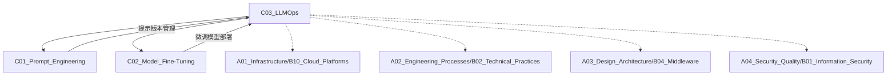

# C03 LLMOps

**所属子领域**: [B01_AI_LLM_Engineering](../README.md)  
**创建日期**: 2026-01-30  
**最后更新**: 2026-01-30

## 📋 主题定位

LLMOps（Large Language Model Operations）是专门针对大语言模型的 MLOps 实践，涵盖模型部署、推理优化、监控运维、成本控制等全生命周期管理。随着 LLM 应用规模扩大，高效的 LLMOps 体系成为生产环境的关键支撑。

## 🎯 核心概念

### 基本定义

LLMOps 是将 DevOps 和 MLOps 理念应用于大语言模型工程化的一套方法论，解决 LLM 特有的挑战：大规模参数、高计算成本、推理延迟、安全合规、版本管理等。

**LLMOps vs MLOps vs DevOps**:

| 维度 | DevOps | MLOps | LLMOps |
|------|--------|-------|--------|
| **核心关注点** | 软件交付效率 | 模型生命周期 | LLM 特有挑战 |
| **版本控制** | 代码版本 | 代码+模型+数据 | 基础模型+适配器+提示词 |
| **部署对象** | 应用服务 | 模型服务 | 大模型 + 推理优化 |
| **监控重点** | 系统指标 | 模型性能 | 提示质量、生成安全 |
| **成本结构** | 基础设施 | 训练成本 | 推理成本占主导 |

### 关键特性

**1. 模型服务架构**
- **自托管部署**: vLLM、TensorRT-LLM、TGI
- **云端 API**: OpenAI、Anthropic、Azure OpenAI
- **混合架构**: 路由层智能选择模型来源

**2. 推理优化技术**
- **量化**: INT8、INT4、FP16、GPTQ、AWQ
- **批处理**: Continuous Batching、Dynamic Batching
- **缓存**: KV-Cache、Prompt Caching
- **投机解码**: Speculative Decoding、Medusa

**3. RAG 系统架构**
- **检索层**: 向量数据库、重排序、混合检索
- **生成层**: 上下文组装、提示工程
- **评估层**: 检索准确率、生成相关性

**4. 安全与合规**
- **输入防护**: 提示注入检测、敏感信息过滤
- **输出控制**: 内容审核、幻觉检测
- **访问控制**: API 密钥管理、调用限流

### 应用场景

- **企业知识库**: 内部文档问答系统
- **智能客服**: 7×24 小时自动客服
- **代码助手**: IDE 插件、代码审查
- **内容生成**: 营销文案、产品描述
- **数据分析**: 自然语言查询、报告生成

## 🛠️ 技术实践

### 实现方法

**1. vLLM 高性能推理**

```python
from vllm import LLM, SamplingParams

# 初始化模型
llm = LLM(
    model="meta-llama/Llama-2-7b-hf",
    tensor_parallel_size=2,  # 2 GPU 并行
    gpu_memory_utilization=0.9,
    max_num_seqs=256  # 最大并发序列数
)

# 采样参数
sampling_params = SamplingParams(
    temperature=0.7,
    top_p=0.95,
    max_tokens=512
)

# 批处理推理
prompts = [
    "解释量子计算的基本原理",
    "写一首关于春天的诗",
    "如何学习 Python 编程？"
]
outputs = llm.generate(prompts, sampling_params)

for output in outputs:
    print(output.outputs[0].text)
```

**2. 生产级 API 服务**

```python
from fastapi import FastAPI, HTTPException
from vllm import LLM, SamplingParams
import asyncio
from pydantic import BaseModel

app = FastAPI(title="LLM Inference API")

# 全局模型实例
llm = None
sampling_params = SamplingParams(temperature=0.7, max_tokens=512)

@app.on_event("startup")
async def load_model():
    global llm
    llm = LLM(
        model="meta-llama/Llama-2-7b-hf",
        gpu_memory_utilization=0.9
    )

class InferenceRequest(BaseModel):
    prompt: str
    temperature: float = 0.7
    max_tokens: int = 512
    stream: bool = False

class InferenceResponse(BaseModel):
    generated_text: str
    usage: dict
    model: str

@app.post("/v1/completions", response_model=InferenceResponse)
async def create_completion(request: InferenceRequest):
    try:
        params = SamplingParams(
            temperature=request.temperature,
            max_tokens=request.max_tokens
        )
        
        outputs = llm.generate(request.prompt, params)
        generated_text = outputs[0].outputs[0].text
        
        # 记录日志
        logger.info(f"Prompt length: {len(request.prompt)}, "
                   f"Output length: {len(generated_text)}")
        
        return InferenceResponse(
            generated_text=generated_text,
            usage={
                "prompt_tokens": len(outputs[0].prompt_token_ids),
                "completion_tokens": len(outputs[0].outputs[0].token_ids),
                "total_tokens": len(outputs[0].prompt_token_ids) + 
                               len(outputs[0].outputs[0].token_ids)
            },
            model="llama-2-7b"
        )
    except Exception as e:
        logger.error(f"Inference error: {str(e)}")
        raise HTTPException(status_code=500, detail=str(e))

# 健康检查
@app.get("/health")
async def health_check():
    return {"status": "healthy", "model": "llama-2-7b"}
```

**3. RAG 系统实现**

```python
from langchain_community.vectorstores import Chroma
from langchain_openai import OpenAIEmbeddings
from langchain.chains import RetrievalQA
from langchain.prompts import PromptTemplate

# 初始化向量数据库
embeddings = OpenAIEmbeddings()
vectorstore = Chroma(
    persist_directory="./chroma_db",
    embedding_function=embeddings
)

# 自定义 RAG 提示词模板
RAG_TEMPLATE = """基于以下上下文回答问题。如果上下文中没有相关信息，请明确说明。

上下文：
{context}

问题：{question}

请提供准确、简洁的回答，并引用相关信息来源。

回答："""

rag_prompt = PromptTemplate(
    template=RAG_TEMPLATE,
    input_variables=["context", "question"]
)

# 构建 RAG Chain
qa_chain = RetrievalQA.from_chain_type(
    llm=llm,
    chain_type="stuff",
    retriever=vectorstore.as_retriever(
        search_kwargs={"k": 5}  # 检索 top-5 文档
    ),
    chain_type_kwargs={"prompt": rag_prompt},
    return_source_documents=True
)

# 使用
result = qa_chain({"query": "公司的休假政策是什么？"})
print(result["result"])
print("来源文档:", [doc.metadata for doc in result["source_documents"]])
```

**4. 提示词版本管理**

```python
# prompts/registry.py
from dataclasses import dataclass
from typing import Dict, List
import hashlib
import json
from datetime import datetime

@dataclass
class PromptVersion:
    version: str
    template: str
    variables: List[str]
    created_at: str
    hash: str
    performance_metrics: Dict

class PromptRegistry:
    def __init__(self):
        self.prompts = {}
    
    def register(self, name: str, template: str, variables: List[str]):
        """注册新版本的提示词"""
        prompt_hash = hashlib.sha256(template.encode()).hexdigest()[:16]
        version = f"{name}@{prompt_hash}"
        
        prompt_version = PromptVersion(
            version=version,
            template=template,
            variables=variables,
            created_at=datetime.now().isoformat(),
            hash=prompt_hash,
            performance_metrics={}
        )
        
        if name not in self.prompts:
            self.prompts[name] = []
        self.prompts[name].append(prompt_version)
        
        return version
    
    def get_prompt(self, name: str, version: str = None):
        """获取指定版本的提示词，默认最新"""
        if name not in self.prompts:
            raise ValueError(f"Prompt {name} not found")
        
        versions = self.prompts[name]
        if version:
            return next((v for v in versions if v.version == version), None)
        return versions[-1]  # 返回最新版本

# 使用示例
registry = PromptRegistry()

# 注册提示词
version = registry.register(
    name="customer_support",
    template="""你是一位专业的客服代表。请根据以下信息回答客户问题：

客户问题：{question}
相关产品：{product}
历史记录：{history}

回答要求：
1. 语气友好专业
2. 提供具体解决方案
3. 必要时建议转人工""",
    variables=["question", "product", "history"]
)

# 后续可以追踪该版本的性能指标
```

**5. 可观测性监控**

```python
# monitoring/llm_metrics.py
from prometheus_client import Counter, Histogram, Gauge, Info
import time

# 定义指标
llm_requests_total = Counter(
    'llm_requests_total',
    'Total LLM requests',
    ['model', 'status']
)

llm_request_duration = Histogram(
    'llm_request_duration_seconds',
    'Request duration in seconds',
    ['model'],
    buckets=[0.1, 0.5, 1.0, 2.0, 5.0, 10.0, 30.0]
)

llm_tokens_generated = Counter(
    'llm_tokens_generated_total',
    'Total tokens generated',
    ['model']
)

llm_active_requests = Gauge(
    'llm_active_requests',
    'Number of active requests',
    ['model']
)

llm_model_info = Info(
    'llm_model',
    'LLM model information'
)

class LLMMonitor:
    def __init__(self, model_name: str):
        self.model_name = model_name
        llm_model_info.info({'model': model_name})
    
    def record_request(self, func):
        """装饰器：记录请求指标"""
        def wrapper(*args, **kwargs):
            llm_active_requests.labels(model=self.model_name).inc()
            start_time = time.time()
            
            try:
                result = func(*args, **kwargs)
                status = "success"
                
                # 记录 token 数
                if hasattr(result, 'usage'):
                    llm_tokens_generated.labels(
                        model=self.model_name
                    ).inc(result.usage.completion_tokens)
                
                return result
            except Exception as e:
                status = "error"
                raise
            finally:
                duration = time.time() - start_time
                llm_request_duration.labels(
                    model=self.model_name
                ).observe(duration)
                llm_requests_total.labels(
                    model=self.model_name,
                    status=status
                ).inc()
                llm_active_requests.labels(
                    model=self.model_name
                ).dec()
        
        return wrapper

# 集成到推理服务
monitor = LLMMonitor("llama-2-7b")

@monitor.record_request
def generate_response(prompt: str):
    # 实际推理逻辑
    return llm.generate(prompt)
```

### 最佳实践

**1. 模型路由策略**

```python
# 智能模型选择
class ModelRouter:
    def __init__(self):
        self.models = {
            "gpt-4": {"cost": 0.03, "quality": 0.95, "speed": 0.7},
            "gpt-3.5": {"cost": 0.002, "quality": 0.8, "speed": 0.9},
            "local-llama": {"cost": 0.0005, "quality": 0.75, "speed": 0.6}
        }
    
    def route(self, query_complexity: float, latency_budget: float) -> str:
        """
        根据查询复杂度和延迟要求选择模型
        - query_complexity: 0-1，查询复杂度评分
        - latency_budget: 最大可接受延迟（秒）
        """
        # 简单查询用小模型
        if query_complexity < 0.3 and latency_budget < 2:
            return "gpt-3.5"
        
        # 复杂查询用强模型
        if query_complexity > 0.8:
            return "gpt-4"
        
        # 成本敏感场景用本地模型
        return "local-llama"
```

**2. 成本控制策略**

| 策略 | 实现方式 | 节省成本 |
|------|----------|----------|
| **缓存** | 相似查询结果缓存 | 20-40% |
| **模型降级** | 简单任务用小模型 | 50-80% |
| **批处理** | 合并多个请求 | 10-20% |
| **提示压缩** | 移除冗余上下文 | 15-30% |
| **流式输出** | 按需生成，提前终止 | 10-25% |

**3. 安全防护措施**

```python
# 输入安全检查
import re

class SafetyGuard:
    def __init__(self):
        self.blocked_patterns = [
            r"忽略之前的指令",
            r"假装你是",
            r"system prompt",
            r"DAN.*mode",
        ]
        self.pii_patterns = [
            r"\b\d{16}\b",  # 信用卡号
            r"\b\d{3}-\d{2}-\d{4}\b",  # SSN
        ]
    
    def check_input(self, prompt: str) -> tuple[bool, str]:
        """检查输入是否安全"""
        # 检查提示注入
        for pattern in self.blocked_patterns:
            if re.search(pattern, prompt, re.IGNORECASE):
                return False, "Detected potential prompt injection"
        
        # 检查敏感信息
        for pattern in self.pii_patterns:
            if re.search(pattern, prompt):
                return False, "Detected potential PII data"
        
        return True, "OK"
    
    def check_output(self, text: str) -> tuple[bool, str]:
        """检查输出是否合规"""
        # 使用内容审核 API
        # 检查幻觉指标
        # 返回 (是否安全, 原因)
        return True, "OK"
```

### 常见陷阱

**1. 单点故障**
- ❌ 只部署一个模型实例
- ✅ 多副本部署 + 负载均衡
- ✅ 准备降级方案（小模型/缓存）

**2. 成本失控**
- ❌ 无限制调用大模型
- ❌ 长上下文无压缩
- ✅ 设置预算告警
- ✅ 实现智能路由

**3. 监控盲区**
- ❌ 只监控系统指标
- ✅ 监控生成质量、用户满意度
- ✅ 追踪提示词版本效果

**4. 安全隐患**
- ❌ 无输入过滤
- ✅ 多层次安全防护
- ✅ 定期安全审计

## 📚 资源索引

### 学术论文

1. **Efficient Memory Management for Large Language Model Serving with PagedAttention** (2023)
   - 作者：Woosuk Kwon et al., Berkeley
   - 链接：https://arxiv.org/abs/2309.06180
   - 核心贡献：vLLM 的 PagedAttention 技术

2. **GPTQ: Accurate Post-Training Quantization for Generative Pre-trained Transformers** (2022)
   - 作者：Elias Frantar et al.
   - 链接：https://arxiv.org/abs/2210.17323
   - 核心贡献：4-bit 量化方法

3. **AWQ: Activation-aware Weight Quantization for LLM Compression and Acceleration** (2023)
   - 作者：Ji Lin et al., MIT
   - 链接：https://arxiv.org/abs/2306.00978
   - 核心贡献：保护激活值重要权重的量化

4. **Medusa: Simple LLM Inference Acceleration Framework with Multiple Decoding Heads** (2024)
   - 链接：https://arxiv.org/abs/2401.10774
   - 核心贡献：投机解码框架

### 技术文档

1. **vLLM 官方文档**
   - https://docs.vllm.ai/
   - 高性能推理引擎文档

2. **TensorRT-LLM 用户指南**
   - https://nvidia.github.io/TensorRT-LLM/
   - NVIDIA GPU 优化推理

3. **Hugging Face TGI**
   - https://huggingface.co/docs/text-generation-inference/
   - HuggingFace 推理服务

4. **OpenAI Production Best Practices**
   - https://platform.openai.com/docs/guides/production-best-practices
   - 生产环境最佳实践

### 开源项目

1. **LangChain**
   - https://github.com/langchain-ai/langchain
   - LLM 应用开发框架

2. **LlamaIndex**
   - https://github.com/run-llama/llama_index
   - RAG 和数据连接框架

3. **BentoML**
   - https://github.com/bentoml/BentoML
   - 模型服务化平台

4. **OpenLLM**
   - https://github.com/bentoml/OpenLLM
   - 开源 LLM 运营平台

5. **LiteLLM**
   - https://github.com/BerriAI/litellm
   - 统一多模型 API 调用

### 云服务商解决方案

1. **AWS SageMaker**
   - 托管推理端点
   - 模型监控和 A/B 测试

2. **Azure OpenAI Service**
   - 企业级 API 访问
   - 内容过滤和安全防护

3. **Google Vertex AI**
   - 模型调优和部署
   - 评估和监控工具

## 🔗 关联知识



## 💡 学习建议

### 前置知识
- Kubernetes 和容器基础
- 微服务架构设计
- 可观测性工具（Prometheus、Grafana）
- 大语言模型基础原理

### 学习路径

**第1周：本地部署**
- 使用 vLLM/Ollama 本地运行模型
- 学习量化技术
- 基准测试不同配置

**第2周：API 服务化**
- 构建 FastAPI 推理服务
- 实现批处理和流式输出
- 添加监控指标

**第3周：RAG 系统**
- 搭建向量数据库
- 实现检索增强生成
- 评估检索质量

**第4周：生产准备**
- Kubernetes 部署
- 负载均衡和自动扩缩容
- 安全加固和审计

### 实践项目

**项目1：企业文档助手**
- RAG 架构
- 权限控制
- 审计日志

**项目2：多模型网关**
- 智能路由
- 成本优化
- 统一 API

**项目3：A/B 测试平台**
- 提示词版本管理
- 效果评估
- 自动切换

## 🔄 维护说明

- **更新频率**: 每月跟踪最新推理优化技术
- **质量标准**: 确保部署方案可复现，性能数据准确
- **贡献方式**: 提交新的优化技巧、监控方案、部署模板
