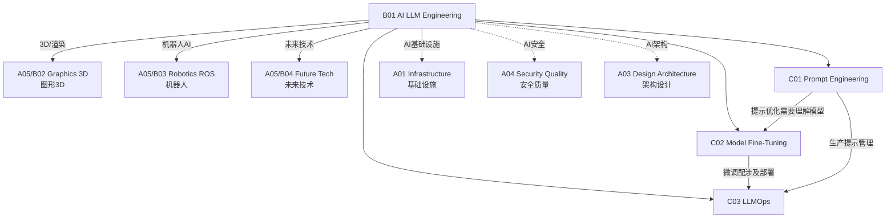

# B01 AI & LLM Engineering

**所属领域**: [A05_Spec_Expertise](../readme.md)
**创建日期**: 2026-01-30
**最后更新**: 2026-01-30

## 📋 子领域定位

AI 与大语言模型工程是当前技术领域最热门和快速发展的方向。从提示工程到模型微调，从 RAG 架构到 LLM 运维，这一领域正在重塑软件开发的方方面面。掌握 AI 工程技能已成为现代技术人员的必备能力。

本领域涵盖三大核心方向：提示工程（Prompt Engineering）、模型微调（Fine-tuning）和 LLM 运维（LLMOps）。工程师需要理解大语言模型的工作原理，掌握与 AI 模型有效交互的技术，以及在生产环境中部署和维护 AI 应用的能力。

**核心关注点**：
- **提示工程**: 提示设计模式、Few-shot/Zero-shot 学习、链式思考、提示优化
- **模型微调**: PEFT、LoRA、QLoRA、指令微调、领域适应
- **LLM 运维**: 模型部署、推理优化、监控、成本管理、安全对齐

## 🗂️ 专项列表

### [C01. Prompt_Engineering](C01_Prompt_Engineering/README.md)

提示工程是与大语言模型有效交互的艺术与科学。本专项详解提示设计模式（Zero-shot、Few-shot、Chain-of-Thought）、提示优化技术（自动提示优化、A/B 测试）、结构化输出（JSON/XML 模式）、以及提示安全（提示注入防护）。涵盖 LangChain、LlamaIndex 等框架的使用和最佳实践。

### [C02. Model_Fine-Tuning](C02_Model_Fine-Tuning/README.md)

模型微调使预训练模型适应特定领域任务。本专项深入 PEFT（参数高效微调）技术（LoRA、QLoRA、Adapter）、指令微调（Instruction Tuning）、领域适应策略、以及 RLHF（基于人类反馈的强化学习）。涵盖训练数据准备、评估指标和模型合并技术。

### [C03. LLMOps](C03_LLMOps/README.md)

LLMOps 是在生产环境中运维大语言模型应用的实践。本专项详解模型部署策略（vLLM、TensorRT-LLM、TGI）、推理优化（批处理、量化、KV Cache）、RAG 架构实现、以及 LLM 监控（延迟、成本、质量、安全）。涵盖模型版本管理、A/B 测试和成本优化。

## 🛠️ 技术栈概览

### 大语言模型

| 模型 | 提供商 | 特点 | 链接 |
|------|--------|------|------|
| **GPT-4** | OpenAI | 最强综合能力 | https://openai.com/gpt-4 |
| **Claude 3** | Anthropic | 长上下文，安全 | https://www.anthropic.com/claude |
| **Gemini** | Google | 多模态 | https://deepmind.google/technologies/gemini |
| **Llama 3** | Meta | 开源领先 | https://llama.meta.com |
| **Qwen** | Alibaba | 中文优化 | https://qwenlm.github.io |
| **Mistral** | Mistral AI | 欧洲开源 | https://mistral.ai |

### 开发框架

| 框架 | 用途 | 官网 |
|------|------|------|
| **LangChain** | LLM 应用框架 | https://www.langchain.com |
| **LlamaIndex** | 数据增强 LLM | https://www.llamaindex.ai |
| **Hugging Face** | 模型生态平台 | https://huggingface.co |
| **Transformers** | 模型库 | https://github.com/huggingface/transformers |
| **AutoGen** | 多智能体框架 | https://github.com/microsoft/autogen |
| **Langfuse** | LLM 可观测性 | https://langfuse.com |

### 部署与推理

| 工具 | 用途 | 官网 |
|------|------|------|
| **vLLM** | 高吞吐推理 | https://github.com/vllm-project/vllm |
| **Text Generation Inference** | HuggingFace 推理 | https://github.com/huggingface/text-generation-inference |
| **TensorRT-LLM** | NVIDIA 推理优化 | https://github.com/NVIDIA/TensorRT-LLM |
| **Ollama** | 本地运行 LLM | https://ollama.com |
| **LM Studio** | 桌面 LLM 管理 | https://lmstudio.ai |

## 💼 实践案例索引

### 案例 1: RAG 知识库问答系统

**架构设计**:
```
┌─────────────────────────────────────────────────────────────┐
│                     RAG 知识库架构                            │
├─────────────────────────────────────────────────────────────┤
│                                                             │
│  ┌─────────────┐    ┌─────────────┐    ┌─────────────┐     │
│  │   文档上传   │───▶│  文档处理    │───▶│  文本分块    │     │
│  │   (PDF/Doc) │    │  (解析/清洗) │    │  (Chunking) │     │
│  └─────────────┘    └─────────────┘    └──────┬──────┘     │
│                                                │            │
│                                                ▼            │
│  ┌─────────────┐    ┌─────────────┐    ┌─────────────┐     │
│  │   生成回答   │◀───│  LLM 处理   │◀───│  向量检索    │     │
│  │  (Streaming)│    │  (GPT-4)   │    │  (Similarity)│     │
│  └─────────────┘    └─────────────┘    └──────▲──────┘     │
│                                                │            │
│                              ┌─────────────────┘            │
│                              ▼                              │
│                   ┌─────────────────────┐                   │
│                   │    向量数据库        │                   │
│                   │  (Pinecone/Milvus)  │                   │
│                   └─────────────────────┘                   │
└─────────────────────────────────────────────────────────────┘
```

**LangChain 实现**:
```python
from langchain import OpenAI, VectorDBQA
from langchain.embeddings import OpenAIEmbeddings
from langchain.vectorstores import Pinecone
import pinecone

# 初始化向量数据库
pinecone.init(api_key="...", environment="us-west1-gcp")
embeddings = OpenAIEmbeddings()

# 创建向量存储
vectorstore = Pinecone.from_documents(
    documents=chunks,
    embedding=embeddings,
    index_name="knowledge-base"
)

# 创建 RAG 链
qa_chain = VectorDBQA.from_chain_type(
    llm=OpenAI(),
    chain_type="stuff",
    vectorstore=vectorstore,
    return_source_documents=True
)

# 查询
result = qa_chain({"query": "什么是机器学习？"})
print(result['result'])
```

### 案例 2: LoRA 模型微调

**微调流程**:
```python
from transformers import AutoModelForCausalLM, AutoTokenizer
from peft import LoraConfig, get_peft_model, TaskType
from trl import SFTTrainer

# 加载基础模型
model = AutoModelForCausalLM.from_pretrained("meta-llama/Llama-2-7b-hf")
tokenizer = AutoTokenizer.from_pretrained("meta-llama/Llama-2-7b-hf")

# LoRA 配置
lora_config = LoraConfig(
    r=16,  # LoRA rank
    lora_alpha=32,
    target_modules=["q_proj", "v_proj"],
    lora_dropout=0.05,
    bias="none",
    task_type=TaskType.CAUSAL_LM
)

# 应用 LoRA
model = get_peft_model(model, lora_config)

# 训练配置
training_args = TrainingArguments(
    output_dir="./results",
    num_train_epochs=3,
    per_device_train_batch_size=4,
    gradient_accumulation_steps=4,
    learning_rate=2e-4,
    fp16=True,
    save_strategy="epoch",
)

# 训练
trainer = SFTTrainer(
    model=model,
    tokenizer=tokenizer,
    train_dataset=dataset,
    args=training_args,
)
trainer.train()
```

### 案例 3: LLM 生产部署架构

**部署架构**:
```
┌─────────────────────────────────────────────────────────────┐
│                    LLM 生产部署架构                           │
├─────────────────────────────────────────────────────────────┤
│                                                             │
│  客户端                                                      │
│  ┌─────────────┐    ┌─────────────┐    ┌─────────────┐     │
│  │   Web App   │    │  Mobile App │    │   API 调用  │     │
│  └──────┬──────┘    └──────┬──────┘    └──────┬──────┘     │
│         │                  │                  │            │
│         └──────────────────┼──────────────────┘            │
│                            ▼                                │
│  ┌─────────────────────────────────────────────────────┐   │
│  │                 API 网关 (Kong/AWS API GW)           │   │
│  │  - 限流 (Rate Limiting)                              │   │
│  │  - 认证 (API Key/JWT)                               │   │
│  │  - 缓存响应                                          │   │
│  └─────────────────────────┬───────────────────────────┘   │
│                            ▼                                │
│  ┌─────────────────────────────────────────────────────┐   │
│  │              负载均衡器 (NGINX/ALB)                   │   │
│  └─────────────────────────┬───────────────────────────┘   │
│                            ▼                                │
│  ┌─────────────────────────────────────────────────────┐   │
│  │              LLM 推理服务 (vLLM/TGI)                  │   │
│  │  ┌─────────────┐  ┌─────────────┐  ┌─────────────┐  │   │
│  │  │  Instance 1 │  │  Instance 2 │  │  Instance N │  │   │
│  │  │  (GPU A10)  │  │  (GPU A10)  │  │  (GPU A10)  │  │   │
│  │  └─────────────┘  └─────────────┘  └─────────────┘  │   │
│  └─────────────────────────────────────────────────────┘   │
│                            │                                │
│                            ▼                                │
│  ┌─────────────────────────────────────────────────────┐   │
│  │               监控与可观测性                          │   │
│  │  - Prometheus (指标)                                 │   │
│  │  - Grafana (可视化)                                  │   │
│  │  - Langfuse (LLM 追踪)                               │   │
│  └─────────────────────────────────────────────────────┘   │
└─────────────────────────────────────────────────────────────┘
```

## 🔗 知识关联图谱



## 📖 学习资源

### 推荐书籍

| 书名 | 作者 | 说明 |
|------|------|------|
| 《Hands-On Large Language Models》 | Jay Alammar | LLM 实践指南 |
| 《Building LLM Applications》 |  | LLM 应用开发 |
| 《Natural Language Processing with Transformers》 | Lewis et al. | Transformers 详解 |
| 《Designing Machine Learning Systems》 | Chip Huyen | ML 系统设计 |

### 在线课程

| 课程 | 平台 | 链接 |
|------|------|------|
| DeepLearning.AI LLM 课程 | Coursera | https://www.deeplearning.ai/short-courses/ |
| Fast.ai 实用深度学习 | fast.ai | https://course.fast.ai |
| Stanford CS224N | Stanford | https://web.stanford.edu/class/cs224n |
| Full Stack LLM Bootcamp | Full Stack Deep Learning | https://fullstackdeeplearning.com/llm-bootcamp |

### 技术资源

| 资源 | 链接 | 说明 |
|------|------|------|
| Prompt Engineering Guide | https://www.promptingguide.ai | 提示工程指南 |
| Hugging Face Transformers | https://huggingface.co/docs/transformers | 官方文档 |
| LangChain Docs | https://python.langchain.com | LangChain 文档 |
| OpenAI Cookbook | https://github.com/openai/openai-cookbook | OpenAI 示例 |
| Papers with Code | https://paperswithcode.com | 最新论文 |

### 开源项目

| 项目 | GitHub | 说明 |
|------|--------|------|
| Transformers | https://github.com/huggingface/transformers | 模型库 |
| LangChain | https://github.com/langchain-ai/langchain | 应用框架 |
| LlamaIndex | https://github.com/run-llama/llama_index | 数据增强 |
| vLLM | https://github.com/vllm-project/vllm | 高吞吐推理 |
| Ollama | https://github.com/ollama/ollama | 本地运行 |
| OpenWebUI | https://github.com/open-webui/open-webui | Web UI |

## 🔄 维护说明

- **内容审查**: 每月更新模型信息和工具版本
- **更新机制**: 跟踪 arXiv、HuggingFace 和厂商发布
- **质量标准**: 所有代码示例需测试验证
- **贡献方式**: 欢迎提交微调案例和部署经验
