```mermaid
graph LR
    B[B01_AI_LLM_Engineering]

    %% 基础ä¾èµ–
    B --> A01[A01_Infrastructure/B09_Virtualization]
    B --> A02[A01_Infrastructure/B10_Cloud_Platforms]
    B --> A03[A03_Design_Architecture/B03_Data_Storage]

    %% 工程å®è·µ
    B --> A04[A02_Engineering_Processes/B02_Technical_Practices]
    B --> A05[A04_Security_Quality/B01_Information_Security]

    %% 相关专项
    B --> A06[A05_Spec_Expertise/B03_NLP_Processing]
    B --> A07[A05_Spec_Expertise/B04_Computer_Vision]

    %% 应用场景
    B --> A08[A03_Design_Architecture/B04_Middleware]
    B --> A09[A04_Security_Quality/B02_Reliability_Evaluation]
```

# B01_AI_LLM_Engineering

**所属领域**: [A05_Spec_Expertise](../readme.md)
**创建日期**: 2026-01-30
**最后更新**: 2026-01-30

## 📋 子领域定位

大语言模型工程化实践领域，专注于将LLM技术从研究转化为生产级应用。涵盖提示工程、模型微调、LLM运维等核心环节，帮助企业构建可靠、高效、可扩展的AI应用系统。

**核心价值**：
- 降低LLM应用开发门槛，提升开发效率
- 建立标准化的LLM工程实践流程
- 优化模型性能与成本平衡
- 保障生产环境稳定性与安全性

## 🗂️ 专项列表

### [C01. Prompt_Engineering](C01_Prompt_Engineering/README.md)

提示工程是与LLM交互的核心技术，通过精心设计的提示词引导模型生成高质量输出。涵盖零样本/少样本学习、思维链（CoT）、自我一致性等高级技术，以及提示词优化、模板管理等工程实践。

### [C02. Model_Fine-Tuning](C02_Model_Fine-Tuning/README.md)

模型微调技术让通用LLM适配特定领域任务。包括全量微调、LoRA、QLoRA等参数高效微调方法，以及指令微调、RLHF等对齐技术。重点关注数据准备、训练策略、评估方法等工程化流程。

### [C03. LLMOps](C03_LLMOps/README.md)

LLM运维体系确保模型在生产环境的稳定运行。涵盖模型部署、推理优化、监控告警、版本管理、成本控制等全生命周期管理。结合MLOps最佳实践，构建企业级LLM应用平台。

## 🛠️ 技术栈概览

### 核心技术
- **Transformer架构**: 自注意力机制、位置编码、多头注意力
- **预训练技术**: 自监督学习、掩码语言模型、因果语言模型
- **对齐技术**: RLHF（人类反馈强化学习）、DPO（直接偏好优化）
- **RAG技术**: 检索增强生成、向量检索、混合检索
- **推理优化**: 量化（INT8/INT4）、KV缓存、投机解码、Flash Attention
- **分布式训练**: 数据并行、模型并行、流水线并行、ZeRO优化

### 工具链
- **开发框架**: LangChain、LlamaIndex、Semantic Kernel、Haystack
- **模型服务**: vLLM、TGI（Text Generation Inference）、Ollama、LocalAI
- **向量数据库**: Milvus、Qdrant、Weaviate、Pinecone、Chroma
- **微调工具**: Axolotl、LLaMA-Factory、Unsloth、PEFT
- **评估工具**: HELM、LM Evaluation Harness、OpenCompass
- **监控平台**: LangSmith、Weights & Biases、MLflow、Prometheus

### 框架与库
- **PyTorch生态**: transformers、accelerate、bitsandbytes、PEFT
- **推理引擎**: vLLM、TensorRT-LLM、llama.cpp、ExLlamaV2
- **Agent框架**: AutoGPT、BabyAGI、MetaGPT、CrewAI
- **数据处理**: datasets、tiktoken、sentencepiece
- **API封装**: OpenAI SDK、Anthropic SDK、LiteLLM

## 💼 实践案例索引

1. **企业知识库问答系统**
   - RAG架构设计：文档解析、向量化、检索策略
   - 混合检索：关键词+语义检索提升准确率
   - 引用溯源：答案可追溯到原始文档

2. **代码生成助手**
   - 代码补全：基于上下文的智能补全
   - 代码解释：自然语言解释代码逻辑
   - 单元测试生成：自动生成测试用例

3. **智能客服系统**
   - 意图识别：多轮对话意图理解
   - 知识检索：FAQ匹配与动态回答
   - 人机协同：复杂问题转人工

4. **文档自动化处理**
   - 合同审查：条款提取与风险识别
   - 报告生成：结构化数据转自然语言
   - 多语言翻译：专业术语准确翻译

5. **数据分析助手**
   - SQL生成：自然语言转SQL查询
   - 数据可视化：自动选择图表类型
   - 洞察提取：数据趋势分析与建议

## 🔗 关联知识

## 📖 学习资源

### 推荐书籍
1. **《大语言模型：原理与工程实践》** - 邱锡鹏
   - 系统介绍LLM基础理论与工程化方法

2. **《动手学大模型应用开发》** - DataWhale开源教程
   - 实战导向的LLM应用开发指南

3. **《Prompt Engineering Guide》** - DAIR.AI
   - 提示工程权威指南，涵盖最新技术

4. **《Building LLM Applications》** - Chip Huyen
   - LLM应用架构设计与最佳实践

5. **《Natural Language Processing with Transformers》** - Lewis Tunstall等
   - Transformers库实战教程

### 在线课程
1. **DeepLearning.AI - ChatGPT Prompt Engineering for Developers**
   - 吴恩达提示工程课程，适合入门

2. **Hugging Face - NLP Course**
   - 免费的Transformers生态系统课程

3. **Stanford CS324 - Large Language Models**
   - 斯坦福LLM理论与实践课程

4. **Full Stack LLM Bootcamp** - The Full Stack
   - LLM全栈开发训练营

5. **LangChain官方教程**
   - LangChain框架从入门到精通

### 技术博客
1. **OpenAI Blog** - https://openai.com/blog
   - GPT系列模型技术解析

2. **Anthropic Research** - https://www.anthropic.com/research
   - Claude模型与Constitutional AI

3. **Hugging Face Blog** - https://huggingface.co/blog
   - 开源模型与工具最新动态

4. **LangChain Blog** - https://blog.langchain.dev
   - LLM应用开发最佳实践

5. **Chip Huyen's Blog** - https://huyenchip.com/blog
   - ML系统设计与LLM工程化

6. **Sebastian Raschka** - https://sebastianraschka.com/blog
   - LLM微调与优化技术

7. **Jay Alammar** - https://jalammar.github.io
   - Transformer可视化讲解

## 🔄 维护说明

- **内容审查**: 每月检查链接有效性
- **更新机制**: 发现新技术或最佳实践时及时更新
- **质量标准**: 确保所有专项主题内容完整且准确
