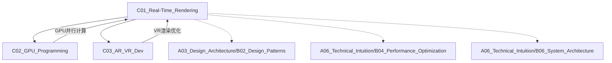

# C01_Real-Time_Rendering

**所属子领域**: [B02_Graphics_3D](../README.md)
**创建日期**: 2026-01-30
**最后更新**: 2026-01-30

## 📋 主题定位

实时渲染（Real-Time Rendering）是计算机图形学的核心领域，专注于在有限时间内（通常每帧16.67ms，对应60FPS）生成高质量图像的技术。它是现代游戏、虚拟现实、数字孪生、建筑可视化等领域的基石技术，需要在图像质量与计算性能之间取得精妙平衡。

## 🎯 核心概念

### 基本定义

实时渲染是指在用户可接受的延迟范围内（通常<100ms）完成图像生成的渲染技术。核心挑战包括：
- **时间预算**：每帧严格的时间限制（16.67ms@60Hz, 33.33ms@30Hz）
- **性能优化**：LOD（细节层次）、遮挡剔除、视锥剔除
- **图像质量**：抗锯齿、全局光照、后处理效果
- **可扩展性**：适配不同硬件性能等级

### 关键特性

**1. 渲染管线架构**
- **应用阶段（Application Stage）**：CPU端逻辑处理、场景管理、碰撞检测
- **几何阶段（Geometry Stage）**：顶点变换、光照计算、投影变换
- **光栅化阶段（Rasterization Stage）**：三角形设置、片段着色、深度测试
- **像素处理阶段（Pixel Processing）**：纹理采样、颜色混合、后处理

**2. 现代图形API演进**
- **OpenGL**：跨平台传统API，状态机模型
- **Vulkan**：显式控制、多线程友好、低开销
- **DirectX 12**：微软平台高性能渲染
- **Metal**：Apple生态系统优化
- **WebGPU**：下一代Web图形标准

**3. 实时光照模型**
- **局部光照**：Phong/Blinn-Phong、BRDF模型
- **全局光照近似**：光照探针、Lightmap、IBL（基于图像的光照）
- **屏幕空间技术**：SSAO、SSR、SSS
- **实时光追**：RTX/DXR硬件加速光线追踪

**4. 抗锯齿技术**
- **MSAA（多重采样抗锯齿）**：传统几何边缘抗锯齿
- **TAA（时域抗锯齿）**：利用时序信息，高效高质量
- **FXAA/SMAA**：后处理快速抗锯齿
- **DLSS/FSR/XeSS**：AI超分辨率重建

### 应用场景
- **3A游戏引擎**：Unreal Engine、Unity、Godot
- **虚拟现实**：VR头显渲染、混合现实
- **建筑可视化**：BIM实时预览、室内设计
- **数字孪生**：智慧城市、工业仿真
- **虚拟制片**：虚拟摄影棚、实时预演

## 🛠️ 技术实践

### 实现方法

**1. 基础渲染管线实现**

```cpp
// Vulkan基础渲染管线示例
#include <vulkan/vulkan.h>
#include <vector>

class VulkanRenderer {
public:
    struct Vertex {
        float position[3];
        float color[3];
        float texCoord[2];
    };

    struct UniformBufferObject {
        glm::mat4 model;
        glm::mat4 view;
        glm::mat4 proj;
    };

    void initialize(VkInstance instance, VkSurfaceKHR surface) {
        // 选择物理设备
        uint32_t deviceCount = 0;
        vkEnumeratePhysicalDevices(instance, &deviceCount, nullptr);
        std::vector<VkPhysicalDevice> devices(deviceCount);
        vkEnumeratePhysicalDevices(instance, &deviceCount, devices.data());
        
        // 选择支持图形和呈现队列的设备
        for (const auto& device : devices) {
            if (isDeviceSuitable(device)) {
                physicalDevice = device;
                break;
            }
        }
        
        // 创建逻辑设备
        createLogicalDevice();
        
        // 创建交换链
        createSwapChain(surface);
        
        // 创建渲染管线
        createGraphicsPipeline();
        
        // 创建帧缓冲
        createFramebuffers();
        
        // 创建命令池和命令缓冲
        createCommandPool();
        createCommandBuffers();
        
        // 创建同步对象
        createSyncObjects();
    }

    void renderFrame() {
        // 等待前一帧完成
        vkWaitForFences(device, 1, &inFlightFences[currentFrame], VK_TRUE, UINT64_MAX);
        
        // 获取下一帧图像索引
        uint32_t imageIndex;
        VkResult result = vkAcquireNextImageKHR(device, swapChain, UINT64_MAX,
            imageAvailableSemaphores[currentFrame], VK_NULL_HANDLE, &imageIndex);
        
        if (result == VK_ERROR_OUT_OF_DATE_KHR) {
            recreateSwapChain();
            return;
        }
        
        // 更新Uniform Buffer
        updateUniformBuffer(currentFrame);
        
        // 重置fence
        vkResetFences(device, 1, &inFlightFences[currentFrame]);
        
        // 记录命令缓冲
        vkResetCommandBuffer(commandBuffers[currentFrame], 0);
        recordCommandBuffer(commandBuffers[currentFrame], imageIndex);
        
        // 提交命令缓冲
        VkSubmitInfo submitInfo{};
        submitInfo.sType = VK_STRUCTURE_TYPE_SUBMIT_INFO;
        
        VkSemaphore waitSemaphores[] = { imageAvailableSemaphores[currentFrame] };
        VkPipelineStageFlags waitStages[] = { VK_PIPELINE_STAGE_COLOR_ATTACHMENT_OUTPUT_BIT };
        submitInfo.waitSemaphoreCount = 1;
        submitInfo.pWaitSemaphores = waitSemaphores;
        submitInfo.pWaitDstStageMask = waitStages;
        submitInfo.commandBufferCount = 1;
        submitInfo.pCommandBuffers = &commandBuffers[currentFrame];
        
        VkSemaphore signalSemaphores[] = { renderFinishedSemaphores[currentFrame] };
        submitInfo.signalSemaphoreCount = 1;
        submitInfo.pSignalSemaphores = signalSemaphores;
        
        vkQueueSubmit(graphicsQueue, 1, &submitInfo, inFlightFences[currentFrame]);
        
        // 呈现图像
        VkPresentInfoKHR presentInfo{};
        presentInfo.sType = VK_STRUCTURE_TYPE_PRESENT_INFO_KHR;
        presentInfo.waitSemaphoreCount = 1;
        presentInfo.pWaitSemaphores = signalSemaphores;
        
        VkSwapchainKHR swapChains[] = { swapChain };
        presentInfo.swapchainCount = 1;
        presentInfo.pSwapchains = swapChains;
        presentInfo.pImageIndices = &imageIndex;
        
        vkQueuePresentKHR(presentQueue, &presentInfo);
        
        currentFrame = (currentFrame + 1) % MAX_FRAMES_IN_FLIGHT;
    }

private:
    void createGraphicsPipeline() {
        // 顶点着色器
        auto vertShaderCode = readFile("shaders/vert.spv");
        VkShaderModule vertShaderModule = createShaderModule(vertShaderCode);
        
        // 片段着色器
        auto fragShaderCode = readFile("shaders/frag.spv");
        VkShaderModule fragShaderModule = createShaderModule(fragShaderCode);
        
        // 着色器阶段
        VkPipelineShaderStageCreateInfo vertShaderStageInfo{};
        vertShaderStageInfo.sType = VK_STRUCTURE_TYPE_PIPELINE_SHADER_STAGE_CREATE_INFO;
        vertShaderStageInfo.stage = VK_SHADER_STAGE_VERTEX_BIT;
        vertShaderStageInfo.module = vertShaderModule;
        vertShaderStageInfo.pName = "main";
        
        VkPipelineShaderStageCreateInfo fragShaderStageInfo{};
        fragShaderStageInfo.sType = VK_STRUCTURE_TYPE_PIPELINE_SHADER_STAGE_CREATE_INFO;
        fragShaderStageInfo.stage = VK_SHADER_STAGE_FRAGMENT_BIT;
        fragShaderStageInfo.module = fragShaderModule;
        fragShaderStageInfo.pName = "main";
        
        VkPipelineShaderStageCreateInfo shaderStages[] = { 
            vertShaderStageInfo, fragShaderStageInfo 
        };
        
        // 顶点输入
        VkPipelineVertexInputStateCreateInfo vertexInputInfo{};
        vertexInputInfo.sType = VK_STRUCTURE_TYPE_PIPELINE_VERTEX_INPUT_STATE_CREATE_INFO;
        
        auto bindingDescription = Vertex::getBindingDescription();
        auto attributeDescriptions = Vertex::getAttributeDescriptions();
        
        vertexInputInfo.vertexBindingDescriptionCount = 1;
        vertexInputInfo.vertexAttributeDescriptionCount = static_cast<uint32_t>(attributeDescriptions.size());
        vertexInputInfo.pVertexBindingDescriptions = &bindingDescription;
        vertexInputInfo.pVertexAttributeDescriptions = attributeDescriptions.data();
        
        // 输入装配
        VkPipelineInputAssemblyStateCreateInfo inputAssembly{};
        inputAssembly.sType = VK_STRUCTURE_TYPE_PIPELINE_INPUT_ASSEMBLY_STATE_CREATE_INFO;
        inputAssembly.topology = VK_PRIMITIVE_TOPOLOGY_TRIANGLE_LIST;
        inputAssembly.primitiveRestartEnable = VK_FALSE;
        
        // 视口和裁剪
        VkPipelineViewportStateCreateInfo viewportState{};
        viewportState.sType = VK_STRUCTURE_TYPE_PIPELINE_VIEWPORT_STATE_CREATE_INFO;
        viewportState.viewportCount = 1;
        viewportState.scissorCount = 1;
        
        // 光栅化
        VkPipelineRasterizationStateCreateInfo rasterizer{};
        rasterizer.sType = VK_STRUCTURE_TYPE_PIPELINE_RASTERIZATION_STATE_CREATE_INFO;
        rasterizer.depthClampEnable = VK_FALSE;
        rasterizer.rasterizerDiscardEnable = VK_FALSE;
        rasterizer.polygonMode = VK_POLYGON_MODE_FILL;
        rasterizer.lineWidth = 1.0f;
        rasterizer.cullMode = VK_CULL_MODE_BACK_BIT;
        rasterizer.frontFace = VK_FRONT_FACE_COUNTER_CLOCKWISE;
        rasterizer.depthBiasEnable = VK_FALSE;
        
        // 多重采样
        VkPipelineMultisampleStateCreateInfo multisampling{};
        multisampling.sType = VK_STRUCTURE_TYPE_PIPELINE_MULTISAMPLE_STATE_CREATE_INFO;
        multisampling.sampleShadingEnable = VK_FALSE;
        multisampling.rasterizationSamples = VK_SAMPLE_COUNT_1_BIT;
        
        // 深度和模板测试
        VkPipelineDepthStencilStateCreateInfo depthStencil{};
        depthStencil.sType = VK_STRUCTURE_TYPE_PIPELINE_DEPTH_STENCIL_STATE_CREATE_INFO;
        depthStencil.depthTestEnable = VK_TRUE;
        depthStencil.depthWriteEnable = VK_TRUE;
        depthStencil.depthCompareOp = VK_COMPARE_OP_LESS;
        depthStencil.depthBoundsTestEnable = VK_FALSE;
        depthStencil.stencilTestEnable = VK_FALSE;
        
        // 颜色混合
        VkPipelineColorBlendAttachmentState colorBlendAttachment{};
        colorBlendAttachment.colorWriteMask = VK_COLOR_COMPONENT_R_BIT | VK_COLOR_COMPONENT_G_BIT | 
                                             VK_COLOR_COMPONENT_B_BIT | VK_COLOR_COMPONENT_A_BIT;
        colorBlendAttachment.blendEnable = VK_FALSE;
        
        VkPipelineColorBlendStateCreateInfo colorBlending{};
        colorBlending.sType = VK_STRUCTURE_TYPE_PIPELINE_COLOR_BLEND_STATE_CREATE_INFO;
        colorBlending.logicOpEnable = VK_FALSE;
        colorBlending.attachmentCount = 1;
        colorBlending.pAttachments = &colorBlendAttachment;
        
        // 动态状态
        std::vector<VkDynamicState> dynamicStates = {
            VK_DYNAMIC_STATE_VIEWPORT,
            VK_DYNAMIC_STATE_SCISSOR
        };
        
        VkPipelineDynamicStateCreateInfo dynamicState{};
        dynamicState.sType = VK_STRUCTURE_TYPE_PIPELINE_DYNAMIC_STATE_CREATE_INFO;
        dynamicState.dynamicStateCount = static_cast<uint32_t>(dynamicStates.size());
        dynamicState.pDynamicStates = dynamicStates.data();
        
        // 创建管线布局
        VkPipelineLayoutCreateInfo pipelineLayoutInfo{};
        pipelineLayoutInfo.sType = VK_STRUCTURE_TYPE_PIPELINE_LAYOUT_CREATE_INFO;
        pipelineLayoutInfo.setLayoutCount = 1;
        pipelineLayoutInfo.pSetLayouts = &descriptorSetLayout;
        
        vkCreatePipelineLayout(device, &pipelineLayoutInfo, nullptr, &pipelineLayout);
        
        // 创建图形管线
        VkGraphicsPipelineCreateInfo pipelineInfo{};
        pipelineInfo.sType = VK_STRUCTURE_TYPE_GRAPHICS_PIPELINE_CREATE_INFO;
        pipelineInfo.stageCount = 2;
        pipelineInfo.pStages = shaderStages;
        pipelineInfo.pVertexInputState = &vertexInputInfo;
        pipelineInfo.pInputAssemblyState = &inputAssembly;
        pipelineInfo.pViewportState = &viewportState;
        pipelineInfo.pRasterizationState = &rasterizer;
        pipelineInfo.pMultisampleState = &multisampling;
        pipelineInfo.pDepthStencilState = &depthStencil;
        pipelineInfo.pColorBlendState = &colorBlending;
        pipelineInfo.pDynamicState = &dynamicState;
        pipelineInfo.layout = pipelineLayout;
        pipelineInfo.renderPass = renderPass;
        pipelineInfo.subpass = 0;
        
        vkCreateGraphicsPipelines(device, VK_NULL_HANDLE, 1, &pipelineInfo, nullptr, &graphicsPipeline);
        
        // 清理
        vkDestroyShaderModule(device, fragShaderModule, nullptr);
        vkDestroyShaderModule(device, vertShaderModule, nullptr);
    }

    void recordCommandBuffer(VkCommandBuffer commandBuffer, uint32_t imageIndex) {
        VkCommandBufferBeginInfo beginInfo{};
        beginInfo.sType = VK_STRUCTURE_TYPE_COMMAND_BUFFER_BEGIN_INFO;
        
        vkBeginCommandBuffer(commandBuffer, &beginInfo);
        
        // 开始渲染通道
        VkRenderPassBeginInfo renderPassInfo{};
        renderPassInfo.sType = VK_STRUCTURE_TYPE_RENDER_PASS_BEGIN_INFO;
        renderPassInfo.renderPass = renderPass;
        renderPassInfo.framebuffer = swapChainFramebuffers[imageIndex];
        renderPassInfo.renderArea.offset = {0, 0};
        renderPassInfo.renderArea.extent = swapChainExtent;
        
        VkClearValue clearColor = {{{0.0f, 0.0f, 0.0f, 1.0f}}};
        renderPassInfo.clearValueCount = 1;
        renderPassInfo.pClearValues = &clearColor;
        
        vkCmdBeginRenderPass(commandBuffer, &renderPassInfo, VK_SUBPASS_CONTENTS_INLINE);
        
        // 绑定管线
        vkCmdBindPipeline(commandBuffer, VK_PIPELINE_BIND_POINT_GRAPHICS, graphicsPipeline);
        
        // 设置视口
        VkViewport viewport{};
        viewport.x = 0.0f;
        viewport.y = 0.0f;
        viewport.width = static_cast<float>(swapChainExtent.width);
        viewport.height = static_cast<float>(swapChainExtent.height);
        viewport.minDepth = 0.0f;
        viewport.maxDepth = 1.0f;
        vkCmdSetViewport(commandBuffer, 0, 1, &viewport);
        
        // 设置裁剪
        VkRect2D scissor{};
        scissor.offset = {0, 0};
        scissor.extent = swapChainExtent;
        vkCmdSetScissor(commandBuffer, 0, 1, &scissor);
        
        // 绑定顶点缓冲
        VkBuffer vertexBuffers[] = {vertexBuffer};
        VkDeviceSize offsets[] = {0};
        vkCmdBindVertexBuffers(commandBuffer, 0, 1, vertexBuffers, offsets);
        
        // 绑定索引缓冲
        vkCmdBindIndexBuffer(commandBuffer, indexBuffer, 0, VK_INDEX_TYPE_UINT32);
        
        // 绑定描述符集
        vkCmdBindDescriptorSets(commandBuffer, VK_PIPELINE_BIND_POINT_GRAPHICS, 
            pipelineLayout, 0, 1, &descriptorSets[currentFrame], 0, nullptr);
        
        // 绘制
        vkCmdDrawIndexed(commandBuffer, static_cast<uint32_t>(indices.size()), 1, 0, 0, 0);
        
        vkCmdEndRenderPass(commandBuffer);
        
        vkEndCommandBuffer(commandBuffer);
    }

private:
    VkPhysicalDevice physicalDevice = VK_NULL_HANDLE;
    VkDevice device;
    VkQueue graphicsQueue;
    VkQueue presentQueue;
    VkSwapchainKHR swapChain;
    std::vector<VkImage> swapChainImages;
    VkFormat swapChainImageFormat;
    VkExtent2D swapChainExtent;
    std::vector<VkImageView> swapChainImageViews;
    VkRenderPass renderPass;
    VkPipelineLayout pipelineLayout;
    VkPipeline graphicsPipeline;
    std::vector<VkFramebuffer> swapChainFramebuffers;
    VkCommandPool commandPool;
    std::vector<VkCommandBuffer> commandBuffers;
    
    std::vector<VkSemaphore> imageAvailableSemaphores;
    std::vector<VkSemaphore> renderFinishedSemaphores;
    std::vector<VkFence> inFlightFences;
    
    VkBuffer vertexBuffer;
    VkDeviceMemory vertexBufferMemory;
    VkBuffer indexBuffer;
    VkDeviceMemory indexBufferMemory;
    
    VkDescriptorSetLayout descriptorSetLayout;
    std::vector<VkDescriptorSet> descriptorSets;
    
    uint32_t currentFrame = 0;
    const int MAX_FRAMES_IN_FLIGHT = 2;
    
    std::vector<Vertex> vertices;
    std::vector<uint32_t> indices;
};
```

**2. GLSL着色器实现**

```glsl
// vertex.glsl - 顶点着色器
#version 450

layout(binding = 0) uniform UniformBufferObject {
    mat4 model;
    mat4 view;
    mat4 proj;
    vec3 cameraPos;
    float time;
} ubo;

layout(location = 0) in vec3 inPosition;
layout(location = 1) in vec3 inColor;
layout(location = 2) in vec2 inTexCoord;
layout(location = 3) in vec3 inNormal;

layout(location = 0) out vec3 fragColor;
layout(location = 1) out vec2 fragTexCoord;
layout(location = 2) out vec3 fragNormal;
layout(location = 3) out vec3 fragPos;
layout(location = 4) out vec3 viewDir;

void main() {
    vec4 worldPos = ubo.model * vec4(inPosition, 1.0);
    fragPos = worldPos.xyz;
    gl_Position = ubo.proj * ubo.view * worldPos;
    
    fragColor = inColor;
    fragTexCoord = inTexCoord;
    
    // 法线变换（使用逆转置处理非均匀缩放）
    fragNormal = mat3(transpose(inverse(ubo.model))) * inNormal;
    
    // 视线方向
    viewDir = normalize(ubo.cameraPos - worldPos.xyz);
}
```

```glsl
// fragment.glsl - 片段着色器（PBR光照模型）
#version 450

layout(binding = 1) uniform sampler2D albedoMap;
layout(binding = 2) uniform sampler2D normalMap;
layout(binding = 3) uniform sampler2D metallicRoughnessMap;
layout(binding = 4) uniform samplerCube environmentMap;
layout(binding = 5) uniform samplerCube irradianceMap;
layout(binding = 6) uniform samplerCube prefilteredMap;
layout(binding = 7) uniform sampler2D brdfLUT;

layout(location = 0) in vec3 fragColor;
layout(location = 1) in vec2 fragTexCoord;
layout(location = 2) in vec3 fragNormal;
layout(location = 3) in vec3 fragPos;
layout(location = 4) in vec3 viewDir;

layout(location = 0) out vec4 outColor;

// 灯光数据
struct Light {
    vec3 position;
    vec3 color;
    float intensity;
    float radius;
};

layout(binding = 0, set = 1) uniform LightsBuffer {
    Light lights[4];
    int numLights;
} lights;

const float PI = 3.14159265359;

// 法线分布函数（Trowbridge-Reitz GGX）
float DistributionGGX(vec3 N, vec3 H, float roughness) {
    float a = roughness * roughness;
    float a2 = a * a;
    float NdotH = max(dot(N, H), 0.0);
    float NdotH2 = NdotH * NdotH;
    
    float num = a2;
    float denom = (NdotH2 * (a2 - 1.0) + 1.0);
    denom = PI * denom * denom;
    
    return num / denom;
}

// 几何函数（Schlick-GGX）
float GeometrySchlickGGX(float NdotV, float roughness) {
    float r = (roughness + 1.0);
    float k = (r * r) / 8.0;
    
    float num = NdotV;
    float denom = NdotV * (1.0 - k) + k;
    
    return num / denom;
}

float GeometrySmith(vec3 N, vec3 V, vec3 L, float roughness) {
    float NdotV = max(dot(N, V), 0.0);
    float NdotL = max(dot(N, L), 0.0);
    float ggx2 = GeometrySchlickGGX(NdotV, roughness);
    float ggx1 = GeometrySchlickGGX(NdotL, roughness);
    
    return ggx1 * ggx2;
}

// 菲涅尔方程（Schlick近似）
vec3 fresnelSchlick(float cosTheta, vec3 F0) {
    return F0 + (1.0 - F0) * pow(clamp(1.0 - cosTheta, 0.0, 1.0), 5.0);
}

vec3 fresnelSchlickRoughness(float cosTheta, vec3 F0, float roughness) {
    return F0 + (max(vec3(1.0 - roughness), F0) - F0) * pow(clamp(1.0 - cosTheta, 0.0, 1.0), 5.0);
}

void main() {
    // 材质属性采样
    vec3 albedo = pow(texture(albedoMap, fragTexCoord).rgb, vec3(2.2));
    float metallic = texture(metallicRoughnessMap, fragTexCoord).b;
    float roughness = texture(metallicRoughnessMap, fragTexCoord).g;
    float ao = texture(metallicRoughnessMap, fragTexCoord).r;
    
    // 法线贴图处理
    vec3 tangentNormal = texture(normalMap, fragTexCoord).xyz * 2.0 - 1.0;
    vec3 N = normalize(fragNormal);
    vec3 V = normalize(viewDir);
    
    // 计算切线空间（简化版）
    vec3 Q1 = dFdx(fragPos);
    vec3 Q2 = dFdy(fragPos);
    vec2 st1 = dFdx(fragTexCoord);
    vec2 st2 = dFdy(fragTexCoord);
    
    vec3 T = normalize(Q1 * st2.t - Q2 * st1.t);
    vec3 B = -normalize(cross(N, T));
    mat3 TBN = mat3(T, B, N);
    
    N = normalize(TBN * tangentNormal);
    
    // F0计算
    vec3 F0 = vec3(0.04);
    F0 = mix(F0, albedo, metallic);
    
    // 反射率方程
    vec3 Lo = vec3(0.0);
    
    for(int i = 0; i < lights.numLights; ++i) {
        // 计算光源参数
        vec3 L = normalize(lights.lights[i].position - fragPos);
        vec3 H = normalize(V + L);
        float distance = length(lights.lights[i].position - fragPos);
        float attenuation = 1.0 / (distance * distance);
        vec3 radiance = lights.lights[i].color * lights.lights[i].intensity * attenuation;
        
        // Cook-Torrance BRDF
        float NDF = DistributionGGX(N, H, roughness);
        float G = GeometrySmith(N, V, L, roughness);
        vec3 F = fresnelSchlick(max(dot(H, V), 0.0), F0);
        
        vec3 numerator = NDF * G * F;
        float denominator = 4.0 * max(dot(N, V), 0.0) * max(dot(N, L), 0.0) + 0.001;
        vec3 specular = numerator / denominator;
        
        // 漫反射能量守恒
        vec3 kS = F;
        vec3 kD = vec3(1.0) - kS;
        kD *= 1.0 - metallic;
        
        // 叠加光照
        float NdotL = max(dot(N, L), 0.0);
        Lo += (kD * albedo / PI + specular) * radiance * NdotL;
    }
    
    // 环境光照（IBL）
    vec3 F = fresnelSchlickRoughness(max(dot(N, V), 0.0), F0, roughness);
    vec3 kS = F;
    vec3 kD = 1.0 - kS;
    kD *= 1.0 - metallic;
    
    vec3 irradiance = texture(irradianceMap, N).rgb;
    vec3 diffuse = irradiance * albedo;
    
    // 镜面反射IBL
    const float MAX_REFLECTION_LOD = 4.0;
    vec3 R = reflect(-V, N);
    vec3 prefilteredColor = textureLod(prefilteredMap, R, roughness * MAX_REFLECTION_LOD).rgb;
    vec2 brdf = texture(brdfLUT, vec2(max(dot(N, V), 0.0), roughness)).rg;
    vec3 specularIBL = prefilteredColor * (F * brdf.x + brdf.y);
    
    vec3 ambient = (kD * diffuse + specularIBL) * ao;
    
    vec3 color = ambient + Lo;
    
    // HDR色调映射
    color = color / (color + vec3(1.0));
    // Gamma校正
    color = pow(color, vec3(1.0 / 2.2));
    
    outColor = vec4(color, 1.0);
}
```

**3. 延迟渲染（Deferred Shading）实现**

```cpp
// 延迟渲染管线
class DeferredRenderer {
public:
    struct GBuffer {
        VkImage position;      // RGB: 世界坐标, A: 线性深度
        VkImage normal;        // RGB: 法线, A: 粗糙度
        VkImage albedo;        // RGB: 反照率, A: 金属度
        VkImage emissive;      // RGB: 自发光, A: AO
        VkImage depth;         // 深度缓冲
        std::vector<VkImageView> attachments;
        VkFramebuffer framebuffer;
    };

    void initialize(uint32_t width, uint32_t height) {
        createGBuffer(width, height);
        createDeferredPipeline();
        createLightingPipeline();
        createSSAOPipeline();
    }

    void render(VkCommandBuffer cmd, Scene& scene, Camera& camera) {
        // 第一阶段：G-Buffer填充
        beginGBufferPass(cmd);
        
        vkCmdBindPipeline(cmd, VK_PIPELINE_BIND_POINT_GRAPHICS, gBufferPipeline);
        
        // 渲染所有不透明物体
        for (auto& object : scene.opaqueObjects) {
            // 绑定材质描述符
            vkCmdBindDescriptorSets(cmd, VK_PIPELINE_BIND_POINT_GRAPHICS,
                gBufferPipelineLayout, 0, 1, &object.material.descriptorSet, 0, nullptr);
            
            // 绑定网格并绘制
            object.mesh.bind(cmd);
            object.mesh.draw(cmd);
        }
        
        vkCmdEndRenderPass(cmd);
        
        // 第二阶段：SSAO计算
        computeSSAO(cmd, camera);
        
        // 第三阶段：光照计算
        beginLightingPass(cmd);
        
        vkCmdBindPipeline(cmd, VK_PIPELINE_BIND_POINT_GRAPHICS, lightingPipeline);
        
        // 绑定G-Buffer和光照数据
        vkCmdBindDescriptorSets(cmd, VK_PIPELINE_BIND_POINT_GRAPHICS,
            lightingPipelineLayout, 0, 1, &lightingDescriptorSet, 0, nullptr);
        
        // 全屏四边形绘制
        vkCmdDraw(cmd, 6, 1, 0, 0);
        
        vkCmdEndRenderPass(cmd);
        
        // 第四阶段：透明物体前向渲染
        beginForwardPass(cmd);
        
        vkCmdBindPipeline(cmd, VK_PIPELINE_BIND_POINT_GRAPHICS, forwardPipeline);
        
        for (auto& object : scene.transparentObjects) {
            // 排序后渲染透明物体
            object.render(cmd);
        }
        
        vkCmdEndRenderPass(cmd);
        
        // 第五阶段：后处理
        applyPostProcessing(cmd);
    }

    void computeSSAO(VkCommandBuffer cmd, Camera& camera) {
        vkCmdBindPipeline(cmd, VK_PIPELINE_BIND_POINT_COMPUTE, ssaoComputePipeline);
        
        // 更新SSAO参数
        SSAOParams params{};
        params.radius = 0.5f;
        params.bias = 0.025f;
        params.kernelSize = 64;
        params.noiseSize = 4;
        params.proj = camera.getProjection();
        params.projInv = glm::inverse(camera.getProjection());
        
        // 推送常量
        vkCmdPushConstants(cmd, ssaoPipelineLayout, VK_SHADER_STAGE_COMPUTE_BIT,
            0, sizeof(SSAOParams), &params);
        
        // 绑定G-Buffer和噪声纹理
        vkCmdBindDescriptorSets(cmd, VK_PIPELINE_BIND_POINT_COMPUTE,
            ssaoPipelineLayout, 0, 1, &ssaoDescriptorSet, 0, nullptr);
        
        // 分派计算着色器
        vkCmdDispatch(cmd, (width + 15) / 16, (height + 15) / 16, 1);
        
        // SSAO模糊
        vkCmdBindPipeline(cmd, VK_PIPELINE_BIND_POINT_COMPUTE, ssaoBlurPipeline);
        vkCmdDispatch(cmd, (width + 15) / 16, (height + 15) / 16, 1);
    }

    void applyPostProcessing(VkCommandBuffer cmd) {
        // 色调映射 + Gamma校正
        vkCmdBindPipeline(cmd, VK_PIPELINE_BIND_POINT_COMPUTE, tonemapPipeline);
        vkCmdDispatch(cmd, (width + 15) / 16, (height + 15) / 16, 1);
        
        // 可选：Bloom效果
        if (enableBloom) {
            applyBloom(cmd);
        }
        
        // 可选：TAA
        if (enableTAA) {
            applyTAA(cmd);
        }
    }

private:
    void createGBuffer(uint32_t width, uint32_t height) {
        // 创建G-Buffer附件
        // Position: RGBA16F
        createImage(width, height, VK_FORMAT_R16G16B16A16_SFLOAT, 
            VK_IMAGE_USAGE_COLOR_ATTACHMENT_BIT | VK_IMAGE_USAGE_SAMPLED_BIT,
            gBuffer.position, gBuffer.positionMemory);
        
        // Normal: RGBA16F
        createImage(width, height, VK_FORMAT_R16G16B16A16_SFLOAT,
            VK_IMAGE_USAGE_COLOR_ATTACHMENT_BIT | VK_IMAGE_USAGE_SAMPLED_BIT,
            gBuffer.normal, gBuffer.normalMemory);
        
        // Albedo: RGBA8
        createImage(width, height, VK_FORMAT_R8G8B8A8_UNORM,
            VK_IMAGE_USAGE_COLOR_ATTACHMENT_BIT | VK_IMAGE_USAGE_SAMPLED_BIT,
            gBuffer.albedo, gBuffer.albedoMemory);
        
        // Emissive: RGBA16F
        createImage(width, height, VK_FORMAT_R16G16B16A16_SFLOAT,
            VK_IMAGE_USAGE_COLOR_ATTACHMENT_BIT | VK_IMAGE_USAGE_SAMPLED_BIT,
            gBuffer.emissive, gBuffer.emissiveMemory);
        
        // Depth: D32F
        createImage(width, height, VK_FORMAT_D32_SFLOAT,
            VK_IMAGE_USAGE_DEPTH_STENCIL_ATTACHMENT_BIT | VK_IMAGE_USAGE_SAMPLED_BIT,
            gBuffer.depth, gBuffer.depthMemory);
        
        // 创建渲染通道和帧缓冲
        createGBufferRenderPass();
    }

    void applyBloom(VkCommandBuffer cmd) {
        // 下采样提取高亮区域
        vkCmdBindPipeline(cmd, VK_PIPELINE_BIND_POINT_COMPUTE, bloomExtractPipeline);
        vkCmdDispatch(cmd, (width/2 + 15) / 16, (height/2 + 15) / 16, 1);
        
        // 多次下采样
        for (int i = 0; i < bloomIterations; ++i) {
            vkCmdBindPipeline(cmd, VK_PIPELINE_BIND_POINT_COMPUTE, bloomDownsamplePipeline);
            vkCmdDispatch(cmd, (bloomWidth[i+1] + 15) / 16, (bloomHeight[i+1] + 15) / 16, 1);
        }
        
        // 上采样混合
        for (int i = bloomIterations - 1; i >= 0; --i) {
            vkCmdBindPipeline(cmd, VK_PIPELINE_BIND_POINT_COMPUTE, bloomUpsamplePipeline);
            vkCmdDispatch(cmd, (bloomWidth[i] + 15) / 16, (bloomHeight[i] + 15) / 16, 1);
        }
        
        // 合并到最终图像
        vkCmdBindPipeline(cmd, VK_PIPELINE_BIND_POINT_COMPUTE, bloomCompositePipeline);
        vkCmdDispatch(cmd, (width + 15) / 16, (height + 15) / 16, 1);
    }

    void applyTAA(VkCommandBuffer cmd) {
        // TAA历史混合
        vkCmdBindPipeline(cmd, VK_PIPELINE_BIND_POINT_COMPUTE, taaPipeline);
        
        TAAParams params{};
        params.jitter = currentJitter;
        params.blendAlpha = 0.1f;
        params.colorClipAABB = true;
        params.velocityWeight = 1.0f;
        
        vkCmdPushConstants(cmd, taaPipelineLayout, VK_SHADER_STAGE_COMPUTE_BIT,
            0, sizeof(TAAParams), &params);
        
        vkCmdDispatch(cmd, (width + 15) / 16, (height + 15) / 16, 1);
        
        // 更新历史帧
        std::swap(currentFrame, historyFrame);
    }

private:
    GBuffer gBuffer;
    VkPipeline gBufferPipeline;
    VkPipeline lightingPipeline;
    VkPipeline forwardPipeline;
    VkPipeline ssaoComputePipeline;
    VkPipeline ssaoBlurPipeline;
    VkPipeline tonemapPipeline;
    VkPipeline bloomExtractPipeline;
    VkPipeline bloomDownsamplePipeline;
    VkPipeline bloomUpsamplePipeline;
    VkPipeline bloomCompositePipeline;
    VkPipeline taaPipeline;
    
    VkPipelineLayout gBufferPipelineLayout;
    VkPipelineLayout lightingPipelineLayout;
    VkPipelineLayout ssaoPipelineLayout;
    VkPipelineLayout taaPipelineLayout;
    
    uint32_t width, height;
    bool enableBloom = true;
    bool enableTAA = true;
    int bloomIterations = 4;
    std::vector<uint32_t> bloomWidth;
    std::vector<uint32_t> bloomHeight;
    
    glm::vec2 currentJitter;
    VkImage currentFrame;
    VkImage historyFrame;
};
```

**4. 实时光追（DXR/Vulkan RT）**

```cpp
// Vulkan光线追踪管线
class RayTracingRenderer {
public:
    void initialize() {
        // 检查RT支持
        VkPhysicalDeviceAccelerationStructureFeaturesKHR accelFeatures{};
        accelFeatures.sType = VK_STRUCTURE_TYPE_PHYSICAL_DEVICE_ACCELERATION_STRUCTURE_FEATURES_KHR;
        
        VkPhysicalDeviceRayTracingPipelineFeaturesKHR rtFeatures{};
        rtFeatures.sType = VK_STRUCTURE_TYPE_PHYSICAL_DEVICE_RAY_TRACING_PIPELINE_FEATURES_KHR;
        rtFeatures.pNext = &accelFeatures;
        
        VkPhysicalDeviceFeatures2 deviceFeatures2{};
        deviceFeatures2.sType = VK_STRUCTURE_TYPE_PHYSICAL_DEVICE_FEATURES_2;
        deviceFeatures2.pNext = &rtFeatures;
        
        vkGetPhysicalDeviceFeatures2(physicalDevice, &deviceFeatures2);
        
        if (!rtFeatures.rayTracingPipeline || !accelFeatures.accelerationStructure) {
            throw std::runtime_error("Ray tracing not supported!");
        }
        
        // 创建加速结构
        createAccelerationStructures();
        
        // 创建光线追踪管线
        createRayTracingPipeline();
        
        // 创建着色器绑定表
        createShaderBindingTable();
    }

    void createAccelerationStructures() {
        // 构建底层加速结构（BLAS）
        for (auto& mesh : scene.meshes) {
            VkAccelerationStructureGeometryKHR geometry{};
            geometry.sType = VK_STRUCTURE_TYPE_ACCELERATION_STRUCTURE_GEOMETRY_KHR;
            geometry.geometryType = VK_GEOMETRY_TYPE_TRIANGLES_KHR;
            geometry.geometry.triangles.sType = VK_STRUCTURE_TYPE_ACCELERATION_STRUCTURE_GEOMETRY_TRIANGLES_DATA_KHR;
            geometry.geometry.triangles.vertexFormat = VK_FORMAT_R32G32B32_SFLOAT;
            geometry.geometry.triangles.vertexData.deviceAddress = mesh.vertexBufferAddress;
            geometry.geometry.triangles.vertexStride = sizeof(Vertex);
            geometry.geometry.triangles.indexType = VK_INDEX_TYPE_UINT32;
            geometry.geometry.triangles.indexData.deviceAddress = mesh.indexBufferAddress;
            geometry.geometry.triangles.maxVertex = mesh.vertexCount;
            
            VkAccelerationStructureBuildGeometryInfoKHR buildInfo{};
            buildInfo.sType = VK_STRUCTURE_TYPE_ACCELERATION_STRUCTURE_BUILD_GEOMETRY_INFO_KHR;
            buildInfo.type = VK_ACCELERATION_STRUCTURE_TYPE_BOTTOM_LEVEL_KHR;
            buildInfo.flags = VK_BUILD_ACCELERATION_STRUCTURE_PREFER_FAST_TRACE_BIT_KHR;
            buildInfo.geometryCount = 1;
            buildInfo.pGeometries = &geometry;
            
            // 获取构建大小
            VkAccelerationStructureBuildSizesInfoKHR sizeInfo{};
            sizeInfo.sType = VK_STRUCTURE_TYPE_ACCELERATION_STRUCTURE_BUILD_SIZES_INFO_KHR;
            
            std::vector<uint32_t> maxPrimitiveCounts = { mesh.indexCount / 3 };
            vkGetAccelerationStructureBuildSizesKHR(device, VK_ACCELERATION_STRUCTURE_BUILD_TYPE_DEVICE_KHR,
                &buildInfo, maxPrimitiveCounts.data(), &sizeInfo);
            
            // 创建BLAS
            createBLAS(mesh, sizeInfo, geometry);
        }
        
        // 构建顶层加速结构（TLAS）
        createTLAS();
    }

    void createRayTracingPipeline() {
        // 加载光线追踪着色器
        auto raygenShader = loadShader("raygen.rgen.spv");
        auto missShader = loadShader("miss.rmiss.spv");
        auto closestHitShader = loadShader("closesthit.rchit.spv");
        auto anyHitShader = loadShader("anyhit.rahit.spv");
        
        // 着色器阶段
        std::vector<VkPipelineShaderStageCreateInfo> shaderStages;
        
        // Ray generation
        VkPipelineShaderStageCreateInfo raygenStage{};
        raygenStage.sType = VK_STRUCTURE_TYPE_PIPELINE_SHADER_STAGE_CREATE_INFO;
        raygenStage.stage = VK_SHADER_STAGE_RAYGEN_BIT_KHR;
        raygenStage.module = raygenShader;
        raygenStage.pName = "main";
        shaderStages.push_back(raygenStage);
        
        // Miss
        VkPipelineShaderStageCreateInfo missStage{};
        missStage.sType = VK_STRUCTURE_TYPE_PIPELINE_SHADER_STAGE_CREATE_INFO;
        missStage.stage = VK_SHADER_STAGE_MISS_BIT_KHR;
        missStage.module = missShader;
        missStage.pName = "main";
        shaderStages.push_back(missStage);
        
        // Closest hit
        VkPipelineShaderStageCreateInfo closestHitStage{};
        closestHitStage.sType = VK_STRUCTURE_TYPE_PIPELINE_SHADER_STAGE_CREATE_INFO;
        closestHitStage.stage = VK_SHADER_STAGE_CLOSEST_HIT_BIT_KHR;
        closestHitStage.module = closestHitShader;
        closestHitStage.pName = "main";
        shaderStages.push_back(closestHitStage);
        
        // 着色器组
        std::vector<VkRayTracingShaderGroupCreateInfoKHR> shaderGroups;
        
        // Ray generation group
        VkRayTracingShaderGroupCreateInfoKHR raygenGroup{};
        raygenGroup.sType = VK_STRUCTURE_TYPE_RAY_TRACING_SHADER_GROUP_CREATE_INFO_KHR;
        raygenGroup.type = VK_RAY_TRACING_SHADER_GROUP_TYPE_GENERAL_KHR;
        raygenGroup.generalShader = 0;
        raygenGroup.closestHitShader = VK_SHADER_UNUSED_KHR;
        raygenGroup.anyHitShader = VK_SHADER_UNUSED_KHR;
        raygenGroup.intersectionShader = VK_SHADER_UNUSED_KHR;
        shaderGroups.push_back(raygenGroup);
        
        // Miss group
        VkRayTracingShaderGroupCreateInfoKHR missGroup{};
        missGroup.sType = VK_STRUCTURE_TYPE_RAY_TRACING_SHADER_GROUP_CREATE_INFO_KHR;
        missGroup.type = VK_RAY_TRACING_SHADER_GROUP_TYPE_GENERAL_KHR;
        missGroup.generalShader = 1;
        missGroup.closestHitShader = VK_SHADER_UNUSED_KHR;
        missGroup.anyHitShader = VK_SHADER_UNUSED_KHR;
        missGroup.intersectionShader = VK_SHADER_UNUSED_KHR;
        shaderGroups.push_back(missGroup);
        
        // Hit group (closest hit)
        VkRayTracingShaderGroupCreateInfoKHR hitGroup{};
        hitGroup.sType = VK_STRUCTURE_TYPE_RAY_TRACING_SHADER_GROUP_CREATE_INFO_KHR;
        hitGroup.type = VK_RAY_TRACING_SHADER_GROUP_TYPE_TRIANGLES_HIT_GROUP_KHR;
        hitGroup.generalShader = VK_SHADER_UNUSED_KHR;
        hitGroup.closestHitShader = 2;
        hitGroup.anyHitShader = VK_SHADER_UNUSED_KHR;
        hitGroup.intersectionShader = VK_SHADER_UNUSED_KHR;
        shaderGroups.push_back(hitGroup);
        
        // 创建管线
        VkRayTracingPipelineCreateInfoKHR pipelineInfo{};
        pipelineInfo.sType = VK_STRUCTURE_TYPE_RAY_TRACING_PIPELINE_CREATE_INFO_KHR;
        pipelineInfo.stageCount = static_cast<uint32_t>(shaderStages.size());
        pipelineInfo.pStages = shaderStages.data();
        pipelineInfo.groupCount = static_cast<uint32_t>(shaderGroups.size());
        pipelineInfo.pGroups = shaderGroups.data();
        pipelineInfo.maxPipelineRayRecursionDepth = 2;
        pipelineInfo.layout = pipelineLayout;
        
        vkCreateRayTracingPipelinesKHR(device, VK_NULL_HANDLE, VK_NULL_HANDLE,
            1, &pipelineInfo, nullptr, &rtPipeline);
    }

    void renderRayTraced(VkCommandBuffer cmd) {
        // 绑定光线追踪管线
        vkCmdBindPipeline(cmd, VK_PIPELINE_BIND_POINT_RAY_TRACING_KHR, rtPipeline);
        
        // 绑定描述符集（TLAS、输出图像、场景数据）
        vkCmdBindDescriptorSets(cmd, VK_PIPELINE_BIND_POINT_RAY_TRACING_KHR,
            pipelineLayout, 0, 1, &rtDescriptorSet, 0, nullptr);
        
        // 追踪光线
        vkCmdTraceRaysKHR(cmd,
            &raygenSbtEntry,
            &missSbtEntry,
            &hitSbtEntry,
            &callableSbtEntry,
            width, height, 1);
    }

private:
    VkPipeline rtPipeline;
    VkPipelineLayout pipelineLayout;
    
    std::vector<VkAccelerationStructureKHR> blasList;
    VkAccelerationStructureKHR tlas;
    
    VkStridedDeviceAddressRegionKHR raygenSbtEntry;
    VkStridedDeviceAddressRegionKHR missSbtEntry;
    VkStridedDeviceAddressRegionKHR hitSbtEntry;
    VkStridedDeviceAddressRegionKHR callableSbtEntry;
    
    uint32_t width, height;
};
```

### 最佳实践

**1. 性能优化策略**
- **遮挡剔除**：使用Hi-Z、软件光栅化进行粗剔除
- **视锥剔除**：基于包围盒的视锥剔除
- **LOD系统**：距离自适应细节层次
- **GPU-Driven渲染**：间接绘制、计算着色器剔除
- **多线程渲染**：并行命令缓冲记录

**2. 内存管理**
- **资源池化**：纹理、缓冲池避免频繁分配
- **内存别名**：非重叠资源共享内存
- **流式加载**：场景资源按需加载
- **纹理流送**：基于距离和视角的MIP流送

**3. 调试工具**
- **RenderDoc**：GPU帧捕获与分析
- **Nsight Graphics**：NVIDIA性能分析
- **PIX**：DirectX调试工具
- **XCode Instruments**：Metal性能分析

### 常见陷阱

**1. 同步问题**
- ❌ 问题：资源在GPU使用中修改
- ✅ 解决：使用栅栏、信号量确保同步

**2. 资源屏障**
- ❌ 问题：图像布局转换缺失
- ✅ 解决：正确插入pipeline barriers

**3. 描述符管理**
- ❌ 问题：频繁更新描述符集
- ✅ 解决：使用描述符缓冲、模板化分配

**4. 着色器分支**
- ❌ 问题：片段着色器中动态分支
- ✅ 解决：使用uniform分支、预热变体

## 📚 资源索引

### 学术论文

1. **Real-Time Rendering, 4th Edition** (2018)
   - 作者：Tomas Akenine-Möller, Eric Haines, Naty Hoffman
   - 链接：https://www.realtimerendering.com/
   - 核心贡献：实时渲染领域权威参考书

2. **Physically Based Rendering: From Theory to Implementation, 3rd Edition** (2016)
   - 作者：Matt Pharr, Wenzel Jakob, Greg Humphreys
   - 链接：https://www.pbr-book.org/
   - 核心贡献：PBR理论与实践

3. **Deferred Shading** (2004)
   - 作者：Shawn Hargreaves, Mark Harris
   - 核心贡献：延迟渲染技术奠基

4. **Screen Space Ambient Occlusion** (2007)
   - 作者：Vladimir Kajalin
   - 核心贡献：实时AO近似算法

5. **A Multiple-Scattering Microfacet Model for Real-Time Image-based Lighting** (2017)
   - 作者：E. Heitz
   - 链接：https://eheitzresearch.wordpress.com/
   - 核心贡献：多散射微表面模型

6. **Rearchitecting Spatiotemporal Resampling for Production** (2022)
   - 作者：Zander Majercik et al., NVIDIA
   - 核心贡献：ReSTIR GI实时全局光照

### 技术文档

1. **Vulkan Specification**
   - https://www.vulkan.org/
   - Khronos Group官方规范

2. **DirectX 12 Documentation**
   - https://docs.microsoft.com/en-us/windows/win32/direct3d12/
   - Microsoft官方文档

3. **GPU Gems** (全3册)
   - https://developer.nvidia.com/gpugems/
   - NVIDIA图形编程精粹

4. **SIGGRAPH Courses**
   - https://advances.realtimerendering.com/
   - 实时渲染进展课程

5. **The Graphics Codex**
   - http://graphicscodex.com/
   - 交互式图形学参考

### 开源项目

1. **Filament** - https://github.com/google/filament
   - Google的PBR渲染引擎，移动优先

2. **bgfx** - https://github.com/bkaradzic/bgfx
   - 跨平台抽象渲染库

3. **Google Dawn** - https://dawn.googlesource.com/dawn/
   - WebGPU原生实现

4. **NVIDIA Falcor** - https://github.com/NVIDIAGameWorks/Falcor
   - NVIDIA实时渲染研究框架

5. **Godot Engine** - https://github.com/godotengine/godot
   - 开源游戏引擎，Vulkan/DirectX12支持

6. **three.js** - https://github.com/mrdoob/three.js
   - WebGL/JavaScript 3D库

7. **Cesium** - https://github.com/CesiumGS/cesium
   - 3D地理空间可视化引擎

### 工具与框架

1. **RenderDoc** - https://renderdoc.org/
   - GPU调试与帧分析工具

2. **SPIRV-Cross** - https://github.com/KhronosGroup/SPIRV-Cross
   - SPIR-V反编译与交叉编译

3. **ShaderPlayground** - http://shader-playground.timjones.io/
   - 在线着色器编译测试

4. **MaterialX** - https://www.materialx.org/
   - 材质交换标准

5. **USD (Universal Scene Description)** - https://graphics.pixar.com/usd/
   - Pixar场景描述标准

## 🔗 关联知识



## 💡 学习建议

### 前置知识
- 线性代数（矩阵、向量运算）
- 计算机图形学基础（光栅化、变换管线）
- C++编程能力
- GPU架构基础

### 学习路径

**第1-2周：图形API基础**
- 学习Vulkan或DirectX12基础
- 实践：创建窗口、基础三角形渲染
- 工具：RenderDoc调试

**第3-4周：渲染管线深入**
- 理解几何处理、光栅化、片段处理
- 实践：实现基础光照、纹理映射
- 资源：《Real-Time Rendering》第1-5章

**第5-6周：高级光照**
- PBR材质、IBL、阴影技术
- 实践：实现PBR着色器
- 资源：Filament源码分析

**第7-8周：延迟渲染与优化**
- G-Buffer、延迟着色、后处理
- 实践：实现延迟渲染管线
- 工具：GPU性能分析工具

**第9-10周：现代技术**
- 实时光追、DLSS、GPU-Driven渲染
- 实践：集成RTX光追或研究项目
- 资源：SIGGRAPH论文

### 实践项目

**项目1：迷你游戏引擎**
- 功能：场景管理、PBR渲染、骨骼动画
- 技术栈：Vulkan + C++17
- 输出：可运行的3D场景查看器

**项目2：路径追踪器**
- 功能：离线路径追踪、BVH加速
- 技术栈：CUDA/OptiX
- 输出：高质量渲染器

**项目3：地形渲染系统**
- 功能：LOD地形、虚拟纹理、大气散射
- 技术栈：OpenGL/Vulkan
- 输出：大规模地形实时渲染

**项目4：体渲染引擎**
- 功能：烟雾、云朵、体积光照
- 技术栈：Compute Shader
- 输出：实时体效果演示

## 🔄 维护说明

- **更新频率**: 每季度更新，跟踪图形API演进
- **质量标准**: 所有代码基于真实API调用
- **贡献方式**: 提交新渲染技术实现、性能优化案例
