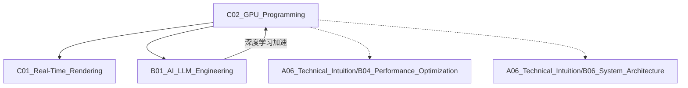

# C02_GPU_Programming

**所属子领域**: [B02_Graphics_3D](../README.md)
**创建日期**: 2026-01-30
**最后更新**: 2026-01-30

## 📋 主题定位

GPU编程（GPU Programming）是利用图形处理器并行计算能力解决通用计算和图形渲染问题的技术领域。随着GPU计算能力的指数级增长，现代GPU编程已超越传统图形渲染，涵盖深度学习、科学计算、密码学、数据分析等广泛领域。掌握GPU编程是释放现代硬件潜力的关键技能。

## 🎯 核心概念

### 基本定义

GPU编程通过利用GPU的大规模并行架构（数千个轻量级核心）加速计算密集型任务。核心范式包括：
- **数据并行**：同一操作应用于大量数据元素
- **SIMT执行**：单指令多线程执行模型
- **内存层次**：寄存器、共享内存、全局内存的优化使用
- **计算-通信比**：最大化计算、最小化数据传输

### 关键特性

**1. GPU架构演进**
- **NVIDIA CUDA核心**：SIMT执行、Warp调度（32线程）
- **AMD RDNA/CDNA**：Wavefront（64线程）执行模型
- **Intel Xe**：EU执行单元、线程级并行
- **Apple Silicon GPU**：TBDR（分块延迟渲染）架构

**2. 编程模型**
- **CUDA**：NVIDIA专有，生态最成熟
- **OpenCL**：跨平台开放标准
- **Vulkan/SYCL**：现代C++异构计算
- **HIP/ROCm**：AMD开源CUDA兼容层
- **WebGPU Compute**：浏览器端GPU计算

**3. 内存模型**
- **全局内存**：容量大、延迟高、需合并访问
- **共享内存/LDS**：片上高速、线程块共享
- **寄存器**：最快速、数量有限
- **常量/纹理内存**：缓存优化、只读访问
- **统一内存**：自动页迁移、简化编程

**4. 执行模型**
- **Grid/Block/Thread**：三级层次结构
- **Warp/Wavefront**：硬件调度单位
- **占用率**：活跃Warp比例，影响延迟隐藏
- **内存合并**：连续线程访问连续内存

### 应用场景
- **深度学习训练推理**：PyTorch/TensorFlow底层加速
- **科学计算**：流体动力学、分子动力学、气象模拟
- **图像处理**：实时滤镜、计算机视觉、视频编码
- **密码学**：区块链挖矿、加密解密
- **金融建模**：蒙特卡洛模拟、风险分析
- **图形渲染**：实时光追、全局光照

## 🛠️ 技术实践

### 实现方法

**1. CUDA基础编程**

```cuda
// vector_add.cu - CUDA向量加法
#include <cuda_runtime.h>
#include <stdio.h>

// CUDA错误检查宏
#define CUDA_CHECK(call)                                                       \
    do {                                                                       \
        cudaError_t err = call;                                                \
        if (err != cudaSuccess) {                                              \
            fprintf(stderr, "CUDA error at %s:%d: %s\n", __FILE__, __LINE__,   \
                    cudaGetErrorString(err));                                  \
            exit(EXIT_FAILURE);                                                \
        }                                                                      \
    } while(0)

// 向量加法核函数
__global__ void vectorAdd(const float* A, const float* B, float* C, int numElements) {
    // 全局线程ID计算
    int i = blockDim.x * blockIdx.x + threadIdx.x;
    
    // 边界检查
    if (i < numElements) {
        C[i] = A[i] + B[i];
    }
}

// 优化版：使用向量化加载
__global__ void vectorAddVectorized(const float4* A, const float4* B, float4* C, int numElements) {
    int i = blockIdx.x * blockDim.x + threadIdx.x;
    
    if (i < numElements / 4) {
        float4 a = A[i];
        float4 b = B[i];
        float4 c;
        c.x = a.x + b.x;
        c.y = a.y + b.y;
        c.z = a.z + b.z;
        c.w = a.w + b.w;
        C[i] = c;
    }
}

int main(void) {
    // 向量大小
    int numElements = 50000;
    size_t size = numElements * sizeof(float);
    
    // 主机内存分配
    float* h_A = (float*)malloc(size);
    float* h_B = (float*)malloc(size);
    float* h_C = (float*)malloc(size);
    
    // 初始化数据
    for (int i = 0; i < numElements; ++i) {
        h_A[i] = rand() / (float)RAND_MAX;
        h_B[i] = rand() / (float)RAND_MAX;
    }
    
    // 设备内存分配
    float* d_A = NULL;
    float* d_B = NULL;
    float* d_C = NULL;
    CUDA_CHECK(cudaMalloc((void**)&d_A, size));
    CUDA_CHECK(cudaMalloc((void**)&d_B, size));
    CUDA_CHECK(cudaMalloc((void**)&d_C, size));
    
    // 数据拷贝到设备
    CUDA_CHECK(cudaMemcpy(d_A, h_A, size, cudaMemcpyHostToDevice));
    CUDA_CHECK(cudaMemcpy(d_B, h_B, size, cudaMemcpyHostToDevice));
    
    // 启动核函数
    int threadsPerBlock = 256;
    int blocksPerGrid = (numElements + threadsPerBlock - 1) / threadsPerBlock;
    
    // 创建CUDA事件用于计时
    cudaEvent_t start, stop;
    CUDA_CHECK(cudaEventCreate(&start));
    CUDA_CHECK(cudaEventCreate(&stop));
    
    CUDA_CHECK(cudaEventRecord(start));
    vectorAdd<<<blocksPerGrid, threadsPerBlock>>>(d_A, d_B, d_C, numElements);
    CUDA_CHECK(cudaEventRecord(stop));
    
    CUDA_CHECK(cudaEventSynchronize(stop));
    float milliseconds = 0;
    CUDA_CHECK(cudaEventElapsedTime(&milliseconds, start, stop));
    
    printf("Vector addition completed in %.3f ms\n", milliseconds);
    
    // 结果拷贝回主机
    CUDA_CHECK(cudaMemcpy(h_C, d_C, size, cudaMemcpyDeviceToHost));
    
    // 验证结果
    for (int i = 0; i < numElements; ++i) {
        if (fabs(h_A[i] + h_B[i] - h_C[i]) > 1e-5) {
            fprintf(stderr, "Result verification failed at element %d!\n", i);
            exit(EXIT_FAILURE);
        }
    }
    
    printf("Test PASSED\n");
    
    // 释放资源
    CUDA_CHECK(cudaFree(d_A));
    CUDA_CHECK(cudaFree(d_B));
    CUDA_CHECK(cudaFree(d_C));
    free(h_A);
    free(h_B);
    free(h_C);
    CUDA_CHECK(cudaEventDestroy(start));
    CUDA_CHECK(cudaEventDestroy(stop));
    
    return 0;
}
```

**2. 共享内存优化：矩阵乘法**

```cuda
// matrix_multiply.cu - 优化矩阵乘法
#include <cuda_runtime.h>

#define TILE_WIDTH 16

// 基础矩阵乘法（全局内存）
__global__ void matrixMulGlobal(float* C, float* A, float* B, int width) {
    int row = blockIdx.y * blockDim.y + threadIdx.y;
    int col = blockIdx.x * blockDim.x + threadIdx.x;
    
    if (row < width && col < width) {
        float sum = 0.0f;
        for (int k = 0; k < width; k++) {
            sum += A[row * width + k] * B[k * width + col];
        }
        C[row * width + col] = sum;
    }
}

// 共享内存优化矩阵乘法
__global__ void matrixMulShared(float* C, float* A, float* B, int width) {
    __shared__ float ds_A[TILE_WIDTH][TILE_WIDTH];
    __shared__ float ds_B[TILE_WIDTH][TILE_WIDTH];
    
    int bx = blockIdx.x;
    int by = blockIdx.y;
    int tx = threadIdx.x;
    int ty = threadIdx.y;
    
    int row = by * TILE_WIDTH + ty;
    int col = bx * TILE_WIDTH + tx;
    
    float Cvalue = 0.0f;
    
    // 分块遍历
    for (int m = 0; m < (width - 1) / TILE_WIDTH + 1; ++m) {
        // 协作加载A的子矩阵到共享内存
        if (row < width && m * TILE_WIDTH + tx < width) {
            ds_A[ty][tx] = A[row * width + m * TILE_WIDTH + tx];
        } else {
            ds_A[ty][tx] = 0.0f;
        }
        
        // 协作加载B的子矩阵到共享内存
        if (m * TILE_WIDTH + ty < width && col < width) {
            ds_B[ty][tx] = B[(m * TILE_WIDTH + ty) * width + col];
        } else {
            ds_B[ty][tx] = 0.0f;
        }
        
        __syncthreads();
        
        // 计算部分积
        for (int k = 0; k < TILE_WIDTH; ++k) {
            Cvalue += ds_A[ty][k] * ds_B[k][tx];
        }
        
        __syncthreads();
    }
    
    if (row < width && col < width) {
        C[row * width + col] = Cvalue;
    }
}

// CUDA Core优化：使用寄存器分块
__global__ void matrixMulOptimized(float* C, const float* A, const float* B, int M, int N, int K) {
    const int BM = 128;  // Block M dimension
    const int BN = 128;  // Block N dimension
    const int BK = 8;    // Block K dimension
    const int TM = 8;    // Thread M tiles
    const int TN = 8;    // Thread N tiles
    
    __shared__ float As[BM * BK];
    __shared__ float Bs[BK * BN];
    
    float regA[TM];
    float regB[TN];
    float threadResults[TM * TN] = {0.0f};
    
    int threadRow = threadIdx.x / (BN / TN);
    int threadCol = threadIdx.x % (BN / TN);
    
    // 外层循环遍历K维度
    for (int bkIdx = 0; bkIdx < K; bkIdx += BK) {
        // 加载A到共享内存
        for (int i = 0; i < BM * BK / blockDim.x; i++) {
            int row = blockIdx.y * BM + (i * blockDim.x + threadIdx.x) / BK;
            int col = bkIdx + (i * blockDim.x + threadIdx.x) % BK;
            if (row < M && col < K) {
                As[(i * blockDim.x + threadIdx.x)] = A[row * K + col];
            }
        }
        
        // 加载B到共享内存
        for (int i = 0; i < BK * BN / blockDim.x; i++) {
            int row = bkIdx + (i * blockDim.x + threadIdx.x) / BN;
            int col = blockIdx.x * BN + (i * blockDim.x + threadIdx.x) % BN;
            if (row < K && col < N) {
                Bs[(i * blockDim.x + threadIdx.x)] = B[row * N + col];
            }
        }
        
        __syncthreads();
        
        // 内层循环计算
        for (int dotIdx = 0; dotIdx < BK; ++dotIdx) {
            // 加载A寄存器
            for (int i = 0; i < TM; ++i) {
                regA[i] = As[(threadRow * TM + i) * BK + dotIdx];
            }
            // 加载B寄存器
            for (int i = 0; i < TN; ++i) {
                regB[i] = Bs[dotIdx * BN + threadCol * TN + i];
            }
            // 计算外积
            for (int rm = 0; rm < TM; ++rm) {
                for (int rn = 0; rn < TN; ++rn) {
                    threadResults[rm * TN + rn] += regA[rm] * regB[rn];
                }
            }
        }
        
        __syncthreads();
    }
    
    // 写回结果
    for (int rm = 0; rm < TM; ++rm) {
        for (int rn = 0; rn < TN; ++rn) {
            int row = blockIdx.y * BM + threadRow * TM + rm;
            int col = blockIdx.x * BN + threadCol * TN + rn;
            if (row < M && col < N) {
                C[row * N + col] = threadResults[rm * TN + rn];
            }
        }
    }
}

// cuBLAS调用示例
void matrixMulCuBLAS(float* C, const float* A, const float* B, int m, int n, int k) {
    cublasHandle_t handle;
    cublasCreate(&handle);
    
    const float alpha = 1.0f;
    const float beta = 0.0f;
    
    // C = alpha * A * B + beta * C
    // 注意cuBLAS是列优先存储
    cublasSgemm(handle, CUBLAS_OP_N, CUBLAS_OP_N,
                n, m, k,
                &alpha,
                B, n,
                A, k,
                &beta,
                C, n);
    
    cublasDestroy(handle);
}
```

**3. 归约算法与并行前缀和**

```cuda
// reduction.cu - 并行归约算法
#include <cuda_runtime.h>

// 基础归约：线程级归约
__global__ void reduceSumBasic(float* input, float* output, int n) {
    extern __shared__ float sdata[];
    
    unsigned int tid = threadIdx.x;
    unsigned int i = blockIdx.x * blockDim.x * 2 + threadIdx.x;
    
    // 加载数据到共享内存，每个线程处理两个元素
    sdata[tid] = (i < n) ? input[i] : 0;
    if (i + blockDim.x < n) {
        sdata[tid] += input[i + blockDim.x];
    }
    __syncthreads();
    
    // 树形归约
    for (unsigned int s = blockDim.x / 2; s > 0; s >>= 1) {
        if (tid < s) {
            sdata[tid] += sdata[tid + s];
        }
        __syncthreads();
    }
    
    // 写回结果
    if (tid == 0) {
        output[blockIdx.x] = sdata[0];
    }
}

// 优化归约：展开循环
__global__ void reduceSumUnrolled(float* input, float* output, int n) {
    extern __shared__ float sdata[];
    
    unsigned int tid = threadIdx.x;
    unsigned int i = blockIdx.x * (blockDim.x * 2) + threadIdx.x;
    
    float sum = 0.0f;
    // 展开4x，每个线程处理8个元素
    #pragma unroll
    for (int j = 0; j < 4; j++) {
        unsigned int idx = i + j * blockDim.x * 2;
        if (idx < n) sum += input[idx];
        if (idx + blockDim.x < n) sum += input[idx + blockDim.x];
    }
    sdata[tid] = sum;
    __syncthreads();
    
    // 展开归约循环
    if (blockDim.x >= 512 && tid < 256) sdata[tid] += sdata[tid + 256]; __syncthreads();
    if (blockDim.x >= 256 && tid < 128) sdata[tid] += sdata[tid + 128]; __syncthreads();
    if (blockDim.x >= 128 && tid < 64) sdata[tid] += sdata[tid + 64]; __syncthreads();
    
    // 最后warp使用shuffle指令
    if (tid < 32) {
        volatile float* vsmem = sdata;
        vsmem[tid] += vsmem[tid + 32];
        vsmem[tid] += vsmem[tid + 16];
        vsmem[tid] += vsmem[tid + 8];
        vsmem[tid] += vsmem[tid + 4];
        vsmem[tid] += vsmem[tid + 2];
        vsmem[tid] += vsmem[tid + 1];
    }
    
    if (tid == 0) {
        output[blockIdx.x] = sdata[0];
    }
}

// Warp级归约使用shuffle指令
__inline__ __device__ float warpReduceSum(float val) {
    for (int offset = warpSize / 2; offset > 0; offset /= 2) {
        val += __shfl_down_sync(0xFFFFFFFF, val, offset);
    }
    return val;
}

// 并行前缀和（Scan）
__global__ void scanBlock(float* input, float* output, float* blockSums, int n) {
    extern __shared__ float temp[];
    
    int tid = threadIdx.x;
    int offset = 1;
    int ai = tid;
    int bi = tid + (n / 2);
    
    // 加载数据到共享内存
    float t = input[ai];
    temp[ai] = t;
    t = input[bi];
    temp[bi] = t;
    
    // 上扫阶段
    for (int d = n >> 1; d > 0; d >>= 1) {
        __syncthreads();
        if (tid < d) {
            int ai = offset * (2 * tid + 1) - 1;
            int bi = offset * (2 * tid + 2) - 1;
            temp[bi] += temp[ai];
        }
        offset *= 2;
    }
    
    // 清零最后一个元素
    if (tid == 0) {
        if (blockSums != NULL) {
            blockSums[blockIdx.x] = temp[n - 1];
        }
        temp[n - 1] = 0;
    }
    
    // 下扫阶段
    for (int d = 1; d < n; d *= 2) {
        offset >>= 1;
        __syncthreads();
        if (tid < d) {
            int ai = offset * (2 * tid + 1) - 1;
            int bi = offset * (2 * tid + 2) - 1;
            float t = temp[ai];
            temp[ai] = temp[bi];
            temp[bi] += t;
        }
    }
    __syncthreads();
    
    // 写回结果
    output[ai] = temp[ai];
    output[bi] = temp[bi];
}

// Thrust库调用
#include <thrust/device_vector.h>
#include <thrust/reduce.h>
#include <thrust/scan.h>

void reduceWithThrust(float* d_input, float* d_output, int n) {
    thrust::device_ptr<float> dev_ptr(d_input);
    float sum = thrust::reduce(dev_ptr, dev_ptr + n);
    cudaMemcpy(d_output, &sum, sizeof(float), cudaMemcpyHostToDevice);
}

void scanWithThrust(float* d_input, float* d_output, int n) {
    thrust::device_ptr<float> in_ptr(d_input);
    thrust::device_ptr<float> out_ptr(d_output);
    thrust::exclusive_scan(in_ptr, in_ptr + n, out_ptr);
}
```

**4. OpenCL跨平台编程**

```cpp
// opencl_vector_add.cpp
#define CL_TARGET_OPENCL_VERSION 300
#include <CL/cl.h>
#include <vector>
#include <iostream>
#include <fstream>
#include <sstream>

const char* kernelSource = R"(
__kernel void vectorAdd(
    __global const float* A,
    __global const float* B,
    __global float* C,
    const int numElements)
{
    int i = get_global_id(0);
    if (i < numElements) {
        C[i] = A[i] + B[i];
    }
}
)";

class OpenCLContext {
public:
    bool initialize() {
        cl_int err;
        
        // 获取平台
        cl_uint numPlatforms;
        err = clGetPlatformIDs(0, NULL, &numPlatforms);
        if (err != CL_SUCCESS || numPlatforms == 0) {
            std::cerr << "Failed to find OpenCL platform\n";
            return false;
        }
        
        std::vector<cl_platform_id> platforms(numPlatforms);
        clGetPlatformIDs(numPlatforms, platforms.data(), NULL);
        
        // 选择第一个平台
        platform = platforms[0];
        
        // 获取设备
        cl_uint numDevices;
        err = clGetDeviceIDs(platform, CL_DEVICE_TYPE_GPU, 0, NULL, &numDevices);
        if (err != CL_SUCCESS || numDevices == 0) {
            // 回退到CPU
            err = clGetDeviceIDs(platform, CL_DEVICE_TYPE_CPU, 0, NULL, &numDevices);
            if (err != CL_SUCCESS || numDevices == 0) {
                std::cerr << "Failed to find OpenCL device\n";
                return false;
            }
        }
        
        std::vector<cl_device_id> devices(numDevices);
        clGetDeviceIDs(platform, CL_DEVICE_TYPE_ALL, numDevices, devices.data(), NULL);
        device = devices[0];
        
        // 创建设备上下文
        context = clCreateContext(NULL, 1, &device, NULL, NULL, &err);
        if (err != CL_SUCCESS) {
            std::cerr << "Failed to create context\n";
            return false;
        }
        
        // 创建命令队列
        commandQueue = clCreateCommandQueueWithProperties(context, device, 0, &err);
        if (err != CL_SUCCESS) {
            std::cerr << "Failed to create command queue\n";
            return false;
        }
        
        // 创建程序
        program = clCreateProgramWithSource(context, 1, &kernelSource, NULL, &err);
        if (err != CL_SUCCESS) {
            std::cerr << "Failed to create program\n";
            return false;
        }
        
        // 编译程序
        err = clBuildProgram(program, 1, &device, NULL, NULL, NULL);
        if (err != CL_SUCCESS) {
            size_t logSize;
            clGetProgramBuildInfo(program, device, CL_PROGRAM_BUILD_LOG, 0, NULL, &logSize);
            std::vector<char> log(logSize);
            clGetProgramBuildInfo(program, device, CL_PROGRAM_BUILD_LOG, logSize, log.data(), NULL);
            std::cerr << "Build error:\n" << log.data() << "\n";
            return false;
        }
        
        // 创建核函数
        kernel = clCreateKernel(program, "vectorAdd", &err);
        if (err != CL_SUCCESS) {
            std::cerr << "Failed to create kernel\n";
            return false;
        }
        
        return true;
    }
    
    void vectorAdd(const std::vector<float>& a, const std::vector<float>& b, 
                   std::vector<float>& c, int numElements) {
        cl_int err;
        size_t size = numElements * sizeof(float);
        
        // 创建设备内存
        cl_mem d_a = clCreateBuffer(context, CL_MEM_READ_ONLY, size, NULL, &err);
        cl_mem d_b = clCreateBuffer(context, CL_MEM_READ_ONLY, size, NULL, &err);
        cl_mem d_c = clCreateBuffer(context, CL_MEM_WRITE_ONLY, size, NULL, &err);
        
        // 拷贝数据到设备
        clEnqueueWriteBuffer(commandQueue, d_a, CL_TRUE, 0, size, a.data(), 0, NULL, NULL);
        clEnqueueWriteBuffer(commandQueue, d_b, CL_TRUE, 0, size, b.data(), 0, NULL, NULL);
        
        // 设置核函数参数
        clSetKernelArg(kernel, 0, sizeof(cl_mem), &d_a);
        clSetKernelArg(kernel, 1, sizeof(cl_mem), &d_b);
        clSetKernelArg(kernel, 2, sizeof(cl_mem), &d_c);
        clSetKernelArg(kernel, 3, sizeof(int), &numElements);
        
        // 执行核函数
        size_t globalSize = ((numElements + 255) / 256) * 256;
        size_t localSize = 256;
        clEnqueueNDRangeKernel(commandQueue, kernel, 1, NULL, &globalSize, &localSize, 0, NULL, NULL);
        
        // 读取结果
        clEnqueueReadBuffer(commandQueue, d_c, CL_TRUE, 0, size, c.data(), 0, NULL, NULL);
        
        // 释放资源
        clReleaseMemObject(d_a);
        clReleaseMemObject(d_b);
        clReleaseMemObject(d_c);
    }
    
    ~OpenCLContext() {
        clReleaseKernel(kernel);
        clReleaseProgram(program);
        clReleaseCommandQueue(commandQueue);
        clReleaseContext(context);
    }
    
private:
    cl_platform_id platform;
    cl_device_id device;
    cl_context context;
    cl_command_queue commandQueue;
    cl_program program;
    cl_kernel kernel;
};
```

**5. HIP/ROCm AMD GPU编程**

```cpp
// hip_matrix_multiply.cpp
#include <hip/hip_runtime.h>
#include <iostream>

// HIP兼容CUDA代码，只需替换头文件和关键字
// __global__ -> __global__
// __shared__ -> __shared__
// __syncthreads() -> __syncthreads()
// threadIdx -> hipThreadIdx_
// blockIdx -> hipBlockIdx_
// blockDim -> hipBlockDim_

#define HIP_CHECK(call)                                                         \
    do {                                                                        \
        hipError_t err = call;                                                  \
        if (err != hipSuccess) {                                                \
            std::cerr << "HIP error at " << __FILE__ << ":" << __LINE__;        \
            std::cerr << " - " << hipGetErrorString(err) << std::endl;          \
            exit(EXIT_FAILURE);                                                 \
        }                                                                       \
    } while(0)

// 矩阵乘HIP核函数
__global__ void matrixMulHIP(float* C, const float* A, const float* B, 
                             int M, int N, int K) {
    int row = hipBlockIdx_y * hipBlockDim_y + hipThreadIdx_y;
    int col = hipBlockIdx_x * hipBlockDim_x + hipThreadIdx_x;
    
    if (row < M && col < N) {
        float sum = 0.0f;
        for (int k = 0; k < K; k++) {
            sum += A[row * K + k] * B[k * N + col];
        }
        C[row * N + col] = sum;
    }
}

// 使用rocBLAS
#include <rocblas.h>

void matrixMulRocBLAS(float* d_C, float* d_A, float* d_B, int m, int n, int k) {
    rocblas_handle handle;
    rocblas_create_handle(&handle);
    
    const float alpha = 1.0f;
    const float beta = 0.0f;
    
    // C = alpha * A * B + beta * C
    rocblas_sgemm(handle, rocblas_operation_none, rocblas_operation_none,
                  n, m, k,
                  &alpha,
                  d_B, n,
                  d_A, k,
                  &beta,
                  d_C, n);
    
    rocblas_destroy_handle(handle);
}

// 使用rocThrust
#include <thrust/device_vector.h>
#include <thrust/reduce.h>

void reduceRocThrust(float* d_input, int n) {
    thrust::device_ptr<float> dev_ptr(d_input);
    float sum = thrust::reduce(dev_ptr, dev_ptr + n);
    std::cout << "Sum: " << sum << std::endl;
}
```

**6. SYCL现代C++异构编程**

```cpp
// sycl_vector_add.cpp
#include <sycl/sycl.hpp>
#include <vector>
#include <iostream>

void vectorAddSYCL(const std::vector<float>& a, const std::vector<float>& b,
                   std::vector<float>& c, int numElements) {
    // 创建SYCL队列
    sycl::queue q(sycl::default_selector_v);
    
    std::cout << "Running on: " 
              << q.get_device().get_info<sycl::info::device::name>() << std::endl;
    
    // 创建缓冲区
    sycl::buffer<float, 1> buf_a(a.data(), sycl::range<1>(numElements));
    sycl::buffer<float, 1> buf_b(b.data(), sycl::range<1>(numElements));
    sycl::buffer<float, 1> buf_c(c.data(), sycl::range<1>(numElements));
    
    // 提交命令组
    q.submit([&](sycl::handler& h) {
        // 创建访问器
        auto acc_a = buf_a.get_access<sycl::access::mode::read>(h);
        auto acc_b = buf_b.get_access<sycl::access::mode::read>(h);
        auto acc_c = buf_c.get_access<sycl::access::mode::write>(h);
        
        // 并行for
        h.parallel_for(sycl::range<1>(numElements), [=](sycl::id<1> i) {
            acc_c[i] = acc_a[i] + acc_b[i];
        });
    });
    
    // 缓冲区自动同步
}

// SYCL矩阵乘法
void matrixMulSYCL(const std::vector<float>& A, const std::vector<float>& B,
                   std::vector<float>& C, int M, int N, int K) {
    sycl::queue q(sycl::gpu_selector_v);
    
    const int TILE_SIZE = 16;
    
    sycl::buffer<float, 2> buf_A(A.data(), sycl::range<2>(M, K));
    sycl::buffer<float, 2> buf_B(B.data(), sycl::range<2>(K, N));
    sycl::buffer<float, 2> buf_C(C.data(), sycl::range<2>(M, N));
    
    q.submit([&](sycl::handler& h) {
        // 本地内存访问器
        sycl::local_accessor<float, 2> tile_A(sycl::range<2>(TILE_SIZE, TILE_SIZE), h);
        sycl::local_accessor<float, 2> tile_B(sycl::range<2>(TILE_SIZE, TILE_SIZE), h);
        
        auto acc_A = buf_A.get_access<sycl::access::mode::read>(h);
        auto acc_B = buf_B.get_access<sycl::access::mode::read>(h);
        auto acc_C = buf_C.get_access<sycl::access::mode::write>(h);
        
        // ND-range并行
        h.parallel_for(
            sycl::nd_range<2>(
                sycl::range<2>((M + TILE_SIZE - 1) / TILE_SIZE * TILE_SIZE,
                              (N + TILE_SIZE - 1) / TILE_SIZE * TILE_SIZE),
                sycl::range<2>(TILE_SIZE, TILE_SIZE)
            ),
            [=](sycl::nd_item<2> item) {
                int row = item.get_global_id(0);
                int col = item.get_global_id(1);
                int local_row = item.get_local_id(0);
                int local_col = item.get_local_id(1);
                
                float sum = 0.0f;
                
                // 分块循环
                for (int t = 0; t < (K + TILE_SIZE - 1) / TILE_SIZE; t++) {
                    // 协作加载到本地内存
                    if (row < M && t * TILE_SIZE + local_col < K) {
                        tile_A[local_row][local_col] = acc_A[row][t * TILE_SIZE + local_col];
                    } else {
                        tile_A[local_row][local_col] = 0.0f;
                    }
                    
                    if (t * TILE_SIZE + local_row < K && col < N) {
                        tile_B[local_row][local_col] = acc_B[t * TILE_SIZE + local_row][col];
                    } else {
                        tile_B[local_row][local_col] = 0.0f;
                    }
                    
                    item.barrier(sycl::access::fence_space::local_space);
                    
                    // 计算部分积
                    for (int k = 0; k < TILE_SIZE; k++) {
                        sum += tile_A[local_row][k] * tile_B[k][local_col];
                    }
                    
                    item.barrier(sycl::access::fence_space::local_space);
                }
                
                if (row < M && col < N) {
                    acc_C[row][col] = sum;
                }
            }
        );
    });
}

// oneMKL BLAS调用
#include <oneapi/mkl/blas.hpp>

void matrixMulOneMKL(sycl::queue& q, float* A, float* B, float* C, int m, int n, int k) {
    float alpha = 1.0f;
    float beta = 0.0f;
    
    oneapi::mkl::blas::row_major::gemm(
        q,
        oneapi::mkl::transpose::nontrans,
        oneapi::mkl::transpose::nontrans,
        m, n, k,
        alpha,
        A, k,
        B, n,
        beta,
        C, n
    );
}
```

### 最佳实践

**1. 内存访问优化**
- 全局内存合并访问
- 共享内存避免bank conflict
- 纹理内存用于随机访问
- 常量内存用于广播数据

**2. 占用率优化**
```cpp
// 计算占用率
cudaOccMaxActiveBlocksPerMultiprocessor(
    &numBlocks,
    prop,
    kernel,
    blockSize,
    dynamicSmemSize
);
```

**3. 流与并发**
```cpp
// 多流并发执行
cudaStream_t streams[4];
for (int i = 0; i < 4; i++) {
    cudaStreamCreate(&streams[i]);
}

// 异步数据传输与计算
for (int i = 0; i < 4; i++) {
    cudaMemcpyAsync(d_data + offset, h_data + offset, size, 
                    cudaMemcpyHostToDevice, streams[i]);
    kernel<<<blocks, threads, 0, streams[i]>>>(d_data + offset);
    cudaMemcpyAsync(h_result + offset, d_result + offset, size,
                    cudaMemcpyDeviceToHost, streams[i]);
}

cudaDeviceSynchronize();
```

**4. 统一内存**
```cpp
// 统一内存自动管理
cudaMallocManaged(&data, size);

// 预取优化
cudaMemPrefetchAsync(data, size, deviceId, stream);
```

### 常见陷阱

**1. 内存泄漏**
- ❌ 问题：cudaMalloc后未cudaFree
- ✅ 解决：使用RAII包装类

**2. 同步问题**
- ❌ 问题：异步操作导致数据竞争
- ✅ 解决：正确使用cudaDeviceSynchronize

**3. 寄存器压力**
- ❌ 问题：过多局部变量降低占用率
- ✅ 解决：分析并减少寄存器使用

**4. 线程发散**
- ❌ 问题：Warp内线程走不同分支
- ✅ 解决：重构算法减少分支

## 📚 资源索引

### 学术论文

1. **CUDA Programming Guide** (NVIDIA)
   - https://docs.nvidia.com/cuda/cuda-c-programming-guide/
   - CUDA编程官方权威指南

2. **Programming Massively Parallel Processors, 4th Edition** (2022)
   - 作者：David B. Kirk, Wen-mei W. Hwu
   - CUDA编程标准教材

3. **OpenCL Specification** (Khronos)
   - https://www.khronos.org/opencl/
   - OpenCL开放标准规范

4. **SYCL 2020 Specification** (Khronos)
   - https://www.khronos.org/sycl/
   - 现代C++异构编程标准

5. **HIP Programming Guide** (AMD)
   - https://rocm.docs.amd.com/
   - AMD GPU编程指南

### 技术文档

1. **NVIDIA CUDA Best Practices Guide**
   - https://docs.nvidia.com/cuda/cuda-c-best-practices-guide/
   - 性能优化最佳实践

2. **NVIDIA Nsight Documentation**
   - 性能分析与调试工具

3. **Intel oneAPI DPC++ Documentation**
   - https://spec.oneapi.io/oneapi-spec.pdf
   - Intel异构编程框架

### 开源项目

1. **cuDNN** - https://developer.nvidia.com/cudnn
   - 深度学习基元库

2. **cuBLAS/cuFFT/cuRAND** - CUDA Math Libraries
   - NVIDIA数学库

3. **Thrust** - https://github.com/NVIDIA/thrust
   - 并行算法库

4. **CUB** - https://github.com/NVIDIA/cub
   - CUDA块级并行原语

5. **hipBLAS/hipFFT** - https://github.com/ROCmSoftwarePlatform
   - AMD ROCm数学库

6. **oneMKL** - https://github.com/oneapi-src/oneMKL
   - Intel oneAPI数学库

### 工具与框架

1. **Nsight Compute/Systems**
   - NVIDIA性能分析工具

2. **rocProf**
   - AMD GPU分析器

3. **Intel VTune**
   - Intel性能分析

4. **GPU Burn**
   - GPU压力测试工具

## 🔗 关联知识



## 💡 学习建议

### 前置知识
- C/C++编程基础
- 并行计算概念
- 计算机体系结构基础
- 线性代数

### 学习路径

**第1-2周：CUDA基础**
- 内存管理、核函数启动
- 实践：向量操作、矩阵转置
- 工具：Nsight调试

**第3-4周：性能优化**
- 共享内存、合并访问
- 实践：优化矩阵乘法
- 目标：达到峰值性能80%

**第5-6周：高级主题**
- 动态并行、统一内存
- 多GPU编程
- 实践：大规模并行应用

**第7-8周：跨平台编程**
- OpenCL或SYCL
- 可移植代码设计
- 实践：跨平台应用

### 实践项目

**项目1：并行排序算法**
- 实现：Bitonic排序、归并排序
- 目标：比CPU快50x

**项目2：图像卷积加速**
- 实现：高斯模糊、边缘检测
- 优化：共享内存、常量内存

**项目3：蒙特卡洛模拟**
- 实现：期权定价、风险分析
- 技术：cuRAND、并行规约

**项目4：分子动力学模拟**
- 实现：N体问题、力计算
- 优化：空间划分、共享内存

## 🔄 维护说明

- **更新频率**: 每季度更新，跟踪新GPU架构
- **质量标准**: 所有代码在多平台测试
- **贡献方式**: 提交新优化技术、架构适配
