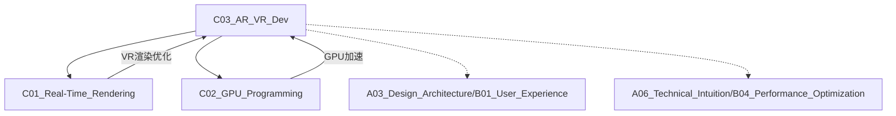

# C03_AR_VR_Dev

**所属子领域**: [B02_Graphics_3D](../README.md)
**创建日期**: 2026-01-30
**最后更新**: 2026-01-30

## 📋 主题定位

AR/VR开发（Augmented Reality / Virtual Reality Development）是构建沉浸式体验的核心技术领域，涵盖头戴显示设备、空间计算、手势追踪、环境理解等多学科交叉技术。随着Apple Vision Pro、Meta Quest系列等设备的普及，XR（Extended Reality）正在从游戏娱乐向工业、医疗、教育、办公等领域全面渗透，成为下一代计算平台的重要形态。

## 🎯 核心概念

### 基本定义

AR/VR开发涉及创建融合数字内容与现实世界（AR）或完全沉浸式虚拟环境（VR）的应用程序。核心技术挑战包括：
- **延迟控制**：Motion-to-Photon延迟需小于20ms，避免晕动症
- **空间追踪**：6DoF（六自由度）头手定位
- **渲染优化**：高帧率（72-120Hz）、低延迟、立体渲染
- **交互设计**：自然用户界面、手势、眼动、语音输入
- **环境理解**：场景重建、平面检测、物体识别

### 关键特性

**1. 硬件形态演进**
- **VR一体机**：Meta Quest 3/3S、PICO 4
- **PC VR**：Valve Index、HTC Vive Pro 2
- **AR眼镜**：Magic Leap 2、HoloLens 2
- **空间计算设备**：Apple Vision Pro
- **轻量AR**：XREAL Air、雷鸟Air

**2. 追踪技术**
- **Inside-Out追踪**：机载摄像头SLAM
- **Outside-In追踪**：基站/外部传感器
- **手部追踪**：计算机视觉手势识别
- **眼动追踪**：注视点渲染、交互输入
- **面部追踪**：化身表情驱动

**3. 渲染优化技术**
- **注视点渲染（Foveated Rendering）**：降低外围分辨率
- **ASW/ATW/ASW 2.0**：时间扭曲技术补偿帧率
- **单通道立体渲染**：减少绘制调用
- **实例化立体渲染**：左右眼一次绘制
- **可变分辨率渲染**：动态调整渲染负载

**4. 交互范式**
- **手柄交互**：6DoF控制器、触觉反馈
- **手势交互**：裸手追踪、手势识别
- **眼手协同**：注视选择+手势确认
- **语音交互**：自然语言命令
- **空间UI**：3D界面、世界锁定UI

### 应用场景
- **游戏娱乐**：沉浸式3A游戏、社交VR
- **工业制造**：远程协助、数字孪生、培训模拟
- **医疗健康**：手术导航、康复训练、心理治疗
- **教育培训**：虚拟实验室、历史重现、技能培训
- **建筑设计**：BIM可视化、空间预览
- **办公协作**：虚拟会议室、空间计算工作流

## 🛠️ 技术实践

### 实现方法

**1. Unity XR开发基础**

```csharp
// XRInteractionToolkit示例：基础交互系统
using UnityEngine;
using UnityEngine.XR.Interaction.Toolkit;
using UnityEngine.XR.Interaction.Toolkit.Interactables;

public class XRGrabbableObject : MonoBehaviour
{
    [Header("Interaction Settings")]
    [SerializeField] private bool isGrabbable = true;
    [SerializeField] private Transform attachTransform;
    
    [Header("Physics Settings")]
    [SerializeField] private float throwVelocityScale = 1.5f;
    
    private XRGrabInteractable grabInteractable;
    private Rigidbody rb;
    private Vector3[] recentVelocities = new Vector3[5];
    private int velocityIndex = 0;
    
    private void Awake()
    {
        rb = GetComponent<Rigidbody>();
        SetupInteractable();
    }
    
    private void SetupInteractable()
    {
        grabInteractable = GetComponent<XRGrabInteractable>();
        if (grabInteractable == null)
        {
            grabInteractable = gameObject.AddComponent<XRGrabInteractable>();
        }
        
        grabInteractable.movementType = XRBaseInteractable.MovementType.VelocityTracking;
        grabInteractable.useDynamicAttach = true;
        
        if (attachTransform != null)
        {
            grabInteractable.attachTransform = attachTransform;
        }
        
        grabInteractable.selectEntered.AddListener(OnGrabbed);
        grabInteractable.selectExited.AddListener(OnReleased);
    }
    
    private void OnGrabbed(SelectEnterEventArgs args)
    {
        if (rb != null)
        {
            rb.isKinematic = true;
        }
        
        // 触觉反馈
        if (args.interactorObject.transform.TryGetComponent(out XRBaseControllerInteractor controller))
        {
            controller.xrController.SendHapticImpulse(0.5f, 0.1f);
        }
        
        HighlightObject(true);
    }
    
    private void OnReleased(SelectExitEventArgs args)
    {
        if (rb != null)
        {
            rb.isKinematic = false;
            Vector3 averagedVelocity = GetAveragedVelocity();
            rb.velocity = averagedVelocity * throwVelocityScale;
        }
        
        HighlightObject(false);
    }
    
    private void FixedUpdate()
    {
        if (rb != null)
        {
            recentVelocities[velocityIndex] = rb.velocity;
            velocityIndex = (velocityIndex + 1) % recentVelocities.Length;
        }
    }
    
    private Vector3 GetAveragedVelocity()
    {
        Vector3 sum = Vector3.zero;
        for (int i = 0; i < recentVelocities.Length; i++)
        {
            sum += recentVelocities[i];
        }
        return sum / recentVelocities.Length;
    }
    
    private void HighlightObject(bool highlight)
    {
        var renderers = GetComponentsInChildren<Renderer>();
        foreach (var renderer in renderers)
        {
            MaterialPropertyBlock mpb = new MaterialPropertyBlock();
            renderer.GetPropertyBlock(mpb);
            mpb.SetFloat("_Highlight", highlight ? 1.0f : 0.0f);
            renderer.SetPropertyBlock(mpb);
        }
    }
}

// 注视点交互系统
public class GazeInteractionSystem : MonoBehaviour
{
    [SerializeField] private float gazeTimeThreshold = 1.5f;
    [SerializeField] private float maxGazeDistance = 10f;
    [SerializeField] private LayerMask interactableLayers;
    
    private Camera xrCamera;
    private GameObject currentGazeTarget;
    private float currentGazeDuration;
    
    public System.Action<GameObject> OnGazeEnter;
    public System.Action<GameObject> OnGazeExit;
    public System.Action<GameObject> OnGazeActivate;
    
    private void Start()
    {
        xrCamera = Camera.main;
    }
    
    private void Update()
    {
        PerformGazeRaycast();
    }
    
    private void PerformGazeRaycast()
    {
        Ray gazeRay = new Ray(xrCamera.transform.position, xrCamera.transform.forward);
        RaycastHit hit;
        
        if (Physics.Raycast(gazeRay, out hit, maxGazeDistance, interactableLayers))
        {
            GameObject hitObject = hit.collider.gameObject;
            
            if (currentGazeTarget != hitObject)
            {
                if (currentGazeTarget != null)
                {
                    ExitGaze(currentGazeTarget);
                }
                EnterGaze(hitObject);
            }
            else
            {
                UpdateGazeProgress();
            }
        }
        else
        {
            if (currentGazeTarget != null)
            {
                ExitGaze(currentGazeTarget);
            }
        }
    }
    
    private void EnterGaze(GameObject target)
    {
        currentGazeTarget = target;
        currentGazeDuration = 0f;
        OnGazeEnter?.Invoke(target);
        target.SendMessage("OnGazeEnter", SendMessageOptions.DontRequireReceiver);
    }
    
    private void ExitGaze(GameObject target)
    {
        OnGazeExit?.Invoke(target);
        target.SendMessage("OnGazeExit", SendMessageOptions.DontRequireReceiver);
        currentGazeTarget = null;
        currentGazeDuration = 0f;
    }
    
    private void UpdateGazeProgress()
    {
        currentGazeDuration += Time.deltaTime;
        
        if (currentGazeDuration >= gazeTimeThreshold)
        {
            ActivateGaze(currentGazeTarget);
        }
    }
    
    private void ActivateGaze(GameObject target)
    {
        OnGazeActivate?.Invoke(target);
        target.SendMessage("OnGazeActivate", SendMessageOptions.DontRequireReceiver);
        currentGazeDuration = 0f;
    }
}
```

**2. Unity空间锚点与场景理解**

```csharp
// ARFoundation空间锚点管理
using UnityEngine;
using UnityEngine.XR.ARFoundation;
using UnityEngine.XR.ARSubsystems;
using System.Collections.Generic;

public class SpatialAnchoringSystem : MonoBehaviour
{
    [SerializeField] private ARAnchorManager anchorManager;
    [SerializeField] private ARRaycastManager raycastManager;
    [SerializeField] private GameObject anchorPrefab;
    
    private Dictionary<string, ARAnchor> placedAnchors = new Dictionary<string, ARAnchor>();
    private List<ARRaycastHit> raycastHits = new List<ARRaycastHit>();
    
    [System.Serializable]
    public class AnchorData
    {
        public string id;
        public Vector3 position;
        public Quaternion rotation;
        public string label;
        public long timestamp;
    }
    
    public void PlaceAnchorAtScreenPosition(Vector2 screenPosition, string label = "")
    {
        if (raycastManager.Raycast(screenPosition, raycastHits, TrackableType.PlaneWithinPolygon))
        {
            Pose hitPose = raycastHits[0].pose;
            ARPlane plane = raycastHits[0].trackable as ARPlane;
            PlaceAnchor(hitPose, plane, label);
        }
    }
    
    public void PlaceAnchor(Pose pose, ARPlane attachToPlane = null, string label = "")
    {
        GameObject anchorObject = Instantiate(anchorPrefab, pose.position, pose.rotation);
        
        ARAnchor anchor = anchorObject.GetComponent<ARAnchor>();
        if (anchor == null)
        {
            anchor = anchorObject.AddComponent<ARAnchor>();
        }
        
        if (attachToPlane != null)
        {
            anchor = anchorManager.AttachAnchor(attachToPlane, pose);
        }
        
        if (anchor != null)
        {
            string anchorId = System.Guid.NewGuid().ToString();
            placedAnchors[anchorId] = anchor;
            
            var anchorMetadata = anchorObject.AddComponent<AnchorMetadata>();
            anchorMetadata.id = anchorId;
            anchorMetadata.label = label;
            
            SaveAnchorData(anchorId, pose, label);
        }
    }
    
    public void SaveAnchorData(string id, Pose pose, string label)
    {
        AnchorData data = new AnchorData
        {
            id = id,
            position = pose.position,
            rotation = pose.rotation,
            label = label,
            timestamp = System.DateTimeOffset.Now.ToUnixTimeMilliseconds()
        };
        
        string json = JsonUtility.ToJson(data);
        PlayerPrefs.SetString($"Anchor_{id}", json);
        PlayerPrefs.Save();
    }
    
    public void RemoveAnchor(string anchorId)
    {
        if (placedAnchors.TryGetValue(anchorId, out ARAnchor anchor))
        {
            placedAnchors.Remove(anchorId);
            if (anchor != null)
            {
                Destroy(anchor.gameObject);
            }
            PlayerPrefs.DeleteKey($"Anchor_{anchorId}");
        }
    }
}

public class AnchorMetadata : MonoBehaviour
{
    public string id;
    public string label;
}
```

**3. Unity注视点渲染实现**

```csharp
// FoveatedRendering.cs - 注视点渲染系统
using UnityEngine;
using UnityEngine.Rendering;
using UnityEngine.XR;

public class FoveatedRenderingSystem : MonoBehaviour
{
    [Header("Foveation Settings")]
    [Range(1, 3)]
    [SerializeField] private int foveationLevel = 2;
    [SerializeField] private bool dynamicFoveation = true;
    [SerializeField] private float innerRadius = 0.5f;
    [SerializeField] private float outerRadius = 1.0f;
    
    [Header("Resolution Scaling")]
    [Range(0.5f, 1.0f)]
    [SerializeField] private float innerResolutionScale = 1.0f;
    [Range(0.2f, 0.5f)]
    [SerializeField] private float outerResolutionScale = 0.3f;
    
    private Vector2 currentGazeUV = new Vector2(0.5f, 0.5f);
    
    private void OnEnable()
    {
        ConfigureXRFoveatedRendering();
        RenderPipelineManager.beginCameraRendering += OnBeginCameraRendering;
    }
    
    private void OnDisable()
    {
        RenderPipelineManager.beginCameraRendering -= OnBeginCameraRendering;
    }
    
    private void ConfigureXRFoveatedRendering()
    {
        #if OCULUS_SDK
        OVRManager.foveatedRenderingLevel = (OVRManager.FoveatedRenderingLevel)foveationLevel;
        OVRManager.useDynamicFoveatedRendering = dynamicFoveation;
        #endif
    }
    
    private void Update()
    {
        UpdateGazePoint();
    }
    
    private void UpdateGazePoint()
    {
        // 获取眼动追踪数据
        Vector3? gazeDirection = null;
        
        #if ENABLE_EYE_TRACKING
        var eyes = Input.GetDevice<UnityEngine.XR.Eyes>();
        if (eyes.isValid && eyes.TryGetGazeDirection(out Vector3 direction))
        {
            gazeDirection = direction;
        }
        #endif
        
        if (gazeDirection.HasValue)
        {
            Vector3 screenPos = Camera.main.WorldToViewportPoint(
                Camera.main.transform.position + gazeDirection.Value * 10f);
            currentGazeUV = new Vector2(Mathf.Clamp01(screenPos.x), Mathf.Clamp01(screenPos.y));
        }
    }
    
    private void OnBeginCameraRendering(ScriptableRenderContext context, Camera camera)
    {
        if (!camera.stereoEnabled) return;
        ApplyFoveatedRendering(context, camera);
    }
    
    private void ApplyFoveatedRendering(ScriptableRenderContext context, Camera camera)
    {
        // 配置可变率着色
        if (SystemInfo.supportsVariableRateShading)
        {
            ConfigureVariableRateShading(camera);
        }
    }
    
    private void ConfigureVariableRateShading(Camera camera)
    {
        int width = camera.pixelWidth / 16;
        int height = camera.pixelHeight / 16;
        
        Vector2Int gazeTile = new Vector2Int(
            (int)(currentGazeUV.x * width),
            (int)(currentGazeUV.y * height));
        
        // 创建shading rate map并应用
        // 具体实现依赖于平台和API
    }
}
```

**4. WebXR浏览器开发**

```javascript
// webxr-app.js
class WebXRApp {
    constructor() {
        this.renderer = null;
        this.scene = null;
        this.camera = null;
        this.xrSession = null;
        this.xrReferenceSpace = null;
        this.glbModel = null;
    }

    async init() {
        // 检查WebXR支持
        if (!navigator.xr) {
            console.error('WebXR not supported');
            return false;
        }

        // Three.js场景初始化
        this.scene = new THREE.Scene();
        this.camera = new THREE.PerspectiveCamera(75, window.innerWidth / window.innerHeight, 0.1, 1000);
        
        this.renderer = new THREE.WebGLRenderer({ antialias: true, alpha: true });
        this.renderer.setSize(window.innerWidth, window.innerHeight);
        this.renderer.xr.enabled = true;
        document.body.appendChild(this.renderer.domElement);

        // 添加灯光
        const light = new THREE.DirectionalLight(0xffffff, 1);
        light.position.set(1, 1, 1);
        this.scene.add(light);
        this.scene.add(new THREE.AmbientLight(0x404040));

        // 添加示例物体
        const geometry = new THREE.BoxGeometry(0.2, 0.2, 0.2);
        const material = new THREE.MeshStandardMaterial({ color: 0x00ff00 });
        const cube = new THREE.Mesh(geometry, material);
        cube.position.set(0, 1.6, -1);
        this.scene.add(cube);

        return true;
    }

    async startVR() {
        // 请求VR会话
        const sessionInit = {
            requiredFeatures: ['local-floor', 'hand-tracking'],
            optionalFeatures: ['layers']
        };

        try {
            this.xrSession = await navigator.xr.requestSession('immersive-vr', sessionInit);
            
            // 获取参考空间
            this.xrReferenceSpace = await this.xrSession.requestReferenceSpace('local-floor');
            
            // 设置渲染层
            const baseLayer = new XRWebGLLayer(this.xrSession, this.renderer.getContext());
            this.xrSession.updateRenderState({ baseLayer });
            
            // 设置渲染循环
            this.xrSession.requestAnimationFrame(this.onXRFrame.bind(this));
            
            // 事件监听
            this.xrSession.addEventListener('end', this.onSessionEnd.bind(this));
            
        } catch (e) {
            console.error('Failed to start VR session:', e);
        }
    }

    async startAR() {
        // 检查AR支持
        const isSupported = await navigator.xr.isSessionSupported('immersive-ar');
        if (!isSupported) {
            console.error('AR not supported');
            return;
        }

        const sessionInit = {
            requiredFeatures: ['hit-test', 'dom-overlay'],
            domOverlay: { root: document.getElementById('overlay') }
        };

        try {
            this.xrSession = await navigator.xr.requestSession('immersive-ar', sessionInit);
            this.xrReferenceSpace = await this.xrSession.requestReferenceSpace('local-floor');
            
            // 请求hit test源
            const viewerSpace = await this.xrSession.requestReferenceSpace('viewer');
            this.hitTestSource = await this.xrSession.requestHitTestSource({
                space: viewerSpace
            });
            
            const baseLayer = new XRWebGLLayer(this.xrSession, this.renderer.getContext());
            this.xrSession.updateRenderState({ baseLayer });
            
            this.xrSession.requestAnimationFrame(this.onXRFrame.bind(this));
            
        } catch (e) {
            console.error('Failed to start AR session:', e);
        }
    }

    onXRFrame(time, frame) {
        const session = frame.session;
        const pose = frame.getViewerPose(this.xrReferenceSpace);

        if (pose) {
            // 获取视图
            for (const view of pose.views) {
                const viewport = session.renderState.baseLayer.getViewport(view);
                this.renderer.setSize(viewport.width, viewport.height);
                
                // 设置相机矩阵
                this.camera.matrix.fromArray(view.transform.matrix);
                this.camera.matrixWorldNeedsUpdate = true;
                this.camera.projectionMatrix.fromArray(view.projectionMatrix);
                
                // 渲染
                this.renderer.render(this.scene, this.camera);
            }
        }

        // AR hit test
        if (this.hitTestSource && frame) {
            const hitTestResults = frame.getHitTestResults(this.hitTestSource);
            if (hitTestResults.length > 0) {
                const hitPose = hitTestResults[0].getPose(this.xrReferenceSpace);
                // 更新放置指示器位置
                this.updatePlacementIndicator(hitPose.transform.position);
            }
        }

        session.requestAnimationFrame(this.onXRFrame.bind(this));
    }

    onSessionEnd() {
        this.xrSession = null;
        this.hitTestSource = null;
    }

    updatePlacementIndicator(position) {
        // 更新AR放置指示器
    }
}

// 使用
const app = new WebXRApp();
app.init();
document.getElementById('vr-button').addEventListener('click', () => app.startVR());
document.getElementById('ar-button').addEventListener('click', () => app.startAR());
```

**5. Apple visionOS开发（Swift/SwiftUI）**

```swift
// ImmersiveSpace.swift
import SwiftUI
import RealityKit
import RealityKitContent

struct ImmersiveView: View {
    @State private var modelEntity: ModelEntity?
    @Environment(AppModel.self) private var appModel
    
    var body: some View {
        RealityView { content in
            // 创建沉浸式内容
            let entity = Entity()
            
            // 加载3D模型
            if let immersiveContentEntity = try? await Entity(
                named: "ImmersiveScene",
                in: realityKitContentBundle
            ) {
                entity.addChild(immersiveContentEntity)
                
                // 设置手势识别
                immersiveContentEntity.generateCollisionShapes(recursive: true)
                
                // 添加手势组件
                immersiveContentEntity.components.set(
                    InputTargetComponent(allowedInputTypes: .all)
                )
            }
            
            content.add(entity)
            
        } update: { content in
            // 更新内容
        }
        .gesture(
            DragGesture()
                .onChanged { value in
                    // 处理拖动手势
                    handleDrag(value)
                }
        )
        .gesture(
            RotateGesture3D()
                .onChanged { value in
                    // 处理旋转手势
                    handleRotation(value)
                }
        )
    }
    
    func handleDrag(_ value: DragGesture.Value) {
        // 将2D手势转换为3D空间移动
    }
    
    func handleRotation(_ value: RotateGesture3D.Value) {
        // 处理3D旋转
    }
}

// Volume窗口
struct ContentView: View {
    @State private var showImmersiveSpace = false
    @Environment(ViewModel.self) private var viewModel
    
    var body: some View {
        VStack {
            Text("XR Experience")
                .font(.title)
            
            Toggle("Show Immersive Space", isOn: $showImmersiveSpace)
                .toggleStyle(.button)
                .padding()
        }
        .padding()
        .onChange(of: showImmersiveSpace) { _, isShowing in
            Task {
                if isShowing {
                    await openImmersiveSpace()
                } else {
                    await dismissImmersiveSpace()
                }
            }
        }
    }
    
    func openImmersiveSpace() async {
        // 打开沉浸式空间
        // id 在 Info.plist 中定义
    }
    
    func dismissImmersiveSpace() async {
        // 关闭沉浸式空间
    }
}

// 空间锚点管理
import ARKit

class SpatialAnchorManager: ObservableObject {
    private var anchors: [UUID: AnchorEntity] = [:]
    private var arSession: ARSession?
    
    func startSession() {
        arSession = ARSession()
        
        let configuration = ARWorldTrackingConfiguration()
        configuration.planeDetection = [.horizontal, .vertical]
        configuration.sceneReconstruction = .meshWithClassification
        
        arSession?.run(configuration)
    }
    
    func placeAnchor(at position: SIMD3<Float>, named: String) {
        let anchor = AnchorEntity(world: position)
        
        // 创建可视化内容
        let mesh = MeshResource.generateSphere(radius: 0.05)
        let material = SimpleMaterial(color: .blue, roughness: 0.3, isMetallic: false)
        let entity = ModelEntity(mesh: mesh, materials: [material])
        
        anchor.addChild(entity)
        
        // 保存锚点
        if let anchorID = anchor.anchorIdentifier {
            anchors[anchorID] = anchor
        }
    }
    
    func getMeshAnchor(at position: SIMD3<Float>) -> MeshAnchor? {
        // 获取场景网格锚点
        return nil
    }
}
```

### 最佳实践

**1. 性能优化**
- 目标帧率：72/90/120Hz（根据平台）
- Motion-to-Photon延迟 < 20ms
- 使用单通道实例化立体渲染
- 启用注视点渲染降低GPU负载

**2. 舒适度设计**
- 避免强制相机移动
- 提供瞬移而非平滑移动选项
- UI元素距用户0.5-10米
- 避免闪烁和高对比度闪烁

**3. 交互设计原则**
- 直接操作优先于间接操作
- 提供视觉、听觉、触觉反馈
- 交互目标最小尺寸（约2度视角）
- 眼手协同提升效率

**4. 无障碍考虑**
- 支持坐姿和站姿模式
- 提供高度调节选项
- 考虑单手可操作
- 支持辅助功能设置

### 常见陷阱

**1. 晕动症**
- ❌ 问题：平滑移动、低帧率
- ✅ 解决：瞬移移动、保持高帧率

**2. 空间感知缺失**
- ❌ 问题：缺乏边界提示
- ✅ 解决：Chaperone系统、环境边界

**3. UI可读性**
- ❌ 问题：文字太小、对比度低
- ✅ 解决：最小1.5度视角、高对比度

**4. 过度渲染**
- ❌ 问题：无差别高质量渲染
- ✅ 解决：注视点渲染、LOD系统

## 📚 资源索引

### 学术论文

1. **A Survey of Augmented Reality** (2018)
   - 作者：Ronald Azuma et al.
   - AR技术全面综述

2. **Oculus Best Practices** (Meta)
   - https://developer.oculus.com/documentation/
   - VR开发最佳实践

3. **Google AR Design Guidelines**
   - https://developers.google.com/ar/design
   - AR界面设计指南

### 技术文档

1. **Unity XR SDK Documentation**
   - https://docs.unity3d.com/Manual/XR.html
   - Unity XR开发官方文档

2. **OpenXR Specification** (Khronos)
   - https://www.khronos.org/openxr/
   - 开放XR标准

3. **ARKit Documentation** (Apple)
   - https://developer.apple.com/arkit/
   - iOS AR开发

4. **ARCore Documentation** (Google)
   - https://developers.google.com/ar
   - Android AR开发

5. **visionOS Documentation**
   - https://developer.apple.com/visionos/
   - Apple Vision Pro开发

### 开源项目

1. **OpenXR-SDK** - https://github.com/KhronosGroup/OpenXR-SDK
   - OpenXR官方SDK

2. **Godot XR Tools** - https://github.com/GodotVR/godot-xr-tools
   - Godot引擎XR工具集

3. **A-Frame** - https://github.com/aframevr/aframe
   - WebXR框架

4. **Babylon.js** - https://github.com/BabylonJS/Babylon.js
   - Web3D引擎，WebXR支持

5. **StereoKit** - https://github.com/StereoKit/StereoKit
   - 跨平台XR开发框架

### 工具与框架

1. **Unity XR Interaction Toolkit**
   - Unity官方XR交互系统

2. **Meta XR SDK**
   - Quest开发SDK

3. **Snapdragon Spaces**
   - 高通XR开发平台

4. **WebXR Device API**
   - 浏览器XR标准

## 🔗 关联知识



## 💡 学习建议

### 前置知识
- Unity或Unreal Engine基础
- 3D数学（矩阵、四元数）
- 实时渲染基础
- 用户体验设计

### 学习路径

**第1-2周：XR基础**
- 了解XR硬件和追踪技术
- 实践：搭建基础XR场景
- 工具：Unity XR Interaction Toolkit

**第3-4周：交互设计**
- 手柄、手势、注视点交互
- 实践：创建可交互场景
- 资源：Oculus/Meta最佳实践

**第5-6周：渲染优化**
- 立体渲染、注视点渲染
- 实践：优化应用到90FPS
- 工具：RenderDoc、OVR Metrics

**第7-8周：高级功能**
- 空间锚点、场景理解
- 多人协作、跨平台
- 实践：完整XR应用

### 实践项目

**项目1：虚拟展厅**
- 功能：3D产品展示、缩放旋转
- 技术：抓取交互、UI系统
- 平台：Quest/PC VR

**项目2：AR测量工具**
- 功能：平面检测、距离测量
- 技术：ARKit/ARCore、射线检测
- 平台：iOS/Android

**项目3：VR协作空间**
- 功能：多人在线、语音聊天
- 技术：Photon/Normcore、化身系统
- 平台：跨平台VR

**项目4：visionOS空间应用**
- 功能：空间窗口、沉浸式内容
- 技术：SwiftUI、RealityKit
- 平台：Apple Vision Pro

## 🔄 维护说明

- **更新频率**: 每季度更新，跟踪新硬件平台
- **质量标准**: 所有示例基于真实SDK版本
- **贡献方式**: 提交新平台适配、交互模式案例
