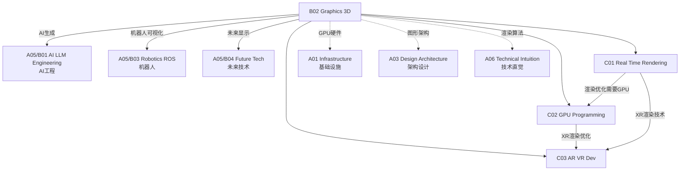

# B02 Graphics & 3D

**所属领域**: [A05_Spec_Expertise](../readme.md)
**创建日期**: 2026-01-30
**最后更新**: 2026-01-30

## 📋 子领域定位

图形学与3D技术是计算机科学的重要分支，涵盖从实时渲染到离线光线追踪、从游戏引擎到CAD系统的广泛应用。随着元宇宙、数字孪生和AI生成内容(AIGC)的兴起，3D图形技术正经历新一轮革新。

本领域涵盖实时渲染技术（PBR、光线追踪、着色器编程）、GPU编程（CUDA、OpenCL、Vulkan Compute）和AR/VR开发（空间计算、手势识别、沉浸式设计）三大方向。工程师需要理解渲染管线、掌握GPU并行编程，并能构建沉浸式3D体验。

**核心关注点**：
- **实时渲染**: 渲染管线、PBR材质、光照模型、后处理效果
- **GPU编程**: CUDA并行计算、着色器优化、计算着色器
- **AR/VR开发**: 空间追踪、渲染优化、交互设计、XR框架

## 🗂️ 专项列表

### [C01. Real-Time_Rendering](C01_Real-Time_Rendering/README.md)

实时渲染是游戏引擎和交互式3D应用的核心技术。本专项详解渲染管线（光栅化vs光线追踪）、PBR物理渲染（微表面模型、IBL、材质工作流）、高级光照技术（全局光照、阴影算法、SSR）和后处理效果（Bloom、SSAO、色调映射）。涵盖主流渲染引擎（Unreal Engine、Unity、Godot）的架构对比。

### [C02. GPU_Programming](C02_GPU_Programming/README.md)

GPU编程释放大规模并行计算能力。本专项深入CUDA编程模型（线程层次、内存层次、流与事件）、OpenCL跨平台开发、Vulkan计算着色器、以及GPU性能优化（内存合并、共享内存、占用率）。涵盖AI训练推理加速、科学计算和实时图形计算。

### [C03. AR_VR_Dev](C03_AR_VR_Dev/README.md)

AR/VR开发构建沉浸式数字体验。本专项详解空间追踪技术（Inside-Out、SLAM、空间锚点）、渲染优化（ASW、ATW、注视点渲染）、交互设计（手势识别、眼动追踪、触觉反馈）和XR框架（OpenXR、ARKit、ARCore）。涵盖Unity/Unreal XR开发和WebXR标准。

## 🛠️ 技术栈概览

### 游戏引擎/渲染器

| 引擎 | 特点 | 适用场景 | 官网 |
|------|------|----------|------|
| **Unreal Engine 5** | 高品质渲染，蓝图可视化 | 3A游戏、影视 | https://www.unrealengine.com |
| **Unity** | 跨平台，生态丰富 | 手游、独立游戏 | https://unity.com |
| **Godot** | 开源轻量，GDScript | 独立游戏、教育 | https://godotengine.org |
| **Three.js** | WebGL封装，易用 | Web 3D、可视化 | https://threejs.org |
| **Babylon.js** | 功能全面，TypeScript | Web游戏、XR | https://www.babylonjs.com |

### GPU计算框架

| 框架 | 平台 | 特点 | 官网 |
|------|------|------|------|
| **CUDA** | NVIDIA | 成熟生态，性能最优 | https://developer.nvidia.com/cuda |
| **OpenCL** | 跨平台 | 开放标准，兼容性好 | https://www.khronos.org/opencl |
| **Vulkan** | 跨平台 | 低开销，现代API | https://www.vulkan.org |
| **Metal** | Apple | 苹果生态优化 | https://developer.apple.com/metal |
| **WebGPU** | Web | 下一代Web图形 | https://www.w3.org/TR/webgpu |

### AR/VR SDK

| SDK | 平台 | 特点 | 官网 |
|------|------|------|------|
| **OpenXR** | 跨平台 | 行业开放标准 | https://www.khronos.org/openxr |
| **ARKit** | iOS | 苹果AR平台 | https://developer.apple.com/arkit |
| **ARCore** | Android | 谷歌AR平台 | https://developers.google.com/ar |
| **SteamVR** | PC VR | Valve VR生态 | https://developer.valvesoftware.com/wiki/SteamVR |
| **Meta XR SDK** | Quest | Meta VR开发 | https://developer.oculus.com |

### 3D内容工具

| 工具 | 用途 | 官网 |
|------|------|------|
| **Blender** | 建模/动画/渲染 | https://www.blender.org |
| **Maya** | 专业影视动画 | https://www.autodesk.com/maya |
| **ZBrush** | 数字雕刻 | https://www.maxon.net/zbrush |
| **Substance** | 材质制作 | https://www.adobe.com/substance |
| **Houdini** | 特效程序化 | https://www.sidefx.com |

## 💼 实践案例索引

### 案例 1: PBR材质工作流

**渲染方程**:
```
L_o(p, ω_o) = L_e(p, ω_o) + ∫_Ω f(p, ω_i, ω_o) L_i(p, ω_i) (n·ω_i) dω_i

其中:
- L_o: 出射光亮度
- L_e: 自发光
- f: BRDF双向反射分布函数
- L_i: 入射光亮度
- n·ω_i: 法线点乘入射方向（几何衰减）
```

**GLSL PBR着色器**:
```glsl
// 微表面模型 Cook-Torrance BRDF
vec3 PBR(vec3 albedo, float metallic, float roughness, 
         vec3 N, vec3 V, vec3 L, vec3 lightColor) {
    vec3 H = normalize(V + L);
    float NdotL = max(dot(N, L), 0.0);
    float NdotV = max(dot(N, V), 0.0);
    float NdotH = max(dot(N, H), 0.0);
    float HdotV = max(dot(H, V), 0.0);
    
    // Fresnel (Schlick近似)
    vec3 F0 = mix(vec3(0.04), albedo, metallic);
    vec3 F = F0 + (1.0 - F0) * pow(1.0 - HdotV, 5.0);
    
    // Normal Distribution (GGX/Trowbridge-Reitz)
    float alpha = roughness * roughness;
    float alpha2 = alpha * alpha;
    float denom = NdotH * NdotH * (alpha2 - 1.0) + 1.0;
    float D = alpha2 / (PI * denom * denom);
    
    // Geometry (Smith + GGX)
    float k = (roughness + 1.0) * (roughness + 1.0) / 8.0;
    float G1_L = NdotL / (NdotL * (1.0 - k) + k);
    float G1_V = NdotV / (NdotV * (1.0 - k) + k);
    float G = G1_L * G1_V;
    
    // Cook-Torrance specular
    vec3 specular = (D * G * F) / (4.0 * NdotV * NdotL + 0.001);
    
    // Diffuse (Lambert, 金属无漫反射)
    vec3 diffuse = albedo * (1.0 - metallic) / PI;
    
    // 环境光IBL
    vec3 ambient = getIBLContribution(N, V, roughness, metallic, albedo);
    
    return (diffuse + specular) * lightColor * NdotL + ambient;
}
```

### 案例 2: CUDA并行计算

**矩阵乘法内核**:
```cuda
#define TILE_SIZE 16

__global__ void matmul_tiled(float* A, float* B, float* C, 
                              int M, int N, int K) {
    // 块内线程索引
    int tx = threadIdx.x;
    int ty = threadIdx.y;
    
    // 全局矩阵索引
    int row = blockIdx.y * TILE_SIZE + ty;
    int col = blockIdx.x * TILE_SIZE + tx;
    
    // 共享内存缓存瓦片
    __shared__ float s_A[TILE_SIZE][TILE_SIZE];
    __shared__ float s_B[TILE_SIZE][TILE_SIZE];
    
    float sum = 0.0f;
    
    // 遍历所有瓦片
    for (int t = 0; t < (K + TILE_SIZE - 1) / TILE_SIZE; t++) {
        // 协作加载瓦片到共享内存
        if (row < M && t * TILE_SIZE + tx < K)
            s_A[ty][tx] = A[row * K + t * TILE_SIZE + tx];
        else
            s_A[ty][tx] = 0.0f;
            
        if (t * TILE_SIZE + ty < K && col < N)
            s_B[ty][tx] = B[(t * TILE_SIZE + ty) * N + col];
        else
            s_B[ty][tx] = 0.0f;
        
        __syncthreads();
        
        // 计算瓦片内积
        for (int k = 0; k < TILE_SIZE; k++)
            sum += s_A[ty][k] * s_B[k][tx];
        
        __syncthreads();
    }
    
    // 写回结果
    if (row < M && col < N)
        C[row * N + col] = sum;
}

// 主机端调用
dim3 blockSize(TILE_SIZE, TILE_SIZE);
dim3 gridSize((N + TILE_SIZE - 1) / TILE_SIZE, 
              (M + TILE_SIZE - 1) / TILE_SIZE);
matmul_tiled<<<gridSize, blockSize>>>(d_A, d_B, d_C, M, N, K);
```

### 案例 3: AR应用架构

**ARKit场景理解**:
```swift
import ARKit
import RealityKit

class ARViewController: UIViewController {
    @IBOutlet var arView: ARView!
    
    override func viewDidLoad() {
        super.viewDidLoad()
        
        // 配置AR会话
        let config = ARWorldTrackingConfiguration()
        config.planeDetection = [.horizontal, .vertical]
        config.sceneReconstruction = .meshWithClassification
        config.environmentTexturing = .automatic
        arView.session.run(config)
        
        // 订阅平面检测
        arView.scene.subscribe(to: SceneEvents.Update.self) { event in
            self.updatePlaneDetection()
        }.store(in: &cancellables)
        
        // 添加手势识别
        let tapGesture = UITapGestureRecognizer(target: self, 
                                                action: #selector(handleTap))
        arView.addGestureRecognizer(tapGesture)
    }
    
    @objc func handleTap(_ gesture: UITapGestureRecognizer) {
        let location = gesture.location(in: arView)
        
        // 射线检测
        let results = arView.raycast(from: location, 
                                      allowing: .estimatedPlane, 
                                      alignment: .any)
        
        if let firstResult = results.first {
            // 放置3D内容
            let anchor = AnchorEntity(world: firstResult.worldTransform)
            let model = createModel()
            anchor.addChild(model)
            arView.scene.addAnchor(anchor)
            
            // 启用物理
            model.generateCollisionShapes(recursive: true)
            arView.installGestures([.translation, .rotation, .scale], 
                                   for: model)
        }
    }
    
    func createModel() -> ModelEntity {
        // 加载USDZ模型
        let model = try! Entity.loadModel(named: "robot")
        
        // 应用PBR材质
        var material = PhysicallyBasedMaterial()
        material.baseColor = .init(tint: .white, texture: nil)
        material.roughness = 0.3
        material.metallic = 0.8
        model.model?.materials = [material]
        
        return model
    }
}
```

## 🔗 知识关联图谱



## 📖 学习资源

### 推荐书籍

| 书名 | 作者 | 说明 |
|------|------|------|
| 《Real-Time Rendering》 | Tomas Akenine-Möller | 实时渲染圣经 |
| 《Physically Based Rendering》 | Pharr et al. | PBR权威 |
| 《CUDA by Example》 | Sanders & Kandrot | CUDA入门 |
| 《Creating Augmented and Virtual Realities》 |  | XR开发 |

### 在线课程

| 课程 | 平台 | 链接 |
|------|------|------|
| CS148 Graphics | Stanford | https://web.stanford.edu/class/cs148 |
| GAMES101 | B站/知乎 | 闫令琪图形学 |
| CUDA Programming | NVIDIA | https://developer.nvidia.com/cuda-zone |
| Unity Learn | Unity | https://learn.unity.com |

### 技术资源

| 资源 | 链接 | 说明 |
|------|------|------|
| GPU Gems | https://developer.nvidia.com/gpugems | GPU编程技巧 |
| SIGGRAPH | https://www.siggraph.org | 图形学顶会 |
| ShaderToy | https://www.shadertoy.com | 着色器分享 |
| Poly Haven | https://polyhaven.com | 免费3D资源 |

### 开源项目

| 项目 | GitHub | 说明 |
|------|--------|------|
| Three.js | https://github.com/mrdoob/three.js | Web3D引擎 |
| filament | https://github.com/google/filament | 移动PBR引擎 |
| magnum | https://github.com/mosra/magnum | C++图形引擎 |
| ncnn | https://github.com/Tencent/ncnn | 移动端推理 |

## 🔄 维护说明

- **内容审查**: 每季度更新引擎版本和GPU技术
- **更新机制**: 跟踪SIGGRAPH、GDC等行业会议
- **质量标准**: 确保渲染技术基于最新硬件能力
- **贡献方式**: 欢迎提交渲染优化案例和XR项目经验
