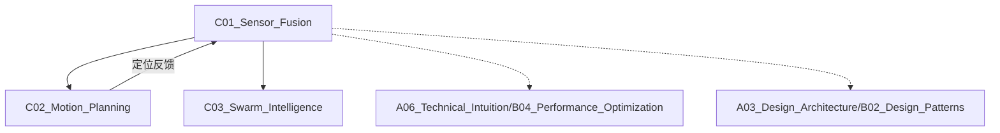

# C01_Sensor_Fusion

**所属子领域**: [B03_Robotics_ROS](../README.md)
**创建日期**: 2026-01-30
**最后更新**: 2026-01-30

## 📋 主题定位

传感器融合（Sensor Fusion）是多传感器数据整合的核心技术，通过算法融合来自不同传感器（IMU、激光雷达、摄像头、GPS等）的信息，以获得比单一传感器更准确、更可靠、更完整的环境感知。它是自动驾驶、机器人导航、无人机飞行控制、增强现实等领域的基石技术。

## 🎯 核心概念

### 基本定义

传感器融合通过数学算法将多源异构传感器数据整合为统一的状态估计，核心目标包括：
- **状态估计**：位置、速度、姿态的精确估计
- **冗余增强**：单一传感器失效时的容错能力
- **互补优势**：结合不同传感器的时间/空间特性
- **噪声抑制**：通过多源数据降低测量不确定性

### 关键特性

**1. 传感器类型**
- **惯性测量单元（IMU）**：加速度计、陀螺仪、磁力计
  - 高频（100-1000Hz）、短时精确、长期漂移
- **全球导航卫星系统（GNSS）**：GPS、北斗、GLONASS、Galileo
  - 绝对位置、低频（1-10Hz）、信号遮挡敏感
- **激光雷达（LiDAR）**：3D点云、距离测量
  - 高精度测距、主动光源、受天气影响
- **摄像头**：视觉特征、语义信息
  - 丰富信息、受光照影响、计算密集
- **轮速计/编码器**：相对位移测量
  - 高频率、累积误差、滑移敏感

**2. 融合架构**
- **松耦合（Loosely Coupled）**：各传感器独立解算后融合
- **紧耦合（Tightly Coupled）**：原始测量数据级融合
- **深耦合（Deeply Coupled）**：信号级融合（GNSS接收机内部）

**3. 估计理论**
- **卡尔曼滤波（KF/EKF/UKF）**：线性/非线性状态估计
- **粒子滤波（PF）**：非线性非高斯系统
- **图优化（Graph Optimization）**：大规模SLAM后端
- **深度学习融合**：端到端融合网络

**4. 时间同步**
- **硬件同步**：PPS、PTP协议
- **软件同步**：插值、外推、时间戳对齐
- **异步融合**：无序测量处理

### 应用场景
- **自动驾驶**：高精度定位、多目标跟踪
- **机器人导航**：SLAM、路径规划、避障
- **无人机飞控**：姿态稳定、位置保持、自主降落
- **可穿戴设备**：行人导航、运动追踪
- **工业自动化**：AGV导航、机械臂定位

## 🛠️ 技术实践

### 实现方法

**1. ROS2 IMU与GPS融合（扩展卡尔曼滤波）**

```python
#!/usr/bin/env python3
# robot_localization_ekf.py
import rclpy
from rclpy.node import Node
from rclpy.qos import QoSProfile, ReliabilityPolicy, HistoryPolicy
from sensor_msgs.msg import Imu, NavSatFix
from nav_msgs.msg import Odometry
from geometry_msgs.msg import PoseWithCovarianceStamped, TwistWithCovarianceStamped
import numpy as np
from scipy.spatial.transform import Rotation as R
from filterpy.kalman import ExtendedKalmanFilter
from filterpy.common import Q_discrete_white_noise

class RobotLocalizationEKF(Node):
    """
    扩展卡尔曼滤波器实现IMU和GPS融合定位
    状态向量: [x, y, z, roll, pitch, yaw, vx, vy, vz, wx, wy, wz]
    """
    
    def __init__(self):
        super().__init__('robot_localization_ekf')
        
        # EKF参数
        self.state_dim = 12  # 状态维度
        self.measure_dim = 6  # 测量维度
        
        # 初始化EKF
        self.ekf = ExtendedKalmanFilter(dim_x=self.state_dim, dim_z=self.measure_dim)
        
        # 状态向量初始化
        self.ekf.x = np.zeros(self.state_dim)
        
        # 状态协方差矩阵
        self.ekf.P = np.eye(self.state_dim) * 1.0
        self.ekf.P[6:9, 6:9] *= 0.1  # 速度初始不确定度较低
        
        # 过程噪声协方差
        self.ekf.Q = np.eye(self.state_dim)
        self.ekf.Q[0:3, 0:3] *= 0.01  # 位置噪声
        self.ekf.Q[3:6, 3:6] *= 0.001  # 姿态噪声
        self.ekf.Q[6:9, 6:9] *= 0.1   # 速度噪声
        self.ekf.Q[9:12, 9:12] *= 0.01  # 角速度噪声
        
        # 传感器参数
        self.imu_dt = 0.01  # IMU频率100Hz
        self.gps_dt = 0.1   # GPS频率10Hz
        
        # GPS原点（用于ENU坐标转换）
        self.gps_origin = None
        self.origin_lat = None
        self.origin_lon = None
        self.origin_alt = None
        
        # 地球参数
        self.earth_radius = 6371000.0  # 米
        
        # 最新的IMU数据
        self.latest_imu = None
        self.latest_imu_time = None
        
        # QoS配置
        qos_profile = QoSProfile(
            reliability=ReliabilityPolicy.BEST_EFFORT,
            history=HistoryPolicy.KEEP_LAST,
            depth=10
        )
        
        # 订阅者
        self.imu_sub = self.create_subscription(
            Imu,
            '/imu/data',
            self.imu_callback,
            qos_profile
        )
        
        self.gps_sub = self.create_subscription(
            NavSatFix,
            '/gps/fix',
            self.gps_callback,
            qos_profile
        )
        
        # 发布者
        self.odom_pub = self.create_publisher(Odometry, '/odometry/ekf', 10)
        self.pose_pub = self.create_publisher(PoseWithCovarianceStamped, '/pose/ekf', 10)
        
        # 定时器（100Hz预测更新）
        self.timer = self.create_timer(self.imu_dt, self.predict_step)
        
        self.get_logger().info('Robot Localization EKF initialized')
    
    def imu_callback(self, msg: Imu):
        """IMU数据回调"""
        self.latest_imu = msg
        self.latest_imu_time = self.get_clock().now()
    
    def gps_callback(self, msg: NavSatFix):
        """GPS数据回调，执行更新步骤"""
        if self.gps_origin is None:
            # 设置GPS原点
            self.set_gps_origin(msg.latitude, msg.longitude, msg.altitude)
            return
        
        # 转换为ENU坐标
        x, y, z = self.gps_to_enu(msg.latitude, msg.longitude, msg.altitude)
        
        # 构建测量向量 [x, y, z, roll, pitch, yaw]
        z_meas = np.array([x, y, z, 0.0, 0.0, 0.0])
        
        # 测量噪声协方差（根据GPS精度调整）
        R = np.eye(self.measure_dim)
        R[0, 0] = msg.position_covariance[0]  # x方差
        R[1, 1] = msg.position_covariance[4]  # y方差
        R[2, 2] = msg.position_covariance[8]  # z方差
        R[3, 3] = 0.1  # roll方差（GPS不提供，设较大值）
        R[4, 4] = 0.1  # pitch方差
        R[5, 5] = 0.1  # yaw方差
        
        # EKF更新
        self.ekf.update(z_meas, HJacobian=self.measurement_jacobian, 
                       Hx=self.measurement_function, R=R)
        
        self.publish_state(msg.header.stamp)
    
    def predict_step(self):
        """预测步骤（IMU积分）"""
        if self.latest_imu is None:
            return
        
        # 提取IMU数据
        ax = self.latest_imu.linear_acceleration.x
        ay = self.latest_imu.linear_acceleration.y
        az = self.latest_imu.linear_acceleration.z
        
        wx = self.latest_imu.angular_velocity.x
        wy = self.latest_imu.angular_velocity.y
        wz = self.latest_imu.angular_velocity.z
        
        # 状态转移函数（非线性）
        def state_transition(x, dt):
            """状态转移：x_{k+1} = f(x_k, u_k)"""
            x_new = x.copy()
            
            # 提取状态
            pos = x[0:3]      # 位置
            rpy = x[3:6]      # 姿态
            vel = x[6:9]      # 速度
            omega = x[9:12]   # 角速度
            
            # 从欧拉角构建旋转矩阵
            roll, pitch, yaw = rpy
            cr, sr = np.cos(roll), np.sin(roll)
            cp, sp = np.cos(pitch), np.sin(pitch)
            cy, sy = np.cos(yaw), np.sin(yaw)
            
            # 旋转矩阵（从body frame到world frame）
            R_wb = np.array([
                [cy*cp, cy*sp*sr - sy*cr, cy*sp*cr + sy*sr],
                [sy*cp, sy*sp*sr + cy*cr, sy*sp*cr - cy*sr],
                [-sp,   cp*sr,            cp*cr]
            ])
            
            # 位置更新: p = p + v * dt + 0.5 * a * dt^2
            acc_world = R_wb @ np.array([ax, ay, az]) - np.array([0, 0, 9.81])
            x_new[0:3] = pos + vel * dt + 0.5 * acc_world * dt**2
            
            # 姿态更新（欧拉角积分，简化版）
            # 注意：实际应用中应使用四元数避免万向锁
            x_new[3] = roll + wx * dt
            x_new[4] = pitch + wy * dt
            x_new[5] = yaw + wz * dt
            
            # 速度更新: v = v + a * dt
            x_new[6:9] = vel + acc_world * dt
            
            # 角速度直接采用测量值（或低通滤波）
            x_new[9:12] = np.array([wx, wy, wz])
            
            return x_new
        
        # 状态转移雅可比矩阵
        def state_jacobian(x, dt):
            """计算状态转移矩阵 F = df/dx"""
            F = np.eye(self.state_dim)
            
            # 位置对速度的偏导
            F[0, 6] = dt
            F[1, 7] = dt
            F[2, 8] = dt
            
            # 姿态对角速度的偏导
            F[3, 9] = dt
            F[4, 10] = dt
            F[5, 11] = dt
            
            return F
        
        # 执行预测
        self.ekf.predict(dt=self.imu_dt, 
                        fx=state_transition, 
                        F=state_jacobian)
    
    def measurement_function(self, x):
        """测量函数 h(x)"""
        # 测量：位置 + 姿态（GPS主要提供位置）
        return np.array([x[0], x[1], x[2], x[3], x[4], x[5]])
    
    def measurement_jacobian(self, x):
        """测量雅可比矩阵 H = dh/dx"""
        H = np.zeros((self.measure_dim, self.state_dim))
        H[0, 0] = 1  # x测量对应x状态
        H[1, 1] = 1  # y测量对应y状态
        H[2, 2] = 1  # z测量对应z状态
        H[3, 3] = 1  # roll测量
        H[4, 4] = 1  # pitch测量
        H[5, 5] = 1  # yaw测量
        return H
    
    def set_gps_origin(self, lat, lon, alt):
        """设置GPS坐标系原点"""
        self.origin_lat = np.radians(lat)
        self.origin_lon = np.radians(lon)
        self.origin_alt = alt
        self.gps_origin = True
        self.get_logger().info(f'GPS origin set: lat={lat}, lon={lon}, alt={alt}')
    
    def gps_to_enu(self, lat, lon, alt):
        """将GPS坐标转换为ENU（东北天）坐标"""
        lat_rad = np.radians(lat)
        lon_rad = np.radians(lon)
        
        # 使用简化投影（适合小范围）
        dlat = lat_rad - self.origin_lat
        dlon = lon_rad - self.origin_lon
        
        x = self.earth_radius * np.cos(self.origin_lat) * dlon
        y = self.earth_radius * dlat
        z = alt - self.origin_alt
        
        return x, y, z
    
    def publish_state(self, timestamp):
        """发布估计状态"""
        # Odometry消息
        odom_msg = Odometry()
        odom_msg.header.stamp = timestamp
        odom_msg.header.frame_id = 'odom'
        odom_msg.child_frame_id = 'base_link'
        
        # 位置
        odom_msg.pose.pose.position.x = self.ekf.x[0]
        odom_msg.pose.pose.position.y = self.ekf.x[1]
        odom_msg.pose.pose.position.z = self.ekf.x[2]
        
        # 姿态（欧拉角转四元数）
        roll, pitch, yaw = self.ekf.x[3:6]
        quat = R.from_euler('xyz', [roll, pitch, yaw]).as_quat()
        odom_msg.pose.pose.orientation.x = quat[0]
        odom_msg.pose.pose.orientation.y = quat[1]
        odom_msg.pose.pose.orientation.z = quat[2]
        odom_msg.pose.pose.orientation.w = quat[3]
        
        # 协方差
        pose_cov = np.zeros(36)
        pose_cov[0] = self.ekf.P[0, 0]
        pose_cov[7] = self.ekf.P[1, 1]
        pose_cov[14] = self.ekf.P[2, 2]
        odom_msg.pose.covariance = pose_cov.tolist()
        
        # 速度
        odom_msg.twist.twist.linear.x = self.ekf.x[6]
        odom_msg.twist.twist.linear.y = self.ekf.x[7]
        odom_msg.twist.twist.linear.z = self.ekf.x[8]
        
        self.odom_pub.publish(odom_msg)
        
        # Pose消息
        pose_msg = PoseWithCovarianceStamped()
        pose_msg.header = odom_msg.header
        pose_msg.pose = odom_msg.pose
        self.pose_pub.publish(pose_msg)

def main(args=None):
    rclpy.init(args=args)
    node = RobotLocalizationEKF()
    rclpy.spin(node)
    node.destroy_node()
    rclpy.shutdown()

if __name__ == '__main__':
    main()
```

**2. LiDAR-IMU融合（LiDAR Odometry）**

```cpp
// lidar_imu_fusion.cpp - 激光雷达IMU融合里程计
#include <ros/ros.h>
#include <sensor_msgs/PointCloud2.h>
#include <sensor_msgs/Imu.h>
#include <nav_msgs/Odometry.h>
#include <pcl/point_types.h>
#include <pcl/point_cloud.h>
#include <pcl_conversions/pcl_conversions.h>
#include <pcl/registration/icp.h>
#include <pcl/filters/voxel_grid.h>
#include <Eigen/Dense>
#include <deque>
#include <mutex>

class LidarIMUFusion {
public:
    struct IMUData {
        double timestamp;
        Eigen::Vector3d acc;
        Eigen::Vector3d gyro;
    };
    
    struct State {
        double timestamp;
        Eigen::Vector3d position;
        Eigen::Quaterniond orientation;
        Eigen::Vector3d velocity;
        Eigen::Vector3d ba;  // 加速度偏置
        Eigen::Vector3d bg;  // 陀螺仪偏置
    };

    LidarIMUFusion(ros::NodeHandle& nh) : nh_(nh) {
        // 参数初始化
        nh_.param<double>("imu_acc_noise", imu_acc_noise_, 0.1);
        nh_.param<double>("imu_gyro_noise", imu_gyro_noise_, 0.01);
        nh_.param<double>("imu_acc_bias_noise", imu_acc_bias_noise_, 0.001);
        nh_.param<double>("imu_gyro_bias_noise", imu_gyro_bias_noise_, 0.0001);
        
        // 状态初始化
        current_state_.position = Eigen::Vector3d::Zero();
        current_state_.orientation = Eigen::Quaterniond::Identity();
        current_state_.velocity = Eigen::Vector3d::Zero();
        current_state_.ba = Eigen::Vector3d::Zero();
        current_state_.bg = Eigen::Vector3d::Zero();
        
        // 协方差初始化
        P_ = Eigen::Matrix<double, 15, 15>::Identity() * 0.1;
        
        // 订阅和发布
        imu_sub_ = nh_.subscribe("/imu/data", 1000, &LidarIMUFusion::imuCallback, this);
        lidar_sub_ = nh_.subscribe("/velodyne_points", 10, &LidarIMUFusion::lidarCallback, this);
        odom_pub_ = nh_.advertise<nav_msgs::Odometry>("/lidar_imu_odom", 10);
        
        // 初始化点云滤波器
        voxel_filter_.setLeafSize(0.1, 0.1, 0.1);
        
        is_first_scan_ = true;
    }

    void imuCallback(const sensor_msgs::Imu::ConstPtr& msg) {
        std::lock_guard<std::mutex> lock(imu_mutex_);
        
        IMUData imu_data;
        imu_data.timestamp = msg->header.stamp.toSec();
        imu_data.acc = Eigen::Vector3d(msg->linear_acceleration.x,
                                       msg->linear_acceleration.y,
                                       msg->linear_acceleration.z);
        imu_data.gyro = Eigen::Vector3d(msg->angular_velocity.x,
                                        msg->angular_velocity.y,
                                        msg->angular_velocity.z);
        
        imu_buffer_.push_back(imu_data);
        
        // 限制缓冲区大小
        if (imu_buffer_.size() > 1000) {
            imu_buffer_.pop_front();
        }
        
        // IMU预测（高频）
        if (imu_buffer_.size() > 1) {
            predictWithIMU(imu_buffer_[imu_buffer_.size()-2], imu_data);
        }
    }

    void lidarCallback(const sensor_msgs::PointCloud2::ConstPtr& msg) {
        double scan_time = msg->header.stamp.toSec();
        
        // 转换点云
        pcl::PointCloud<pcl::PointXYZI>::Ptr current_cloud(new pcl::PointCloud<pcl::PointXYZI>());
        pcl::fromROSMsg(*msg, *current_cloud);
        
        // 体素滤波降采样
        pcl::PointCloud<pcl::PointXYZI>::Ptr filtered_cloud(new pcl::PointCloud<pcl::PointXYZI>());
        voxel_filter_.setInputCloud(current_cloud);
        voxel_filter_.filter(*filtered_cloud);
        
        if (is_first_scan_) {
            // 第一帧作为参考
            prev_cloud_ = filtered_cloud;
            last_lidar_time_ = scan_time;
            is_first_scan_ = false;
            return;
        }
        
        // LiDAR运动畸变去除（使用IMU积分）
        auto deskewed_cloud = deskewPointCloud(filtered_cloud, scan_time);
        
        // ICP配准
        Eigen::Matrix4f initial_guess = Eigen::Matrix4f::Identity();
        // 使用IMU预测作为初始值
        initial_guess.block<3, 3>(0, 0) = current_state_.orientation.toRotationMatrix().cast<float>();
        initial_guess.block<3, 1>(0, 3) = current_state_.position.cast<float>();
        
        pcl::IterativeClosestPoint<pcl::PointXYZI, pcl::PointXYZI> icp;
        icp.setInputSource(deskewed_cloud);
        icp.setInputTarget(prev_cloud_);
        icp.setMaxCorrespondenceDistance(1.0);
        icp.setMaximumIterations(50);
        icp.setTransformationEpsilon(1e-6);
        
        pcl::PointCloud<pcl::PointXYZI> aligned_cloud;
        icp.align(aligned_cloud, initial_guess);
        
        if (icp.hasConverged() && icp.getFitnessScore() < 0.5) {
            Eigen::Matrix4f T = icp.getFinalTransformation();
            
            // 提取位姿
            Eigen::Matrix3f R = T.block<3, 3>(0, 0);
            Eigen::Vector3f t = T.block<3, 1>(0, 3);
            
            // 状态更新（EKF更新）
            updateWithLiDAR(R.cast<double>(), t.cast<double>(), scan_time);
            
            // 发布里程计
            publishOdometry(msg->header.stamp);
        }
        
        // 更新参考点云
        prev_cloud_ = deskewed_cloud;
        last_lidar_time_ = scan_time;
    }

    pcl::PointCloud<pcl::PointXYZI>::Ptr deskewPointCloud(
        pcl::PointCloud<pcl::PointXYZI>::Ptr cloud, double timestamp) {
        
        std::lock_guard<std::mutex> lock(imu_mutex_);
        
        // 获取该帧时间范围内的IMU数据
        std::vector<IMUData> frame_imu_data;
        for (const auto& imu : imu_buffer_) {
            if (imu.timestamp >= last_lidar_time_ && imu.timestamp <= timestamp) {
                frame_imu_data.push_back(imu);
            }
        }
        
        if (frame_imu_data.size() < 2) {
            return cloud;  // 数据不足，不做畸变去除
        }
        
        // 对点云中每个点进行畸变去除
        pcl::PointCloud<pcl::PointXYZI>::Ptr deskewed(new pcl::PointCloud<pcl::PointXYZI>());
        deskewed->reserve(cloud->size());
        
        double dt_total = timestamp - last_lidar_time_;
        
        for (const auto& pt : cloud->points) {
            // 计算该点的相对时间（假设点云按时间均匀分布）
            double pt_time = pt.intensity / 100.0 * dt_total + last_lidar_time_;
            
            // 插值获取该时刻的姿态
            Eigen::Quaterniond q_interp = interpolateRotation(frame_imu_data, pt_time);
            Eigen::Vector3d t_interp = interpolateTranslation(frame_imu_data, pt_time);
            
            // 变换点坐标
            Eigen::Vector3d pt_vec(pt.x, pt.y, pt.z);
            Eigen::Vector3d deskewed_pt = q_interp * pt_vec + t_interp;
            
            pcl::PointXYZI new_pt = pt;
            new_pt.x = deskewed_pt.x();
            new_pt.y = deskewed_pt.y();
            new_pt.z = deskewed_pt.z();
            deskewed->push_back(new_pt);
        }
        
        return deskewed;
    }

    void predictWithIMU(const IMUData& prev_imu, const IMUData& curr_imu) {
        double dt = curr_imu.timestamp - prev_imu.timestamp;
        if (dt <= 0) return;
        
        // 去除偏置
        Eigen::Vector3d acc = curr_imu.acc - current_state_.ba;
        Eigen::Vector3d gyro = curr_imu.gyro - current_state_.bg;
        
        // 姿态更新（四元数积分）
        Eigen::Quaterniond dq(1, 0.5 * gyro.x() * dt, 0.5 * gyro.y() * dt, 0.5 * gyro.z() * dt);
        current_state_.orientation = (current_state_.orientation * dq).normalized();
        
        // 速度更新
        Eigen::Vector3d acc_world = current_state_.orientation * acc;
        acc_world[2] -= 9.81;  // 去除重力
        current_state_.velocity += acc_world * dt;
        
        // 位置更新
        current_state_.position += current_state_.velocity * dt + 0.5 * acc_world * dt * dt;
        
        // 协方差预测（省略详细F矩阵计算）
        // ...
    }

    void updateWithLiDAR(const Eigen::Matrix3d& R_measured, 
                        const Eigen::Vector3d& t_measured,
                        double timestamp) {
        
        // 计算测量残差
        Eigen::Quaterniond q_measured(R_measured);
        Eigen::Quaterniond q_error = current_state_.orientation.inverse() * q_measured;
        
        Eigen::Vector3d t_error = t_measured - current_state_.position;
        
        // EKF更新（简化）
        // H矩阵、卡尔曼增益计算...
        // 状态更新...
        
        current_state_.timestamp = timestamp;
    }

    void publishOdometry(const ros::Time& stamp) {
        nav_msgs::Odometry odom_msg;
        odom_msg.header.stamp = stamp;
        odom_msg.header.frame_id = "odom";
        odom_msg.child_frame_id = "base_link";
        
        odom_msg.pose.pose.position.x = current_state_.position.x();
        odom_msg.pose.pose.position.y = current_state_.position.y();
        odom_msg.pose.pose.position.z = current_state_.position.z();
        
        odom_msg.pose.pose.orientation.x = current_state_.orientation.x();
        odom_msg.pose.pose.orientation.y = current_state_.orientation.y();
        odom_msg.pose.pose.orientation.z = current_state_.orientation.z();
        odom_msg.pose.pose.orientation.w = current_state_.orientation.w();
        
        odom_msg.twist.twist.linear.x = current_state_.velocity.x();
        odom_msg.twist.twist.linear.y = current_state_.velocity.y();
        odom_msg.twist.twist.linear.z = current_state_.velocity.z();
        
        odom_pub_.publish(odom_msg);
    }

private:
    ros::NodeHandle nh_;
    ros::Subscriber imu_sub_;
    ros::Subscriber lidar_sub_;
    ros::Publisher odom_pub_;
    
    std::deque<IMUData> imu_buffer_;
    std::mutex imu_mutex_;
    
    pcl::PointCloud<pcl::PointXYZI>::Ptr prev_cloud_;
    pcl::VoxelGrid<pcl::PointXYZI> voxel_filter_;
    
    State current_state_;
    Eigen::Matrix<double, 15, 15> P_;
    
    double last_lidar_time_;
    bool is_first_scan_;
    
    // 噪声参数
    double imu_acc_noise_;
    double imu_gyro_noise_;
    double imu_acc_bias_noise_;
    double imu_gyro_bias_noise_;
};

int main(int argc, char** argv) {
    ros::init(argc, argv, "lidar_imu_fusion");
    ros::NodeHandle nh("~");
    
    LidarIMUFusion fusion(nh);
    
    ros::spin();
    
    return 0;
}
```

**3. 多传感器时间同步**

```python
#!/usr/bin/env python3
# sensor_sync.py
import rclpy
from rclpy.node import Node
from rclpy.time import Time
from message_filters import Subscriber, ApproximateTimeSynchronizer
from sensor_msgs.msg import Image, PointCloud2, Imu
import numpy as np

class SensorSynchronizer(Node):
    """
    多传感器时间同步器
    使用近似时间同步策略
    """
    
    def __init__(self):
        super().__init__('sensor_synchronizer')
        
        # 参数
        self.declare_parameter('slop', 0.05)  # 时间容差50ms
        self.declare_parameter('queue_size', 10)
        
        slop = self.get_parameter('slop').value
        queue_size = self.get_parameter('queue_size').value
        
        # 订阅者
        self.image_sub = Subscriber(self, Image, '/camera/image_raw')
        self.lidar_sub = Subscriber(self, PointCloud2, '/velodyne_points')
        self.imu_sub = Subscriber(self, Imu, '/imu/data')
        
        # 时间同步器
        self.sync = ApproximateTimeSynchronizer(
            [self.image_sub, self.lidar_sub, self.imu_sub],
            queue_size=queue_size,
            slop=slop
        )
        self.sync.registerCallback(self.synced_callback)
        
        # 发布同步后的数据
        self.synced_image_pub = self.create_publisher(Image, '/synced/camera/image', 10)
        self.synced_lidar_pub = self.create_publisher(PointCloud2, '/synced/lidar/points', 10)
        self.synced_imu_pub = self.create_publisher(Imu, '/synced/imu/data', 10)
        
        self.get_logger().info('Sensor synchronizer initialized')
    
    def synced_callback(self, image_msg, lidar_msg, imu_msg):
        """同步数据回调"""
        # 使用最早的时间戳作为同步时间
        sync_time = min(
            self.get_timestamp(image_msg),
            self.get_timestamp(lidar_msg),
            self.get_timestamp(imu_msg)
        )
        
        # 更新时间戳
        image_msg.header.stamp = sync_time.to_msg()
        lidar_msg.header.stamp = sync_time.to_msg()
        imu_msg.header.stamp = sync_time.to_msg()
        
        # 发布同步数据
        self.synced_image_pub.publish(image_msg)
        self.synced_lidar_pub.publish(lidar_msg)
        self.synced_imu_pub.publish(imu_msg)
        
        self.get_logger().debug(f'Published synced data at {sync_time.nanoseconds}')
    
    def get_timestamp(self, msg):
        """获取消息时间戳"""
        return Time.from_msg(msg.header.stamp)

class SoftwareSyncInterpolator(Node):
    """
    软件时间同步：使用插值对齐不同频率传感器
    """
    
    def __init__(self):
        super().__init__('software_sync_interpolator')
        
        # 缓冲队列
        self.imu_buffer = []
        self.gps_buffer = []
        
        self.imu_sub = self.create_subscription(Imu, '/imu/data', self.imu_callback, 100)
        self.gps_sub = self.create_subscription(NavSatFix, '/gps/fix', self.gps_callback, 10)
        
        self.synced_pub = self.create_publisher(Odometry, '/synced_odom', 10)
        
        # 定时器（与低频传感器同步）
        self.timer = self.create_timer(0.1, self.process_synced_data)  # 10Hz
    
    def imu_callback(self, msg):
        """高频IMU数据入队"""
        self.imu_buffer.append(msg)
        
        # 限制队列大小
        if len(self.imu_buffer) > 100:
            self.imu_buffer.pop(0)
    
    def gps_callback(self, msg):
        """GPS数据入队"""
        self.gps_buffer.append(msg)
        
        if len(self.gps_buffer) > 10:
            self.gps_buffer.pop(0)
    
    def interpolate_imu(self, target_time):
        """在目标时间点插值IMU数据"""
        if len(self.imu_buffer) < 2:
            return None
        
        # 找到相邻的IMU数据
        for i in range(len(self.imu_buffer) - 1):
            t1 = self.get_timestamp(self.imu_buffer[i])
            t2 = self.get_timestamp(self.imu_buffer[i + 1])
            
            if t1 <= target_time <= t2:
                # 线性插值
                dt = (t2 - t1).nanoseconds
                dt_target = (target_time - t1).nanoseconds
                alpha = dt_target / dt if dt > 0 else 0
                
                # 插值加速度和角速度
                imu1 = self.imu_buffer[i]
                imu2 = self.imu_buffer[i + 1]
                
                interp_imu = Imu()
                interp_imu.header.stamp = target_time.to_msg()
                interp_imu.linear_acceleration.x = self.lerp(
                    imu1.linear_acceleration.x, imu2.linear_acceleration.x, alpha)
                interp_imu.linear_acceleration.y = self.lerp(
                    imu1.linear_acceleration.y, imu2.linear_acceleration.y, alpha)
                interp_imu.linear_acceleration.z = self.lerp(
                    imu1.linear_acceleration.z, imu2.linear_acceleration.z, alpha)
                interp_imu.angular_velocity.x = self.lerp(
                    imu1.angular_velocity.x, imu2.angular_velocity.x, alpha)
                interp_imu.angular_velocity.y = self.lerp(
                    imu1.angular_velocity.y, imu2.angular_velocity.y, alpha)
                interp_imu.angular_velocity.z = self.lerp(
                    imu1.angular_velocity.z, imu2.angular_velocity.z, alpha)
                
                return interp_imu
        
        return None
    
    def lerp(self, a, b, t):
        """线性插值"""
        return a + (b - a) * t

def main(args=None):
    rclpy.init(args=args)
    node = SensorSynchronizer()
    rclpy.spin(node)
    node.destroy_node()
    rclpy.shutdown()

if __name__ == '__main__':
    main()
```

### 最佳实践

**1. 传感器选型**
- IMU：高带宽、低噪声、温度稳定性
- GNSS：RTK/PPK厘米级精度
- LiDAR：视场角、分辨率、帧率平衡
- 相机：全局快门、高动态范围

**2. 标定校准**
- 外参标定：传感器间空间关系
- 内参标定：相机畸变、IMU偏置
- 时间标定：传感器间时间偏移

**3. 协方差调优**
- 基于传感器数据手册
- 实际环境测试迭代
- 自适应噪声估计

**4. 故障检测**
- 传感器异常值检测
- 协方差监控
- 多传感器一致性检查

### 常见陷阱

**1. 时间不同步**
- ❌ 问题：传感器数据时间戳不一致
- ✅ 解决：硬件同步或软件插值

**2. 外参不准**
- ❌ 问题：传感器安装位置偏差
- ✅ 解决：精确标定、在线校准

**3. 运动学建模错误**
- ❌ 问题：忽略车辆滑移、IMU安装偏移
- ✅ 解决：完整运动学模型

**4. 协方差过大/过小**
- ❌ 问题：滤波器发散或过于保守
- ✅ 解决：仔细调参、自适应估计

## 📚 资源索引

### 学术论文

1. **A Multi-State Constraint Kalman Filter for Vision-aided Inertial Navigation** (2007)
   - 作者：Anastasios Mourikis et al.
   - MSCKF视觉惯性里程计奠基

2. **LOAM: Lidar Odometry and Mapping in Real-time** (2014)
   - 作者：Ji Zhang, Sanjiv Singh
   - 激光雷达里程计经典算法

3. **VINS-Mono: A Robust and Versatile Monocular Visual-Inertial State Estimator** (2018)
   - 作者：Tong Qin et al.
   - 单目视觉惯性融合

4. **LIO-SAM: Tightly-coupled Lidar Inertial Odometry via Smoothing and Mapping** (2020)
   - 作者：Tixiao Shan et al.
   - 紧耦合激光惯性融合

5. **ORB-SLAM3: An Accurate Open-Source Library for Visual, Visual-Inertial and Multi-Map SLAM** (2021)
   - 作者：Carlos Campos et al.
   - 多地图视觉SLAM

### 技术文档

1. **Kalman and Bayesian Filters in Python**
   - https://github.com/rlabbe/Kalman-and-Bayesian-Filters-in-Python
   - 卡尔曼滤波完整教程

2. **ROS robot_localization**
   - http://docs.ros.org/en/noetic/api/robot_localization/html/
   - ROS官方多传感器融合包

3. **RTKLIB Manual**
   - http://www.rtklib.com/
   - GNSS处理库文档

### 开源项目

1. **LIO-SAM** - https://github.com/TixiaoShan/LIO-SAM
   - 激光雷达惯性融合SLAM

2. **VINS-Fusion** - https://github.com/HKUST-Aerial-Robotics/VINS-Fusion
   - 视觉惯性融合定位

3. **OpenVINS** - https://github.com/rpng/open_vins
   - 开源视觉惯性导航

4. **Kalibr** - https://github.com/ethz-asl/kalibr
   - 多传感器标定工具箱

5. **rtklib_ros** - https://github.com/MapIV/rtklib_ros
   - RTK-GPS ROS接口

## 🔗 关联知识



## 💡 学习建议

### 前置知识
- 线性代数、概率论
- 状态估计理论
- ROS/ROS2基础
- C++/Python编程

### 学习路径

**第1-2周：理论基础**
- 卡尔曼滤波推导
- 传感器模型学习
- 实践：简单KF实现

**第3-4周：ROS实现**
- robot_localization使用
- IMU/GPS融合
- 实践：移动机器人定位

**第5-6周：视觉融合**
- VINS-Mono部署
- 相机标定
- 实践：视觉里程计

**第7-8周：激光融合**
- LOAM/LIO-SAM
- 点云处理
- 实践：3D SLAM

### 实践项目

**项目1：自动驾驶定位**
- 传感器：IMU + GNSS RTK + 轮速计
- 算法：EKF融合
- 输出：厘米级定位

**项目2：无人机定位**
- 传感器：IMU + GPS + 气压计
- 算法：UKF/互补滤波
- 输出：稳定飞行控制

**项目3：手持SLAM设备**
- 传感器：双目相机 + IMU
- 算法：VINS-Fusion
- 输出：实时3D重建

## 🔄 维护说明

- **更新频率**: 每半年更新，跟踪新算法
- **质量标准**: 所有代码在ROS2 Humble测试
- **贡献方式**: 提交新融合算法、标定工具
