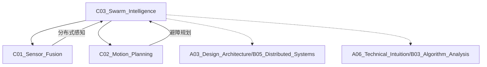

# C03_Swarm_Intelligence

**所属子领域**: [B03_Robotics_ROS](../README.md)
**创建日期**: 2026-01-30
**最后更新**: 2026-01-30

## 📋 主题定位

群体智能（Swarm Intelligence）研究去中心化、自组织的集体行为系统，通过简单个体间的局部交互涌现出复杂的群体行为。它是自然界群体行为（蚁群、鸟群、鱼群）的工程学应用，在无人机集群、机器人协作、分布式优化、边缘计算等领域展现出巨大潜力，是未来大规模自主系统的核心技术。

## 🎯 核心概念

### 基本定义

群体智能系统由大量简单个体组成，遵循以下核心原则：
- **去中心化**：无全局控制器，决策分布在各个体
- **局部交互**：仅与邻居通信，无全局信息
- **自组织**：从无序到有序的自发涌现
- **可扩展性**：系统性能随规模增长而提升
- **容错性**：个体失效不影响整体功能

### 关键特性

**1. 群体行为模型**
- **Boids模型**：分离（Separation）、对齐（Alignment）、聚合（Cohesion）
- **Vicsek模型**：角度一致性导致集体运动
- **社会力模型**：个体间吸引/排斥力
- **基于共识的控制**：分布式一致性算法

**2. 通信拓扑**
- **固定拓扑**：预定义的邻居关系
- **动态拓扑**：基于距离的邻居选择
- **切换拓扑**：通信链路时断时续
- **有向图**：非对称通信关系

**3. 一致性协议**
- **平均一致性**：最终达到状态平均值
- **领导者-跟随者**：部分个体引导群体
- **包容控制**：多领导者场景
- **牵制控制**：选择性控制关键节点

**4. 任务分配**
- **市场机制**：拍卖、合同网协议
- **响应阈值**：基于任务刺激的自分配
- **虚拟力**：吸引/排斥引导分工
- **图匹配**：最优分配求解

### 应用场景
- **无人机集群**：协同侦察、编队飞行、群体表演
- **仓储物流**：AGV协同搬运、智能调度
- **环境监测**：分布式传感、污染源追踪
- **搜索救援**：区域覆盖、目标定位
- **卫星星座**：分布式空间系统
- **边缘计算**：负载均衡、任务卸载

## 🛠️ 技术实践

### 实现方法

**1. ROS2多机器人分布式编队**

```python
#!/usr/bin/env python3
# swarm_formation_control.py
import rclpy
from rclpy.node import Node
from geometry_msgs.msg import Twist, PoseStamped, Pose
from nav_msgs.msg import Odometry
import numpy as np
from typing import List, Dict
import math

class FormationController(Node):
    """
    分布式编队控制器
    实现领导者-跟随者编队结构
    """
    
    def __init__(self):
        super().__init__('formation_controller')
        
        # 参数声明
        self.declare_parameter('robot_id', 0)
        self.declare_parameter('total_robots', 3)
        self.declare_parameter('is_leader', False)
        self.declare_parameter('formation_type', 'triangle')  # line, triangle, diamond
        self.declare_parameter('formation_scale', 2.0)
        
        self.robot_id = self.get_parameter('robot_id').value
        self.total_robots = self.get_parameter('total_robots').value
        self.is_leader = self.get_parameter('is_leader').value
        self.formation_type = self.get_parameter('formation_type').value
        self.formation_scale = self.get_parameter('formation_scale').value
        
        # 编队几何（相对于领导者）
        self.formation_positions = self.define_formation()
        
        # 邻居关系
        self.neighbors: Dict[int, Pose] = {}
        
        # 自身位姿
        self.current_pose: Pose = Pose()
        self.target_pose: Pose = Pose()
        
        # 控制增益
        self.k_position = 0.5
        self.k_velocity = 0.3
        self.k_angular = 1.0
        self.avoidance_gain = 2.0
        self.avoidance_distance = 1.0
        
        # 订阅邻居位姿
        for i in range(self.total_robots):
            if i != self.robot_id:
                self.create_subscription(
                    Odometry,
                    f'/robot_{i}/odom',
                    lambda msg, rid=i: self.neighbor_callback(msg, rid),
                    10
                )
        
        # 订阅自身位姿
        self.odom_sub = self.create_subscription(
            Odometry,
            'odom',
            self.odom_callback,
            10
        )
        
        # 订阅目标（领导者目标或编队中心）
        if self.is_leader:
            self.target_sub = self.create_subscription(
                PoseStamped,
                '/leader_goal',
                self.target_callback,
                10
            )
        else:
            self.leader_sub = self.create_subscription(
                Odometry,
                '/robot_0/odom',
                self.leader_callback,
                10
            )
        
        # 发布控制指令
        self.cmd_pub = self.create_publisher(Twist, 'cmd_vel', 10)
        
        # 发布编队可视化
        self.formation_pub = self.create_publisher(PoseStamped, 'formation_pose', 10)
        
        # 控制周期
        self.timer = self.create_timer(0.05, self.control_loop)  # 20Hz
        
        self.get_logger().info(f'Robot {self.robot_id} initialized (Leader: {self.is_leader})')
    
    def define_formation(self) -> Dict[int, np.ndarray]:
        """定义编队几何结构"""
        positions = {}
        
        if self.formation_type == 'line':
            for i in range(self.total_robots):
                positions[i] = np.array([0.0, -i * self.formation_scale, 0.0])
        
        elif self.formation_type == 'triangle':
            if self.total_robots == 3:
                positions[0] = np.array([0.0, 0.0, 0.0])  # 领导者
                positions[1] = np.array([-self.formation_scale, -self.formation_scale, 0.0])
                positions[2] = np.array([-self.formation_scale, self.formation_scale, 0.0])
        
        elif self.formation_type == 'diamond':
            if self.total_robots == 4:
                positions[0] = np.array([0.0, 0.0, 0.0])
                positions[1] = np.array([-self.formation_scale, 0.0, 0.0])
                positions[2] = np.array([-self.formation_scale * 2, -self.formation_scale, 0.0])
                positions[3] = np.array([-self.formation_scale * 2, self.formation_scale, 0.0])
        
        return positions
    
    def neighbor_callback(self, msg: Odometry, robot_id: int):
        """接收邻居位姿"""
        self.neighbors[robot_id] = msg.pose.pose
    
    def odometry_callback(self, msg: Odometry):
        """接收自身位姿"""
        self.current_pose = msg.pose.pose
    
    def target_callback(self, msg: PoseStamped):
        """领导者接收目标位姿"""
        self.target_pose = msg.pose
    
    def leader_callback(self, msg: Odometry):
        """跟随者接收领导者位姿"""
        leader_pose = msg.pose.pose
        
        # 计算期望位姿（相对于领导者）
        if self.robot_id in self.formation_positions:
            rel_pos = self.formation_positions[self.robot_id]
            
            # 应用领导者坐标变换
            leader_yaw = self.quaternion_to_yaw(leader_pose.orientation)
            cos_yaw = math.cos(leader_yaw)
            sin_yaw = math.sin(leader_yaw)
            
            world_rel_x = cos_yaw * rel_pos[0] - sin_yaw * rel_pos[1]
            world_rel_y = sin_yaw * rel_pos[0] + cos_yaw * rel_pos[1]
            
            self.target_pose.position.x = leader_pose.position.x + world_rel_x
            self.target_pose.position.y = leader_pose.position.y + world_rel_y
            self.target_pose.orientation = leader_pose.orientation
    
    def control_loop(self):
        """主控制循环"""
        if not self.current_pose.position.x and not self.current_pose.position.y:
            return
        
        # 计算控制输入
        cmd_vel = Twist()
        
        if self.is_leader:
            # 领导者：跟踪目标位姿
            cmd_vel = self.compute_leader_control()
        else:
            # 跟随者：维持编队
            cmd_vel = self.compute_follower_control()
        
        # 避障控制
        avoidance_vel = self.compute_avoidance()
        cmd_vel.linear.x += avoidance_vel[0]
        cmd_vel.linear.y += avoidance_vel[1]
        
        # 发布控制指令
        self.cmd_pub.publish(cmd_vel)
        
        # 发布编队可视化
        self.publish_formation_visualization()
    
    def compute_leader_control(self) -> Twist:
        """领导者控制：跟踪目标"""
        cmd = Twist()
        
        # 位置误差
        error_x = self.target_pose.position.x - self.current_pose.position.x
        error_y = self.target_pose.position.y - self.current_pose.position.y
        
        # 转换为机体坐标系
        current_yaw = self.quaternion_to_yaw(self.current_pose.orientation)
        cos_yaw = math.cos(-current_yaw)
        sin_yaw = math.sin(-current_yaw)
        
        body_error_x = cos_yaw * error_x - sin_yaw * error_y
        body_error_y = sin_yaw * error_x + cos_yaw * error_y
        
        # 比例控制
        cmd.linear.x = self.k_position * body_error_x
        cmd.linear.y = self.k_position * body_error_y
        
        # 朝向控制
        target_yaw = self.quaternion_to_yaw(self.target_pose.orientation)
        yaw_error = self.normalize_angle(target_yaw - current_yaw)
        cmd.angular.z = self.k_angular * yaw_error
        
        # 速度限制
        max_linear = 0.5
        max_angular = 1.0
        cmd.linear.x = max(-max_linear, min(max_linear, cmd.linear.x))
        cmd.linear.y = max(-max_linear, min(max_linear, cmd.linear.y))
        cmd.angular.z = max(-max_angular, min(max_angular, cmd.angular.z))
        
        return cmd
    
    def compute_follower_control(self) -> Twist:
        """跟随者控制：维持编队"""
        cmd = Twist()
        
        # 目标位置误差
        error_x = self.target_pose.position.x - self.current_pose.position.x
        error_y = self.target_pose.position.y - self.current_pose.position.y
        
        # 机体坐标系
        current_yaw = self.quaternion_to_yaw(self.current_pose.orientation)
        cos_yaw = math.cos(-current_yaw)
        sin_yaw = math.sin(-current_yaw)
        
        body_error_x = cos_yaw * error_x - sin_yaw * error_y
        body_error_y = sin_yaw * error_x + cos_yaw * error_y
        
        # PD控制
        cmd.linear.x = self.k_position * body_error_x
        cmd.linear.y = self.k_position * body_error_y
        
        # 朝向保持与领导者一致
        target_yaw = self.quaternion_to_yaw(self.target_pose.orientation)
        yaw_error = self.normalize_angle(target_yaw - current_yaw)
        cmd.angular.z = self.k_angular * yaw_error
        
        return cmd
    
    def compute_avoidance(self) -> np.ndarray:
        """计算避障速度"""
        avoidance_vel = np.array([0.0, 0.0])
        
        for neighbor_id, neighbor_pose in self.neighbors.items():
            # 计算距离
            dx = neighbor_pose.position.x - self.current_pose.position.x
            dy = neighbor_pose.position.y - self.current_pose.position.y
            distance = math.sqrt(dx*dx + dy*dy)
            
            if distance < self.avoidance_distance and distance > 0.01:
                # 排斥力
                force = self.avoidance_gain * (self.avoidance_distance - distance) / distance
                avoidance_vel[0] -= force * dx / distance
                avoidance_vel[1] -= force * dy / distance
        
        return avoidance_vel
    
    def quaternion_to_yaw(self, q) -> float:
        """四元数转偏航角"""
        siny = 2.0 * (q.w * q.z + q.x * q.y)
        cosy = 1.0 - 2.0 * (q.y * q.y + q.z * q.z)
        return math.atan2(siny, cosy)
    
    def normalize_angle(self, angle: float) -> float:
        """归一化角度到[-pi, pi]"""
        while angle > math.pi:
            angle -= 2 * math.pi
        while angle < -math.pi:
            angle += 2 * math.pi
        return angle
    
    def publish_formation_visualization(self):
        """发布编队可视化"""
        pose_msg = PoseStamped()
        pose_msg.header.stamp = self.get_clock().now().to_msg()
        pose_msg.header.frame_id = 'map'
        pose_msg.pose = self.target_pose
        self.formation_pub.publish(pose_msg)

def main(args=None):
    rclpy.init(args=args)
    controller = FormationController()
    rclpy.spin(controller)
    controller.destroy_node()
    rclpy.shutdown()

if __name__ == '__main__':
    main()
```

**2. 分布式一致性算法**

```python
#!/usr/bin/env python3
# consensus_control.py
import numpy as np
import matplotlib.pyplot as plt
from matplotlib.animation import FuncAnimation

class ConsensusController:
    """
    分布式平均一致性控制器
    实现经典的DeGroot和Vicsek模型
    """
    
    def __init__(self, n_agents: int, topology: str = 'ring'):
        """
        初始化
        n_agents: 智能体数量
        topology: 通信拓扑 ('ring', 'line', 'star', 'complete', 'random')
        """
        self.n_agents = n_agents
        self.topology = topology
        
        # 构建邻接矩阵
        self.A = self.build_adjacency_matrix(topology)
        
        # 计算度矩阵
        self.D = np.diag(np.sum(self.A, axis=1))
        
        # 拉普拉斯矩阵
        self.L = self.D - self.A
        
        # 构建一致性权重矩阵（Metropolis权重）
        self.W = self.build_metropolis_weights()
        
        # 状态
        self.states = np.random.rand(n_agents, 2) * 10  # 2D位置
        self.velocities = np.zeros((n_agents, 2))
        self.headings = np.random.rand(n_agents) * 2 * np.pi
        
        # 历史记录
        self.history = [self.states.copy()]
    
    def build_adjacency_matrix(self, topology: str) -> np.ndarray:
        """构建邻接矩阵"""
        A = np.zeros((self.n_agents, self.n_agents))
        
        if topology == 'ring':
            for i in range(self.n_agents):
                A[i, (i-1) % self.n_agents] = 1
                A[i, (i+1) % self.n_agents] = 1
        
        elif topology == 'line':
            for i in range(self.n_agents - 1):
                A[i, i+1] = 1
                A[i+1, i] = 1
        
        elif topology == 'star':
            for i in range(1, self.n_agents):
                A[0, i] = 1
                A[i, 0] = 1
        
        elif topology == 'complete':
            A = np.ones((self.n_agents, self.n_agents)) - np.eye(self.n_agents)
        
        elif topology == 'random':
            p = 0.3  # 连接概率
            A = np.random.rand(self.n_agents, self.n_agents) < p
            A = np.triu(A, 1)  # 上三角
            A = A + A.T  # 对称
        
        return A.astype(float)
    
    def build_metropolis_weights(self) -> np.ndarray:
        """构建Metropolis权重矩阵"""
        W = np.zeros((self.n_agents, self.n_agents))
        
        for i in range(self.n_agents):
            for j in range(self.n_agents):
                if i != j and self.A[i, j] > 0:
                    W[i, j] = 1.0 / (1 + max(self.D[i, i], self.D[j, j]))
        
        # 对角元素
        for i in range(self.n_agents):
            W[i, i] = 1.0 - np.sum(W[i, :])
        
        return W
    
    def update_consensus(self, dt: float = 0.1):
        """
        一致性更新
        x_i(t+1) = sum_j W_ij * x_j(t)
        """
        self.states = self.W @ self.states
        self.history.append(self.states.copy())
    
    def update_vicsek(self, speed: float = 0.1, noise: float = 0.1, dt: float = 0.1):
        """
        Vicsek模型更新（角度一致性）
        模拟鸟群/鱼群的集体运动
        """
        new_headings = np.zeros(self.n_agents)
        
        for i in range(self.n_agents):
            # 邻居的平均角度
            neighbor_angles = []
            for j in range(self.n_agents):
                if self.A[i, j] > 0 or i == j:
                    neighbor_angles.append(self.headings[j])
            
            # 平均方向
            avg_angle = np.arctan2(
                np.mean(np.sin(neighbor_angles)),
                np.mean(np.cos(neighbor_angles))
            )
            
            # 添加噪声
            new_headings[i] = avg_angle + noise * (np.random.rand() - 0.5)
        
        self.headings = new_headings
        
        # 更新位置
        self.velocities[:, 0] = speed * np.cos(self.headings)
        self.velocities[:, 1] = speed * np.sin(self.headings)
        self.states += self.velocities * dt
        
        self.history.append(self.states.copy())
    
    def update_flocking(self, 
                       separation_weight: float = 1.0,
                       alignment_weight: float = 1.0,
                       cohesion_weight: float = 1.0,
                       dt: float = 0.1):
        """
        Boids模型（Reynolds群体行为）
        分离、对齐、聚合
        """
        new_velocities = np.zeros_like(self.velocities)
        
        for i in range(self.n_agents):
            separation = np.zeros(2)
            alignment = np.zeros(2)
            cohesion = np.zeros(2)
            
            neighbors = []
            for j in range(self.n_agents):
                if i != j and self.A[i, j] > 0:
                    neighbors.append(j)
            
            if len(neighbors) > 0:
                for j in neighbors:
                    # 分离：避免碰撞
                    diff = self.states[i] - self.states[j]
                    dist = np.linalg.norm(diff)
                    if dist > 0:
                        separation += diff / dist
                    
                    # 对齐：速度匹配
                    alignment += self.velocities[j]
                    
                    # 聚合：向中心移动
                    cohesion += self.states[j]
                
                separation /= len(neighbors)
                alignment /= len(neighbors)
                cohesion = cohesion / len(neighbors) - self.states[i]
            
            # 合成速度
            new_velocities[i] = (
                self.velocities[i] +
                separation_weight * separation +
                alignment_weight * alignment +
                cohesion_weight * cohesion
            )
            
            # 速度限制
            speed = np.linalg.norm(new_velocities[i])
            max_speed = 1.0
            if speed > max_speed:
                new_velocities[i] = new_velocities[i] / speed * max_speed
        
        self.velocities = new_velocities
        self.states += self.velocities * dt
        self.history.append(self.states.copy())
    
    def check_consensus(self, threshold: float = 0.01) -> bool:
        """检查是否达到一致性"""
        if len(self.history) < 2:
            return False
        
        # 检查状态方差
        variance = np.var(self.states, axis=0)
        return np.all(variance < threshold)
    
    def plot_topology(self):
        """绘制通信拓扑"""
        plt.figure(figsize=(8, 8))
        
        # 绘制节点
        pos = np.random.rand(self.n_agents, 2)  # 节点位置
        plt.scatter(pos[:, 0], pos[:, 1], s=500, c='lightblue', edgecolors='black')
        
        # 绘制边
        for i in range(self.n_agents):
            for j in range(i+1, self.n_agents):
                if self.A[i, j] > 0:
                    plt.plot([pos[i, 0], pos[j, 0]], [pos[i, 1], pos[j, 1]], 'k-', alpha=0.5)
        
        # 标注
        for i in range(self.n_agents):
            plt.text(pos[i, 0], pos[i, 1], str(i), ha='center', va='center')
        
        plt.title(f'Communication Topology: {self.topology}')
        plt.axis('equal')
        plt.show()
    
    def animate_consensus(self, n_steps: int = 100, interval: int = 100):
        """动画演示一致性过程"""
        fig, ax = plt.subplots(figsize=(10, 10))
        
        scatter = ax.scatter([], [], s=100)
        ax.set_xlim(-1, 11)
        ax.set_ylim(-1, 11)
        ax.set_title('Distributed Consensus')
        ax.grid(True)
        
        def init():
            scatter.set_offsets(np.empty((0, 2)))
            return scatter,
        
        def update(frame):
            # 运行到第frame步
            while len(self.history) <= frame:
                self.update_consensus()
            
            scatter.set_offsets(self.history[frame])
            
            # 显示收敛信息
            if self.check_consensus():
                ax.set_title('Distributed Consensus - CONVERGED')
            
            return scatter,
        
        anim = FuncAnimation(fig, update, frames=n_steps, init_func=init,
                           interval=interval, blit=True)
        plt.show()
        return anim
    
    def plot_convergence(self):
        """绘制收敛曲线"""
        history_array = np.array(self.history)
        
        plt.figure(figsize=(12, 5))
        
        # X坐标收敛
        plt.subplot(1, 2, 1)
        for i in range(self.n_agents):
            plt.plot(history_array[:, i, 0], label=f'Agent {i}')
        plt.xlabel('Iteration')
        plt.ylabel('X Position')
        plt.title('X Coordinate Convergence')
        plt.legend()
        plt.grid(True)
        
        # Y坐标收敛
        plt.subplot(1, 2, 2)
        for i in range(self.n_agents):
            plt.plot(history_array[:, i, 1], label=f'Agent {i}')
        plt.xlabel('Iteration')
        plt.ylabel('Y Position')
        plt.title('Y Coordinate Convergence')
        plt.legend()
        plt.grid(True)
        
        plt.tight_layout()
        plt.show()

# 演示
def demo_consensus():
    """一致性算法演示"""
    print("=== Consensus Algorithm Demo ===")
    
    # 创建控制器
    controller = ConsensusController(n_agents=5, topology='ring')
    
    print(f"Initial states:\n{controller.states}")
    
    # 运行一致性
    for _ in range(50):
        controller.update_consensus()
    
    print(f"Final states:\n{controller.states}")
    print(f"Average: {np.mean(controller.states, axis=0)}")
    
    # 可视化
    controller.plot_convergence()

def demo_flocking():
    """群体行为演示"""
    print("=== Flocking Behavior Demo ===")
    
    controller = ConsensusController(n_agents=20, topology='complete')
    
    # 运行动画
    controller.animate_consensus(n_steps=200)

if __name__ == '__main__':
    demo_consensus()
    demo_flocking()
```

**3. 任务分配算法**

```python
#!/usr/bin/env python3
# task_allocation.py
import numpy as np
from typing import List, Tuple, Dict
from scipy.optimize import linear_sum_assignment
import random

class TaskAllocation:
    """
    多机器人任务分配算法
    实现市场机制、匈牙利算法等
    """
    
    def __init__(self, n_robots: int, n_tasks: int):
        self.n_robots = n_robots
        self.n_tasks = n_tasks
        
        # 生成随机位置
        self.robot_positions = np.random.rand(n_robots, 2) * 100
        self.task_positions = np.random.rand(n_tasks, 2) * 100
        self.task_rewards = np.random.rand(n_tasks) * 10  # 任务价值
    
    def compute_cost_matrix(self) -> np.ndarray:
        """计算机器人到任务的成本矩阵（欧氏距离）"""
        cost_matrix = np.zeros((self.n_robots, self.n_tasks))
        
        for i in range(self.n_robots):
            for j in range(self.n_tasks):
                distance = np.linalg.norm(self.robot_positions[i] - self.task_positions[j])
                cost_matrix[i, j] = distance - self.task_rewards[j]  # 距离减价值
        
        return cost_matrix
    
    def hungarian_algorithm(self) -> Dict[int, int]:
        """
        匈牙利算法（KM算法）
        最优任务分配，最小化总成本
        """
        cost_matrix = self.compute_cost_matrix()
        
        # 处理非方阵情况
        max_size = max(self.n_robots, self.n_tasks)
        square_cost = np.full((max_size, max_size), cost_matrix.max() * 2)
        square_cost[:self.n_robots, :self.n_tasks] = cost_matrix
        
        # 使用scipy实现
        row_ind, col_ind = linear_sum_assignment(square_cost)
        
        # 提取有效分配
        assignment = {}
        for r, c in zip(row_ind, col_ind):
            if r < self.n_robots and c < self.n_tasks:
                assignment[r] = c
        
        return assignment
    
    def greedy_assignment(self) -> Dict[int, int]:
        """贪心算法，局部最优"""
        cost_matrix = self.compute_cost_matrix()
        assignment = {}
        assigned_tasks = set()
        
        for robot in range(self.n_robots):
            # 找到未分配且成本最低的任务
            best_task = None
            best_cost = float('inf')
            
            for task in range(self.n_tasks):
                if task not in assigned_tasks and cost_matrix[robot, task] < best_cost:
                    best_cost = cost_matrix[robot, task]
                    best_task = task
            
            if best_task is not None:
                assignment[robot] = best_task
                assigned_tasks.add(best_task)
        
        return assignment
    
    def market_based_allocation(self, max_rounds: int = 10) -> Dict[int, int]:
        """
        基于拍卖的任务分配（Contract Net Protocol）
        模拟市场机制
        """
        task_prices = np.zeros(self.n_tasks)  # 任务当前价格
        assignment = {}  # 当前分配
        
        for round_num in range(max_rounds):
            # 每个机器人投标
            bids = {}  # task -> [(robot, bid_value), ...]
            
            for robot in range(self.n_robots):
                # 计算对每个任务的估值
                for task in range(self.n_tasks):
                    if task in assignment and assignment[task] == robot:
                        continue  # 已经是自己的任务
                    
                    distance = np.linalg.norm(self.robot_positions[robot] - self.task_positions[task])
                    value = self.task_rewards[task] - distance - task_prices[task]
                    
                    if value > 0:  # 有利可图才投标
                        if task not in bids:
                            bids[task] = []
                        bids[task].append((robot, value))
            
            # 确定获胜者
            new_assignments = {}
            for task, task_bids in bids.items():
                # 最高出价者获胜
                winner = max(task_bids, key=lambda x: x[1])
                new_assignments[task] = winner[0]
                task_prices[task] += 0.1  # 价格略涨
            
            assignment = new_assignments
            
            if len(assignment) == min(self.n_robots, self.n_tasks):
                break
        
        # 转换为robot->task格式
        result = {robot: task for task, robot in assignment.items()}
        return result
    
    def evaluate_assignment(self, assignment: Dict[int, int]) -> float:
        """评估分配方案的总成本"""
        total_cost = 0
        for robot, task in assignment.items():
            distance = np.linalg.norm(self.robot_positions[robot] - self.task_positions[task])
            total_cost += distance - self.task_rewards[task]
        return total_cost
    
    def visualize_assignment(self, assignment: Dict[int, int], title: str = "Task Assignment"):
        """可视化任务分配结果"""
        import matplotlib.pyplot as plt
        
        plt.figure(figsize=(10, 10))
        
        # 绘制机器人
        plt.scatter(self.robot_positions[:, 0], self.robot_positions[:, 1], 
                   s=300, c='blue', marker='s', label='Robots', edgecolors='black')
        
        # 绘制任务
        plt.scatter(self.task_positions[:, 0], self.task_positions[:, 1], 
                   s=self.task_rewards * 50, c='red', marker='o', 
                   label='Tasks', alpha=0.6, edgecolors='black')
        
        # 绘制分配连线
        for robot, task in assignment.items():
            plt.plot([self.robot_positions[robot, 0], self.task_positions[task, 0]],
                    [self.robot_positions[robot, 1], self.task_positions[task, 1]],
                    'g--', alpha=0.5)
        
        # 标注
        for i in range(self.n_robots):
            plt.text(self.robot_positions[i, 0], self.robot_positions[i, 1], f'R{i}',
                    ha='center', va='center', color='white', fontweight='bold')
        
        for i in range(self.n_tasks):
            plt.text(self.task_positions[i, 0], self.task_positions[i, 1], f'T{i}',
                    ha='center', va='center', color='white', fontweight='bold')
        
        plt.title(f'{title}\nTotal Cost: {self.evaluate_assignment(assignment):.2f}')
        plt.xlabel('X Position')
        plt.ylabel('Y Position')
        plt.legend()
        plt.grid(True)
        plt.axis('equal')
        plt.show()

def compare_allocation_algorithms():
    """比较不同任务分配算法"""
    print("=== Task Allocation Algorithm Comparison ===\n")
    
    # 创建场景
    allocator = TaskAllocation(n_robots=5, n_tasks=8)
    
    # 匈牙利算法（最优）
    hungarian_result = allocator.hungarian_algorithm()
    hungarian_cost = allocator.evaluate_assignment(hungarian_result)
    print(f"Hungarian Algorithm:")
    print(f"  Assignment: {hungarian_result}")
    print(f"  Total Cost: {hungarian_cost:.2f}\n")
    
    # 贪心算法
    greedy_result = allocator.greedy_assignment()
    greedy_cost = allocator.evaluate_assignment(greedy_result)
    print(f"Greedy Algorithm:")
    print(f"  Assignment: {greedy_result}")
    print(f"  Total Cost: {greedy_cost:.2f}")
    print(f"  Optimality Gap: {(greedy_cost - hungarian_cost) / hungarian_cost * 100:.1f}%\n")
    
    # 市场机制
    market_result = allocator.market_based_allocation()
    market_cost = allocator.evaluate_assignment(market_result)
    print(f"Market-Based Algorithm:")
    print(f"  Assignment: {market_result}")
    print(f"  Total Cost: {market_cost:.2f}")
    print(f"  Optimality Gap: {(market_cost - hungarian_cost) / hungarian_cost * 100:.1f}%\n")
    
    # 可视化
    allocator.visualize_assignment(hungarian_result, "Hungarian (Optimal)")
    allocator.visualize_assignment(greedy_result, "Greedy")
    allocator.visualize_assignment(market_result, "Market-Based")

if __name__ == '__main__':
    compare_allocation_algorithms()
```

### 最佳实践

**1. 通信设计**
- 使用发布/订阅模式解耦
- 实现消息过滤减少带宽
- 考虑通信延迟和丢包

**2. 容错机制**
- 邻居超时检测
- 自动重连和发现
- 状态一致性检查

**3. 可扩展性**
- 避免O(n^2)通信复杂度
- 使用分层拓扑
- 动态群组管理

**4. 仿真测试**
- Gazebo多机器人仿真
- 网络延迟注入
- 故障注入测试

### 常见陷阱

**1. 通信延迟**
- ❌ 问题：假设瞬时通信
- ✅ 解决：异步一致性、延迟补偿

**2. 拓扑约束**
- ❌ 问题：图不连通导致无法收敛
- ✅ 解决：保证生成树、动态重连

**3. 规模限制**
- ❌ 问题：中央协调器瓶颈
- ✅ 解决：完全分布式设计

**4. 异构系统**
- ❌ 问题：不同类型机器人协作
- ✅ 解决：标准化接口、能力建模

## 📚 资源索引

### 学术论文

1. **Flocks, Herds, and Schools: A Distributed Behavioral Model** (1987)
   - 作者：Craig Reynolds
   - Boids模型奠基

2. **Consensus and Cooperation in Networked Multi-Agent Systems** (2007)
   - 作者：Reza Olfati-Saber et al.
   - 一致性理论综述

3. **Vicsek Model** (1995)
   - 作者：Tamás Vicsek et al.
   - 统计物理群体模型

4. **Multi-Robot Task Allocation** (2005)
   - 作者：Brian Gerkey, Maja Matarić
   - 任务分配综述

5. **Swarm Robotics** (2013)
   - 作者：Marco Dorigo et al.
   - 群体机器人综述

### 技术文档

1. **ROS2 Multi-Robot Tutorial**
   - https://docs.ros.org/en/humble/Tutorials.html
   - ROS2多机器人教程

2. **Gazebo Multi-Robot Simulation**
   - https://gazebosim.org/docs/
   - 多机器人仿真

3. **Buzz Programming Language**
   - https://github.com/MISTLab/Buzz
   - 群体机器人编程语言

### 开源项目

1. **ARGoS** - https://github.com/ilpincy/argos3
   - 群体机器人仿真器

2. **Kilobot** - https://github.com/acornejo/kilolib
   - 群体机器人平台

3. **ROS2 Swarm**
   - https://github.com/ros-planning
   - ROS2群体包

## 🔗 关联知识



## 💡 学习建议

### 前置知识
- 图论、线性代数
- 分布式系统
- ROS/ROS2
- Python/C++

### 学习路径

**第1-2周：理论基础**
- 一致性算法
- Boids模型
- 图论基础

**第3-4周：ROS实现**
- 多机器人通信
- 编队控制
- 实践：双机编队

**第5-6周：高级主题**
- 任务分配
- 分布式优化
- 实践：集群任务

**第7-8周：仿真部署**
- Gazebo多机
- 网络模拟
- 实践：大规模仿真

### 实践项目

**项目1：无人机编队**
- 功能：几何编队、避障
- 技术：领导者-跟随者、势场法
- 平台：PX4仿真

**项目2：AGV集群调度**
- 功能：任务分配、路径协调
- 技术：匈牙利算法、冲突消解
- 平台：ROS2+Gazebo

**项目3：分布式SLAM**
- 功能：协作建图
- 技术：分布式一致性
- 平台：多机器人

## 🔄 维护说明

- **更新频率**: 每半年更新
- **质量标准**: 代码在ROS2 Humble测试
- **贡献方式**: 提交新算法、仿真场景
