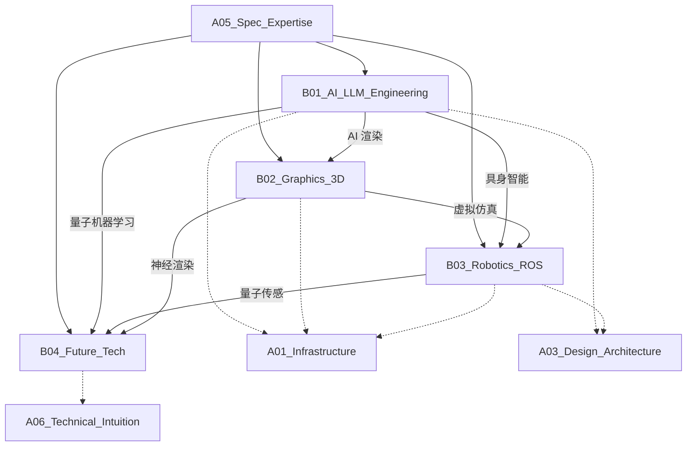

# A05_Spec_Expertise

**领域定位**: 前沿技术深度实践
**创建日期**: 2026-01-30
**最后更新**: 2026-01-30

## 📋 领域概述

专项技术领域聚焦于前沿技术的深度探索与工程化实践，涵盖人工智能、图形渲染、机器人技术和未来计算等创新方向。本领域强调理论与实践结合，关注技术演进趋势，为技术创新和产品突破提供核心能力支撑。

**核心关注点**：
- **AI 工程化**：大语言模型应用、提示工程、模型运维
- **图形技术**：实时渲染、GPU 编程、沉浸式体验
- **机器人系统**：感知融合、运动规划、智能协作
- **未来计算**：量子计算、神经形态芯片、生物计算
- **跨域融合**：AI+3D、机器人+LLM、量子+机器学习

## 🗂️ 子领域结构

### [B01_AI_LLM_Engineering](B01_AI_LLM_Engineering/README.md)
**定位**：提示工程、模型微调、LLM 运维

涵盖大语言模型应用架构、提示工程最佳实践、RAG (检索增强生成)、模型微调 (LoRA/QLoRA)、LLMOps 平台建设、模型评估与监控、AI Agent 开发等。

### [B02_Graphics_3D](B02_Graphics_3D/README.md)
**定位**：实时渲染技术、GPU 编程、AR/VR 开发

包括现代图形 API (Vulkan/Metal/DirectX 12)、物理渲染 (PBR)、光线追踪、GPU 计算 (CUDA/OpenCL)、游戏引擎架构 (Unity/Unreal)、WebGPU、空间计算等。

### [B03_Robotics_ROS](B03_Robotics_ROS/README.md)
**定位**：传感器融合、运动规划算法、群体智能

涉及 ROS/ROS2 架构、SLAM (同步定位与地图构建)、传感器融合 (Kalman/粒子滤波)、路径规划 (A*/RRT)、机械臂控制、多机器人协作、具身智能等。

### [B04_Future_Tech](B04_Future_Tech/README.md)
**定位**：量子计算、神经形态芯片、生物计算

探索量子算法 (Shor/Grover)、量子纠错、神经形态计算架构、脉冲神经网络 (SNN)、DNA 存储、合成生物学、脑机接口等前沿方向。

## 🔗 知识关联图谱

## 📚 学习路径建议

### 初级路径
**目标**：理解前沿技术基础概念，建立技术直觉

1. **AI 应用基础** (B01)
   - 大语言模型基本原理
   - API 调用与提示编写
   - 向量数据库基础
   - AI 应用开发框架 (LangChain)

2. **图形编程入门** (B02)
   - 计算机图形学基础
   - OpenGL/WebGL 编程
   - 着色器编程 (GLSL)
   - 3D 数学基础

3. **机器人基础** (B03)
   - ROS 基础概念
   - 机器人运动学
   - 传感器原理 (激光雷达/相机)
   - 基本控制算法

4. **未来技术概览** (B04)
   - 量子计算基本概念
   - 神经形态计算原理
   - 前沿技术趋势追踪
   - 科技论文阅读方法

### 中级路径
**目标**：深入技术实践，具备工程化能力

1. **LLM 工程化** (B01)
   - 提示工程高级技巧
   - RAG 系统设计
   - 模型微调实践
   - LLM 应用架构设计
   - AI Agent 开发
   - 模型性能优化

2. **高级图形技术** (B02)
   - 现代图形 API (Vulkan)
   - 物理渲染 (PBR/IBL)
   - 实时光线追踪
   - GPU 并行计算
   - 游戏引擎架构
   - 渲染优化技术

3. **机器人系统** (B03)
   - SLAM 算法实现
   - 传感器融合技术
   - 路径规划算法
   - 机械臂运动规划
   - ROS2 分布式系统
   - 机器人仿真 (Gazebo)

4. **前沿技术实践** (B04)
   - 量子编程 (Qiskit/Cirq)
   - 量子算法实现
   - 神经形态芯片编程
   - 脉冲神经网络
   - 技术原型开发

### 高级路径
**目标**：技术创新，前沿研究与产品化

1. **LLM 前沿** (B01)
   - 多模态大模型
   - 模型压缩与量化
   - 分布式训练
   - LLMOps 平台建设
   - AI 安全与对齐
   - 具身智能系统

2. **图形前沿** (B02)
   - 神经渲染 (NeRF/3D Gaussian)
   - 实时全局光照
   - 虚拟制作技术
   - 空间计算平台
   - 元宇宙技术栈
   - 图形硬件架构

3. **高级机器人** (B03)
   - 多传感器融合
   - 强化学习控制
   - 群体智能算法
   - 人机协作系统
   - 具身智能与 LLM 融合
   - 机器人操作系统设计

4. **未来计算** (B04)
   - 量子纠错码
   - 量子机器学习
   - 神经形态架构设计
   - DNA 计算与存储
   - 脑机接口技术
   - 跨域技术融合

## 📖 参考资源

### 核心资源

**书籍**：
- 《深度学习》(Deep Learning) - Ian Goodfellow
- 《Real-Time Rendering》- 实时渲染圣经
- 《Probabilistic Robotics》- 概率机器人学
- 《Quantum Computation and Quantum Information》- 量子计算经典
- 《Programming Massively Parallel Processors》- GPU 编程
- 《Artificial Intelligence: A Modern Approach》- AI 综合教材

**在线资源**：
- OpenAI Documentation: https://platform.openai.com/docs
- Hugging Face: https://huggingface.co/
- Learn OpenGL: https://learnopengl.com/
- ROS Wiki: https://wiki.ros.org/
- Qiskit Textbook: https://qiskit.org/textbook/
- NVIDIA Developer: https://developer.nvidia.com/

**社区**：
- AI Alignment Forum
- Graphics Programming Discord
- ROS Discourse
- Quantum Computing Stack Exchange

### 扩展阅读

**AI/LLM**：
- 《Attention Is All You Need》- Transformer 原论文
- 《LLaMA》系列论文 - Meta 开源模型
- 《Retrieval-Augmented Generation》- RAG 论文
- 《LoRA: Low-Rank Adaptation》- 高效微调
- Anthropic Research - Claude 技术博客
- OpenAI Research - GPT 系列论文

**图形技术**：
- 《Physically Based Rendering》- PBR 理论
- 《GPU Gems》系列 - NVIDIA 图形技术
- 《Ray Tracing in One Weekend》- 光线追踪入门
- 《Game Engine Architecture》- 游戏引擎设计
- SIGGRAPH Papers - 图形学顶会论文
- Advances in Real-Time Rendering (SIGGRAPH Course)

**机器人技术**：
- 《Modern Robotics》- 现代机器人学
- 《Planning Algorithms》- 路径规划算法
- 《Multiple View Geometry》- 多视图几何
- 《Robotics: Modelling, Planning and Control》
- ICRA/IROS 会议论文 - 机器人顶会
- arXiv Robotics Section

**未来技术**：
- 《Quantum Computing: A Gentle Introduction》
- 《Neuromorphic Engineering》- 神经形态工程
- 《Molecular Computation》- 分子计算
- Nature/Science 前沿论文
- arXiv Quantum Physics/Emerging Technologies
- IEEE Spectrum 技术趋势

**跨域融合**：
- 《Neural Radiance Fields (NeRF)》- AI+图形
- 《RT-1: Robotics Transformer》- LLM+机器人
- 《Quantum Machine Learning》- 量子+AI
- NeurIPS/ICML/CVPR 跨域论文

## 🔄 维护说明

- **内容更新频率**: 每季度审查一次
- **质量标准**: 确保所有子领域链接有效，内容准确完整
- **贡献方式**: 参见根目录 readme.md 中的贡献指南
