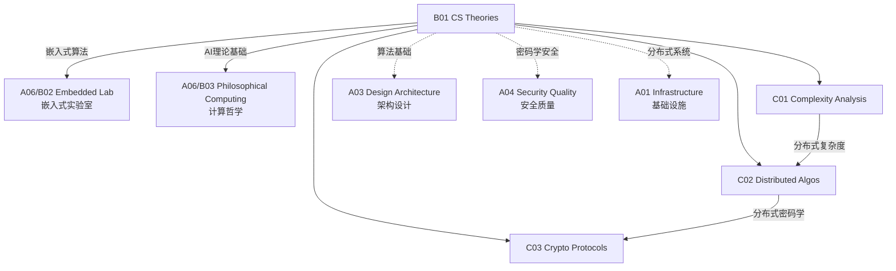

# B01 CS Theories

**所属领域**: [A06_Technical_Intuition](../readme.md)
**创建日期**: 2026-01-30
**最后更新**: 2026-01-30

## 📋 子领域定位

计算机科学理论是技术决策的基石，帮助工程师理解算法本质、系统行为和技术权衡。深入理解这些理论能够在面对复杂问题时做出更明智的选择，避免常见的性能陷阱和设计误区。

本领域涵盖算法复杂度分析（时间/空间复杂度、P vs NP）、分布式算法（共识协议、一致性模型、CAP定理）和密码学协议（零知识证明、同态加密、安全多方计算）三大方向。工程师需要建立计算思维，理解分布式系统的本质约束，并掌握现代密码学基础。

**核心关注点**：
- **算法复杂度**: 渐近分析、复杂度类、优化策略、摊还分析
- **分布式算法**: 共识机制、一致性模型、分布式事务、CAP权衡
- **密码学协议**: 零知识证明、同态加密、安全计算、后量子密码

## 🗂️ 专项列表

### [C01. Complexity_Analysis](C01_Complexity_Analysis/README.md)

算法复杂度分析是评估算法效率的核心工具。本专项详解渐近记号（Big-O、Big-Ω、Big-Θ）、常见复杂度类（P、NP、NP-Complete、NP-Hard）、均摊分析（Amortized Analysis）和概率分析。涵盖实际性能优化中的复杂度权衡和缓存友好算法设计。

### [C02. Distributed_Algos](C02_Distributed_Algos/README.md)

分布式算法解决多节点协作的根本问题。本专项深入共识算法（Paxos、Raft、PBFT）、一致性模型（线性一致性、顺序一致性、最终一致性）、分布式事务（2PC、3PC、Saga）和CAP定理实践。涵盖分布式ID生成、分布式锁和Gossip协议。

### [C03. Crypto_Protocols](C03_Crypto_Protocols/README.md)

密码学协议构建安全计算的数学基础。本专项详解零知识证明（zk-SNARKs、zk-STARKs）、同态加密（部分同态、全同态）、安全多方计算（MPC）和后量子密码学。涵盖区块链密码学、隐私计算和可验证计算。

## 🛠️ 技术栈概览

### 算法可视化与学习

| 资源 | 类型 | 说明 | 链接 |
|------|------|------|------|
| **VisuAlgo** | 可视化 | 算法交互演示 | https://visualgo.net |
| **Algorithm Visualizer** | 可视化 | 代码动画 | https://algorithm-visualizer.org |
| **Big-O Cheat Sheet** | 参考 | 复杂度速查 | https://www.bigocheatsheet.com |
| **LeetCode** | 练习 | 算法题目 | https://leetcode.com |

### 分布式系统框架

| 框架 | 语言 | 特点 | 官网 |
|------|------|------|------|
| **etcd** | Go | Raft共识实现 | https://etcd.io |
| **ZooKeeper** | Java | 分布式协调 | https://zookeeper.apache.org |
| **Consul** | Go | 服务发现+KV | https://www.consul.io |
| **Atomix** | Java | 分布式原语 | https://atomix.io |

### 密码学库

| 库 | 语言 | 特点 | 官网 |
|------|------|------|------|
| **OpenSSL** | C | 行业标准 | https://www.openssl.org |
| **libsodium** | C | 现代易用 | https://libsodium.gitbook.io |
| ** CIRCL** | Go | 云flare密码库 | https://github.com/cloudflare/circl |
| ** arkworks** | Rust | zk-SNARKs | https://arkworks.rs |

## 💼 实践案例索引

### 案例 1: 算法复杂度分析实践

**常见数据结构复杂度**:
| 操作 | 数组 | 链表 | 哈希表 | 平衡BST | 堆 |
|------|------|------|--------|---------|-----|
| 访问 | O(1) | O(n) | O(1) | O(log n) | - |
| 搜索 | O(n) | O(n) | O(1) | O(log n) | O(n) |
| 插入 | O(n) | O(1) | O(1) | O(log n) | O(log n) |
| 删除 | O(n) | O(1) | O(1) | O(log n) | O(log n) |

**摊还分析 - 动态数组扩容**:
```python
class DynamicArray:
    """
    动态数组的摊还分析:
    - 每次扩容: 容量翻倍
    - n次插入的总成本: O(n)
    - 单次插入摊还成本: O(1)
    """
    def __init__(self):
        self.capacity = 1
        self.size = 0
        self.array = [None] * self.capacity
    
    def append(self, item):
        if self.size == self.capacity:
            # 扩容: 分配新数组，复制元素
            self._resize(2 * self.capacity)
        self.array[self.size] = item
        self.size += 1
    
    def _resize(self, new_capacity):
        new_array = [None] * new_capacity
        for i in range(self.size):
            new_array[i] = self.array[i]
        self.array = new_array
        self.capacity = new_capacity
    
    # 摊还分析证明:
    # 假设每次插入的基本成本为1，扩容成本为当前大小
    # n次插入过程中，扩容发生在第1, 2, 4, 8...次插入
    # 总成本 = n (基本插入) + (1 + 2 + 4 + ... + 2^⌈log₂n⌉) (扩容)
    #        = n + (2n - 1) = 3n - 1 = O(n)
    # 单次摊还成本 = O(n)/n = O(1)
```

### 案例 2: Raft共识算法实现

**Raft状态机**:
```
┌─────────────────────────────────────────────────────────────┐
│                    Raft 节点状态机                           │
├─────────────────────────────────────────────────────────────┤
│                                                             │
│                    ┌─────────────┐                         │
│                    │  初始状态    │                         │
│                    │  Follower   │                         │
│                    └──────┬──────┘                         │
│                           │ 选举超时                        │
│                           ▼                                │
│                    ┌─────────────┐                         │
│              ┌────│  Candidate  │────┐                    │
│        发现   │    │  (发起投票) │    │ 获得多数票          │
│        更高任期│    └──────┬──────┘    │                    │
│              └──────────▶│◀───────────┘                    │
│                          │                                  │
│                    ┌─────┴─────┐                          │
│                    │  Leader   │◀─────────────────────┐   │
│                    │ (日志复制)│                      │   │
│                    └─────┬─────┘                      │   │
│                          │                           │   │
│                          │ 心跳/日志复制              │   │
│                          ▼                           │   │
│                    ┌─────────────┐                   │   │
│                    │  Follower   │───────────────────┘   │
│                    │ (接收日志)  │ (发现更高任期)        │
│                    └─────────────┘                       │
└─────────────────────────────────────────────────────────────┘
```

**关键机制**:
| 机制 | 说明 |
|------|------|
| 领导者选举 | 超时随机化避免活锁，获得多数票成为Leader |
| 日志复制 | Leader接收客户端请求，复制到多数节点后提交 |
| 安全性 | 已提交的日志不会被覆盖，所有节点最终一致 |

### 案例 3: 零知识证明应用

**zk-SNARKs工作流程**:
```
┌─────────────────────────────────────────────────────────────┐
│                  zk-SNARKs 工作流程                          │
├─────────────────────────────────────────────────────────────┤
│                                                             │
│  证明者 (Prover)              验证者 (Verifier)              │
│       │                              │                      │
│       │  1. 生成证明密钥 (Setup)     │                      │
│       │◀──────── pk, vk ───────────▶│                      │
│       │                              │                      │
│       │  2. 生成证明                  │                      │
│       │  Prove(pk, x, w) → π         │                      │
│       │  (公开输入x, 见证w, 证明π)    │                      │
│       │                              │                      │
│       │────────── π ────────────────▶│  3. 验证证明         │
│       │                              │  Verify(vk, x, π)    │
│       │                              │  → true/false        │
│       │                              │                      │
└─────────────────────────────────────────────────────────────┘

特性:
- 完备性: 正确的见证总能生成有效证明
- 可靠性: 错误的见证无法生成有效证明  
- 零知识: 验证者除语句真假外无法获得其他信息
- 简洁性: 证明大小和验证时间远小于原始计算
```

**应用场景**:
| 场景 | 说明 |
|------|------|
| 隐私交易 | Zcash使用zk-SNARKs隐藏交易双方和金额 |
| 身份验证 | 证明拥有某凭证而不泄露凭证内容 |
| 可验证计算 | 外包计算后验证结果正确性 |
| 区块链扩容 | zk-Rollups批量验证交易，降低主链负载 |

## 🔗 知识关联图谱



## 📖 学习资源

### 推荐书籍

| 书名 | 作者 | 说明 |
|------|------|------|
| 《Introduction to Algorithms》 | CLRS | 算法圣经 |
| 《Designing Data-Intensive Applications》 | Martin Kleppmann | 分布式系统 |
| 《Understanding Cryptography》 | Paar & Pelzl | 密码学入门 |
| 《Distributed Algorithms》 | Nancy Lynch | 分布式算法理论 |

### 在线课程

| 课程 | 平台 | 链接 |
|------|------|------|
| Algorithms | Princeton (Coursera) | https://www.coursera.org/learn/algorithms-part1 |
| Distributed Systems | MIT | https://pdos.csail.mit.edu/6.824 |
| Cryptography I | Stanford (Coursera) | https://www.coursera.org/learn/crypto |

### 技术资源

| 资源 | 链接 | 说明 |
|------|------|------|
| Raft论文 | https://raft.github.io | 共识算法 |
| zkSNARKs介绍 | https://z.cash/technology/zksnarks | 零知识证明 |
| Complexity Zoo | https://complexityzoo.net | 复杂度类百科 |

### 开源项目

| 项目 | GitHub | 说明 |
|------|--------|------|
| etcd | https://github.com/etcd-io/etcd | Raft实现 |
| libsnark | https://github.com/scipr-lab/libsnark | zk-SNARKs库 |
| bulletproofs | https://github.com/dalek-cryptography/bulletproofs | 零知识范围证明 |

## 🔄 维护说明

- **内容审查**: 每半年更新算法研究和密码学进展
- **更新机制**: 跟踪理论计算机科学顶会(FOCS、STOC、CRYPTO)
- **质量标准**: 确保理论解释准确，有数学依据
- **贡献方式**: 欢迎提交算法分析和分布式系统设计案例
