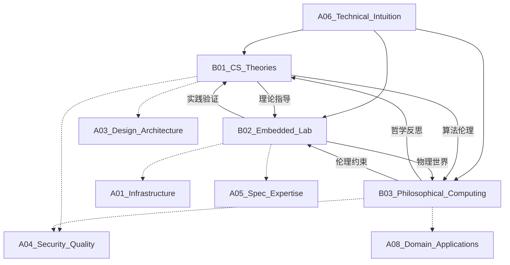

# A06_Technical_Intuition

**领域定位**: 计算机科学理论与系统思维
**创建日期**: 2026-01-30
**最后更新**: 2026-01-30

## 📋 领域概述

技术直觉领域专注于培养深层次的计算机科学理解和系统性思维能力。本领域不仅关注"如何实现"，更关注"为什么这样设计"，通过理论基础、实验探索和哲学思考，构建对技术本质的洞察力。

**核心关注点**：
- **理论基础**：算法复杂度分析、分布式系统理论、密码学原理
- **实验探索**：嵌入式系统开发、物联网原型、固件逆向工程
- **哲学思考**：AI 伦理、数字孪生、信息物理系统融合
- **系统思维**：抽象层次理解、权衡取舍分析、技术演进预判
- **创新能力**：跨领域知识迁移、原创性问题解决

## 🗂️ 子领域结构

### [B01_CS_Theories](B01_CS_Theories/README.md)
**定位**：算法复杂度、分布式协议、加密原理

涵盖时间/空间复杂度分析、NP 完全问题、CAP/PACELC 定理、Paxos/Raft 共识算法、对称/非对称加密、零知识证明等计算机科学核心理论。

### [B02_Embedded_Lab](B02_Embedded_Lab/README.md)
**定位**：物联网原型开发、固件逆向、实时系统

包括 Arduino/ESP32 开发、RTOS 实时操作系统、固件提取与分析、硬件调试技术、边缘 AI 部署、低功耗设计等嵌入式系统实践。

### [B03_Philosophical_Computing](B03_Philosophical_Computing/README.md)
**定位**：AI 伦理、数字孪生、信息物理系统

探讨算法偏见与公平性、自动化决策伦理、数字孪生技术、CPS 信息物理系统、人机协作哲学、技术社会影响等前沿议题。

## 🔗 知识关联图谱

## 📚 学习路径建议

### 初级路径
**目标**：建立计算机科学基础，理解核心概念

1. **算法基础** (B01)
   - 时间复杂度分析 (Big O 表示法)
   - 常见数据结构 (数组、链表、树、图)
   - 基础算法 (排序、搜索、递归)

2. **嵌入式入门** (B02)
   - Arduino 基础编程
   - 传感器数据采集
   - 简单物联网项目

3. **技术思考** (B03)
   - 技术决策的权衡
   - 软件工程伦理基础
   - 技术文档批判性阅读

### 中级路径
**目标**：深入理论原理，培养系统性思维

1. **算法进阶** (B01)
   - 动态规划与贪心算法
   - 图算法 (最短路径、最小生成树)
   - 分治与回溯策略
   - P vs NP 问题理解

2. **分布式理论** (B01)
   - CAP 定理与实践权衡
   - 一致性模型 (强一致性、最终一致性)
   - 共识算法基础 (2PC、3PC)
   - 分布式时钟与因果关系

3. **密码学基础** (B01)
   - 对称加密 (AES、ChaCha20)
   - 非对称加密 (RSA、ECC)
   - 哈希函数与数字签名
   - TLS/SSL 协议原理

4. **嵌入式系统** (B02)
   - RTOS 实时操作系统 (FreeRTOS)
   - 中断处理与任务调度
   - 低功耗设计技术
   - 硬件调试工具使用

5. **技术哲学** (B03)
   - 算法偏见识别
   - 隐私保护技术
   - 开源软件哲学
   - 技术可持续性

### 高级路径
**目标**：理论创新，跨领域融合

1. **高级算法** (B01)
   - 近似算法与启发式方法
   - 随机算法与概率分析
   - 并行算法设计
   - 量子算法基础

2. **分布式系统深度** (B01)
   - Paxos/Raft 共识算法实现
   - 拜占庭容错 (BFT)
   - 分布式事务协议
   - 最终一致性系统设计

3. **现代密码学** (B01)
   - 零知识证明 (ZKP)
   - 同态加密
   - 多方安全计算 (MPC)
   - 后量子密码学

4. **固件逆向** (B02)
   - 固件提取技术
   - 反汇编与反编译
   - 漏洞挖掘方法
   - 硬件安全分析

5. **边缘智能** (B02)
   - TinyML 模型部署
   - 模型量化与压缩
   - 边缘推理优化
   - 联邦学习实践

6. **计算哲学** (B03)
   - AI 对齐问题 (Alignment)
   - 数字孪生伦理
   - 信息物理系统安全
   - 技术奇点讨论
   - 计算伦理学框架

## 📖 参考资源

### 核心资源

**书籍**：
- 《算法导论》(CLRS) - 算法理论圣经
- 《分布式系统原理与范型》- Andrew S. Tanenbaum
- 《密码编码学与网络安全》- William Stallings
- 《嵌入式系统设计》- Frank Vahid
- 《人工智能：一种现代方法》- Russell & Norvig
- 《技术的本质》- Brian Arthur

**在线资源**：
- MIT OpenCourseWare - 6.006 算法导论
- Stanford CS 244 - 高级分布式系统
- Coursera Cryptography I - Dan Boneh
- edX Embedded Systems - UT Austin
- AI Ethics Guidelines - IEEE/ACM

**论文与会议**：
- ACM SIGACT (算法理论)
- USENIX OSDI/SOSP (系统设计)
- IEEE S&P (安全与隐私)
- ACM FAccT (公平性、问责与透明度)

### 扩展阅读

**算法与理论**：
- 《算法设计手册》- Steven Skiena
- 《具体数学》- Donald Knuth
- 《计算理论导引》- Michael Sipser

**分布式系统**：
- 《Designing Data-Intensive Applications》- Martin Kleppmann
- 《分布式系统：概念与设计》- Coulouris
- Raft 论文：In Search of an Understandable Consensus Algorithm

**密码学**：
- 《应用密码学》- Bruce Schneier
- 《现代密码学》- Jonathan Katz
- 零知识证明系列论文

**嵌入式系统**：
- 《嵌入式实时操作系统 μC/OS-III》
- 《ARM Cortex-M3 权威指南》
- 《物联网设计：从原型到产品》

**技术哲学**：
- 《算法霸权》- Cathy O'Neil
- 《人工智能伦理学》- 多作者合集
- 《数字乌托邦》- Fred Turner
- 《技术垄断》- Neil Postman

**前沿探索**：
- arXiv.org - 计算机科学预印本
- Hacker News - 技术讨论社区
- ACM Queue - 实践者视角
- IEEE Spectrum - 技术趋势

## 🔄 维护说明

- **内容更新频率**: 每季度审查一次
- **质量标准**: 确保所有子领域链接有效，内容准确完整
- **贡献方式**: 参见根目录 readme.md 中的贡献指南
