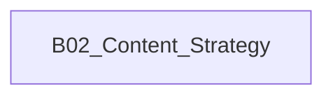

# B02_Content_Strategy

**所属领域**: [A07_Knowledge_Ops](../readme.md)
**创建日期**: 2026-01-30
**最后更新**: 2026-01-30

## 📋 子领域定位

待补充：子领域定位说明

## 🗂️ 专项列表

### [C01. Atomic_Notes](C01_Atomic_Notes/README.md)

待补充：专项主题简介

### [C02. Cross-Linking](C02_Cross-Linking/README.md)

待补充：专项主题简介

### [C03. Version_Control](C03_Version_Control/README.md)

待补充：专项主题简介

## 🛠️ 技术栈概览

### 核心技术
待补充：核心技术栈

### 工具链
待补充：工具链

### 框架与库
待补充：框架与库

## 💼 实践案例索引

待补充：实践案例

## 🔗 关联知识

## 📖 学习资源

### 推荐书籍
待补充：推荐书籍

### 在线课程
待补充：在线课程

### 技术博客
待补充：技术博客

## 🔄 维护说明

- **内容审查**: 每月检查链接有效性
- **更新机制**: 发现新技术或最佳实践时及时更新
- **质量标准**: 确保所有专项主题内容完整且准确
