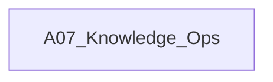

# A07_Knowledge_Ops

**领域定位**: 待补充：领域定位说明
**创建日期**: 2026-01-30
**最后更新**: 2026-01-30

## 📋 领域概述

待补充：领域概述内容

## 🗂️ 子领域结构

待补充：子领域列表

## 🔗 知识关联图谱

## 📚 学习路径建议

### 初级路径
待补充：初级学习路径

### 中级路径
待补充：中级学习路径

### 高级路径
待补充：高级学习路径

## 📖 参考资源

### 核心资源
待补充：核心参考资源

### 扩展阅读
待补充：扩展阅读资源

## 🔄 维护说明

- **内容更新频率**: 每季度审查一次
- **质量标准**: 确保所有子领域链接有效，内容准确完整
- **贡献方式**: 参见根目录 readme.md 中的贡献指南
