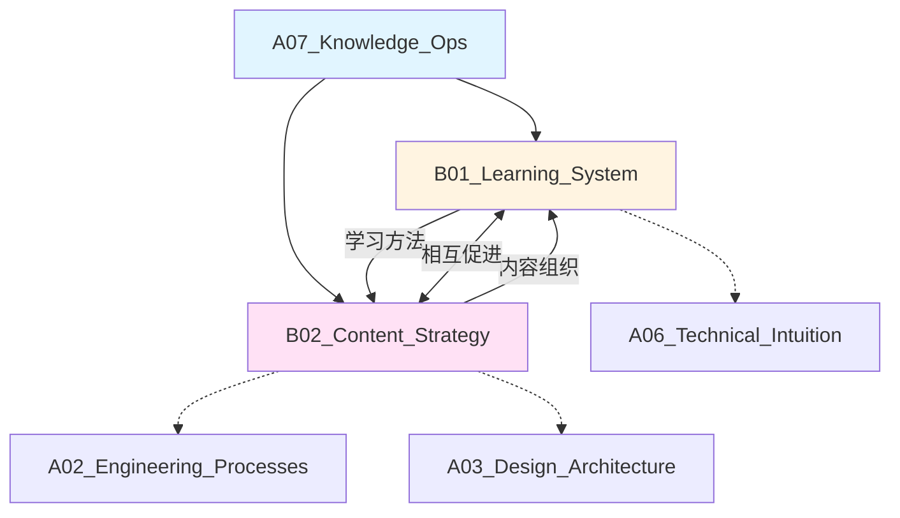

# A07_Knowledge_Ops

**领域定位**: 知识库构建与管理方法论
**创建日期**: 2026-01-30
**最后更新**: 2026-01-30

## 📋 领域概述

知识运营领域专注于个人和团队知识体系的构建、管理和演进。本领域将知识视为可持续增长的资产，通过系统化的方法论和工具链，实现知识的高效获取、组织、检索和应用。

**核心关注点**：
- **学习系统**：间隔重复学习、概念图谱构建、知识网络编织
- **内容策略**：原子化笔记、双向链接、渐进式总结
- **工具生态**：Obsidian/Notion/Logseq 等知识管理工具
- **版本控制**：知识演进追踪、历史回溯、协作编辑
- **知识检索**：全文搜索、语义检索、知识图谱查询

## 🗂️ 子领域结构

### [B01_Learning_System](B01_Learning_System/README.md)
**定位**：间隔重复学习、概念图谱、知识网络

涵盖 Anki 间隔重复系统、费曼学习法、概念地图 (Concept Map)、知识网络理论、元认知策略、学习效率优化等科学学习方法。

### [B02_Content_Strategy](B02_Content_Strategy/README.md)
**定位**：原子化笔记、交叉链接、版本控制

包括 Zettelkasten 卡片盒笔记法、PARA 方法 (Projects/Areas/Resources/Archives)、渐进式总结 (Progressive Summarization)、双向链接策略、Git 版本控制等内容组织方法。

## 🔗 知识关联图谱



## 📚 学习路径建议

### 初级路径
**目标**：建立基本知识管理习惯，掌握核心工具

1. **笔记基础** (B02)
   - Markdown 语法掌握
   - 基本笔记结构 (标题、列表、代码块)
   - 文件夹组织方法
   - 标签系统使用

2. **工具入门** (B02)
   - Obsidian/Notion 基础操作
   - 笔记创建与编辑
   - 基本搜索功能
   - 模板使用

3. **学习方法** (B01)
   - 主动回忆 (Active Recall)
   - 间隔重复原理
   - 费曼学习法实践
   - 学习日志记录

### 中级路径
**目标**：构建个人知识体系，形成知识网络

1. **高级笔记法** (B02)
   - Zettelkasten 卡片盒笔记法
   - 原子化笔记原则
   - 双向链接策略
   - 知识图谱可视化

2. **内容组织** (B02)
   - PARA 方法实践
   - 渐进式总结技术
   - MOC (Map of Content) 构建
   - 知识分类体系设计

3. **学习系统** (B01)
   - Anki 卡片制作技巧
   - 间隔重复算法理解
   - 概念地图绘制
   - 知识网络编织

4. **版本控制** (B02)
   - Git 基础操作
   - 笔记版本管理
   - 协作编辑流程
   - 冲突解决策略

### 高级路径
**目标**：知识系统优化，团队知识管理

1. **知识工程** (B02)
   - 知识本体 (Ontology) 设计
   - 语义网络构建
   - 知识图谱技术
   - 自动化知识提取

2. **高级学习** (B01)
   - 元认知策略
   - 迁移学习方法
   - 跨领域知识整合
   - 创造性思维培养

3. **工具定制** (B02)
   - Obsidian 插件开发
   - 自动化工作流 (Templater/Dataview)
   - API 集成
   - 自定义脚本

4. **团队协作** (B02)
   - 团队知识库架构
   - 协作编辑规范
   - 知识审核流程
   - 知识传承机制

5. **知识检索** (B02)
   - 全文搜索优化
   - 语义检索技术
   - RAG (检索增强生成)
   - AI 辅助知识管理

## 📖 参考资源

### 核心资源

**书籍**：
- 《如何阅读一本书》- Mortimer Adler (阅读方法论)
- 《卡片笔记写作法》- Sönke Ahrens (Zettelkasten 方法)
- 《认知天性》- Peter C. Brown (学习科学)
- 《Building a Second Brain》- Tiago Forte (PARA 方法)
- 《Make It Stick》- 学习科学经典

**在线资源**：
- Obsidian Documentation: https://help.obsidian.md/
- Zettelkasten.de: https://zettelkasten.de/
- LessWrong Rationality: https://www.lesswrong.com/
- Andy Matuschak's Notes: https://notes.andymatuschak.org/
- Maggie Appleton's Digital Garden: https://maggieappleton.com/garden

**工具**：
- Obsidian - 本地优先的知识管理工具
- Logseq - 大纲式笔记工具
- Notion - 协作知识库平台
- Anki - 间隔重复学习软件
- Zotero - 文献管理工具

### 扩展阅读

**学习科学**：
- 《学习之道》- Barbara Oakley
- 《刻意练习》- Anders Ericsson
- 《超越智商》- Keith Stanovich
- 《思考，快与慢》- Daniel Kahneman

**知识管理**：
- 《个人知识管理》- 多作者合集
- 《The Organized Mind》- Daniel Levitin
- 《Getting Things Done》- David Allen (GTD 方法)
- 《How to Take Smart Notes》- Sönke Ahrens

**信息架构**：
- 《Information Architecture》- Louis Rosenfeld
- 《The Humane Interface》- Jef Raskin
- 《Don't Make Me Think》- Steve Krug

**数字花园**：
- Digital Gardening 运动相关文章
- Evergreen Notes 概念
- Networked Thought 理念

**工具与实践**：
- Obsidian Forum 社区讨论
- r/ObsidianMD Reddit 社区
- Linking Your Thinking (LYT) 课程
- Building a Second Brain (BASB) 课程

**学术资源**：
- 认知科学期刊
- 教育心理学研究
- 人机交互 (HCI) 论文

## 🎯 实践建议

### 知识管理工作流

**每日流程**：
1. **捕获** - 快速记录想法和信息
2. **处理** - 整理笔记，建立链接
3. **回顾** - Anki 复习，笔记重读
4. **创造** - 基于笔记产出内容

**每周流程**：
1. **整理** - 清理收件箱，归档笔记
2. **连接** - 建立跨笔记链接
3. **总结** - 创建周总结笔记
4. **规划** - 下周学习计划

**每月流程**：
1. **审查** - 知识体系健康检查
2. **优化** - 调整分类和标签
3. **输出** - 撰写长文或教程
4. **反思** - 学习方法改进

### 笔记模板示例

**文献笔记模板**：
```markdown
# 文献标题

## 元信息
- 作者：
- 发表时间：
- 来源：
- 标签：

## 核心观点
- 观点 1
- 观点 2

## 个人思考
...

## 相关笔记
- [[相关笔记1]]
- [[相关笔记2]]
```

**概念笔记模板**：
```markdown
# 概念名称

## 定义
...

## 为什么重要
...

## 如何应用
...

## 相关概念
- [[概念A]]
- [[概念B]]

## 参考资料
...
```

## 🔄 维护说明

- **内容更新频率**: 每季度审查一次
- **质量标准**: 确保所有子领域链接有效，内容准确完整
- **贡献方式**: 参见根目录 readme.md 中的贡献指南
