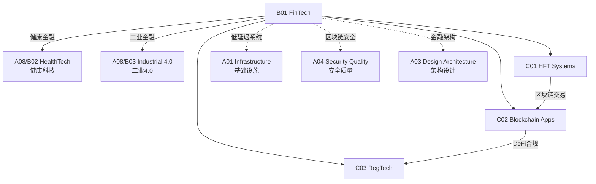

# B01 FinTech

**所属领域**: [A08_Domain_Applications](../readme.md)
**创建日期**: 2026-01-30
**最后更新**: 2026-01-30

## 📋 子领域定位

金融科技(FinTech)是技术与金融服务的深度融合，正在重塑银行、支付、投资和保险等行业。从高频交易到区块链应用，从智能投顾到监管科技，FinTech代表了一个高度监管、技术密集且快速创新的领域。

本领域涵盖高频交易系统（低延迟架构、市场微观结构、风险控制）、区块链应用（智能合约、DeFi、CBDC）和监管科技（合规自动化、反洗钱、风险监控）三大方向。工程师需要理解金融市场的特殊性，掌握高可用、高一致性和高安全性的系统设计。

**核心关注点**：
- **高频交易**: 低延迟网络、FPGA加速、市场数据、风控系统
- **区块链应用**: 智能合约、DeFi协议、跨链技术、数字资产
- **监管科技**: 实时风控、反欺诈、合规报告、审计追踪

## 🗂️ 专项列表

### [C01. HFT_Systems](C01_HFT_Systems/README.md)

高频交易系统追求微秒级的延迟优势。本专项详解低延迟架构（内核旁路、DPDK、FPGA加速）、市场数据解析（FIX协议、二进制协议）、订单管理系统和风险控制。涵盖共置(Co-location)、市场微观结构和监管合规要求。

### [C02. Blockchain_Apps](C02_Blockchain_Apps/README.md)

区块链技术构建去中心化金融基础设施。本专项深入智能合约开发（Solidity、Rust）、DeFi协议（DEX、借贷、衍生品）、跨链互操作（桥接、IBC）和数字资产（NFT、代币标准）。涵盖以太坊、Solana、Cosmos等主流平台。

### [C03. RegTech](C03_RegTech/README.md)

监管科技自动化合规流程，降低合规成本。本专项详解反洗钱(AML/KYC)、交易监控、实时风控、合规报告和审计追踪。涵盖监管沙盒、开放银行和PSD2/GDPR合规技术实现。

## 🛠️ 技术栈概览

### 高频交易技术

| 技术 | 用途 | 官网 |
|------|------|------|
| **DPDK** | 内核旁路网络 | https://www.dpdk.org |
| **FIX Protocol** | 金融信息交换 | https://www.fixtrading.org |
| **Apache Kafka** | 实时流处理 | https://kafka.apache.org |
| **LMDB** | 内存映射数据库 | https://www.lmdb.tech |
| **Aeron** | 低延迟消息 | https://github.com/real-logic/aeron |

### 区块链平台

| 平台 | 特点 | 智能合约 | 官网 |
|------|------|----------|------|
| **Ethereum** | 生态最丰富 | Solidity | https://ethereum.org |
| **Solana** | 高性能 | Rust/C | https://solana.com |
| **Cosmos** | 跨链生态 | Go (CosmWasm) | https://cosmos.network |
| **Hyperledger Fabric** | 企业联盟链 | Go/Java | https://www.hyperledger.org |
| **Aptos** | Move语言 | Move | https://aptoslabs.com |

### DeFi协议

| 协议 | 类型 | TVL(2024) | 官网 |
|------|------|-----------|------|
| **Lido** | 流动性质押 | $20B+ | https://lido.fi |
| **Aave** | 借贷 | $10B+ | https://aave.com |
| **Uniswap** | DEX | $4B+ | https://uniswap.org |
| **MakerDAO** | 稳定币 | $5B+ | https://makerdao.com |
| **Chainlink** | 预言机 | - | https://chain.link |

### 监管科技工具

| 工具 | 功能 | 官网 |
|------|------|------|
| **Sumsub** | KYC/AML | https://sumsub.com |
| **Chainalysis** | 区块链分析 | https://www.chainalysis.com |
| **ComplyAdvantage** | 金融犯罪检测 | https://complyadvantage.com |
| **Fenergo** | 客户生命周期管理 | https://www.fenergo.com |

## 💼 实践案例索引

### 案例 1: 高频交易系统架构

**低延迟架构设计**:
```
┌─────────────────────────────────────────────────────────────┐
│                    高频交易系统架构                          │
├─────────────────────────────────────────────────────────────┤
│                                                             │
│  交易所共置机房                                               │
│  ┌─────────────────────────────────────────────────────┐   │
│  │                   网络层 (DPDK)                      │   │
│  │  ┌─────────┐  ┌─────────┐  ┌─────────┐             │   │
│  │  │ 行情接入 │  │ 订单网关 │  │ 回报处理 │             │   │
│  │  │ (UDP)  │  │ (TCP)  │  │ (TCP)  │             │   │
│  │  └────┬────┘  └────┬────┘  └────┬────┘             │   │
│  └───────┼────────────┼────────────┼───────────────────┘   │
│          │            │            │                        │
│  ┌───────┴────────────┴────────────┴───────────────────┐   │
│  │                 策略引擎 (FPGA/内核态)                │   │
│  │  - 行情解析 (亚微秒级)                                │   │
│  │  - 信号生成                                          │   │
│  │  - 预风控检查                                        │   │
│  └─────────────────────────┬─────────────────────────────┘   │
│                            │                                 │
│  ┌─────────────────────────┴─────────────────────────────┐   │
│  │                   风控与合规层                         │   │
│  │  - 实时风险限额检查                                    │   │
│  │  - 自成交检测                                         │   │
│  │  - 审计日志                                           │   │
│  └───────────────────────────────────────────────────────┘   │
│                                                             │
│  延迟指标:                                                   │
│  - 网络往返: 1-5 μs (共置)                                   │
│  - 系统处理: 5-10 μs (FPGA) 或 50-100 μs (软件)               │
└─────────────────────────────────────────────────────────────┘
```

**关键优化**:
| 层级 | 优化技术 | 延迟收益 |
|------|----------|----------|
| 硬件 | 内核旁路(DPDK)、FPGA加速、智能网卡 | 10-100x |
| 系统 | CPU亲和性、NUMA优化、无锁队列 | 2-5x |
| 应用 | 零拷贝、预分配内存、缓存友好 | 2-3x |

### 案例 2: DeFi智能合约开发

**Uniswap V2 AMM合约**:
```solidity
// SPDX-License-Identifier: MIT
pragma solidity ^0.8.0;

contract ConstantProductAMM {
    // 恒定乘积做市商: x * y = k
    // x, y 是两种代币的储备量
    // k 是恒定乘积
    
    IERC20 public token0;
    IERC20 public token1;
    uint256 public reserve0;
    uint256 public reserve1;
    uint256 public totalSupply;
    mapping(address => uint256) public balanceOf;
    
    // 添加流动性
    function addLiquidity(uint256 amount0, uint256 amount1) 
        external 
        returns (uint256 liquidity 
    {
        // 首次添加
        if (totalSupply == 0) {
            liquidity = sqrt(amount0 * amount1);
        } else {
            // 按比例添加
            liquidity = min(
                amount0 * totalSupply / reserve0,
                amount1 * totalSupply / reserve1
            );
        }
        
        require(liquidity > 0, "INSUFFICIENT_LIQUIDITY");
        
        // 转账并更新储备
        token0.transferFrom(msg.sender, address(this), amount0);
        token1.transferFrom(msg.sender, address(this), amount1);
        
        reserve0 += amount0;
        reserve1 += amount1;
        totalSupply += liquidity;
        balanceOf[msg.sender] += liquidity;
    }
    
    // 代币交换 (考虑0.3%手续费)
    function swap(address tokenIn, uint256 amountIn) 
        external 
        returns (uint256 amountOut 
    {
        require(tokenIn == address(token0) || tokenIn == address(token1));
        
        bool isToken0 = tokenIn == address(token0);
        (IERC20 tokenIn_, IERC20 tokenOut_) = isToken0 
            ? (token0, token1) 
            : (token1, token0);
        (uint256 reserveIn, uint256 reserveOut) = isToken0
            ? (reserve0, reserve1)
            : (reserve1, reserve0);
        
        // 收取0.3%手续费: amountInWithFee = amountIn * 997 / 1000
        uint256 amountInWithFee = amountIn * 997;
        // 根据恒定乘积公式计算输出
        // (reserveIn + amountInWithFee) * (reserveOut - amountOut) = reserveIn * reserveOut
        amountOut = (amountInWithFee * reserveOut) / 
                    (reserveIn * 1000 + amountInWithFee);
        
        // 执行交换
        tokenIn_.transferFrom(msg.sender, address(this), amountIn);
        tokenOut_.transfer(msg.sender, amountOut);
        
        // 更新储备
        if (isToken0) {
            reserve0 += amountIn;
            reserve1 -= amountOut;
        } else {
            reserve1 += amountIn;
            reserve0 -= amountOut;
        }
    }
}
```

### 案例 3: 实时反欺诈系统

**风控架构**:
```
┌─────────────────────────────────────────────────────────────┐
│                    实时反欺诈系统                            │
├─────────────────────────────────────────────────────────────┤
│                                                             │
│  交易请求                                                   │
│     │                                                       │
│     ▼                                                       │
│  ┌─────────────────────────────────────────────────────┐   │
│  │                 规则引擎 (Drools/EasyRules)          │   │
│  │  - 黑名单检查                                         │   │
│  │  - 交易限额                                           │   │
│  │  - 地理位置异常                                       │   │
│  └─────────────────────────┬───────────────────────────┘   │
│                            │                                │
│              ┌─────────────┴─────────────┐                  │
│              ▼                           ▼                  │
│       ┌─────────────┐            ┌─────────────┐           │
│       │   通过      │            │   可疑      │           │
│       │ (放行)      │            │ (ML模型)    │           │
│       └─────────────┘            └──────┬──────┘           │
│                                         │                   │
│                              ┌──────────┴──────────┐       │
│                              ▼                     ▼       │
│                       ┌─────────────┐       ┌─────────────┐│
│                       │   通过      │       │   拦截      ││
│                       │ (人工复核)  │       │ (冻结账户)  ││
│                       └─────────────┘       └─────────────┘│
│                                                             │
│  ML特征工程:                                                │
│  - 交易频率                                                 │
│  - 设备指纹                                                 │
│  - 行为序列                                                 │
│  - 图网络分析 (关联交易)                                     │
└─────────────────────────────────────────────────────────────┘
```

## 🔗 知识关联图谱



## 📖 学习资源

### 推荐书籍

| 书名 | 作者 | 说明 |
|------|------|------|
| 《Flash Boys》 | Michael Lewis | 高频交易故事 |
| 《Mastering Bitcoin》 | Andreas Antonopoulos | 区块链技术 |
| 《How to DeFi》 | CoinGecko | DeFi入门 |
| 《Algorithmic Trading》 | Ernie Chan | 量化策略 |

### 在线资源

| 资源 | 链接 | 说明 |
|------|------|------|
| DeFi Llama | https://defillama.com | DeFi数据聚合 |
| Etherscan | https://etherscan.io | 以太坊浏览器 |
| OpenZeppelin | https://openzeppelin.com | 安全合约库 |
| CME Group Education | https://www.cmegroup.com/education.html | 期货知识 |

### 开源项目

| 项目 | GitHub | 说明 |
|------|--------|------|
| OpenZeppelin | https://github.com/OpenZeppelin/openzeppelin-contracts | 安全合约库 |
| Uniswap | https://github.com/Uniswap/v3-core | DEX合约 |
| Chainlink | https://github.com/smartcontractkit/chainlink | 预言机 |
| QuickFIX | https://github.com/quickfix/quickfix | FIX协议引擎 |

## 🔄 维护说明

- **内容审查**: 每季度更新市场数据、DeFi协议和监管要求
- **更新机制**: 跟踪金融监管动态和区块链技术发展
- **质量标准**: 确保金融示例符合实际业务规则
- **贡献方式**: 欢迎提交交易系统设计和智能合约审计经验
