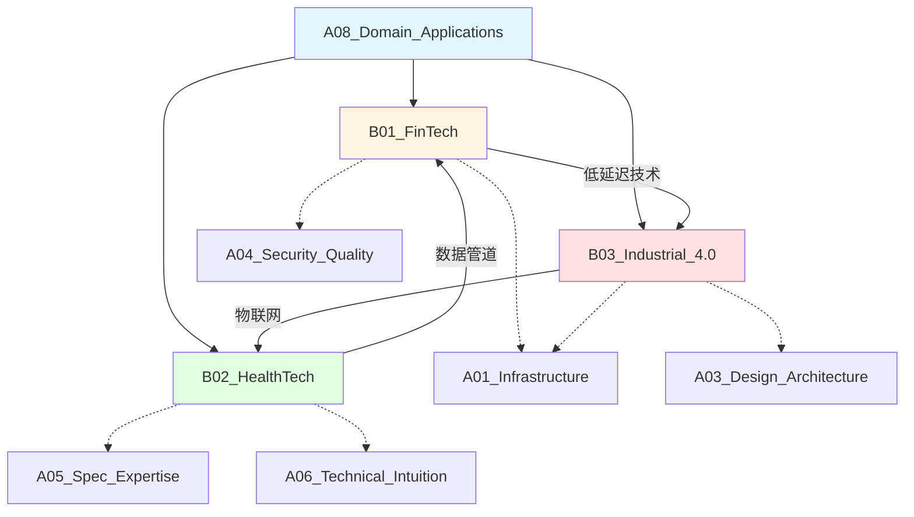

# A08_Domain_Applications

**领域定位**: 技术场景化解决方案与行业应用
**创建日期**: 2026-01-30
**最后更新**: 2026-01-30

## 📋 领域概述

领域应用专注于将通用技术能力转化为特定行业的解决方案。本领域深入金融科技、医疗健康、工业制造等垂直领域，理解行业特定需求、监管要求和技术挑战，构建端到端的场景化技术方案。

**核心关注点**：
- **金融科技**：高频交易系统、区块链应用、监管科技 (RegTech)
- **医疗健康**：医学影像分析、基因组学管道、医疗物联网
- **工业 4.0**：数字主线 (Digital Thread)、自主系统、预测性维护
- **行业合规**：HIPAA/GDPR/SOX 等行业标准
- **领域建模**：业务流程数字化、领域特定语言 (DSL)

## 🗂️ 子领域结构

### [B01_FinTech](B01_FinTech/README.md)
**定位**：高频交易系统、区块链应用、监管科技

涵盖量化交易策略、低延迟系统设计、智能合约开发、DeFi 协议、支付系统架构、反洗钱 (AML) 系统、KYC 自动化、金融风控模型等。

### [B02_HealthTech](B02_HealthTech/README.md)
**定位**：医学影像分析、基因组学管道、医疗物联网

包括 DICOM 影像处理、深度学习诊断模型、NGS 数据分析、生物信息学工具链、可穿戴设备集成、远程医疗平台、HIPAA 合规架构等。

### [B03_Industrial_4.0](B03_Industrial_4.0/README.md)
**定位**：数字主线、自主系统、预测性维护

探讨数字孪生技术、工业物联网 (IIoT)、边缘计算部署、机器视觉检测、预测性维护算法、MES/ERP 集成、OT/IT 融合安全等。

## 🔗 知识关联图谱

## 📚 学习路径建议

### 初级路径
**目标**：理解行业基础知识，掌握领域术语

1. **金融科技基础** (B01)
   - 金融市场基础 (股票、期货、期权)
   - 支付系统原理
   - 区块链基础概念
   - 金融监管框架概览

2. **医疗健康基础** (B02)
   - 医疗数据标准 (HL7/FHIR)
   - 医学影像格式 (DICOM)
   - 电子病历系统 (EMR/EHR)
   - HIPAA 合规基础

3. **工业制造基础** (B03)
   - 制造执行系统 (MES)
   - 工业协议 (Modbus/OPC UA)
   - 传感器数据采集
   - 设备维护基础

### 中级路径
**目标**：深入技术实现，构建领域解决方案

1. **金融系统开发** (B01)
   - 交易系统架构设计
   - 订单簿 (Order Book) 实现
   - 风险管理系统
   - 智能合约开发 (Solidity)
   - 支付网关集成

2. **区块链应用** (B01)
   - 以太坊 DApp 开发
   - DeFi 协议理解
   - NFT 标准 (ERC-721/1155)
   - Layer 2 扩容方案
   - 跨链桥技术

3. **监管科技** (B01)
   - KYC/AML 自动化
   - 交易监控系统
   - 合规报告生成
   - 反欺诈模型

4. **医学影像处理** (B02)
   - DICOM 数据解析
   - 影像分割算法
   - 3D 重建技术
   - 深度学习诊断模型
   - PACS 系统集成

5. **基因组学** (B02)
   - NGS 数据处理流程
   - 变异检测算法
   - 生物信息学工具 (GATK/BWA)
   - 基因注释与解读
   - 精准医疗应用

6. **数字孪生** (B03)
   - 物理模型构建
   - 实时数据同步
   - 仿真与优化
   - 可视化展示
   - 决策支持系统

7. **预测性维护** (B03)
   - 时间序列分析
   - 异常检测算法
   - 剩余寿命预测 (RUL)
   - 维护策略优化
   - 故障诊断系统

### 高级路径
**目标**：行业创新，前沿技术应用

1. **高频交易** (B01)
   - 微秒级延迟优化
   - FPGA 加速
   - 市场微观结构
   - 算法交易策略
   - 共置 (Co-location) 部署

2. **DeFi 协议设计** (B01)
   - 自动做市商 (AMM)
   - 流动性挖矿机制
   - 闪电贷实现
   - 跨链互操作
   - MEV (最大可提取价值) 防护

3. **AI 辅助诊断** (B02)
   - 多模态医学数据融合
   - 联邦学习在医疗中的应用
   - 可解释 AI 模型
   - 临床决策支持系统
   - 药物发现 AI

4. **精准医疗** (B02)
   - 多组学数据整合
   - 个性化治疗方案
   - 药物基因组学
   - 疾病风险预测
   - 临床试验优化

5. **工业自主系统** (B03)
   - 自主移动机器人 (AMR)
   - 机器视觉质检
   - 强化学习优化
   - 人机协作系统
   - 工业 5.0 探索

6. **智能制造** (B03)
   - 柔性制造系统
   - 供应链优化
   - 能源管理系统
   - 碳足迹追踪
   - 可持续制造

## 📖 参考资源

### 核心资源

**金融科技**：
- 《算法交易》- Ernest P. Chan
- 《区块链技术指南》- 多作者合集
- 《精通以太坊》- Andreas M. Antonopoulos
- CFA Institute 金融分析师资料
- Solidity 官方文档

**医疗健康**：
- 《医学影像处理》- 多作者合集
- 《生物信息学算法》- Phillip Compeau
- DICOM 标准文档
- HL7 FHIR 规范
- FDA 医疗器械软件指南

**工业 4.0**：
- 《工业 4.0：正在发生的第四次工业革命》
- 《数字孪生技术》- Michael Grieves
- 《预测性维护》- 多作者合集
- OPC UA 规范
- ISA-95 标准

**在线资源**：
- Coursera - Financial Engineering 课程
- edX - Blockchain Fundamentals
- Kaggle - Medical Imaging 竞赛
- IEEE Industrial Electronics Society
- NIST Manufacturing Extension Partnership

### 扩展阅读

**金融科技**：
- 《量化交易：如何建立自己的算法交易业务》
- 《DeFi 与未来金融》
- 《监管科技：金融科技的下一个前沿》
- arXiv Quantitative Finance 论文
- CoinDesk Research 报告

**医疗健康**：
- 《深度学习在医学影像中的应用》
- 《精准医疗：基因组学时代》
- 《数字健康：技术与实践》
- Nature Medicine 期刊
- JAMA (美国医学会杂志)

**工业 4.0**：
- 《智能制造系统》
- 《工业物联网架构》
- 《机器视觉实战》
- IEEE Transactions on Industrial Informatics
- Journal of Manufacturing Systems

**行业报告**：
- Gartner Hype Cycle 报告
- McKinsey Digital 行业报告
- Deloitte Tech Trends
- PwC Industry 4.0 研究

**标准与合规**：
- ISO 13485 (医疗器械质量管理)
- IEC 62304 (医疗器械软件生命周期)
- PCI DSS (支付卡行业数据安全标准)
- GDPR/HIPAA 合规指南
- ISO/IEC 27001 (信息安全管理)

## 🎯 行业实践建议

### 金融科技项目

**量化交易系统**：
1. 数据获取与清洗
2. 回测框架搭建
3. 策略开发与优化
4. 风险管理模块
5. 实盘交易部署

**DeFi 协议开发**：
1. 智能合约设计
2. 安全审计 (Slither/Mythril)
3. 测试网部署
4. 前端 DApp 开发
5. 主网发布与监控

### 医疗健康项目

**医学影像分析**：
1. DICOM 数据预处理
2. 标注数据准备
3. 深度学习模型训练
4. 模型验证与评估
5. 临床集成与部署

**基因组学管道**：
1. 原始数据质控
2. 序列比对 (Alignment)
3. 变异检测 (Variant Calling)
4. 注释与解读
5. 报告生成

### 工业 4.0 项目

**预测性维护系统**：
1. 传感器数据采集
2. 特征工程
3. 异常检测模型
4. 剩余寿命预测
5. 维护决策优化

**数字孪生平台**：
1. 物理模型构建
2. 数据接口开发
3. 实时仿真引擎
4. 可视化界面
5. 优化算法集成

## 🔄 维护说明

- **内容更新频率**: 每季度审查一次
- **质量标准**: 确保所有子领域链接有效，内容准确完整
- **贡献方式**: 参见根目录 readme.md 中的贡献指南
