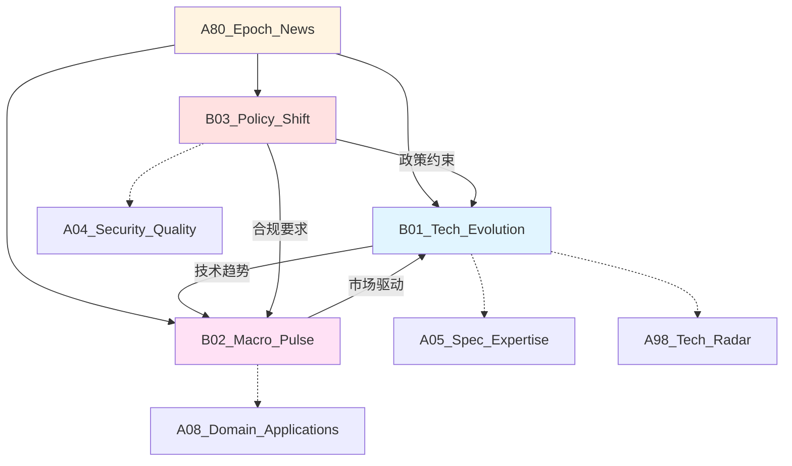

# A80_Epoch_News

**领域定位**: 技术演进追踪与行业动态监测
**创建日期**: 2026-01-30
**最后更新**: 2026-01-30

## 📋 领域概述

时代新闻领域专注于追踪技术发展趋势、行业重大事件和政策变化。本领域作为动态追踪模块，持续监测 AI 突破、硬件创新、开源生态、监管政策等关键领域，为技术决策提供前瞻性洞察。

**核心关注点**：
- **技术演进**：AI 模型突破、编程语言发展、框架更新
- **宏观脉搏**：科技巨头动向、创业生态、投资趋势
- **政策影响**：数据隐私法规、AI 监管、开源许可变化
- **硬件突破**：芯片架构创新、量子计算进展
- **安全事件**：重大漏洞披露、供应链攻击、安全趋势

## 🗂️ 子领域结构

### [B01_Tech_Evolution](B01_Tech_Evolution/README.md)
**定位**：AI 进展、编程语言、框架生态

追踪大语言模型突破 (GPT/Claude/Gemini)、多模态 AI、编程语言新特性 (Rust/Go/Python)、前端框架演进 (React/Vue/Svelte)、后端技术栈更新等。

### [B02_Macro_Pulse](B02_Macro_Pulse/README.md)
**定位**：科技巨头、创业生态、投资趋势

监测 FAANG 战略调整、独角兽公司动态、VC 投资热点、并购事件、IPO 趋势、技术人才市场等宏观行业脉搏。

### [B03_Policy_Shift](B03_Policy_Shift/README.md)
**定位**：监管政策、合规要求、标准制定

关注 GDPR/CCPA 执法、AI 伦理法规、开源许可争议、数据主权政策、网络安全法规、技术出口管制等政策变化。

## 🔗 知识关联图谱

## 📰 追踪维度

### 技术演进追踪

**AI 与机器学习**：
- 大语言模型发布 (GPT-5/Claude 4/Gemini 2.0)
- 多模态模型突破 (视觉-语言-音频融合)
- 开源模型生态 (Llama/Mistral/Qwen)
- AI 推理优化技术
- 边缘 AI 部署方案

**编程语言与框架**：
- Rust 生态成熟度
- Go 泛型与并发改进
- Python 性能优化 (Faster CPython)
- TypeScript 类型系统演进
- WebAssembly 应用扩展

**基础设施**：
- Kubernetes 新特性
- Serverless 平台演进
- 边缘计算架构
- 云原生工具链
- 可观测性技术栈

### 宏观脉搏监测

**科技巨头动向**：
- OpenAI/Anthropic 产品发布
- Google/Microsoft AI 战略
- Meta 开源贡献
- Apple 隐私技术
- Amazon 云服务创新

**创业生态**：
- AI 初创公司融资
- 开发者工具赛道
- 垂直领域 SaaS
- Web3 项目进展
- 硬件创业趋势

**人才市场**：
- 技术岗位需求变化
- 薪资水平趋势
- 远程工作政策
- 技能需求演变
- 人才流动方向

### 政策影响分析

**数据隐私**：
- GDPR 执法案例
- CCPA/CPRA 实施
- 中国数据安全法
- 跨境数据传输
- Cookie 政策变化

**AI 监管**：
- EU AI Act 实施细则
- 美国 AI 行政令
- 算法透明度要求
- 生成式 AI 版权争议
- AI 安全标准制定

**开源与知识产权**：
- 开源许可证争议
- 专利诉讼案例
- 商业开源模式
- 代码版权问题
- 技术标准之争

## 📚 信息源推荐

### 核心信息源

**技术新闻**：
- Hacker News (https://news.ycombinator.com/)
- TechCrunch (https://techcrunch.com/)
- The Verge (https://www.theverge.com/)
- Ars Technica (https://arstechnica.com/)
- InfoQ (https://www.infoq.com/)

**AI 专题**：
- OpenAI Blog
- Anthropic Research
- Google AI Blog
- Meta AI Research
- Papers with Code

**开发者社区**：
- GitHub Trending
- Reddit r/programming
- Dev.to
- Lobsters (https://lobste.rs/)
- Stack Overflow Blog

**行业分析**：
- Gartner Research
- Forrester Reports
- IDC Analysis
- CB Insights
- Crunchbase News

**政策与法规**：
- IAPP (国际隐私专业人员协会)
- EFF (电子前沿基金会)
- CNIL (法国数据保护局)
- FTC Technology Blog
- NIST Cybersecurity

### 专业订阅

**Newsletter**：
- TLDR Newsletter (技术日报)
- The Pragmatic Engineer (工程管理)
- Benedict's Newsletter (科技战略)
- Stratechery (科技商业分析)
- Import AI (AI 周报)

**播客**：
- The Changelog
- Software Engineering Daily
- Lex Fridman Podcast
- a16z Podcast
- The TWIML AI Podcast

**YouTube 频道**：
- Fireship (技术快讯)
- ThePrimeagen (开发者视角)
- Computerphile (计算机科学)
- Two Minute Papers (AI 论文解读)
- GOTO Conferences (技术大会)

## 🎯 追踪方法论

### 信息过滤策略

**优先级分类**：
1. **P0 - 立即关注**：重大安全漏洞、关键技术突破、影响业务的政策
2. **P1 - 每日追踪**：主流技术更新、行业重要动态
3. **P2 - 每周回顾**：趋势分析、深度报告
4. **P3 - 每月总结**：长期趋势、战略洞察

**信息验证**：
- 交叉验证多个信源
- 区分事实与观点
- 关注原始来源
- 警惕标题党
- 追踪后续发展

### 知识沉淀流程

**每日流程**：
1. 浏览核心信息源 (30 分钟)
2. 标记重要信息
3. 快速笔记记录
4. 分享到团队频道

**每周流程**：
1. 整理本周重要事件
2. 撰写周报总结
3. 更新技术雷达
4. 评估对项目的影响

**每月流程**：
1. 趋势分析报告
2. 技术决策建议
3. 学习路径调整
4. 知识库更新

## 📖 参考资源

### 核心资源

**书籍**：
- 《创新者的窘境》- Clayton Christensen (技术变革)
- 《跨越鸿沟》- Geoffrey Moore (技术采纳)
- 《技术的本质》- Brian Arthur (技术演进)
- 《黑客与画家》- Paul Graham (技术思考)

**报告**：
- Gartner Hype Cycle (技术成熟度曲线)
- ThoughtWorks Technology Radar (技术雷达)
- State of DevOps Report (DevOps 现状)
- Stack Overflow Developer Survey (开发者调查)
- GitHub Octoverse (开源生态)

**数据平台**：
- Google Trends (搜索趋势)
- GitHub Archive (代码活动)
- npm trends (包流行度)
- PyPI Stats (Python 包统计)
- Docker Hub Stats (容器镜像)

### 扩展阅读

**技术趋势**：
- 《技术奇点》- Ray Kurzweil
- 《必然》- Kevin Kelly
- 《失控》- Kevin Kelly
- 《数字化生存》- Nicholas Negroponte

**商业分析**：
- 《从 0 到 1》- Peter Thiel
- 《精益创业》- Eric Ries
- 《创新者的解答》- Clayton Christensen
- 《平台革命》- Geoffrey Parker

**政策与伦理**：
- 《算法霸权》- Cathy O'Neil
- 《监控资本主义时代》- Shoshana Zuboff
- 《人工智能伦理学》- 多作者合集
- 《数据与歌利亚》- Bruce Schneier

## 🔄 维护说明

- **内容更新频率**: 每日更新重要事件，每周总结趋势
- **质量标准**: 确保信息准确性和时效性，提供原始来源链接
- **贡献方式**: 参见根目录 readme.md 中的贡献指南

## 📌 特别说明

本领域作为动态追踪模块，内容更新频率高于其他领域。建议：
- 订阅关键信息源的 RSS/Newsletter
- 使用 Feedly/Inoreader 等聚合工具
- 设置 Google Alerts 关键词监控
- 加入相关技术社区和 Slack/Discord 频道
- 定期回顾和归档历史事件
