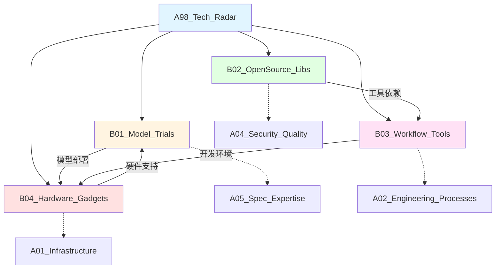

# A98_Tech_Radar

**领域定位**: 技术选型评估与工具审计
**创建日期**: 2026-01-30
**最后更新**: 2026-01-30

## 📋 领域概述

技术雷达领域专注于技术选型决策、工具评估和实践验证。本领域通过系统化的评估方法，对 AI 模型、开源库、开发工具、硬件设备进行深度测试和对比分析，为技术决策提供数据支撑。

**核心关注点**：
- **模型评测**：LLM 性能对比、多模态模型测试、推理效率分析
- **开源审计**：库的成熟度、社区活跃度、安全性、许可证
- **工具评估**：开发效率、学习曲线、生态系统、成本效益
- **硬件测评**：性能基准、功耗分析、性价比、适用场景
- **技术成熟度**：采纳建议 (Adopt/Trial/Assess/Hold)

## 🗂️ 子领域结构

### [B01_Model_Trials](B01_Model_Trials/README.md)
**定位**：AI 模型评测、性能基准、推理优化

涵盖 LLM 对比测试 (GPT/Claude/Gemini/Llama)、多模态模型评估、模型量化效果、推理框架对比 (vLLM/TensorRT-LLM)、边缘部署方案等。

### [B02_OpenSource_Libs](B02_OpenSource_Libs/README.md)
**定位**：开源库审计、依赖分析、安全评估

包括库的功能完整性、API 设计质量、文档完善度、测试覆盖率、社区健康度、安全漏洞历史、许可证兼容性、维护活跃度等。

### [B03_Workflow_Tools](B03_Workflow_Tools/README.md)
**定位**：开发工具评测、效率分析、集成能力

探讨 IDE/编辑器对比、CI/CD 工具选型、项目管理平台、协作工具、监控系统、日志平台、APM 工具等的评估与选择。

### [B04_Hardware_Gadgets](B04_Hardware_Gadgets/README.md)
**定位**：硬件设备测评、性能基准、应用场景

涉及开发设备 (笔记本/工作站)、GPU 加速卡、边缘计算设备、网络设备、存储方案、外设配件等的性能测试和选购建议。

## 🔗 知识关联图谱



## 📊 评估框架

### 技术成熟度模型

采用 ThoughtWorks 技术雷达的四象限分类：

**Adopt (采纳)**：
- 成熟稳定，生产环境验证
- 强烈推荐在新项目中使用
- 示例：Kubernetes、PostgreSQL、React

**Trial (试验)**：
- 值得在非关键项目中尝试
- 技术前景看好，但需谨慎评估
- 示例：Rust 后端、Deno、Tauri

**Assess (评估)**：
- 值得关注和探索
- 适合技术预研和 POC
- 示例：WebGPU、WASM 组件模型、Mojo

**Hold (暂缓)**：
- 不推荐使用或需要迁移
- 存在更好的替代方案
- 示例：AngularJS、Bower、CoffeeScript

### 评估维度

**功能性**：
- 功能完整度
- API 设计质量
- 扩展性
- 性能表现

**可维护性**：
- 代码质量
- 文档完善度
- 测试覆盖率
- 架构清晰度

**社区生态**：
- 社区活跃度
- 贡献者数量
- Issue 响应速度
- 生态系统丰富度

**安全性**：
- 已知漏洞
- 安全审计
- 更新频率
- 依赖安全

**成本效益**：
- 学习曲线
- 开发效率
- 运维成本
- 许可证成本

## 📚 评估方法论

### AI 模型评测

**性能基准**：
- MMLU (多任务语言理解)
- HumanEval (代码生成)
- MT-Bench (多轮对话)
- HELM (全面评估)
- 自定义领域测试集

**推理效率**：
- 吞吐量 (tokens/s)
- 延迟 (首 token 时间)
- 内存占用
- 批处理能力
- 成本效益 ($/1M tokens)

**实际应用测试**：
- 代码生成质量
- 文档理解能力
- 多语言支持
- 上下文长度处理
- 指令遵循能力

### 开源库审计

**代码质量检查**：
```bash
# 静态分析
eslint / pylint / golangci-lint

# 复杂度分析
radon / sonarqube

# 依赖审计
npm audit / pip-audit / cargo audit

# 许可证检查
licensee / fossa
```

**社区健康度指标**：
- GitHub Stars 增长趋势
- Commit 频率
- Issue 关闭率
- PR 合并时间
- 贡献者分布
- 文档质量评分

**安全评估**：
- CVE 漏洞历史
- 依赖树安全扫描
- SBOM (软件物料清单)
- 供应链安全
- 安全响应流程

### 工具评估流程

**1. 需求分析**：
- 明确使用场景
- 定义评估标准
- 确定权重分配

**2. 候选筛选**：
- 市场调研
- 初步筛选 (3-5 个候选)
- 排除明显不合适的选项

**3. 深度测试**：
- 功能验证
- 性能测试
- 集成测试
- 用户体验评估

**4. 成本分析**：
- 许可证费用
- 学习成本
- 迁移成本
- 运维成本

**5. 决策报告**：
- 对比矩阵
- 优劣势分析
- 推荐方案
- 风险评估

## 🎯 实践案例

### 案例 1：LLM 选型

**场景**：代码辅助工具

**候选模型**：
- GPT-4 Turbo
- Claude 3.5 Sonnet
- Gemini 1.5 Pro
- Llama 3 70B

**评估维度**：
| 维度 | GPT-4 | Claude 3.5 | Gemini 1.5 | Llama 3 |
|------|-------|------------|------------|---------|
| 代码质量 | 9/10 | 9.5/10 | 8.5/10 | 8/10 |
| 推理速度 | 7/10 | 8/10 | 8.5/10 | 9/10 |
| 成本 | 6/10 | 7/10 | 8/10 | 10/10 |
| 上下文长度 | 128K | 200K | 1M | 8K |
| 部署灵活性 | 5/10 | 5/10 | 6/10 | 10/10 |

**结论**：
- **生产环境**：Claude 3.5 Sonnet (质量与速度平衡)
- **成本敏感**：Llama 3 70B (自托管)
- **长文档处理**：Gemini 1.5 Pro

### 案例 2：前端框架选型

**场景**：企业级 Web 应用

**候选框架**：
- React
- Vue 3
- Svelte
- Solid.js

**评估结果**：
- **Adopt**: React (生态成熟，人才充足)
- **Trial**: Vue 3 (渐进式，学习曲线友好)
- **Assess**: Svelte (编译时优化，性能优异)
- **Assess**: Solid.js (细粒度响应式，新兴)

### 案例 3：数据库选型

**场景**：高并发读写系统

**候选方案**：
- PostgreSQL
- MySQL
- MongoDB
- CockroachDB

**决策矩阵**：
| 需求 | PostgreSQL | MySQL | MongoDB | CockroachDB |
|------|------------|-------|---------|-------------|
| ACID 事务 | ✅ | ✅ | ⚠️ | ✅ |
| 水平扩展 | ⚠️ | ⚠️ | ✅ | ✅ |
| JSON 支持 | ✅ | ⚠️ | ✅ | ✅ |
| 运维成熟度 | ✅ | ✅ | ✅ | ⚠️ |
| 成本 | 免费 | 免费 | 免费 | 付费 |

**推荐**：PostgreSQL + Citus 扩展 (平衡各方面需求)

## 📖 参考资源

### 核心资源

**技术雷达**：
- ThoughtWorks Technology Radar: https://www.thoughtworks.com/radar
- InfoQ Architecture & Design: https://www.infoq.com/architecture-design/
- CNCF Landscape: https://landscape.cncf.io/

**基准测试**：
- TechEmpower Benchmarks (Web 框架)
- MLPerf (AI 性能)
- SPEC Benchmarks (硬件性能)
- Phoronix Test Suite (Linux 性能)

**评测平台**：
- Hugging Face Leaderboards (AI 模型)
- DB-Engines Ranking (数据库)
- Stack Overflow Trends (技术流行度)
- npm trends (JavaScript 包)

**工具**：
- OpenSSF Scorecard (开源项目健康度)
- Snyk (依赖安全扫描)
- SonarQube (代码质量)
- Lighthouse (Web 性能)

### 扩展阅读

**技术选型**：
- 《架构整洁之道》- Robert C. Martin
- 《凤凰项目》- Gene Kim (DevOps 实践)
- 《技术的本质》- Brian Arthur
- 《Accelerate》- Nicole Forsgren (DevOps 度量)

**评估方法**：
- 《软件度量》- 多作者合集
- 《代码大全》- Steve McConnell
- 《重构》- Martin Fowler
- 《设计模式》- GoF

**行业报告**：
- Gartner Magic Quadrant
- Forrester Wave
- State of JavaScript/CSS/DevOps
- GitHub Octoverse

## 🔄 维护说明

- **内容更新频率**: 每季度更新技术雷达，每月更新评测结果
- **质量标准**: 确保评测数据真实可靠，提供可复现的测试方法
- **贡献方式**: 参见根目录 readme.md 中的贡献指南

## 📌 使用建议

**技术选型流程**：
1. 查阅本领域相关评测
2. 结合项目实际需求
3. 进行小规模 POC 验证
4. 评估长期维护成本
5. 做出决策并记录 ADR

**持续跟踪**：
- 订阅技术雷达更新
- 关注已采纳技术的演进
- 定期重新评估关键依赖
- 及时淘汰过时技术
- 保持技术栈现代化
