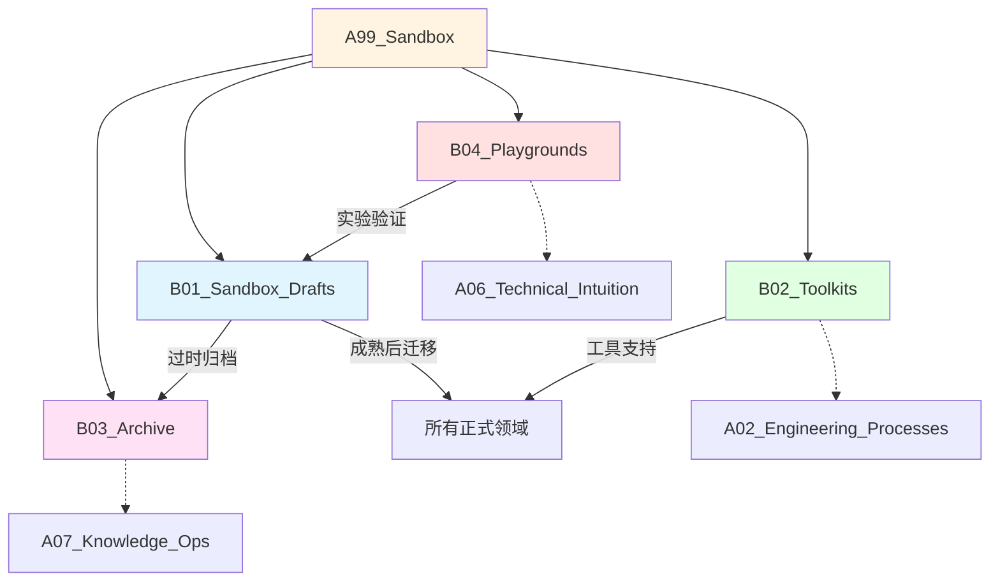

# A99_Sandbox

**领域定位**: 实验场、概念验证与工具集
**创建日期**: 2026-01-30
**最后更新**: 2026-01-30

## 📋 领域概述

沙盒领域是知识库的实验区和工具库，用于快速原型开发、概念验证、临时草稿和实用工具存储。本领域鼓励自由探索和快速迭代，成熟的内容会迁移到对应的正式领域，过时的内容会归档保存。

**核心关注点**：
- **概念验证**：新技术 POC、架构实验、算法原型
- **草稿区**：未完成的文档、待整理的笔记、临时想法
- **工具集**：自动化脚本、实用工具、配置模板
- **归档库**：历史项目、过时技术、经验教训
- **游乐场**：技术探索、学习实验、趣味项目

## 🗂️ 子领域结构

### [B01_Sandbox_Drafts](B01_Sandbox_Drafts/README.md)
**定位**：草稿区、临时笔记、待整理内容

存放未完成的技术文档、会议记录、临时想法、待验证的假设、快速笔记等内容。定期整理，成熟内容迁移到正式领域。

### [B02_Toolkits](B02_Toolkits/README.md)
**定位**：自动化脚本、实用工具、配置模板

收集日常开发中的实用工具，包括自动化脚本、配置文件模板、代码生成器、数据处理工具、环境配置脚本等。

### [B03_Archive](B03_Archive/README.md)
**定位**：历史项目、过时技术、经验教训

归档已完成的项目、不再使用的技术栈、历史决策记录、失败案例分析、经验教训总结等，保留历史价值。

### [B04_Playgrounds](B04_Playgrounds/README.md)
**定位**：技术探索、学习实验、趣味项目

用于技术学习、新框架试用、算法实验、趣味编程、黑客马拉松项目等自由探索活动。

## 🔗 知识关联图谱



## 🎯 使用指南

### 草稿区使用规范

**适合放入草稿区的内容**：
- 未完成的技术调研
- 会议记录和讨论笔记
- 临时想法和灵感
- 待验证的技术方案
- 快速记录的学习笔记

**草稿整理流程**：
1. **每周回顾** - 检查草稿区内容
2. **分类处理**：
   - 完善后迁移到正式领域
   - 合并相似内容
   - 删除无价值内容
   - 继续完善未完成内容
3. **设置提醒** - 超过 30 天的草稿需要处理

**草稿模板**：
```markdown
# [草稿] 标题

**创建日期**: YYYY-MM-DD
**状态**: 草稿 / 进行中 / 待迁移
**目标领域**: A0X_XXX

## 背景
...

## 内容
...

## 待办
- [ ] 补充 XXX
- [ ] 验证 YYY
- [ ] 整理格式

## 迁移计划
迁移到: /path/to/target
```

### 工具集管理

**工具分类**：
- **开发工具** - 代码生成、格式化、重构
- **运维工具** - 部署脚本、监控工具、日志分析
- **数据工具** - 数据清洗、转换、分析
- **自动化工具** - 批处理、定时任务、工作流
- **配置模板** - 项目模板、配置文件、环境设置

**工具文档规范**：
```markdown
# 工具名称

## 功能描述
简要说明工具用途

## 使用方法
\`\`\`bash
# 示例命令
./tool.sh --option value
\`\`\`

## 依赖
- Python 3.8+
- 其他依赖

## 配置
配置文件说明

## 示例
实际使用案例

## 维护者
@username
```

**常用工具示例**：

**1. 项目初始化脚本**：
```bash
#!/bin/bash
# init-project.sh - 快速初始化项目结构

PROJECT_NAME=$1
mkdir -p $PROJECT_NAME/{src,tests,docs,config}
cd $PROJECT_NAME
git init
echo "# $PROJECT_NAME" > README.md
```

**2. 代码统计工具**：
```bash
#!/bin/bash
# code-stats.sh - 统计代码行数和文件数

echo "=== Code Statistics ==="
echo "Total files: $(find . -type f -name '*.go' | wc -l)"
echo "Total lines: $(find . -type f -name '*.go' -exec cat {} \; | wc -l)"
```

**3. 日志分析脚本**：
```bash
#!/bin/bash
# log-analyzer.sh - 分析日志文件

LOG_FILE=$1
echo "Top 10 error messages:"
grep "ERROR" $LOG_FILE | sort | uniq -c | sort -rn | head -10
```

### 归档管理

**归档原则**：
- 保留历史价值的内容
- 记录失败案例和教训
- 保存过时但有参考价值的技术
- 归档已完成的项目

**归档结构**：
```
B03_Archive/
├── projects/           # 历史项目
│   ├── 2024-Q1/
│   └── 2024-Q2/
├── deprecated-tech/    # 过时技术
│   ├── angular-js/
│   └── python2/
├── lessons-learned/    # 经验教训
│   ├── incident-reports/
│   └── postmortems/
└── decisions/          # 历史决策
    └── adr-archive/
```

**归档文档模板**：
```markdown
# [归档] 项目/技术名称

**归档日期**: YYYY-MM-DD
**原因**: 项目完成 / 技术过时 / 其他

## 背景
项目/技术的背景信息

## 主要内容
核心内容概述

## 经验教训
- 成功经验
- 失败教训
- 改进建议

## 参考价值
对未来项目的参考意义

## 相关资源
- 代码仓库
- 文档链接
- 相关人员
```

### 游乐场使用

**适合的实验内容**：
- 新技术学习和试用
- 算法实现和验证
- 框架对比测试
- 趣味编程项目
- 黑客马拉松作品

**实验项目结构**：
```
B04_Playgrounds/
├── learning/           # 学习项目
│   ├── rust-basics/
│   └── webgpu-demo/
├── experiments/        # 技术实验
│   ├── algorithm-viz/
│   └── perf-test/
├── fun-projects/       # 趣味项目
│   ├── game-of-life/
│   └── ascii-art/
└── hackathons/         # 黑客马拉松
    └── 2024-hackathon/
```

**实验记录模板**：
```markdown
# 实验: 标题

**日期**: YYYY-MM-DD
**目标**: 实验目的

## 假设
要验证的假设

## 实验步骤
1. 步骤 1
2. 步骤 2

## 结果
实验结果记录

## 结论
- 发现 1
- 发现 2

## 后续行动
- [ ] 深入研究 XXX
- [ ] 应用到项目 YYY
```

## 📚 实用工具集

### 开发工具

**代码生成器**：
- REST API 脚手架生成
- 数据库模型生成
- 测试用例生成
- 文档生成工具

**代码质量工具**：
- 代码格式化脚本
- Lint 配置模板
- 预提交钩子
- 代码审查清单

### 运维工具

**部署脚本**：
- Docker 构建脚本
- Kubernetes 部署模板
- CI/CD 配置示例
- 环境配置脚本

**监控工具**：
- 日志收集脚本
- 性能监控工具
- 健康检查脚本
- 告警配置模板

### 数据工具

**数据处理**：
- CSV/JSON 转换工具
- 数据清洗脚本
- 批量数据导入
- 数据备份脚本

**数据分析**：
- 日志分析工具
- 统计报表生成
- 数据可视化脚本
- A/B 测试分析

### 自动化工具

**工作流自动化**：
- 文件批处理
- 定时任务脚本
- 通知机器人
- 报告生成器

**环境管理**：
- 开发环境配置
- 依赖安装脚本
- 版本管理工具
- 配置同步脚本

## 📖 参考资源

### 核心资源

**工具开发**：
- 《Unix 编程艺术》- 工具设计哲学
- 《命令行的艺术》- Shell 脚本技巧
- 《自动化运维》- 运维自动化实践

**实验方法**：
- 《精益创业》- 快速验证方法
- 《设计冲刺》- 5 天验证想法
- 《科学方法论》- 实验设计

**知识管理**：
- 《卡片笔记写作法》- 草稿整理方法
- 《Getting Things Done》- 任务管理
- 《数字极简主义》- 信息管理

### 扩展阅读

**创造力**：
- 《创意的生成》- 创意方法
- 《黑客与画家》- 创造性思维
- 《心流》- 最佳体验心理学

**实践指南**：
- 《程序员修炼之道》- 实用技巧
- 《代码整洁之道》- 代码质量
- 《重构》- 代码改进

## 🔄 维护说明

- **内容更新频率**: 每周整理草稿区，每月清理过期内容
- **质量标准**: 保持沙盒整洁，及时迁移成熟内容
- **贡献方式**: 参见根目录 readme.md 中的贡献指南

## 📌 特别说明

**沙盒原则**：
1. **自由探索** - 鼓励尝试新想法
2. **快速迭代** - 不追求完美，重在实践
3. **及时整理** - 定期清理和归档
4. **价值提取** - 将有价值的内容迁移到正式领域
5. **保留历史** - 归档有参考价值的内容

**内容生命周期**：
```
草稿 → 完善 → 迁移到正式领域
  ↓
过时 → 归档保存
  ↓
无价值 → 删除
```

**定期维护任务**：
- [ ] 每周回顾草稿区
- [ ] 每月整理工具集
- [ ] 每季度清理归档
- [ ] 每年度总结经验教训
